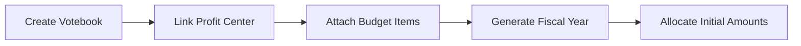

## Purpose and Overview

The Budget Applet is a comprehensive budgetary management tool that provides structured budget planning, allocation, tracking, and control capabilities. This applet enables organizations to define spending plans, monitor utilization in real-time, and maintain fiscal discipline across departments and faculties.


**Budgetary Module Component**: This applet is the core component of the Budgetary Management Module, providing complete budget lifecycle management from planning through reporting.


### Primary Functions
- **Budget Item Management** - Define spending components and categories
- **Profit Center Allocation** - Departmental budget responsibility
- **Votebook Management** - Annual budget distribution and tracking
- **Budget Transfers (Virement)** - Reallocate funds between registers
- **Budget Adjustments** - Increase or decrease total allocations
- **Utilization Tracking** - Real-time budget consumption monitoring
- **Budget Reporting** - Comprehensive variance and utilization analysis

## Key Concepts

### Budgetary Framework

The Budget Applet operates on a structured framework that answers three fundamental questions:

| Question | Component | Purpose |
|----------|-----------|---------|
| **Who** is spending? | Profit Center | Defines departmental responsibility |
| **What** are they spending on? | Category & Budget Item | Classifies expense types |
| **How** are funds allocated? | Votebook & Register | Manages period allocations |

### Budget Hierarchy

```
Organization
├── Profit Centers (Departments/Faculties)
│   └── Votebooks (Annual Budgets)
│       └── Budget Items (Spending Components)
│           └── Categories (Multi-Level Classification)
│               └── Budget Registers (Period Allocations)
```

## Key Features

### 1. Budget Item Management


#### Creating Budget Items

Budget Items define the specific spending components that make up a votebook's budget allocation.

**Steps to Create:**

1. Navigate to **Budgetary Applet → Items**
2. Click **"+"** Add button
3. Fill in the required details:
   - **Item Code*** - Unique identifier (e.g., MKTG001)
   - **Item Name*** - Descriptive name (e.g., Marketing Expenses)
   - **Description** - Optional contextual notes
4. Click **Save**


**Naming Convention**: Use a consistent format such as DEPT-TYPE (e.g., HR-TRAIN for HR Training, IT-MAINT for IT Maintenance).


#### Multi-Level Category Assignment

Budget items support up to **10 category levels** for granular expense tracking:

**Configuration:**
1. Navigate to **Settings → Field Settings → Budget Item Settings**
2. Configure up to 10 Category Groups
3. Mark groups as Mandatory if required

**Assigning Categories:**
1. Open Budget Item → **Category Tab**
2. Select categories from each dropdown (Category 0-9)
3. Click **Save** to link

**Example Classification:**
- Category 0 → Faculty of Science
- Category 1 → Laboratory Equipment
- Category 2 → Maintenance

### 2. Category Group & Category Management


#### Category Groups

Category Groups provide broader organizational umbrellas for expense classification.

**Creating Category Groups:**

1. Navigate to **Budgetary Applet → Category Groups**
2. Click **"+ Add"**
3. Enter:
   - Category Group Code (e.g., FAKULTI-SAINS)
   - Category Group Name
   - Status (Active/Inactive)
4. Click **Create**

#### Categories

Categories define specific types of spending under each group.

**Creating Categories:**

1. Navigate to **Budgetary Applet → Categories**
2. Click **"+ Add"**
3. Fill in:
   - Category Group
   - Category Code
   - Category Name
   - Description
4. Click **Create**

**Example Structure:**

| Category Group | Category | Description |
|----------------|----------|-------------|
| FAKULTI-SAINS | Laboratory Equipment | Purchases of microscopes and lab tools |
| FAKULTI-EKONOMI | Training Expenses | Staff courses and development |

### 3. Profit Center Management


Profit Centers define **who** is doing the spending within the organization.

#### Creating a Profit Center

1. Navigate to **Budgetary Applet → Profit Center**
2. Click **"+"** Add button
3. Fill in:

| Field | Description | Required |
|-------|-------------|----------|
| Profit Center Code | Unique identifier (e.g., FAC_A) | Yes |
| Profit Center Name | Name of department/unit | Yes |
| Description | Brief explanation | No |
| Ref 1 Code/Name/Description | Additional reference | No |
| Ref 2 Code/Name/Description | Secondary reference | No |
| Status | Active / Inactive | Yes |

4. Click **Save**


**Budget Accountability**: Every expenditure is traceable back to a responsible profit center, providing clear accountability and departmental spending reports.


### 4. Votebook Management


Votebooks manage how funds are distributed across Budget Items and Fiscal Periods.

#### Workflow Overview



#### Creating a Votebook

1. Navigate to **Budgetary Applet → Votebook**
2. Click **"+ Add"**
3. Fill in:
   - Votebook Code and Name
   - Linked Profit Center
   - Description / Notes
4. Click **Save**

#### Linking Budget Items

1. Open the votebook
2. Navigate to **Items Tab**
3. Click **"+ Add Item"**
4. Select budget items to manage
5. Items inherit their category classifications

#### Generating Fiscal Year

1. Open votebook → **Fiscal Year Tab**
2. Click **Generate Fiscal Year**
3. System automatically creates:
   - Budget Registers for each fiscal period
   - Links to respective budget items

#### Allocating Initial Amounts


1. Open **Budget Register** under fiscal year
2. Enter **Initial Amount** once
3. System automatically distributes equally across periods

**Example:**
- Input: RM 12,000
- Distribution: RM 1,000 per month (12-month year)

### 5. Budget Virement (Transfer)


Budget Virement transfers allocated amounts between registers **within the same votebook**.


**Key Difference**: Virement redistributes funds without changing the overall budget total. For increasing/decreasing total allocations, use Budget Adjustment instead.


#### Creating a Virement

**Step 1: Fill Header**
- Select Votebook, Fiscal Year, Fiscal Period
- Add Reference # / Tracking ID
- Enter Remarks / Description

**Step 2: Add Lines**
- Select Item Code / Name
- Choose Fiscal Period
- Select **Budget Register From** and **To**
- View Amount Allocated
- Enter Amount To Transfer

**Step 3: Create Document**
- Document saved in **Draft** state
- Review all lines before finalizing

**Step 4: Finalize**
- Click **Finalize** to confirm
- System updates:
  - Register From → reduced by transfer amount
  - Register To → increased by transfer amount

### 6. Budget Adjustment


Budget Adjustment **increases** (Adjust In) or **decreases** (Adjust Out) total allocations.

#### Key Differences: Virement vs Adjustment

| Feature | Virement | Adjustment |
|---------|----------|-----------|
| **Purpose** | Transfer between registers | Change total budget |
| **Impact** | No change in total | Changes total allocation |
| **Direction** | From → To | In / Out |
| **Registers Affected** | Two (source and target) | One |

#### Creating an Adjustment

**Step 1: Fill Header**
- Select Votebook and Fiscal Year
- Add Reference # / Tracking ID
- Enter Remarks / Description

**Step 2: Add Lines**
- Choose Item Code / Name
- Select Fiscal Period
- View Budget Register and Amount Allocated
- Select **Adjustment Type** (Adjust In / Out)
- Enter Amount To Adjust

**Step 3: Create Document**
- Document saved as **Draft**
- Review all entries

**Step 4: Finalize**
- Click **Finalize** to apply
- Register automatically updated:
  - Adjust In → adds to total
  - Adjust Out → deducts from total

### 7. Budget Reports


#### Budget Report (Summary)

High-level summary of budget performance:

| Column | Description |
|--------|-------------|
| Item Code / Name | Budget item identifier |
| Initial Amount Allocated | Original allocation |
| Latest Amount Allocated | Current total after adjustments |
| Amount Reserved | Earmarked but not utilized |
| Amount Utilized | Actual spending |
| Utilization % | (Utilized ÷ Latest Allocated) × 100 |
| Remaining Balance | Funds available |

**Available Actions:**
- Generate Utilization Chart
- Search / Filter by votebook, item, period
- Export to Excel / PDF


**Reading Utilization**: Positive values indicate spending. Negative values (from reverse adjustments) show fund recovery or reallocation.


#### Budget Register Transaction Line Report

Detailed audit trail of all budget transactions:

- Lists every entry (Creation, Virement, Adjustment)
- Shows Votebook, Fiscal Year, Fiscal Period
- Displays Budget Item and Item Code
- Enables complete traceability

**Primary Users:**
- Accountants - detailed reconciliation
- Auditors - compliance verification
- Finance Teams - transaction analysis

### 8. Budget Utilization and Validation


#### Integration with General Documents

The Budget Applet integrates with transaction documents for real-time validation:

- **Purchase Orders**
- **Purchase Invoices**
- **Sales Orders**
- **Sales Invoices**

#### Validation Process

When creating a transaction with budget-linked items:

1. Specify budget details:
   - Budget Votebook
   - Budget Fiscal Year and Period
   - Budget Item
   - Budget Register

2. System validates:
   - Sufficient funds available
   - Transaction within remaining balance

3. If exceeded:
   - Validation warning appears
   - Affected line highlighted in red
   - Over-budget entry prevented


**Budget Exceeded Warning**: "Budget exceeded for Sales FY2026 October 2026 (Used 10,000.00, Available 393.33)"


#### Utilization Process

Upon document **finalization**:
- Budget register deducts utilized amount
- Remaining balance updated
- Reports reflect real-time consumption

**Key Points:**
- Validation occurs **before** finalization
- Utilization occurs **after** finalization
- Over-budget prevented unless adjusted via Virement/Adjustment

## Configuration

### Initial Setup

#### Step 1: Field Settings
1. Navigate to **Settings → Field Settings → Budget Item Settings**
2. Configure Category Groups (up to 10)
3. Mark groups as Mandatory if required

#### Step 2: Profit Centers
1. Create profit centers for each department/faculty
2. Define organizational hierarchy
3. Set active status

#### Step 3: Category Framework
1. Create Category Groups
2. Define Categories under each group
3. Link categories to groups

#### Step 4: Budget Items
1. Create standard budget items
2. Assign multi-level categories
3. Set item status

#### Step 5: Votebooks
1. Create votebooks for each Profit Center
2. Link budget items
3. Generate fiscal year periods
4. Allocate initial amounts

## Best Practices

### Budget Planning

**Bottom-Up Approach:**
- Departments submit budget requests
- Items justified with business cases
- Review and consolidation at management level

**Top-Down Approach:**
- Management sets overall budget ceiling
- Allocation distributed to departments
- Departments plan within limits

**Hybrid Approach:**
- Combine both methods
- Strategic items top-down
- Operational items bottom-up

### Budget Control

**Approval Hierarchy:**

| Transaction Type | Amount Threshold | Approver |
|-----------------|------------------|----------|
| Virement | < RM 10,000 | Department Head |
| Virement | > RM 10,000 | Finance Director |
| Adjustment In | Any | CFO |
| Adjustment Out | < RM 5,000 | Finance Manager |
| Adjustment Out | > RM 5,000 | CFO |

**Monitoring Schedule:**
- **Weekly**: Review high-utilization items
- **Monthly**: Full budget variance analysis
- **Quarterly**: Strategic budget review
- **Annually**: Budget planning and rollover

### Data Management

**Archiving Strategy:**
- Archive completed fiscal years after 2 years
- Maintain summary data for historical reporting
- Keep detailed data for current and previous year

**Performance Optimization:**
- Use filters to limit data ranges
- Schedule large reports during off-peak hours
- Export to Excel for detailed analysis

## Integration

### Module Integration

**Financial Accounting:**
- Budget vs actual variance reporting
- Chart of accounts alignment
- Financial statement integration

**Purchasing:**
- Budget validation for purchase orders
- Procurement budget tracking
- Vendor spending analysis

**Sales:**
- Revenue budget tracking
- Sales target vs actual
- Channel performance budgets

**Projects:**
- Project budget management
- Resource allocation budgets
- Project profitability analysis

**HR/Payroll:**
- Personnel cost budgeting
- Department staffing budgets
- Training and development budgets

### External Systems

**Data Import/Export:**
- Excel/CSV import for budget templates
- Export to financial planning tools
- Integration with consolidation systems
- Synchronization with corporate reporting

## Troubleshooting

### Common Issues

| Issue | Possible Cause | Solution |
|-------|----------------|----------|
| Cannot finalize virement | Insufficient funds in source register | Check register balance, reduce virement amount |
| Budget validation fails | Register not linked to document | Ensure correct votebook and period selected |
| Report shows incorrect utilization | Timing differences in posting | Run report after all transactions posted |
| Cannot delete budget item | Item linked to active votebook | Remove from votebook first, then delete |
| Category assignment missing | Category group not configured | Set up category groups in Field Settings |
| Virement document stuck in draft | Missing required fields | Review all header and line fields for completion |
| Adjustment not reflected | Document not finalized | Finalize document to apply changes |

### Error Messages

| Error Message | Meaning | Action Required |
|---------------|---------|----------------|
| "Budget exceeded for [Item]" | Transaction amount exceeds available budget | Reduce transaction amount or adjust budget |
| "Fiscal year not generated" | Budget registers not created | Generate fiscal year in votebook |
| "Invalid profit center" | Profit center not active or not found | Verify profit center status and code |
| "Category group mandatory" | Required category not selected | Select category from mandatory group |

## Security and Access Control

### User Roles

**Budget Administrator:**
- Full access to all budget functions
- Configure settings and categories
- Create and manage votebooks
- Approve adjustments and virements

**Budget Manager:**
- Create budget items and categories
- Manage assigned profit centers
- Initiate virements and adjustments
- View reports for assigned areas

**Budget User:**
- View budget allocations
- Enter transactions with budget validation
- View utilization reports
- Cannot modify budget structures

**Auditor (Read-Only):**
- View all budget data
- Generate reports
- Export transaction details
- No modification permissions

### Audit Trail

The Budget Applet maintains complete audit trails:
- User activity logs
- Document creation and modification history
- Approval workflows
- Budget register transaction history
- Category and item change tracking

## Related Resources

### Module Documentation
- [Budgetary Management Module](/modules/budgetary/) - Complete module overview
- [Financial Accounting Module](/modules/financial-accounting/) - Integration with GL

### Guides
- [Budget Planning Guide](/guides/budgetary/planning/) - Best practices
- [Budget Reporting Guide](/guides/budgetary/reporting/) - Report interpretation
- [Year-End Budget Process](/guides/budgetary/year-end/) - Closing procedures

### Support
- 📚 [Budget Template Library](/resources/budgetary/templates/)
- 🎥 [Video Tutorials](/tutorials/budgetary/)
- 🤝 [Community Forum](https://forum.bigledger.com/budgetary)
- 📧 [Expert Support](mailto:budgetary@bigledger.com)

## Summary

The Budget Applet provides comprehensive budget management capabilities:

✅ **Structured Planning** - Multi-level categorization and profit center allocation
✅ **Real-Time Control** - Automated validation and utilization tracking
✅ **Flexible Adjustments** - Virement and adjustment capabilities
✅ **Complete Reporting** - Summary and detailed transaction reports
✅ **Seamless Integration** - Works with all transaction modules


**Ready to Start?** Begin by setting up your organizational structure with Profit Centers, then create Category Groups and Budget Items. Once your framework is ready, create Votebooks and start allocating your budgets!

