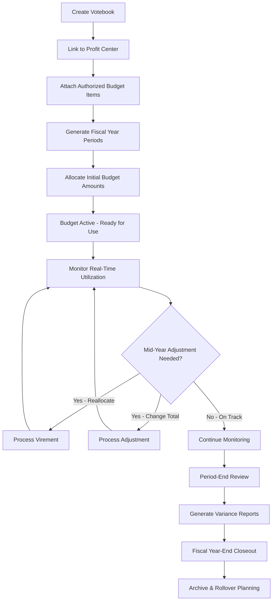

## Purpose and Overview

Budget control shouldn't be about saying "no" to departments—it should be about providing the visibility and tools to make smart spending decisions. The Budget Applet transforms budgeting from a restrictive annual exercise into an active, real-time management tool that prevents problems before they happen.


**Core Component**: This applet is the heart of the [Budgetary Management Module](/modules/budgetary/), providing complete budget lifecycle management from initial planning through year-end reporting and analysis.


### Who Benefits from This Applet?

**Finance Directors & Controllers:**
- Enforce budget discipline without becoming a bottleneck
- Get instant visibility into organizational spending
- Prevent budget overruns through automated validation
- Generate comprehensive variance reports in minutes

**Department Heads & Managers:**
- Know real-time budget status without waiting for month-end
- Make informed spending decisions based on current availability
- Quickly reallocate budgets as priorities shift
- Avoid embarrassing overspend situations

**Procurement & Purchasing Teams:**
- Validate budget availability before creating purchase orders
- Prevent unauthorized or over-budget purchases
- Streamline approval workflows
- Maintain complete audit trail

**Executive Leadership:**
- Confidence that spending stays within authorized limits
- Early warning system for budget pressures
- Better cash flow predictability
- Data-driven budget allocation decisions

### What Problems Does This Solve?

**The Spreadsheet Budget Problem:**

Traditional budget management relies on spreadsheets distributed across the organization. By mid-year, you have:
- Multiple versions with conflicting numbers
- Manual reconciliation consuming days each month
- Budget overruns discovered weeks after they occur
- No enforcement mechanism—budgets are advisory at best
- Incomplete audit trail for changes

**The Budget Applet Solution:**

- **Single source of truth** - One system, one set of numbers, always current
- **Real-time validation** - Over-budget transactions blocked automatically
- **Instant visibility** - Know budget status in seconds, not days
- **Complete traceability** - Every change logged with user, timestamp, and justification
- **Flexible reallocation** - Move funds between budget lines in minutes
- **Comprehensive reporting** - Summary dashboards and detailed audit trails

## Key Features Overview


  

  

  

  

  

  

  

  


## Key Concepts

### Understanding the Budgetary Framework

Every budget system must answer three fundamental questions. The Budget Applet provides structured answers:

| Question | Component | Practical Example |
|----------|-----------|------------------|
| **Who** is spending? | Profit Center | Faculty of Science, Marketing Department, Regional Office |
| **What** are they spending on? | Category & Budget Item | Laboratory Equipment, Digital Advertising, Office Rent |
| **How** are funds allocated? | Votebook & Register | Annual Budget 2025, distributed across 12 monthly periods |


**Real-World Example**: The Marketing Department (WHO) has an annual budget of RM 500,000 (Votebook). Within that budget, RM 100,000 is allocated to Digital Advertising (Budget Item / WHAT), distributed as RM 8,333 per month (Budget Register / HOW). When Marketing wants to spend RM 15,000 on Google Ads in March, the system checks the March Digital Advertising register and validates sufficient balance exists.


### Budget Hierarchy Structure

Think of the budget hierarchy as an organizational tree structure for financial control:

```
Organization (Your Company)
│
├── Profit Centers (Departments) ──→ WHO is responsible?
│   │
│   └── Votebooks (Annual Budgets) ──→ WHEN and HOW MUCH?
│       │
│       └── Budget Items (Expense Categories) ──→ WHAT to spend on?
│           │
│           └── Categories (Multi-Level Classification) ──→ HOW to analyze?
│               │
│               └── Budget Registers (Period Allocations) ──→ WHEN to spend?
```

**Flow Through the Hierarchy:**

1. **Organization**: ABC Corporation
2. **Profit Center**: Marketing Department (who manages this budget)
3. **Votebook**: Marketing Budget 2025 (annual budget document)
4. **Budget Item**: Digital Advertising (specific spending category)
5. **Category**: Online Marketing (classification for reporting)
6. **Budget Register**: March 2025 - Digital Advertising (monthly allocation)

This hierarchical structure enables:
- **Precise control** at the transaction level
- **Flexible reporting** at any level of aggregation
- **Clear accountability** through organizational assignment
- **Period-based tracking** aligned with financial reporting

## Core Features in Detail

### 1. Budget Item Management


#### Why Budget Items Are Critical

Budget Items form the foundation of your entire budget management system. Without them, you can't consistently track what money is spent on, compare across departments, or generate meaningful reports.

**The Business Case:**

Imagine three departments independently buying office supplies:
- **IT Department** calls it "Office Supplies"
- **HR Department** calls it "Administrative Materials"
- **Finance Department** calls it "Stationery & Supplies"

Result? Consolidating supply spending across departments becomes impossible. Budget Items solve this by creating a common vocabulary.


**Business Impact**: Standardized budget items enable apples-to-apples comparisons, accurate trend analysis, meaningful benchmarking, and data-driven decision-making. Organizations typically achieve 15-20% better budget accuracy simply through consistent categorization.


#### Industry-Specific Budget Item Examples

Design your budget item catalog based on your industry and operational needs:




**Educational Institutions**

**Academic Operations:**
- Faculty Salaries & Benefits
- Laboratory Equipment & Maintenance
- Library Resources & Subscriptions
- Research Grants & Projects
- Student Scholarships & Financial Aid

**Support Services:**
- Campus Facilities & Maintenance
- Student Services & Activities
- IT Infrastructure & Software
- Marketing & Recruitment
- Administrative Overhead



**Corporate Business**

**Revenue-Generating:**
- Sales & Marketing Expenses
- Product Development & R&D
- Customer Success & Support
- Business Development
- Channel Partner Programs

**Support Functions:**
- IT Infrastructure & Software
- Human Resources & Training
- Finance & Accounting
- Legal & Compliance
- Facilities & Office Operations



**Government Agencies**

**Program Delivery:**
- Personnel Costs & Benefits
- Program Operations & Services
- Capital Projects & Infrastructure
- Public Outreach & Communications
- Grant Programs & Subsidies

**Administrative:**
- Administrative Salaries
- Office Operations & Supplies
- IT Systems & Maintenance
- Professional Services
- Training & Development



**Healthcare Organizations**

**Clinical Operations:**
- Medical Supplies & Equipment
- Pharmaceutical Inventory
- Clinical Staff Salaries
- Medical Equipment Maintenance
- Patient Care Services

**Support Services:**
- Administrative Staff
- Facilities & Utilities
- IT & Medical Systems
- Professional Liability Insurance
- Marketing & Community Outreach




#### Creating Budget Items Step-by-Step

Establish your budget item catalog with these systematic steps:

**Step 1: Navigate to Budget Items**
- Open the **Budgetary Applet**
- Select **Items** from the menu
- Click **"+"** Add button to create new item

**Step 2: Fill in Essential Details**

| Field | Purpose | Best Practice Example |
|-------|---------|---------------------|
| **Item Code*** | Unique identifier for system | MKTG-001, LAB-EQUIP, HR-TRAIN |
| **Item Name*** | Human-readable description | Marketing Expenses, Laboratory Equipment, HR Training |
| **Description** | Usage guidelines and restrictions | "For digital and traditional marketing campaigns. Excludes employee events." |

**Step 3: Save and Categorize**
- Click **Save** to create the budget item
- Navigate to **Category Tab** (see Multi-Level Categorization below)
- Link appropriate categories for classification
- Save category assignments


**Naming Convention Best Practices**:

**Option 1 - Dept-Function**: `HR-TRAIN`, `IT-MAINT`, `MKTG-DIGITAL`
- **Pros**: Immediately clear which department, easy to remember
- **Cons**: Doesn't scale if items used across departments

**Option 2 - Category-Sequential**: `MKTG-001`, `MKTG-002`, `LAB-001`
- **Pros**: Clean sequential numbering, scales indefinitely
- **Cons**: Requires lookup to know what 001, 002 mean

**Option 3 - Function-Activity**: `OPS-SUPPLIES`, `OPS-UTILITIES`, `RD-EQUIPMENT`
- **Pros**: Groups related items functionally
- **Cons**: Ambiguous department ownership

**Recommendation**: Choose one convention organization-wide and document it. Consistency matters more than which system you choose.


#### Multi-Level Category Assignment

One of the Budget Applet's most powerful features is multi-dimensional categorization—classify each budget item across up to **10 independent category dimensions**.

**Why Multiple Category Levels?**

Different stakeholders need different views of the same spending:

**Executive Team** wants to see:
- Total spending by division (Sales, Operations, R&D)
- Strategic vs operational expenses
- Discretionary vs committed spending

**Finance Team** needs to see:
- Spending by account type (Capital, Operating, Personnel)
- Funding source (Operating Budget, Grants, Donations)
- Tax treatment (Deductible, Non-Deductible, Capitalized)

**Department Heads** want to view:
- Their department's spending in detail
- Project or initiative-based allocation
- Cost center or profit center breakdown

**Compliance Officers** require:
- Grant-funded vs unrestricted spending
- Restricted use fund compliance
- Regulatory reporting categories

**How It Works:**

```
Budget Item: Laboratory Microscope Purchase (RM 50,000)

├── Category Level 0: Organizational Unit
│   └── Faculty of Science
│
├── Category Level 1: Expense Type
│   └── Scientific Equipment
│
├── Category Level 2: Financial Classification
│   └── Capital Expenditure
│
├── Category Level 3: Functional Area
│   └── Research & Development
│
├── Category Level 4: Funding Source
│   └── Grant-Funded (NSF Award #12345)
│
├── Category Level 5: Asset Class
│   └── Laboratory Equipment
│
├── Category Level 6: Depreciation Type
│   └── 7-Year Straight Line
│
├── Category Level 7: Strategic Initiative
│   └── Nanotechnology Research Program
│
├── Category Level 8: Geographic Location
│   └── North Campus Research Lab
│
└── Category Level 9: Project Code
    └── PROJECT-2025-NANO-001
```

**Reporting Flexibility:**

With this rich categorization, you can generate reports by ANY dimension:
- Show me all Grant-Funded equipment purchases (Level 4)
- What did we spend on R&D across all departments? (Level 3)
- How much capital expenditure did North Campus make? (Level 2 + Level 8)
- Report all spending on Nanotechnology Research (Level 7)

**Configuration Steps:**

1. Navigate to **Settings → Field Settings → Budget Item Settings**
2. Enable up to 10 Category Groups (each group represents one classification dimension)
3. Mark groups as **Mandatory** or **Optional** based on reporting requirements
4. Set up validation rules (e.g., Grant-Funded items must specify grant number)

**Assigning Categories to Budget Items:**

1. Open Budget Item from listing
2. Navigate to **Category Tab**
3. For each enabled category level (0-9):
   - Dropdown menu shows available categories
   - Categories filtered by their Category Group
   - Select the most appropriate classification
4. Click **Save** to finalize assignments

**Result**: Every future transaction using this budget item automatically inherits ALL category classifications, ensuring consistent, accurate reporting without manual categorization for each expense.


**Avoid Over-Categorization**: Start with 3-5 essential category levels that support actual decision-making. You can always add more later. Over-categorization creates data entry burden without corresponding value. Ask: "Will we actually filter reports by this dimension?" If no, don't create the category level.


### 2. Category Group & Category Management


#### The Two-Level Classification System

The Budget Applet uses a two-tier approach to organize expense classifications:

**Tier 1: Category Groups** (The Container)
- High-level organizational umbrellas
- Examples: "Academic Faculties", "Support Departments", "Expense Types"
- Purpose: Keep category lists manageable and logically organized

**Tier 2: Categories** (The Specific Classification)
- Specific classifications within each group
- Examples: "Faculty of Science", "Laboratory Equipment", "Capital Expenditure"
- Purpose: The actual tags applied to budget items for reporting

**Why This Structure?**

Without Category Groups, you'd have one massive category list containing everything from "Faculty of Science" to "Office Supplies" to "Capital Expenditure"—hundreds of items with no logical organization. Category Groups provide structure.

| Element | Function | Example |
|---------|----------|---------|
| **Category Group** | Organizes categories into logical collections | FACULTIES, DEPARTMENTS, EXPENSE-TYPES |
| **Category** | Specific classification tag | Science, Engineering, HR, IT, Equipment, Services |

#### Real-World Example

**Category Group: ACADEMIC-FACULTIES**
- Faculty of Arts & Humanities
- Faculty of Science & Technology
- Faculty of Business & Economics
- Faculty of Engineering
- Faculty of Medicine

**Category Group: EXPENSE-TYPES**
- Personnel Costs
- Operating Expenses
- Capital Equipment
- Professional Services
- Facilities & Maintenance

**Category Group: FUNDING-SOURCES**
- Unrestricted Operating Budget
- Government Grants
- Research Grants
- Endowment Funds
- Donor-Restricted Funds

#### Creating Category Groups

Build the organizational structure for your categories:

**Process:**

1. Navigate to **Budgetary Applet → Category Groups**
2. Click **"+ Add"** to create new group
3. Enter the group information:
   - **Category Group Code** - Unique identifier (e.g., FAC-ACADEMIC, DEPT-ADMIN)
   - **Category Group Name** - Descriptive name (e.g., "Academic Faculties", "Administrative Departments")
   - **Status** - Active or Inactive (only active groups appear in dropdowns)
4. Click **Create** to save

**Strategic Category Group Design:**

Consider these common Category Group structures:

| Category Group Type | Purpose | When to Use |
|--------------------|---------|-------------|
| **Organizational** | WHO spent the money | Always - fundamental for accountability |
| **Functional** | WHY the money was spent | When functional analysis matters (teaching vs research vs admin) |
| **Financial** | HOW to account for it | When financial statement classification matters |
| **Source** | WHERE money came from | When fund accounting or grant tracking required |
| **Geographic** | WHERE the spending occurred | Multi-location organizations |
| **Temporal** | WHAT period or project | Project-based or initiative-based organizations |


**Start Simple Framework**: Most organizations need just 3-4 Category Groups initially:
1. **Organizational Units** (departments/divisions) - for accountability
2. **Expense Types** (personnel/operating/capital) - for financial reporting
3. **Funding Sources** (unrestricted/grants/donations) - for fund compliance
4. **Optional**: Strategic Initiatives, Projects, or Geographic Locations

Add more Category Groups only when you have a clear reporting or compliance need.


#### Creating Categories

Populate each Category Group with specific classifications:

**Process:**

1. Navigate to **Budgetary Applet → Categories**
2. Click **"+ Add"** to create new category
3. Complete the category details:
   - **Category Group** - Select parent group from dropdown
   - **Category Code** - Unique identifier within the group
   - **Category Name** - Descriptive name for reporting
   - **Description** - Optional guidance on usage
4. Click **Create** to save

**Example Category Structure:**

```
Category Group: ACADEMIC-FACULTIES
├── FAC-ART → Faculty of Arts
├── FAC-SCI → Faculty of Science
├── FAC-BUS → Faculty of Business
└── FAC-ENG → Faculty of Engineering

Category Group: EXPENSE-TYPES
├── EXP-PER → Personnel Costs
├── EXP-OPS → Operating Expenses
├── EXP-CAP → Capital Equipment
└── EXP-SVC → Professional Services

Category Group: FUNDING-SOURCES
├── FUND-OP → Unrestricted Operating
├── FUND-GRANT → Research Grants
├── FUND-DONOR → Donor Restricted
└── FUND-ENDOW → Endowment Funds
```

**Practical Example Table:**

| Category Group | Category Code | Category Name | When to Use |
|----------------|--------------|---------------|-------------|
| FACULTIES | FAC-SCI | Faculty of Science | Any spending by Science faculty |
| FACULTIES | FAC-ENG | Faculty of Engineering | Any spending by Engineering faculty |
| EXPENSE-TYPES | EXP-LAB | Laboratory Supplies | Consumables for labs |
| EXPENSE-TYPES | EXP-EQUIP | Equipment Purchases | Capitalized equipment |
| FUNDING | FUND-NSF | NSF Research Grants | Anything funded by NSF grants |
| FUNDING | FUND-OP | Operating Budget | Unrestricted operating funds |

#### Linking Categories to Budget Items

Once your category framework exists, apply it to budget items:

**Process:**

1. Open any Budget Item from the Items listing
2. Navigate to the **Category Tab**
3. You'll see dropdowns for each category level (Category 0 through Category 9)
4. For each applicable level:
   - Dropdown shows categories from the associated Category Group
   - Select the most appropriate category
   - Leave blank if not applicable (unless marked mandatory)
5. Click **Save** to establish the links

**The Power of Pre-Classification:**

Every transaction that uses this budget item will automatically inherit these category assignments. This means:
- **No manual categorization** needed at transaction time
- **Consistency guaranteed** across all transactions
- **Reporting accuracy** dramatically improved
- **Data entry efficiency** for end users

**Example in Practice:**

```
Budget Item: Laboratory Equipment Purchases
Categories assigned:
├── Category 0 (Organizational): Faculty of Science
├── Category 1 (Expense Type): Capital Equipment
├── Category 2 (Functional): Research & Development
└── Category 3 (Funding): Grant-Funded

When someone creates a purchase order for RM 25,000 of lab equipment:
→ System automatically applies all four category tags
→ No need to ask user to select categories manually
→ Report by any dimension automatically includes this transaction
```


**Change Management**: Changing category assignments on budget items affects all future transactions but NOT historical ones. If you need to reclassify historical data, you'll need to run data migration scripts or adjustments. Plan your category structure carefully before go-live.


### 3. Profit Center Management


#### Understanding Profit Centers

Profit Centers are the organizational answer to "WHO is responsible for this spending?" They represent the departments, faculties, divisions, branches, or business units that manage budgets and bear accountability for staying within allocated limits.

**The Accountability Principle:**

Without Profit Centers, budget is just numbers in a system. With Profit Centers:
- The Marketing Department **owns** its budget—success and overruns
- The Faculty of Science is **accountable** for equipment purchases
- The Regional Office has **responsibility** for local operations

This transforms budget management from top-down control to distributed ownership.


**Cultural Impact**: Profit Centers shift the conversation from "Finance won't let me spend" to "I need to manage my budget wisely." This psychological shift dramatically improves budget discipline and reduces finger-pointing when trade-offs are necessary.


#### Real-World Profit Center Structures

Design your Profit Center structure based on how budget authority is distributed in your organization:




**University Structure**

**Academic Units:**
- Faculty of Arts & Humanities
- Faculty of Science & Technology
- Faculty of Business & Economics
- Faculty of Engineering
- Faculty of Medicine & Health Sciences

**Support Units:**
- University Library
- Student Services Department
- IT Services
- Facilities & Maintenance
- Human Resources
- Finance & Administration

**Research Centers:**
- Center for Advanced Materials Research
- Institute of Sustainability Studies
- Innovation & Entrepreneurship Hub



**Corporate Structure**

**Revenue Centers:**
- Sales & Marketing Division
- Product Development
- Customer Success
- Business Development

**Cost Centers:**
- Operations & Manufacturing
- Supply Chain & Logistics
- Quality Assurance
- Research & Development

**Support Centers:**
- IT & Technology Services
- Human Resources
- Finance & Accounting
- Legal & Compliance
- Facilities Management



**Government Structure**

**Service Departments:**
- Public Works Department
- Health Services Division
- Education & Training Bureau
- Social Services Department
- Parks & Recreation

**Administrative Units:**
- City Manager's Office
- Finance Department
- Human Resources
- IT & Communications
- Legal Services

**Public Safety:**
- Police Department
- Fire & Rescue Services
- Emergency Management



**Healthcare Structure**

**Clinical Departments:**
- Emergency Medicine
- Surgery
- Internal Medicine
- Pediatrics
- Obstetrics & Gynecology
- Radiology & Imaging

**Support Services:**
- Nursing Administration
- Laboratory Services
- Pharmacy
- Facilities & Engineering
- IT & Clinical Systems

**Administrative:**
- Finance & Revenue Cycle
- Human Resources
- Quality & Compliance
- Marketing & Community Relations




#### Creating a Profit Center

Establish each budget-responsible organizational unit as a Profit Center:

**Step-by-Step Process:**

1. Navigate to **Budgetary Applet → Profit Center**
2. Click **"+"** Add button to create new center
3. Complete the Profit Center details:

| Field | Purpose | Example |
|-------|---------|---------|
| **Profit Center Code*** | Unique system identifier | FAC-SCI, DEPT-MKT, DIV-OPS |
| **Profit Center Name*** | Full organizational unit name | Faculty of Science, Marketing Department |
| **Description** | Scope and responsibility summary | "Manages all science programs, research labs, and faculty" |
| **Ref 1 Code/Name/Description** | Additional reference (location, building, campus) | "North Campus, Building A, Lab Complex" |
| **Ref 2 Code/Name/Description** | Secondary reference (cost center, manager) | "Cost Center 1000, Manager: Dr. Jane Smith" |
| **Status** | Active or Inactive | Active (only active centers can receive budgets) |

4. Click **Save** to create the Profit Center

**Real Example:**

```
Profit Center Code: FAC-SCI
Profit Center Name: Faculty of Science
Description: Manages all undergraduate and graduate science programs,
            including biology, chemistry, physics, and mathematics.
            Responsible for teaching, research, and lab operations.
Ref 1: North Campus, Building A (Science Complex)
Ref 2: Cost Center 1500, Dean: Dr. Sarah Johnson
Status: Active
```

#### Comprehensive Example Structure

**ABC University Profit Centers:**

| Code | Name | Type | Campus | Budget Size | Status |
|------|------|------|--------|------------|--------|
| FAC-ART | Faculty of Arts | Academic | Main | RM 2.5M | Active |
| FAC-SCI | Faculty of Science | Academic | North | RM 5.2M | Active |
| FAC-BUS | Faculty of Business | Academic | City Center | RM 3.8M | Active |
| FAC-ENG | Faculty of Engineering | Academic | North | RM 6.1M | Active |
| DEPT-LIB | University Library | Support | Main | RM 1.2M | Active |
| DEPT-IT | IT Services | Support | All | RM 2.9M | Active |
| DEPT-FAC | Facilities Management | Support | All | RM 4.5M | Active |
| DEPT-HR | Human Resources | Admin | Main | RM 800K | Active |
| CTR-RES | Research Center | Research | North | RM 1.5M | Active |

#### Benefits of Well-Designed Profit Centers

**Accountability & Ownership:**
- Department heads own their budget performance
- Clear responsibility when overspending occurs
- Recognition when departments stay within budget
- Prevents "not my responsibility" mentality

**Reporting & Analysis:**
- Compare performance across peer units (Faculty A vs Faculty B)
- Identify high-performing and struggling departments
- Benchmark spending patterns
- Inform next year's budget allocation

**Control & Governance:**
- Every expense traceable to specific organizational unit
- Prevent unauthorized cross-department charging
- Enable department-level spending limits
- Support organizational restructuring

**Strategic Planning:**
- Understand true cost of each organizational unit
- Support make-vs-buy decisions
- Identify opportunities for consolidation or outsourcing
- Allocate resources based on strategic priorities


**Organizational Design Principle**: Structure Profit Centers to match decision-making authority and budget control. If your Marketing Manager has authority over digital and traditional marketing budgets combined, create ONE profit center. If Digital and Traditional Marketing report to different managers with separate budgets, create TWO profit centers.

**Rule of Thumb**: One Profit Center = One budget owner with decision-making authority.


### 4. Votebook Management


#### What Is a Votebook?

A Votebook is the **central budget document** for a Profit Center's fiscal year. Think of it as the annual "spending authority document" that details:
- How much total budget the department has for the year
- How that budget is divided among different Budget Items
- How funds are distributed across fiscal periods (months or quarters)
- Current utilization and remaining balance for each allocation

**Helpful Analogies:**
- **Credit Card Statement**: Shows approved credit limits, spending categories, and remaining credit
- **Checkbook Register**: Tracks deposits (allocations), checks written (utilization), and balance
- **Spending Playbook**: The authorized plan for how department can spend its annual budget


**The Critical Connection**: Votebooks connect three essential elements:
- **WHO** (Profit Centers - department/faculty)
- **WHAT** (Budget Items - spending categories)
- **WHEN** (Fiscal Periods - monthly/quarterly distribution)

This three-way connection enables precise budget control at the granular level while supporting consolidated reporting.


#### The Complete Votebook Lifecycle

Understanding the full lifecycle helps you manage budgets more effectively:



#### Creating a Votebook

Set up the annual budget container for your department or organizational unit:

**Step-by-Step Process:**

**Step 1: Create Votebook Document**
1. Navigate to **Budgetary Applet → Votebook**
2. Click **"+ Add"** to create new votebook
3. Enter votebook identification:
   - **Votebook Code** - Unique identifier (e.g., VB-2025-SCIENCE, BUDGET-MKT-2025)
   - **Votebook Name** - Descriptive name (e.g., "Budget 2025 - Faculty of Science")
   - **Linked Profit Center** - Select the responsible organizational unit
   - **Description / Notes** - Context and scope (e.g., "Operating budget excluding capital projects and grant-funded research")
4. Click **Save** to create the votebook

**Votebook Naming Best Practices:**

| Format | Example | Pros | Cons | Best For |
|--------|---------|------|------|----------|
| YEAR-DEPT | 2025-SCIENCE | Simple, chronological | Ambiguous if multiple budgets per dept | Small orgs, one budget per dept |
| DEPT-YEAR-TYPE | SCIENCE-2025-OPS | Clear separation of budget types | Longer codes | Large orgs with operating/capital split |
| VB-YEAR-CODE | VB-2025-FAC-SCI | Formal, systematic | Requires lookup to decode | Formal environments, many votebooks |
| FISCAL-DEPT | FY25-MARKETING | Fiscal year aware | FY25 vs 2025 confusion possible | Organizations with non-calendar fiscal years |


**Choose ONE naming convention** and apply it consistently across all votebooks. Document the convention in your budget procedures manual. Consistency matters far more than which specific format you choose.


#### Linking Budget Items to Votebook

After creating the votebook, define WHAT the department is authorized to spend budget on:

**Process:**

1. Open the votebook from the listing
2. Navigate to the **Items Tab**
3. Click **"+ Add Item"** to link budget items
4. Select Budget Items from the available list (multi-select if supported)
5. Each linked item automatically inherits its pre-configured category classifications
6. Click **Save** to confirm the links

**What This Accomplishes:**

**Before Linking:**
- Votebook exists but has no spending authority defined
- No budget items → no way to allocate or spend budget

**After Linking:**
- Department authorized to spend on ONLY the linked items
- Attempting to charge unlisted items → validation error
- Creates first layer of spending control

**Example:**

```
Votebook: Budget 2025 - Faculty of Science
Linked Budget Items:
├── Faculty Salaries & Benefits
├── Laboratory Equipment
├── Laboratory Supplies & Consumables
├── Research Software & Subscriptions
├── Student Research Assistants
├── Professional Development & Training
├── Office Supplies & Administrative
└── Equipment Maintenance & Repairs

NOT Linked (therefore NOT authorized):
├── Marketing & Advertising
├── Facility Renovations
├── Vehicle Purchases
└── Legal Services
```

**Control Implication**: Science faculty can create transactions using any of the 8 linked items. Attempting to charge "Marketing & Advertising" budget will fail validation—they don't have authorization for that spending category.


**Authorization Control**: Linking Budget Items to Votebooks is a critical security and control point. Only link items that the department should legitimately be able to spend on. This prevents accidental or intentional mis-charging of expenses.


#### Generating Fiscal Year Periods

Once Budget Items are linked, create the time-based structure for budget distribution:

**Process:**

1. Open the votebook and navigate to **Fiscal Year Tab**
2. Click **Generate Fiscal Year** button
3. The system automatically creates:
   - **Budget Registers** for each fiscal period (typically 12 months: January - December)
   - **Links** each register to its respective Budget Item
   - **Structure** ready for budget allocation

**What Gets Created:**

For a votebook with 8 Budget Items and standard 12-month fiscal year:
- **96 Budget Registers** (8 items × 12 months)
- Each register represents one item-period combination
- All registers ready to receive budget allocation
- Complete foundation for period-by-period tracking

**Visual Example:**

```
Budget Item: Laboratory Equipment
Fiscal Year: 2025
Periods Generated:
├── January 2025 - Laboratory Equipment → Budget Register #001
├── February 2025 - Laboratory Equipment → Budget Register #002
├── March 2025 - Laboratory Equipment → Budget Register #003
├── ... (April through November)
└── December 2025 - Laboratory Equipment → Budget Register #012

Repeat for all 8 Budget Items = 96 registers total
```


**One-Time Operation**: Generate Fiscal Year only ONCE per votebook. Running it multiple times creates duplicate registers and causes data inconsistencies. If you need to regenerate, delete the votebook and start fresh, or contact your system administrator.


#### Allocating Initial Budget Amounts


Now comes the critical step—putting actual budget numbers into your framework:

**Process:**

1. Open the **Budget Register** section under the fiscal year tab
2. For each Budget Item, locate its register(s)
3. Enter the **Initial Amount** once (typically the annual total allocation)
4. System performs automatic distribution:
   - Divides the amount equally across all fiscal periods
   - Creates consistent monthly or quarterly allocations
   - Updates all related registers simultaneously

**Smart Distribution Example:**

```
Budget Item: Marketing Expenses
Annual Allocation: RM 120,000
Fiscal Structure: 12 months (January - December)

System Automatically Calculates:
├── January 2025: RM 10,000
├── February 2025: RM 10,000
├── March 2025: RM 10,000
├── April 2025: RM 10,000
├── May 2025: RM 10,000
├── June 2025: RM 10,000
├── July 2025: RM 10,000
├── August 2025: RM 10,000
├── September 2025: RM 10,000
├── October 2025: RM 10,000
├── November 2025: RM 10,000
└── December 2025: RM 10,000

Total Allocated: RM 120,000 ✓
```

**Manual Adjustment for Seasonal Variation:**

Equal distribution is a starting point. You can manually adjust individual periods for known seasonal patterns:

```
Budget Item: Utilities
Annual Allocation: RM 120,000
Pattern: Higher usage in summer (cooling) and winter (heating)

Manual Allocation:
├── January (Winter): RM 12,000 ↑
├── February (Winter): RM 12,000 ↑
├── March (Spring): RM 9,000 →
├── April (Spring): RM 8,000 ↓
├── May (Spring): RM 8,000 ↓
├── June (Summer): RM 13,000 ↑
├── July (Summer): RM 14,000 ↑
├── August (Summer): RM 13,000 ↑
├── September (Fall): RM 9,000 →
├── October (Fall): RM 8,000 ↓
├── November (Fall): RM 8,000 ↓
└── December (Winter): RM 12,000 ↑

Total Still: RM 120,000 ✓
```

**Allocation Strategy Considerations:**




**Even Distribution**

Allocate same amount to each period.

**When to Use:**
- Stable, predictable expenses (salaries, rent)
- No historical data on spending patterns
- First-year budget (establish baseline)

**Advantages:**
- Simple and fast to set up
- Easy to explain and understand
- Aligns with accrual accounting

**Example Items:**
- Staff salaries
- Software subscriptions
- Insurance premiums
- Lease payments



**Seasonal Pattern**

Allocate more to high-usage periods, less to low-usage.

**When to Use:**
- Clear historical seasonal patterns
- Weather-dependent costs (utilities)
- Academic calendar variations
- Retail with holiday seasons

**Advantages:**
- Aligns budget with actual needs
- Avoids artificial variances
- Better cash flow planning

**Example Items:**
- Utilities (heating/cooling)
- Student services (academic year)
- Retail marketing (holiday ramp-up)
- Agricultural supplies (planting/harvest)



**Project-Based**

Allocate budget to periods when projects execute.

**When to Use:**
- Capital projects with defined timelines
- Research projects with start/end dates
- Construction or renovation phases
- Planned major initiatives

**Advantages:**
- Matches budget to project schedule
- Supports milestone tracking
- Enables project profitability analysis

**Example Items:**
- Construction projects
- Software implementation
- Research grants (project duration)
- Marketing campaigns



**Cash Flow Aligned**

Allocate budget based on revenue timing.

**When to Use:**
- Tight cash flow situations
- Revenue seasonality exists
- Working capital constraints
- Matching principle important

**Advantages:**
- Prevents cash crunches
- Aligns spending with revenue
- Better working capital management

**Example Items:**
- Discretionary spending
- Expansion initiatives
- Marketing (ROI-driven)
- Capital purchases





**Allocation Best Practice**: Start with equal distribution across all periods, then adjust based on:
1. **Historical actuals** - How did you spend last year?
2. **Known events** - Conferences, projects, seasonal patterns
3. **Payment schedules** - Annual subscriptions, quarterly payments
4. **Strategic priorities** - Front-load critical initiatives
5. **Cash flow** - Align spending with revenue timing

Document your allocation assumptions for next year's budget planning.


#### Votebook Management Best Practices

**For Initial Setup (Beginning of Fiscal Year):**
- Create all votebooks during budget planning cycle (Nov-Dec for Jan start)
- Link all anticipated Budget Items upfront—adding mid-year is disruptive
- Involve department heads in allocation decisions for buy-in
- Document assumptions and strategic priorities driving allocations
- Get formal approval before activating votebooks

**For Ongoing Management (During Fiscal Year):**
- Review utilization reports monthly—don't wait for problems
- Identify high-burn items early (>30% consumed in first quarter)
- Adjust period allocations quarterly if patterns deviate from plan
- Maintain clear documentation for all virements and adjustments
- Communicate budget status proactively to stakeholders

**For Year-End (Fiscal Year Closeout):**
- Generate comprehensive utilization reports for all votebooks
- Document variances with clear explanations for each
- Use actual spending patterns to inform next year's allocations
- Archive votebook data for historical reference and trending
- Conduct lessons-learned session with budget managers

### 5. Budget Virement (Transfer) & Budget Adjustment

For detailed information on:
- **Budget Virement** (transferring funds between registers within same votebook)
- **Budget Adjustment** (increasing or decreasing total budget allocations)
- Differences between Virement and Adjustment
- Step-by-step processes for each
- Real-world examples and use cases

Please see the corresponding sections in the **[Budgetary Management Module documentation](/modules/budgetary/#budget-virement-management)**.

These features are comprehensively documented in the module-level documentation with extensive examples, workflows, approval matrices, and best practices.

### 6. Budget Reports

For detailed information on:
- **Budget Report (Summary View)** for executive dashboards
- **Budget Register Transaction Line Report** for detailed audit trails
- Report column explanations and interpretations
- Available actions (charts, filters, exports)
- Variance analysis frameworks
- Best practices for regular monitoring

Please see the **[Budget Reports section](/modules/budgetary/#budget-reports)** in the Budgetary Management Module documentation.

The module documentation provides comprehensive coverage of reporting capabilities, including interpretation guidance, monitoring schedules, and effective budget narratives.

### 7. Budget Utilization and Validation

For detailed information on:
- Real-time budget validation at transaction creation
- Integration with purchase orders, invoices, and other documents
- Validation process step-by-step
- Budget exceeded warnings and resolution options
- Utilization process after document finalization
- Benefits of integrated budget control

Please see the **[Budget Utilization and Validation section](/modules/budgetary/#budget-utilization-and-validation)** in the Budgetary Management Module documentation.

This critical feature is thoroughly documented with examples of validation workflows, warning messages, and the benefits for different user roles.

## Configuration & Setup

### Initial Configuration Steps

Setting up the Budget Applet requires careful planning and systematic execution:




**Field Settings Configuration**

Configure how the Budget Applet operates at the system level.

**Navigate to**: Settings → Field Settings → Budget Item Settings

**Configure:**
- **Category Groups**: Enable up to 10 category levels
- **Mandatory Fields**: Mark which category groups are required
- **Validation Rules**: Set budget tolerance thresholds
- **Default Values**: Pre-populate common selections
- **Approval Workflows**: Define approval routing rules

**Time Required**: 1-2 hours



**Profit Centers Creation**

Establish your organizational accountability structure.

**Tasks:**
1. Map organizational chart to profit centers
2. Create profit center for each budget-responsible unit
3. Assign reference information (campus, cost center, manager)
4. Document reporting relationships
5. Set active status appropriately

**Best Practice**: Involve department heads in profit center design to ensure structure matches actual authority and responsibility.

**Time Required**: 2-4 hours



**Category Framework Design**

Design how you'll classify and analyze budget data.

**Tasks:**
1. Create Category Groups (3-5 initially recommended)
2. Define Categories under each group
3. Link categories to groups
4. Set mandatory vs optional designation
5. Test category structure with sample items

**Avoid**: Over-categorization—start simple, expand later based on actual reporting needs.

**Time Required**: 4-8 hours (includes stakeholder consultation)



**Budget Items Creation**

Build your standard budget item catalog.

**Tasks:**
1. Develop budget item catalog (20-50 items typical)
2. Choose naming convention and apply consistently
3. Create budget items in system
4. Assign multi-level categories to each item
5. Document usage guidelines in descriptions
6. Review with department heads for completeness

**Time Required**: 4-8 hours



**Votebooks & Budget Allocation**

Create annual budgets for each profit center.

**Tasks:**
1. Create votebook for each profit center
2. Link authorized budget items to each votebook
3. Generate fiscal year periods
4. Allocate initial budget amounts
5. Adjust for seasonal patterns where appropriate
6. Get formal approval before activating

**Time Required**: 1-2 days per 10 profit centers




### Configuration Checklist

Use this checklist to ensure complete setup:

**System Configuration:**
- [ ] Field settings configured for budget items
- [ ] Category groups enabled and named
- [ ] Mandatory fields marked appropriately
- [ ] Validation rules and thresholds set
- [ ] Approval workflows configured
- [ ] Fiscal calendar defined

**Master Data:**
- [ ] All profit centers created
- [ ] Category groups created
- [ ] Categories created under each group
- [ ] Budget items catalog complete
- [ ] Categories linked to budget items
- [ ] Item status set (active/inactive)

**Budget Documents:**
- [ ] Votebook created for each profit center
- [ ] Budget items linked to votebooks
- [ ] Fiscal year periods generated
- [ ] Initial budget amounts allocated
- [ ] Seasonal adjustments made where needed
- [ ] Approvals obtained

**User Access:**
- [ ] User roles defined (admin, manager, user, auditor)
- [ ] Permissions configured per role
- [ ] Users assigned to appropriate roles
- [ ] Department heads granted access to their profit centers
- [ ] Finance team granted full access

**Testing:**
- [ ] Test virement between registers
- [ ] Test budget adjustment in and out
- [ ] Test validation on transaction documents
- [ ] Test budget exceeded warning
- [ ] Test reporting (summary and detailed)
- [ ] Conduct user acceptance testing

**Documentation & Training:**
- [ ] Budget procedures documented
- [ ] Naming conventions documented
- [ ] Category framework documented
- [ ] Approval matrix documented
- [ ] User training conducted
- [ ] Quick reference guides distributed

## Best Practices

### Budget Planning Approaches

For comprehensive guidance on budget planning methodologies including:
- Bottom-Up vs Top-Down vs Hybrid approaches
- Zero-Based vs Incremental budgeting
- When to use each approach
- Advantages and challenges
- Implementation recommendations

See the **[Best Practices section](/modules/budgetary/#best-practices)** in the Budgetary Management Module documentation.

### Budget Control & Governance

For detailed approval hierarchies, monitoring schedules, and control mechanisms:
- Sample approval matrices by transaction type and amount
- Daily, weekly, monthly, quarterly monitoring schedules
- Key metrics to track (burn rate, runway, variance, utilization)
- Customization considerations for different organization sizes

See the **[Budget Control and Governance section](/modules/budgetary/#budget-control-and-governance)** in the module documentation.

### Performance Optimization

For strategies to maintain system performance as data grows:
- Data archiving rules and retention policies
- Reporting efficiency techniques
- Database optimization
- Archive processes

See the **[Performance Optimization section](/modules/budgetary/#performance-optimization)** in the module documentation.

## Integration

### Module Integration

The Budget Applet integrates seamlessly with other BigLedger modules:

**Financial Accounting:**
- Budget vs actual variance reporting
- Chart of accounts alignment
- Financial statement integration
- Journal entry budget validation

**Purchasing:**
- Purchase requisition budget validation
- Purchase order budget checking
- Vendor invoice budget control
- Procurement spend analysis

**Sales:**
- Revenue budget tracking
- Commission budget validation
- Sales expense control
- Channel budget management

**Projects:**
- Project budget management
- Resource allocation budgets
- Project profitability vs budget
- Multi-project consolidation

**HR/Payroll:**
- Personnel cost budgeting
- Staffing budget by department
- Training and development budgets
- Benefits and compensation planning

For detailed integration information, see the **[Integration section](/modules/budgetary/#integration)** in the module documentation.

### External Systems

Import/export capabilities:
- Excel/CSV budget templates
- Financial planning tool integration
- Consolidation system feeds
- Data warehouse synchronization

## Troubleshooting

### Common Issues

Quick reference for typical problems and solutions:

| Issue | Likely Cause | Solution |
|-------|--------------|----------|
| Cannot finalize virement | Insufficient source register balance | Check register balance; reduce amount or adjust budget first |
| Budget validation fails | Wrong votebook/item/period selected | Verify all budget fields filled correctly; ensure register exists |
| Report shows wrong utilization | Transactions not finalized; timing issue | Finalize all pending documents; refresh report; check date filters |
| Cannot delete budget item | Item linked to votebook or has history | Remove from votebooks first; archive instead of delete |
| Category assignment missing | Category group not configured | Configure category groups in Field Settings; mark as mandatory |
| Virement stuck in draft | Missing required fields | Review header and lines for completion; check validation messages |
| Adjustment not reflected | Document not finalized | Finalize the adjustment document to apply changes |

### Error Messages

For comprehensive error message reference with explanations and action steps, see the **[Troubleshooting section](/modules/budgetary/#troubleshooting)** in the module documentation.

## Security & Access Control

### User Roles

**Budget Administrator:**
- Full access to all budget functions
- Configure settings and categories
- Create and manage votebooks
- Approve adjustments and virements
- Access to all reports

**Budget Manager:**
- Create budget items and categories
- Manage assigned profit centers only
- Initiate virements and adjustments
- View reports for assigned areas
- Cannot modify system settings

**Budget User:**
- View budget allocations
- Enter transactions with budget validation
- View utilization reports
- Cannot modify budget structures
- Cannot approve virements/adjustments

**Auditor (Read-Only):**
- View all budget data
- Generate and export reports
- Access transaction detail
- No modification permissions
- Full audit trail access

### Audit Trail

The Budget Applet maintains comprehensive audit trails:
- User activity logs (who, what, when)
- Document creation and modification history
- Complete approval workflows with timestamps
- Budget register transaction history
- Category and item change tracking
- Period lock/unlock activities

For regulatory compliance features including public sector support, see the **[Regulatory Compliance section](/modules/budgetary/#regulatory-compliance)** in the module documentation.

## Related Documentation

### Module Documentation
- **[Budgetary Management Module](/modules/budgetary/)** - Complete module overview with comprehensive feature details, workflows, and examples
- **[Financial Accounting Module](/modules/financial-accounting/)** - Integration with general ledger and financial reporting

### Guides
- **[Budget Planning Guide](/guides/budgetary/planning/)** - Best practices for annual budget planning
- **[Budget Reporting Guide](/guides/budgetary/reporting/)** - How to interpret and use budget reports effectively
- **[Year-End Budget Process](/guides/budgetary/year-end/)** - Procedures for fiscal year closeout and rollover

### Resources
- **[Budget Template Library](/resources/budgetary/templates/)** - Downloadable Excel templates for budget planning and import
- **[Video Tutorials](/tutorials/budgetary/)** - Step-by-step video demonstrations of key workflows

### Support
- **[Community Forum](https://forum.bigledger.com/budgetary)** - Connect with other budget managers, share tips, ask questions
- **[Expert Support](mailto:budgetary@bigledger.com)** - Direct support from BigLedger budget specialists

## Summary

The Budget Applet transforms budget management from a restrictive control mechanism into an enabling tool for informed decision-making:

**Core Capabilities:**
- ✅ **Structured Planning** - Multi-level categorization, profit center accountability, flexible allocation
- ✅ **Real-Time Control** - Automated validation prevents overspending before it happens
- ✅ **Flexible Management** - Virement and adjustment capabilities respond to changing priorities
- ✅ **Complete Visibility** - Real-time utilization tracking and comprehensive reporting
- ✅ **Seamless Integration** - Works with all transaction modules across BigLedger
- ✅ **Full Traceability** - Complete audit trail supports compliance and investigation

**Business Impact:**
- Prevent budget overruns through proactive control
- Empower departments with real-time budget visibility
- Reduce month-end close time with automated reconciliation
- Support strategic decision-making with accurate budget data
- Maintain compliance with complete audit trails
- Improve budget accuracy through historical analysis


**Ready to Begin?** Start by configuring your organizational structure with Profit Centers, then design your category framework and create your Budget Items catalog. Once your foundation is established, create Votebooks for each department and allocate your budgets. Within weeks, you'll have comprehensive budget control with real-time visibility across your entire organization.

