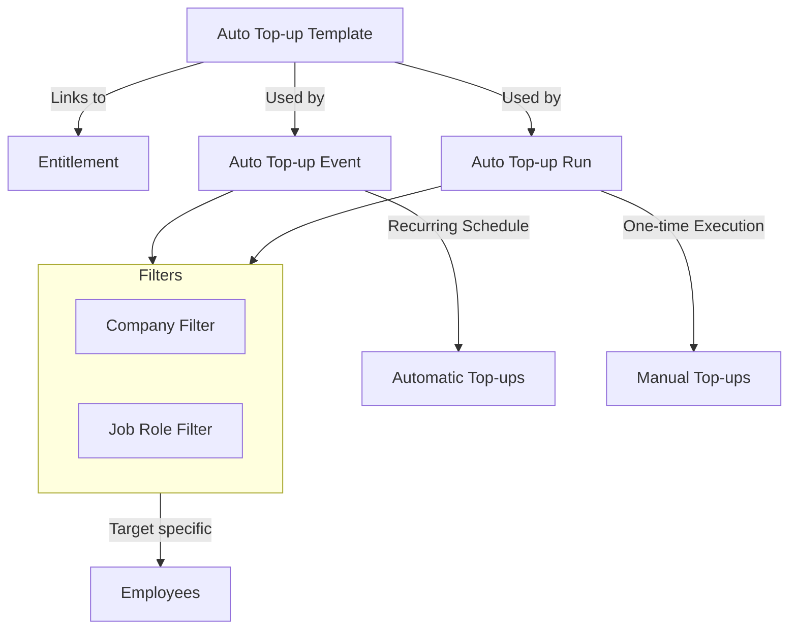

## Purpose and Overview

The **Claim Applet** is a powerful tool designed to streamline the entire expense management process. It moves beyond simple reimbursement by integrating entitlement tracking, fund management, and complex approval workflows.


**Core Concept**: The system links **what** you claim (Items) to **where** the money comes from (Accounts) and **how much** is allowed (Entitlements).


## Key Features Overview

### Who Benefits from This Applet?

**Employees & Claimants:**
- Easy submission of claims with attachments
- Real-time status tracking
- Quick approvals and reimbursements
- Personal entitlement visibility

**Managers & Approvers:**
- Simple approval workflow
- Clear visibility into claim details
- Automated notifications
- Compliance enforcement

**Finance & HR Teams:**
- Automated validation against entitlements
- Reduced processing time
- Complete audit trail
- Accurate reimbursement calculation

**Executive Leadership:**
- Better control over expense spending
- Reduced fraud risk
- Improved employee satisfaction
- Data-driven expense analysis

### What Problems Does This Solve?

**The Manual Claim Process Problem:**

Traditional claim management relies on paper forms and email chains. Common issues include:
- Lost paperwork and missing receipts
- Delayed approvals and reimbursements
- Manual entitlement checks leading to errors
- Difficult compliance tracking
- No centralized reporting

**The Claim Applet Solution:**

- **Digital submission** - Submit claims anytime, anywhere with mobile support
- **Automated workflows** - Intelligent routing and notifications
- **Entitlement validation** - Automatic checks against limits and policies
- **Complete traceability** - Full audit history for every claim
- **Flexible reporting** - Analyze expenses by department, type, or employee
- **Integration ready** - Connects with payroll and accounting systems

## Key Features Overview


  

  

  

  

  

  

  

  




## Key Concepts

### Understanding the Claim Framework

Every claim system must address three fundamental aspects. The Claim Applet provides structured handling:

| Aspect | Component | Practical Example |
|--------|-----------|------------------|
| **Who** is claiming? | Employee/Claimant | Sales Representative, Department Manager |
| **What** is being claimed? | Claim Item & Category | Travel Expenses, Medical Reimbursement |
| **How** is it processed? | Approval Workflow & Entitlements | Multi-level approval, Monthly limits |


**Real-World Example**: A sales rep (WHO) submits a claim for client dinner (WHAT) of RM 200. The system checks their monthly entertainment entitlement, routes to manager for approval (HOW), and processes reimbursement upon approval.


### Claim Hierarchy Structure

Think of the claim process as a structured flow:

```
Organization
│
├── Employees (Claimants) ──→ WHO is claiming?
│   │
│   └── Entitlements ──→ WHAT can they claim?
│       │
│       └── Claim Items ──→ SPECIFIC expense types
│           │
│           └── Categories ──→ Classification for reporting
│
└── Approval Workflow ──→ HOW claims are processed
    │
    └── Cut-Off Periods ──→ WHEN claims can be submitted
```

**Flow Through the Hierarchy:**

1. **Organization**: Company-wide policies
2. **Employee**: Individual entitlements
3. **Claim Item**: Specific expense (e.g., Mileage)
4. **Category**: Grouping (e.g., Travel)
5. **Approval**: Routing to approvers
6. **Cut-Off**: Submission deadlines

This structure enables:
- **Precise control** over claims
- **Flexible reporting** by any dimension
- **Clear accountability** for approvals
- **Period-based processing** for finance

### The "Golden Triangle" of Claims

To effectively manage the system, it is crucial to understand how **Claim Items**, **Claim Accounts**, and **Claim Entitlements** work together.

| Component | Analogy | Definition | Example |
|-----------|---------|------------|---------|
| **Claim Account** | The "Fund" or "Wallet" | A bucket of money designated for a specific purpose. | **Medical Fund** |
| **Claim Entitlement** | The "Limit" | The rule defining how much of that fund an employee gets. | **RM 1,000 per year** |
| **Claim Item** | The "Expense" | The actual item selected when making a claim. It draws from the Account. | **GP Visit**, **Dental Care** |

**How they link:**
1. You create a **Claim Account** (e.g., Medical Fund).
2. You create a **Claim Entitlement** linked to that Account (e.g., RM 1000 limit).
3. You create **Claim Items** (e.g., Dental) and link them to the **Claim Account**.
4. When an employee claims "Dental", the system checks the "Medical Fund" balance defined by the "Entitlement".

---

## Quick Start Guide

Get up and running quickly with these essential workflows.



### For Employees: Submit Your First Claim

**Goal:** Submit a claim and get reimbursed in 5 simple steps.

1. **Navigate**: Go to **My Claims** from the sidebar
2. **Create Header**: Click **"+"** → Enter claim title (e.g., "Oct Medical") → Select your Branch → **Create**
3. **Add Expenses**: 
   - Click **"Add Line"**
   - Select **Claim Item** (e.g., "GP Visit")
   - Enter **Amount** (e.g., RM 150)
   - Add **Description** ("Visit to Dr. Ahmad")
   - Upload **Receipt** (system auto-extracts data with OCR)
4. **Review**: Check all details are correct
5. **Submit**: Click **Submit** → Claim goes to your manager





**What happens next?** You'll get email notifications when approved/rejected. Payment typically within 7-14 days.

**Pro Tip:** Enable "Display Entitlement Balance" to see your remaining allowance before claiming.

---

### For Managers: Approve Your First Claim  

**Goal:** Review and approve employee claims in 3 steps.

1. **Check Pending**: Go to **Pending Approvals** (you'll see a notification badge)
2. **Review Details**:
   - Click on the claim to open
   - Check: Amount, receipts, employee entitlement balance
   - Verify receipts match the claim details
3. **Decide**:
   - **Approve**: Click ✓ **Approve** → Employee gets paid
   - **Reject**: Click ✗ **Reject** → Add reason → Employee notified
   - **Query**: Click **Query** → Ask for more info





**Going on Leave?** Set up delegation: `Settings > Claim Approval Delegation Period` → Select someone to approve on your behalf.

---

### For Admins: Initial System Setup

**Goal:** Get the claim system ready for employees in 6 steps.

**Step 1: Create Claim Accounts** (`Settings > Claim Accounts`)
- Create funds like "Medical Fund", "Transport Fund"
- Set currency and enable balance display



**Step 2: Create Entitlements** (`Settings > Claim Entitlements`)  
- Link to Claim Accounts (e.g., Medical Fund → RM 1,500/year)
- Set recurring top-ups (Monthly/Yearly)



**Step 3: Create Claim Items** (`Settings > Claim Items`)
- Define expense types (GP Visit, Taxi, Parking)
- Link each item to a Claim Account
- Enable required fields (OCR, receipts, etc.)

**Step 4: Set Up Approvals** (`Settings > Claim Approval Settings`)
- Define approval chains (Manager → HOD → Finance)
- Set conditions (claims > RM 1000 need extra approval)

**Step 5: Upload Employee Entitlements** (`Settings > Upload Employee Entitlement`)
- Bulk import all employee allowances via Excel

**Step 6: Test**
- Create a test claim as an employee
- Approve it as a manager
- Verify the full flow works

**Ongoing:** Set up Auto Top-up for automatic monthly/yearly renewals.

---


**New to the system?** Start with the basics:
1. Employees should explore **My Claims** and submit a test claim
2. Managers should check **Pending Approvals** to practice the workflow  
3. Admins should review **Configuration & Settings** below for detailed setup guides


---

## Entitlement Tracking

**Monitor your claim limits and balances in real-time.**

### What is Entitlement Tracking?

Entitlement Tracking shows employees and managers how much of their allocated allowances they've used and what remains. Think of it as your "claim wallet balance."

**For Employees:**
- See your remaining balance before claiming (e.g., "You have RM 800 left in Medical Fund")
- Avoid rejected claims due to insufficient balance
- Plan your expenses throughout the year

**For Managers:**
- Monitor team spending against budgets
- Identify employees who haven't used their entitlements
- Track utilization rates by department

**For Finance/HR:**
- Real-time visibility into budget consumption
- Forecast year-end accruals
- Identify trends (underutilization vs overutilization)

---

### How to Check Your Entitlement Balance

**Employees:**
1. Go to **My Claims** or **Dashboard**
2. Look for **"My Entitlements"** widget/section
3. See all your allowances with:
   - **Total Allocated**: Your yearly/monthly limit (e.g., RM 1,500)
   - **Used**: How much you've claimed (e.g., RM 700)
   - **Remaining**: What's left (e.g., RM 800)
   - **Valid Until**: Expiry date (e.g., Dec 31, 2024)

**Visual Example:**

```
Medical & Wellness Fund
━━━━━━━━━━━━━━━━━━━━━━━━━━━━━━━━━━━━━━━
Allocated: RM 1,500     Used: RM 700 (47%)     Remaining: RM 800
Valid: Jan 1 - Dec 31, 2024

[████████░░░░░░░░░░░] 47% utilized
```

---

### Key Features

**Real-Time Updates:**
- Balance updates immediately after claim approval
- No manual calculation needed

**Multi-Currency Support:**
- View balances in MYR, USD, SGD, or other currencies
- Auto-conversion for reporting

**Breakdown by Category:**
- Medical Fund: RM 800 remaining
- Transport Fund: RM 150 remaining  
- Training Fund: RM 2,500 remaining

**Renewal Tracking:**
- See when your entitlement renews (Monthly, Yearly)
- Know if unused balance carries forward or expires

---

### Common Scenarios

**Scenario 1: Planning a Medical Procedure**

```
Employee checks: "I have RM 800 left in Medical Fund"
Dental procedure costs: RM 600
Decision: Proceed—still have RM 200 buffer for emergencies
```

**Scenario 2: Avoiding Rejection**

```
Employee wants to claim RM 300 for parking
Checks balance: Only RM 150 remaining in Transport Fund
Decision: Split claim—RM 150 now, wait for next month's renewal for the rest
```

**Scenario 3: Year-End Planning**

```
November check: RM 500 unused in Training Fund
Action: Enroll in a course before Dec 31 to use the balance
(Otherwise, it expires and resets on Jan 1)
```

---

### Tips for Employees

✓ **Check Before You Claim**: Always verify your balance to avoid rejected claims  
✓ **Monitor Expiry Dates**: Don't let allowances go to waste  
✓ **Plan Big Expenses**: For large amounts, check if your entitlement renews soon  
✓ **Contact HR**: If your balance seems incorrect, report it immediately

---


## For Claimants (Employees)

This section is your personal guide to submitting and tracking your expense claims.

### My Claim - Your Personal Expense Hub



**What is My Claim?**

This is YOUR workspace—where you create, submit, and track all your expense claims. Think of it as your personal expense diary that automatically gets processed for reimbursement.

**What You Can Do:**
- ✓ Submit new expense claims
- ✓ Edit draft claims before submitting
- ✓ Track claim status (Submitted → Approved → Paid)
- ✓ View payment history
- ✓ Check rejection reasons

---

**How to Submit a Claim** (The Complete Journey)

**Step 1: Create the Claim Header**
1. Click **"My Claims"** from the sidebar
2. Click **"+" (Add New)**
3. Fill in:
   - **Claim Title**: "December 2024 - Medical" (helps you find it later)
   - **Branch**: Your office location
   - **Month**: Claim period
4. Click **"Create"**

**Step 2: Add Your Expenses**
1. Click **"Add Line"**
2. For each expense, enter:
   - **Date**: When you spent the money
   - **Claim Item**: Select type (GP Visit, Taxi, Parking, etc.)
   - **Amount**: How much you paid
   - **Description**: Brief note ("Visit to Dr. Ahmad for flu")
   - **Receipt**: Upload photo/PDF

**Pro Tip with OCR:**
- Upload a clear receipt photo
- System auto-extracts: Date, Amount, Vendor name
- Verify and adjust if needed
- Saves you typing!

**Step 3: Review & Submit**
1. Double-check all amounts and receipts
2. **Check your entitlement balance** (avoid rejection!)
3. Click **"Submit"**
4. Done! You'll get an email notification

**What Happens Next?**
```
You Submit → Manager Approves → Finance Processes → You Get Paid (7-14 days)
          ↓
    Email at each step
```

---

**Claim Statuses Explained:**

| Status | What It Means | What You Should Do|
|--------|---------------|-------------------|
| **Draft** | Not yet submitted | Finish and submit before month-end |
| **Submitted** | Waiting for manager | Nothing—wait for approval |
| **Queried** | Manager needs more info | Check email, provide details |
| **Approved** | Manager said YES | Wait for payment |
| **Rejected** | Manager said NO | Read reason, fix and resubmit |
| **Paid** | Money in your account | Check bank statement |

---

**Common Scenarios:**

**Scenario 1: Monthly Medical Claim**
```
January Activities:
- Jan 5: GP visit - RM 80
- Jan 12: Pharmacy - RM 45
- Jan 20: Dental cleaning - RM 150

End of Month:
1. Create claim: "Jan 2024 - Medical"
2. Add 3 lines (1 per visit)
3. Upload 3 receipts
4. Submit → Approved → Paid RM 275
```

**Scenario 2: Business Trip**
```
Trip to KL for training (3 days):
- Flight RM 350
- Hotel (2 nights) RM 400
- Taxi (airport) RM 80
- Meals RM 120

Create claim: "KL Training Trip - Oct 2024"
Add 4 expense lines
Total: RM 950 reimbursed
```

**Scenario 3: Rejected Claim (How to Fix)**
```
Submitted: Lunch claim RM 200
Status: Rejected
Reason: "Receipt not clear, missing tax invoice"

What to do:
1. Go to My Claims
2. Find rejected claim
3. Click "Edit"
4. Upload clearer receipt with tax details
5. Resubmit → Approved!
```

---

**Tips for Faster Approvals:**

✓ **Clear Receipts**: Ensure date, amount, vendor name are visible  
✓ **Accurate Descriptions**: "Team lunch with client XYZ" vs just "Lunch"  
✓ **Check Balance First**: Don't claim RM 500 if you only have RM 300 left  
✓ **Submit Early**: Don't wait until month-end (managers get swamped)  
✓ **Group Logically**: Cluster related expenses in one claim

❌ **Common Mistakes:**
- Submitting without receipts
- Claiming same expense twice
- Wrong claim item selected (Medical for Parking)
- Expired receipts (check cut-off dates!)

---

### Line Report - Detailed Expense Tracking



**What is Line Report?**

While "My Claim" shows your full claims, **Line Report** shows every individual expense you've claimed—line by line. It's like having an itemized expense history.

**Why Is This Useful?**

**For You (Employee):**
- Track spending patterns ("How much did I spend on parking this year?")
- Find specific expenses quickly
- Prepare for tax submissions
- Verify all claims were processed

**How to Use It:**

**Basic View:**
1. Go to **"Line Report"** (or "My Expenses")
2. See a list of ALL your expense lines
3. Each row = 1 expense (not a full claim)

**Example View:**
```
Date       | Item      | Amount | Status   | Claim
-----------|-----------|---------|- ---------|--------
Dec 5, 2024| GP Visit  | RM 80   | Paid     | Dec Medical
Dec 12     | Pharmacy  | RM 45   | Paid     | Dec Medical
Dec 15     | Taxi      | RM 25   | Approved | Dec Transport
Dec 20     | Parking   | RM 15   | Submitted| Dec Transport
```

**Powerful Filtering:**

**Find All Taxi Expenses:**
- Filter by: Item = "Taxi"
- Date Range: Jan - Dec 2024
- Result: See total taxi spending (RM 1,200 for the year!)

**Find Specific Receipt:**
- Filter by: Date = "Oct 15, 2024"
- Item = "Medical"
- Find that GP receipt you need for tax

**Monthly Summary:**
- Filter by: Month = "November 2024"
- View: All expenses for that month
- Export to Excel for records

---

**Real-World Use Cases:**

**Use Case 1: Year-End Tax Preparation**
```
Task: Need all medical expenses for tax relief

Steps:
1. Open Line Report
2. Filter: Item Category = "Medical"
3. Date Range: Jan 1 - Dec 31, 2024
4. Export to Excel
5. Submit to tax consultant

Result: Complete medical claim history in 2 minutes!
```

**Use Case 2: Budget Planning**
```
Question: "How much do I spend on parking monthly?"

Steps:
1. Line Report
2. Filter: Item = "Parking"
3. Group by: Month
4. See trend: Jan RM 180, Feb RM 200, Mar RM 190

Insight: Average RM 190/month → Adjust personal budget
```

**Use Case 3: Finding a Lost Claim**
```
Problem: "I claimed a dental visit in September but can't find it"

Steps:
1. Line Report
2. Filter: Item = "Dental", Month = "September"
3. Found: Sept 15 - Dr. Lee Dental - RM 250
4. Click to see full claim details
```

---

**Tips:**

✓ **Export Regularly**: Download Excel monthly for your records  
✓ **Use Filters**: Don't scroll—filter to find what you need  
✓ **Check Paid Items**: Verify everything marked "Paid" actually hit your bank  
✓ **Year-End Review**: Check totals against entitlement (did you use all your RM 1,500 medical?)

---

### Engagement Reports - Project Claims



**Submit expenses tied to specific client projects or engagements.**

**What are Engagement Reports?**

Engagement Reports (also called Project Claims) are used when expenses need to be:
- **Billable to clients** - Pass costs directly to the client
- **Tracked by project** - Allocate expenses to specific engagements for profitability analysis
- **Approved by project stakeholders** - Route to project managers instead of regular line managers

**Common in:** Consulting firms, law firms, agencies, professional services

---

**How It Works:**

**Standard Claim Flow:**
```
Employee → Line Manager → Paid
(Just checking if expense is legitimate)
```

**Engagement Report Flow:**
```
Employee → Project Manager → Engagement Partner → Finance → Paid
(Checking: Is this project-related? Is it within budget? Can we bill the client?)
```

---

**When to Use Engagement Reports:**

✓ **Client Travel**: Flew to client site for meetings  
✓ **Client Entertainment**: Dinner with client stakeholders  
✓ **Project-Specific Purchases**: Materials bought for a specific client project  
✓ **External Consultants**: Subcontractor fees for client work  
✓ **Project Accommodation**: Hotel stay during client project delivery

❌ **Don't Use For:**
- Regular office expenses (use standard claims)
- Personal development training (unless client-specific)
- General office supplies

---

**How to Submit an Engagement Report:**

**Step 1: Create the Claim**
1. Go to **Engagement Reports** (or **My Claims**)
2. Click **"+ Add"**
3. Select **Engagement/Project** from dropdown (e.g., "ABC Corp - ERP Implementation")

**Step 2: Add Expense Lines**
1. Click **"Add Line"**
2. Enter expense details:
   - **Date**: When expense occurred
   - **Claim Item**: Type (Travel, Meals, Accommodation)
   - **Amount**: Cost
   - **Description**: "Flight to KL for client workshop"
   - Upload **Receipt**

**Step 3: Mark as Billable (If Applicable)**
- Check **"Billable to Client"** checkbox
- This flags the expense for invoicing

**Step 4: Submit**
- Click **Submit** → Routes to Project Manager

---

**Billable vs Non-Billable:**

| Type | Description | Example | Who Pays? |
|------|-------------|---------|-----------|
| **Billable** | Client reimbursed | Flight to client site for project work | Client (invoiced) |
| **Non-Billable** | Company absorbs | Team lunch during project (goodwill) | Company |

**Finance Tip:** Correctly marking billable items ensures accurate client invoicing and project profitability tracking.

---

**Approval Flow:**

**Level 1: Project Manager**
- Validates: "Is this expense legitimate for this project?"
- Checks: "Is it within the project budget?"

**Level 2: Engagement Partner (High-Value)**
- Reviews: "Should we bill the client or absorb it?"
- Approves: Strategic client relationship decisions

**Level 3: Finance**
- Verifies: Coding to correct project account
- Processes: Payment to employee + client invoice generation

---

**Real-World Example:**

**Scenario: Consultant Claims Travel to Client Site**

```
Employee: Sarah (Management Consultant)
Project: ABC Corp - Digital Transformation
Expenses:
  - Flight KL → Singapore: RM 350 (Billable)
  - Hotel (3 nights): RM 900 (Billable)
  - Client dinner: RM 250 (Non-billable - relationship building)

Sarah submits Engagement Report:
  1. Selects Project: "ABC Corp - Digital Transformation"
  2. Adds 3 line items
  3. Marks flight + hotel as "Billable"
  4. Marks dinner as "Non-billable"

Approval Flow:
  → Project Manager (reviews budget)
  → Engagement Partner (approves billable amounts)
  → Finance (pays Sarah RM 1,500, invoices client RM 1,250)
```

---

**Benefits of Engagement Reports:**

**For Consultants/Employees:**
- ✓ Clear project expense tracking
- ✓ Fast reimbursement (client-funded)
- ✓ Proper documentation for audits

**For Project Managers:**
- ✓ Budget control per project
- ✓ Visibility into project costs
- ✓ Early warning if overspending

**For Finance:**
- ✓ Automated client invoicing
- ✓ Project profitability tracking
- ✓ Accurate cost allocation

**For Clients:**
- ✓ Transparency in billed expenses
- ✓ Itemized invoices with receipts
- ✓ Only pay for agreed-upon expenses

---

**Common Questions:**

**Q: What if I forget to mark an expense as billable?**  
A: Contact your Project Manager immediately. If already approved, Finance may need to adjust the client invoice.

**Q: Can I claim personal expenses on an engagement report?**  
A: No. Only project-related expenses. Personal items should use standard claims.

**Q: What if the client disputes a billable expense?**  
A: The Engagement Partner will review and may reclassify it as non-billable (company absorbs).

**Q: How long until I get reimbursed?**  
A: Typically 7-14 days after final approval. Billable expenses may take longer if tied to client payment terms.

**Q: Can I see all my project expenses for the year?**  
A: Yes—use **Engagement Reports** view with filters by Project and Date Range.

---

## For Supervisors (Managers)

This section helps you manage team claims efficiently and maintain proper oversight.

### Pending Approvals - Your Action Centre

**What is Pending Approvals?**

This is YOUR task list—all claims waiting for your decision. Think of it as your approval inbox.

**Why This Matters:**

**For You (Manager):**
- Clear queue of what needs your attention
- Quick approve/reject without digging through emails
- Protect yourself (proper authorization trail)
- Control team budget

**For Your Team:**
- Fast approvals = Happy employees
- Delayed approvals = Frustrated employees
- Clear feedback on rejections

---

**How to Approve Claims (Step-by-Step):**

**Step 1: Open Your Queue**
1. Click **"Pending Approvals"** from sidebar
2. See list of all claims waiting for you
3. Notice: Red badge number = items pending

**Step 2: Review Each Claim**
Click on a claim to see:
- **Employee Name**: Who's claiming
- **Amount**: How much they're requesting
- **Claim Items**: What they bought
- **Receipts**: Attached documents
- **Entitlement Balance**: Do they have enough allowance left?

**Key Things to Check:**
- ✓ Receipts are clear and complete
- ✓ Amounts match receipts
- ✓ Expense is work-related (not personal)
- ✓ Within company policy (e.g., meals < RM 100)
- ✓ Employee has entitlement balance
- ✓ Not a duplicate claim

**Step 3: Make Your Decision**

**Option A: Approve ✓**
1. Click **"Approve"** button
2. Claim moves to Finance for payment
3. Employee gets notification

**Option B: Reject ✗**
1. Click **"Reject"** button
2. **IMPORTANT**: Type rejection reason
   - Good: "Receipt missing vendor name—please resubmit with tax invoice"
   - Bad: "Rejected" (employee doesn't know why!)
3. Employee gets email with your reason
4. They can fix and resubmit

**Option C: Query ?**
1. Click **"Query"** button
2. Ask for clarification: "Was this meal with client or internal team?"
3. Employee responds
4. Claim comes back to you for final decision

---

**Quick Approval Tips:**

**Fast-Track (Bulk Approve):**
- Select multiple small, routine claims (< RM 50)
- Verify receipts look ok
- Click "Approve All"
- Done in seconds!

**Careful Review (High-Value):**
- Claims > RM 500: Take your time
- Check receipts carefully
- Verify business purpose
- Confirm with employee if unclear

---

**Common Approval Scenarios:**

**Scenario 1: Routine Medical Claim**
```
Employee: Sarah
Claim: RM 80 - GP Visit
Receipt: ✓ Clear, shows date, amount, clinic name
Entitlement Balance: RM 1,200 remaining (plenty)
Your Decision: Approve ✓ (30 seconds)
```

**Scenario 2: Questionable Meal Claim**
```
Employee: John
Claim: RM 350 - Team Dinner
Receipt: ✓ Clear
Issue: Policy limit is RM 200 for team meals

Your Action:
1. Click Query
2. Message: "Team dinners capped at RM 200. Was this a client dinner?"
3. John responds: "Yes, with ABC Corp client"
4. You approve: "Client dinner approved" ✓
```

**Scenario 3: Missing Receipt**
```
Employee: Mary
Claim: RM 120 - Taxi
Receipt: ✗ Missing

Your Action:
1. Reject
2. Reason: "Receipt required for all claims > RM 50. Please resubmit with e-hailing receipt"
3. Mary uploads receipt
4. You approve on resubmission
```

**Scenario 4: Exceeded Entitlement**
```
Employee: Ahmad
Claim: RM 600 - Medical
Balance Remaining: RM 300 (insufficient!)

Your Action:
1. Reject
2. Reason: "Your medical balance is RM 300. Please reduce claim to available balance or contact HR for top-up approval"
```

---

**Best Practices for Managers:**

✓ **Daily Check-In**: Review approvals daily (10 mins) rather than weekly  
✓ **Set Expectations**: Team knows you approve every afternoon  
✓ **Be Consistent**: Same rules for everyone (no favouritism)  
✓ **Clear Rejections**: Always explain WHY—helps employees learn  
✓ **Use Delegation**: Going on leave? Delegate approvals to your deputy

**Delegation Setup:**
```
Going on holiday Dec 20-31?
1. Go to: Settings > Claim Approval Delegation
2. Delegatee: Select your deputy
3. Period: Dec 20 - Dec 31
4. Save

Result: All your pending approvals auto-route to your deputy
Employee experience: No delay!
```

---

### Staff Reports - Team Oversight Dashboard

**What is Staff Reports?**

This shows ALL claims from your team members—past, present, pending, paid. It's your team expense control centre.

**What You Can See:**

- Every claim submitted by your team
- Who's claiming what
- Team spending patterns
- Budget utilization
- Spending trends

**Why Use This?**

**Budget Monitoring:**
- "My team has claimed RM 50,000 this quarter—are we on track?"
- "Who's using their allowances? Who isn't?"

**Trend Analysis:**
- "Taxi claims doubled this month—why?"
- "Medical claims always spike in December (year-end rush)"

**Audit Prep:**
- "Show me all claims > RM 1,000 this year"
- "Who claimed what on Project ABC?"

---

**How to Use Staff Reports:**

**View All Team Claims:**
1. Click **"Staff Reports"**
2. See complete list of subordinate claims
3. Filter by:
   - Employee name
   - Date range
   - Status (Approved, Rejected, Pending)
   - Amount range
   - Claim item type

**Example View:**
```
Employee   | Claim        | Amount    | Status   | Date
-----------|--------------|-----------|----------|----------
Sarah Tan  | Medical      | RM 350    | Paid     | Dec 15
John Lee   | Travel       | RM 1,200  | Approved | Dec 18
Mary Wong  | Parking      | RM 80     | Submitted | Dec 20
Ahmad Ali  | Meals        | RM 150    | Rejected | Dec 22
```

---

**Powerful Filters & Exports:**

**Monthly Team Summary:**
```
Filter:
- Date Range: Nov 1-30, 2024
- All employees
- Status: Paid

Export to Excel
Result: Complete monthly expense report for finance
```

**High-Value Claims Audit:**
```
Filter:
- Amount: > RM 500
- Date: Last 6 months
- Status: All

Review: Are high claims properly justified?
```

**Individual Employee Check:**
```
Filter:
- Employee: Sarah Tan
- Year: 2024
- All statuses

See: Total claimed RM 8,500 / Entitlement RM 10,000
Insight: Sarah has RM 1,500 unused (remind her!)
```

---

**Real-World Management Scenarios:**

**Scenario 1: Monthly Budget Review**
```
Task: Prepare team expense report for director

Steps:
1. Staff Reports
2. Filter: This month, Status = Paid
3. Group by: Claim Item Category
4. Export to Excel
5. Add totals:
   - Medical: RM 5,000
   - Transport: RM 3,000
   - Meals: RM 2,000
   Total: RM 10,000 / RM 12,000 budget

Report to Director: "Under budget, 83% utilized"
```

**Scenario 2: Unusual Spending Alert**
```
Notice: Taxi claims doubled this month

Steps:
1. Staff Reports
2. Filter: Item = Taxi, This month
3. Drill down: All from 3 employees (salespeople)
4. Check: New client visits increased

Action: Expected—approve. Update next month's budget.
```

**Scenario 3: Year-End Entitlement Check**
```
December Task: Ensure team uses entitlements

Steps:
1. Staff Reports
2. View each employee's utilization %
3. Find: 5 employees have unused medical (RM 500+ each)
4. Action: Send reminder email:
   "You have RM 500 medical remaining—expires Dec 31!"

Result: Employees claim remaining balance, satisfaction up
```

---

**Manager Tips:**

✓ **Weekly 15-Min Review**: Check team spending patterns  
✓ **Spot Check Receipts**: Randomly verify receipts for quality control  
✓ **Trend Analysis**: Compare month-to-month to catch anomalies  
✓ **Support Your Team**: Proactively remind about unused entitlements  
✓ **Budget Forecasting**: Use past data to plan next year's budgets

---

### Non-Reimbursable Report - Company-Paid Tracking



**What is Non-Reimbursable Report?**

These are expenses the company pays DIRECTLY—no money goes to employees. Think: corporate credit cards, company car allowances, direct vendor billing.

**Why Track These If No Payment Needed?**

1. **Tax Reporting**: Benefits-in-kind need to be reported
2. **Budget Control**: Company still spends money—needs tracking
3. **Audit Compliance**: Must show what was spent and why
4. **Fair Allocation**: Ensure costs go to right department/project

---

**Common Non-Reimbursable Items:**

| Item | How It Works | Example |
|------|--------------|---------|
| **Corporate Card** | Employee swipes company card | Client dinner charged directly |
| **Company Car** | Fuel/maintenance billed to company | RM 500 monthly fuel |
| **Direct Billing** | Vendor invoices company | Hotel books conference room |
| **Allowances** | Fixed monthly amount (no cash) | RM 300 phone allowance |
| **Subscriptions** | Professional memberships | ACCA fees paid by company |

---

**What You See in This Report:**

**Employee View:**
```
Date       | Item             | Amount  | Purpose
-----------|------------------|---------|------------------
Dec 5      | Corporate Card   | RM 350  | Client lunch
Dec 10     | Company Car Fuel | RM 200  | Monthly allocation
Dec 15     | Phone Allowance  | RM 300  | Monthly credit
```

**Manager View (Staff Reports):**
```
Employee  | Non-Reimb Items | Monthly Total
----------|-----------------|---------------
Sarah     | Corp Card (3x)  | RM 850
John      | Car Fuel        | RM 400
Mary      | Phone           | RM 300
```

---

**Real-World Use Cases:**

**Use Case 1: Year-End Tax for Employee**
```
Tax Season: Need benefits-in-kind value

Steps:
1. Non-Reimbursable Report
2. Filter: My items, Full year
3. Export: Excel

Submit to Tax Agent:
- Phone allowance: RM 300 × 12 = RM 3,600
- Company car: RM 500 × 12 = RM 6,000
Total BIK: RM 9,600 (taxable)
```

**Use Case 2: Department Budget (Manager)**
```
Question: "What did company spend on our team's corporate cards?"

Steps:
1. Non-Reimbursable Report
2. Filter: Team members, Item = Corporate Card
3. See: Total RM 12,000 this quarter
4. Budget tracking: Within RM 15,000 limit ✓
```

**Use Case 3: Audit Compliance**
```
Auditor Request: "Show all company-paid expenses for Project XYZ"

Steps:
1. Non-Reimbursable Report
2. Filter: Project = XYZ, All employees
3. Export with receipts
4. Submit to auditor

Proves: Proper authorization and documentation
```

---

**Manager Oversight:**

**What to Monitor:**
- ✓ Corporate card usage (is it reasonable?)
- ✓ Patterns (are allowances being used properly?)
- ✓ Policy compliance (within limits?)

**Red Flags:**
- Corporate card for personal expenses
- Duplicate entries (same expense claimed twice)
- Over-limit spending without approval

---

### Professional Study Scheme Report - Education Tracking



**What is Professional Study Scheme?**

Special tracking for educational and professional development expenses—courses, certifications, tuition, professional memberships.

**Why Separate from Regular Claims?**

1. **Different Budget**: Usually HR/L&D budget, not operating expenses
2. **Special Approval**: May need HR + Manager approval
3. **Payback Clauses**: Some have "stay 2 years or pay back" conditions
4. **Tax Treatment**: Education expenses have special tax rules
5. **ROI Tracking**: Company wants to know if training works

---

**What's Covered:**

**Eligible Expenses:**
- ✓ Degree/Diploma tuition (MBA, MSc)
- ✓ Professional certifications (ACCA, CPA, PMP, CISSP)
- ✓ Skills courses (Excel, Leadership, Coding)
- ✓ Conference fees (professional development)
- ✓ Study materials (textbooks, exam fees)
- ✓ Professional body memberships (annual fees)

**Not Covered:**
- ✗ Hobbies (yoga, cooking classes)
- ✗ Personal interest courses unrelated to work
- ✗ Courses taken on personal time without approval

---

**How to Submit Professional Study Claims:**

**Step 1: Get Approval FIRST**
```
BEFORE enrolling:
1. Discuss with Manager
2. Submit course details to HR
3. Get written approval (email/form)
4. Sign payback agreement (if applicable)

THEN enroll in course
```

**Step 2: Submit Claim After Payment**
1. Go to **"Professional Study Claims"**
2. Click **"+ Add"**
3. Enter:
   - **Course Name**: "ACCA Level 1 - Financial Accounting"
   - **Provider**: University/Institution
   - **Amount**: RM 3,500
   - **Approval Reference**: HR approval email/number
   - **Receipt**: Tuition invoice
4. Submit

**Step 3: Approval Flow**
```
Employee → Manager → HR/L&D → Finance → Payment
         (Work relevance?) (Budget?) (Process) (Reimburse)
```

---

**Real-World Scenarios:**

**Scenario 1: ACCA Professional Certification**
```
Employee: Sarah (Accountant)
Course: ACCA Level 1
Cost: RM 3,500
Company Policy: Reimburse 100% if pass, 50% if fail

Process:
1. Sarah gets HR approval
2. Completes course
3. Submits claim with:
   - Tuition receipt
   - **Passing certificate** (proof of completion)
4. HR verifies pass
5. Full RM 3,500 reimbursed

Payback clause: If Sarah leaves within 2 years, refund RM 3,500
```

**Scenario 2: MBA Sponsorship**
```
Employee: John (Manager)
Program: Executive MBA
Cost: RM 80,000 (over 2 years)
Company Policy: Sponsor 70%, John pays 30%

Setup:
- Company pays: RM 56,000 directly to university
- John pays: RM 24,000 personally
- Non-reimbursable tracking: Company's RM 56K
- Payback: If leaves in 3 years, refund proportionally

Claim Submission:
- Per semester: RM 14,000 (company portion)
- Total 4 claims over 2 years
```

**Scenario 3: Annual Professional Membership**
```
Employee: Mary (Engineer)
Membership: Board of Engineers Malaysia (BEM)
Cost: RM 350/year
Policy: Company pays for job-required memberships

Process:
1. Submit annual renewal invoice
2. Manager approves (job requires PEng license)
3. Finance pays vendor directly OR reimburses Mary
4. Tracked in Professional Study report for tax
```

---

**Manager's View (Staff Reports):**

**What You See:**
```
Employee | Course              | Amount    | Status    | ROI Notes
---------|---------------------|-----------|-----------|------------
Sarah    | ACCA L1             | RM 3,500  | Completed | Passed ✓
John     | MBA Semester 1      | RM 14,000 | In Progress| 2 years remaining
Mary     | BEM Membership      | RM 350    | Paid      | Annual renewal
Ahmad    | Leadership Course   | RM 1,200  | Completed | Promoted after!
```

**ROI Tracking:**
- Sarah (ACCA): Now qualified accountant ✓
- John (MBA): In progress
- Ahmad (Leadership): Got promoted 6 months later → Great ROI!

---

**HR/Manager Approval Guidelines:**

**Approve When:**
- ✓ Job-related/career progression
- ✓ Benefits company (upskills employee)
- ✓ Within budget
- ✓ Employee committed (signs payback if needed)

**Reject/Defer When:**
- ✗ Not work-related
- ✗ Budget exhausted
- ✗ Employee planning to leave soon (red flag)
- ✗ Just completed similar course recently

---

**Tips for Employees:**

✓ **Plan Ahead**: Get approval BEFORE paying  
✓ **Read Policy**: Know pass/fail reimbursement rules  
✓ **Keep Proof**: Certificates, transcripts, receipts  
✓ **Understand Payback**: If you leave, you may owe money

**Tips for Managers:**

✓ **Support Development**: Encourage team learning  
✓ **Track ROI**: Did training improve performance?  
✓ **Fair Distribution**: Ensure all team members get opportunities  
✓ **Budget Wisely**: Plan annual training budget per employee

---

## Configuration & Settings



#### Claim Accounts (`Settings > Claim Accounts`)



**Claim Accounts** are the foundation of your claim system—they define the "money pools" that fund employee claims. Think of each account as a separate budget or fund (e.g., Medical Fund, Transport Fund, Training Fund).

**Why Claim Accounts Matter:**
- Each account has its own balance and rules
- Employees are linked to accounts via entitlements
- Claims draw from specific accounts automatically
- Enables separate tracking of different benefit types

**Creating a Claim Account - Field Guide:**

| Field | Purpose | Example |
|-------|---------|---------|
| **Account Name** | Display name for the fund | "Medical & Wellness Fund" |
| **Account Code** | Unique identifier | MED-001 |
| **Currency** | Account currency | MYR |
| **Display Balance** | Show employees their remaining balance | Yes (recommended) |
| **Description** | Admin notes about this account | "Covers GP, Dental, Optical" |

---

**Claim Account Edit - Tabs Overview:**

When you edit a Claim Account, you'll see the following tabs:

| Tab | Purpose |
|-----|---------|
| **Main Details** | Basic account information (name, code, currency, description) |
| **Claim Entitlement** | Configure entitlements linked to this account |
| **Account Conversion** | Define which other accounts this account can convert to |
| **HR Claim Approval** | Assign HR approvers for claims from this account |
| **Employee Balance** | View employee balances for this account |
| **Claim Items** | View which claim items use this account |

---

##### Account Conversion (`Settings > Claim Accounts > [Account] > Account Conversion`)

**What is Account Conversion?**

Account Conversion defines which other claim accounts the current account's balance can be converted to. When configured, employees can transfer their unused entitlement from one account to another (e.g., transfer Medical Fund balance to Training Fund).


**Why This Feature Exists**: Employees often have unused balances in one benefit account while needing more in another. Account Conversion provides flexibility by allowing pre-approved transfers between accounts.


---

**How It Works:**

1. Admin defines conversion rules for each claim account
2. Each rule specifies which target account(s) money can flow into
3. When employees have remaining balance, they can request conversion to allowed target accounts
4. The converted amount is deducted from the source account and added to the target account

---

**How to Set Up Account Conversion:**

1. Navigate to `Settings > Claim Accounts`
2. Select the **source account** (where balance comes FROM)
3. Click on the **Account Conversion** tab
4. Click **"+ Add"** to create a new conversion rule
5. Fill in the form fields:

| Field | Description | Example |
|-------|-------------|---------|
| **Name** | Descriptive name for this conversion rule | "Medical to Training" |
| **Main Account** | The source account (auto-filled, read-only) | "Medical & Wellness Fund" |
| **Convertible Account** | Select the target account for conversion | "Professional Development Fund" |

6. Click **CREATE** to save the rule

---

**Example Setup:**

To allow employees to convert Medical Fund → Training Fund:

1. Go to `Settings > Claim Accounts`
2. Select "Medical & Wellness Fund"
3. Click **Account Conversion** tab
4. Click **+ Add**
5. Enter:
   - **Name**: "Medical to Training Conversion"
   - **Main Account**: Medical & Wellness Fund (auto-filled)
   - **Convertible Account**: Professional Development Fund
6. Click **CREATE**

Now employees with balances in Medical Fund can convert to Training Fund.

---

**Best Practices:**

✓ **Plan Conversion Paths Carefully**: Decide which accounts should allow conversion and in which direction

✓ **Communicate to Employees**: Announce which conversions are available and any deadlines

✓ **Review Regularly**: Monitor conversion patterns to understand employee benefit preferences

---

##### HR Claim Approval Setting (`Settings > Claim Accounts > [Account] > HR Claim Approval`)

**What is HR Claim Approval Setting?**

HR Claim Approval Setting allows you to assign specific employees as HR approvers for claims submitted against this claim account. When configured, claims from this account will route through the assigned HR approvers based on their approval level.


**Why This Feature Exists**: For certain claim accounts (especially medical or sensitive benefits), HR oversight is required. This feature lets you designate who in HR can approve claims and at what level in the approval chain.


---

**How It Works:**

1. Admin assigns employees as HR approvers for a specific claim account
2. Each approver is assigned an **Approval Level** (1, 2, 3, etc.)
3. When claims are submitted to this account, they route through the assigned approvers in order of their approval level
4. Level 1 approvers review first, then Level 2, and so on

---

**How to Add an HR Approver:**

1. Navigate to `Settings > Claim Accounts`
2. Select the claim account (e.g., Medical Fund)
3. Click on **HR Claim Approval** tab
4. Click **"+ Add"** to add an approver
5. A dialog will open to select an employee
6. Fill in the form fields:

| Field | Description | Example |
|-------|-------------|---------|
| **Employee Name** | The employee designated as approver (read-only after selection) | "John Smith" |
| **Rank** | Employee's rank/position (read-only, from profile) | "HR Manager" |
| **Email** | Employee's email for notifications (read-only) | "john.smith@company.com" |
| **Approval Level** | Order in approval chain (1 = first, 2 = second) | 1 |

7. Click **CREATE** to save

---

**Example Setup:**

For a Medical Fund that requires two-level HR approval:

1. **Level 1 Approver**: HR Executive (Sarah) - Reviews all claims first
2. **Level 2 Approver**: HR Manager (John) - Final HR approval for escalated/large claims

Setup steps:
1. Go to `Settings > Claim Accounts > Medical Fund`
2. Click **HR Claim Approval** tab
3. Click **+ Add**, select Sarah, set Approval Level = 1
4. Click **+ Add**, select John, set Approval Level = 2

Now claims from Medical Fund will route: Employee → Manager → Sarah (HR L1) → John (HR L2) → Finance

---

**Best Practices:**

✓ **Assign Backup Approvers**: Have multiple approvers at each level in case of leave

✓ **Use Approval Levels Wisely**: Level 1 for initial screening, higher levels for escalation

✓ **Keep the List Updated**: Remove approvers who leave or change roles

---

##### Claim Entitlement Tab (`Settings > Claim Accounts > [Account] > Claim Entitlement`)

**What is the Claim Entitlement Tab?**

This tab shows all entitlements that draw funds from this specific claim account. It answers the question: *"Who can claim from this account and how much are they entitled to?"*


**Why This Tab Exists**: When you create entitlements (e.g., "Staff Medical RM 1,000/year"), they must be linked to a claim account. This tab lets you see ALL entitlements connected to this account in one place—without navigating to the separate Entitlements settings menu.


---

**Real-World Scenario:**

You manage a Medical Fund with RM 50,000 annual budget. You want to see:
- How many entitlements are using this fund?
- What are the individual limits?
- Is the total allocated close to the budget?

**Solution**: Go to `Medical Fund > Claim Entitlement` tab to see all entitlements at a glance.

---

**What You'll See in This Tab:**

| Column | What It Shows | Why It Matters |
|--------|---------------|----------------|
| **Entitlement Name** | e.g., "Staff Medical", "Executive Medical" | Identifies the entitlement type |
| **Code** | Unique identifier like MED-STAFF | For exports and reporting |
| **Topup Amount** | e.g., RM 1,000 | The limit per employee |
| **Recurring** | Yes/No | Whether it auto-renews |

---

**Common Questions This Tab Answers:**

1. **"Why is our Medical Fund overspent?"**
   - Check if multiple entitlements are drawing from the same account
   - Example: "Staff Medical (RM 1,000)" + "Family Medical (RM 3,000)" both use Medical Fund

2. **"Which entitlement type gives the highest limit?"**
   - Compare all entitlements linked to an account
   - Useful for policy reviews

3. **"How many entitlement types exist for this fund?"**
   - Quick count without navigating elsewhere

---

**How to Add an Entitlement from This Tab:**

1. Open the Claim Account (e.g., Medical Fund)
2. Go to **Claim Entitlement** tab
3. Click the **"+"** button
4. Fill in the entitlement details (Name, Code, Topup Amount, Recurring)
5. Save

This creates an entitlement automatically linked to this account—no need to select the account separately.

---

##### Employee Balance Tab (`Settings > Claim Accounts > [Account] > Employee Balance`)

**What is the Employee Balance Tab?**

This tab shows the **real-time claim balance** of every employee who has entitlements under this account. It's your "balance dashboard" for a specific fund.


**Why This Tab Exists**: Instead of checking each employee individually or running a report, you can instantly see who has used their entitlement, who hasn't, and who's running low—all for a specific claim account.


---

**Real-World Scenarios:**

**Scenario 1: Year-End Entitlement Review**

*Problem*: It's December, and you want to remind employees to use their unused medical benefits before they expire.

*Solution*: 
1. Go to `Medical Fund > Employee Balance` tab
2. Sort by "Remaining Balance" descending
3. Export the list of employees with high remaining balances
4. Send a reminder email to those employees

---

**Scenario 2: Budget Monitoring**

*Problem*: Finance wants to know how much of the Medical Fund has been utilized this quarter.

*Solution*:
1. Go to `Medical Fund > Employee Balance` tab
2. Review the Total Utilized column across all employees
3. Calculate: Total Budget - Total Utilized = Remaining Budget

---

**Scenario 3: Investigating an Employee Query**

*Problem*: An employee says "My medical claim was rejected due to insufficient balance, but I haven't used anything this year!"

*Solution*:
1. Go to `Medical Fund > Employee Balance` tab
2. Search for the employee's name
3. Check their:
   - Assigned Entitlement
   - Used Amount
   - Remaining Balance
4. Identify if there's a discrepancy or if claims were already approved

---

**What You'll See in This Tab:**

| Column | What It Shows | Example |
|--------|---------------|---------|
| **Employee Name** | Full name of the employee | "Ahmad bin Hassan" |
| **Employee Code** | Staff ID | "EMP-001" |
| **Entitlement** | Which entitlement they have | "Staff Medical (RM 1,000)" |
| **Initial Balance** | Starting amount for the period | RM 1,000.00 |
| **Used** | Amount claimed and approved | RM 350.00 |
| **Pending** | Amount in pending claims | RM 150.00 |
| **Remaining** | Available balance | RM 500.00 |

---

**Tips for Using This Tab:**

✓ **Export to Excel**: Use the export function for detailed analysis or to share with finance

✓ **Filter by Department**: Some views allow filtering to see only your team's balances

✓ **Check Regularly**: Review monthly to catch any unusual patterns early

---

##### Claim Items Tab (`Settings > Claim Accounts > [Account] > Claim Items`)

**What is the Claim Items Tab?**

This tab shows which **expense types (claim items)** are configured to use this account. It answers: *"What can employees claim against this fund?"*


**Why This Tab Exists**: When creating claim items (like "GP Visit" or "Dental Treatment"), you link them to an account. This tab gives you a consolidated view of all expense types that draw from a specific fund—useful for auditing and configuration reviews.


---

**Real-World Scenarios:**

**Scenario 1: Policy Audit**

*Problem*: HR asks: "Which expense types are covered under our Medical Fund?"

*Solution*:
1. Go to `Medical Fund > Claim Items` tab
2. You'll see a list like:
   - GP Visit
   - Specialist Consultation
   - Dental Treatment
   - Optical (Glasses)
   - Traditional Medicine
3. Screenshot or export this list for the policy document

---

**Scenario 2: Adding a New Expense Type**

*Problem*: The company now wants to cover mental health counseling under Medical Fund.

*Solution*:
1. First, check `Medical Fund > Claim Items` tab to see existing items
2. Verify "Mental Health Counseling" isn't already there
3. Go to `Settings > Claim Items` to create the new item
4. Link it to Medical Fund during creation
5. Return to the Claim Items tab to verify it now appears

---

**Scenario 3: Troubleshooting Missing Claim Type**

*Problem*: An employee says "I can't find Dental Treatment in my claim options."

*Solution*:
1. Go to `Medical Fund > Claim Items` tab
2. Check if "Dental Treatment" is listed
3. If not listed → the item isn't linked to this account
4. If listed → check the employee's entitlement to ensure they're eligible

---

**What You'll See in This Tab:**

| Column | What It Shows | Example |
|--------|---------------|---------|
| **Item Name** | The expense type | "GP Visit", "Dental Treatment" |
| **Item Code** | Unique code | "MED-GP", "MED-DENTAL" |
| **Category** | Grouping | "Medical & Wellness" |
| **Threshold** | Max per claim (if set) | RM 200 per visit |
| **Status** | Active/Inactive | Active |

---

**Tips for Using This Tab:**

✓ **Review Before Policy Changes**: Always check which items use an account before modifying limits

✓ **Cross-Reference with Entitlements**: An employee needs BOTH an entitlement to the account AND the claim item must be linked to that account

✓ **Identify Unused Items**: If an item is listed but never claimed, consider if it's still needed

---

#### Claim Items (`Settings > Claim Items`)



The **Claim Items** menu defines what employees can claim. Think of this as building your organization's "expense menu". Each item represents a specific type of expense (e.g., Taxi, Meals, Medical).

**Creating a Claim Item - Field-by-Field Guide:**

| Field | Purpose | Why It Matters | Example |
|-------|---------|----------------|---------|
| **Approval Workflow** | Determines the approval path | Different items need different approvals. "Claim Account" = standard budget check. "Engagement PIC" = project-billable with client billing. | Medical claims → Claim Account; Client meals → Engagement PIC |
| **Approval Setting** | Defines WHO approves | Links to your org chart. Determines if it goes to Manager, HOD, or Finance. | "Manager Only" vs "Manager → Finance Director" |
| **Payment Processing Option** | How reimbursement is paid | "Reimbursable" = paid to employee. "Non-Reimbursable" = tracking only. | Parking fees = Reimbursable; Company credit card purchases = Non-Reimbursable |
| **Claim Item Name** | Display name for employees | What users see when selecting expenses. Keep it clear and intuitive. | "GP Visit", "Taxi Fare", "Client Entertainment" |
| **Claim Item Code** | Unique identifier | Used for reporting and integrations. Often matches your accounting system codes. | MED-001, TRV-TAXI, ENT-MEAL |
| **Claim Category** | Grouping for reports | Helps organize expenses. All medical items under "Medical", all transport under "Travel". | Medical, Travel, Entertainment |
| **Claimable Period (Days)** | How far back can you claim? | Controls how long after an expense occurs it can be claimed. | 30 days = expenses must be claimed within a month |
| **Threshold** | Maximum amount per claim | Prevents excessive single claims. Applies when workflow requires it. | RM 500 per taxi claim |
| **UOM (Unit)** | Measurement unit | "Amount" for money. "Km" for mileage. "Days" for allowances. | Taxi = Amount; Mileage = Km |

**Advanced Configuration (Checkboxes):**


These checkboxes enforce data collection rules. Check them to make fields **mandatory** during claim submission.


- **Required Supporting Document (Normal)**: Forces users to upload a receipt/invoice.
- **Required Supporting Document (OCR)**: Receipt must be uploaded AND system will auto-extract data.
- **Required Vendor, Receipt Date & Number**: Enforces detailed receipt info (good for audit trails).
- **Required Follow-up Programme**: For entertainment claims—who attended, what was discussed.
- **Required Subscription/Membership Type**: For professional membership fees.
- **Required Travel Allowance**: Links to the Travel Allowance module for per-diem calculations.
- **Required Professional Body**: For claims related to certifications (ACCA, CPA, etc.).
- **Required Internal Employees Only**: Restricts this item to claims involving only company staff.
- **Required Location Tracking**: Captures GPS coordinates (useful for field claims).
- **Mileage Claim**: Switches to distance-based calculation instead of fixed amount.
- **Custom Validity Date by HR**: Allows HR to set unique expiry dates per employee.

**Financial Mapping (For Accounting Integration):**

| Field | Purpose | Example |
|-------|---------|---------|
| **Expense Company** | Which legal entity pays | "ABC Sdn Bhd" vs "XYZ Holdings" |
| **Expense Financial Item** | Accounting sub-category | "Staff Welfare - Medical" |
| **Expense GL Code** | General Ledger account | 6100-Medical Expenses |

**For Engagement-Based Claims Only:**

If you selected **"Engagement PIC"** workflow, you'll see additional billing fields:

| Field | Purpose |
|-------|---------|
| **Billing Company** | Which client/project entity to bill |
| **Billing Financial Item** | How this appears on client invoice |
| **Billing GL Code** | Revenue account for billing |
| **Billing Markup Ratio** | Profit margin (e.g., 1.2 = 20% markup) |

**Real-World Example:**

Creating a "Client Meal" expense item:
1. **Workflow**: Engagement PIC (billable to client)
2. **Approval**: Manager → Finance Director
3. **Category**: Entertainment
4. **Required OCR Receipt**: ✓ (Yes)
5. **Required Follow-up**: ✓ (Must enter attendees/purpose)
6. **Expense GL**: 6200-Entertainment
7. **Billing GL**: 4500-Billable Expenses
8. **Markup**: 1.0 (No markup, cost pass-through)

#### Item Categories (`Settings > Claim Item Category`)



Categories organize your claim items into logical groups for reporting and analysis. Instead of viewing 50 individual expense types, you can analyze spending by category.


**Why This Feature Exists**: Categories help finance teams analyze spending patterns (e.g., "How much did we spend on Travel vs Medical this year?") and simplify reporting by grouping similar expense types together.


---

**Creating a Category - Field Guide:**

| Field | Purpose | Why It Matters | Example |
|-------|---------|----------------|---------|
| **Name** | Display name for the group | Used in reports and dashboards. Keep it broad enough to group multiple items. | "Medical & Wellness", "Travel & Transport" |
| **Code** | Unique identifier | Short code for integrations and exports. Usually alphanumeric. | MED, TRV, ENT |
| **Description** | What belongs in this category | Helps other admins understand what items fit here. | "All medical-related expenses including GP visits, dental, optical" |

---

**Editing a Category - Tabs Overview:**

When you select an existing category to edit, you'll see **2 tabs**:

| Tab | Purpose |
|-----|---------|
| **Main Details** | Edit the category name, code, and description. Also shows audit info (Created By, Creation Date, Modified By, Modified Date) |
| **Claim Items** | View all claim items currently assigned to this category. Useful for reviewing what's grouped together. |

---

**Best Practices:**
- **Keep it simple**: 5-10 categories are usually enough (Medical, Travel, Entertainment, Training, Equipment)
- **Align with finance**: Match your accounting department's expense categories
- **Think reporting**: Categories appear in charts and summaries—make them meaningful
- **Review periodically**: Use the "Claim Items" tab to ensure items are correctly categorized

**Real-World Example:**

Creating a "Professional Development" category:
1. **Name**: Professional Development
2. **Code**: PROF-DEV
3. **Description**: Training courses, certifications, conferences, and professional subscriptions
4. **Items to assign**: Course Fees, Conference Registration, ACCA Membership, Books & Materials

#### Claim Entitlements (`Settings > Claim Entitlements`)



**Claim Entitlements** define how much employees can claim from a specific Claim Account. Think of it as the "rule" that sets claim limits.


**Why This Feature Exists**: Without entitlements, you'd need to manually track each employee's claim limits. Entitlements automate this—when an employee submits a claim, the system automatically checks if they have remaining balance.


---

**Creating an Entitlement - Field-by-Field Guide:**

| Field | Purpose | Why It Matters | Example |
|-------|---------|----------------|---------|
| **Claim Account** | Which account this entitlement draws from | Links to available funds | "Medical Fund", "Training Allowance" |
| **Name** | Descriptive name for the entitlement | Users see this when checking balances | "Annual Medical Entitlement", "Monthly Transport" |
| **Code** | Unique identifier | Used for imports and exports | MED-ENT-2024, TRV-MTH |
| **Topup Amount** | How much balance to add | The actual claimable amount | RM 1,000 (annual), RM 200 (monthly) |
| **Required Recurring** | Enable automatic recurring top-ups | For monthly/yearly renewals | Check for monthly transport |

**Recurring Top-up Configuration:**

When "Required Recurring" is enabled, you can configure:
- **Frequency**: Daily, Weekly, Monthly, Yearly
- **Interval**: Every 1, 2, 3... periods
- **End Date**: When to stop recurring (optional)

---

**Editing an Entitlement - Tabs Overview:**

When you select an existing entitlement to edit, you'll see **3 tabs**:

| Tab | Purpose |
|-----|---------|
| **Main Details** | Edit the entitlement configuration (same fields as create + audit info) |
| **Employees** | View/manage employees who have this entitlement |
| **Resigned Employees** | View resigned employees who had this entitlement |

---

**How It Works:**

```
Claim Account: Medical Fund (pool of RM 100,000)
       ↓
Entitlement: "Staff Medical" (RM 1,000/year per employee)
       ↓
Assigned to: 50 employees
       ↓
Each employee can claim up to RM 1,000 from Medical Fund
```

---

**Real-World Examples:**

**Example 1: Annual Medical Entitlement**
```
Claim Account: Medical & Wellness Fund
Entitlement Name: Annual Medical Allowance
Code: MED-ANNUAL-2024
Topup Amount: RM 2,000
Recurring: Yes (Yearly on Jan 1st)
```
Result: Each employee gets RM 2,000 medical claim limit, auto-renewed yearly.

**Example 2: Monthly Transport Allowance**
```
Claim Account: Transport Allowance Fund
Entitlement Name: Monthly Transport
Code: TRV-MTH
Topup Amount: RM 200
Recurring: Yes (Monthly on 1st)
```
Result: Employees get RM 200/month for transport claims, auto-renewed monthly.

---

**Best Practices:**

✓ **Use Descriptive Names**: "Staff Medical 2024" is clearer than "ENT-001"

✓ **Set Up Recurring for Renewals**: Avoid manual annual top-ups

✓ **Check Employees Tab**: Review who has access to each entitlement

✓ **Archive Resigned Employees**: Use the "Resigned Employees" tab to track former staff claims

---

### Claim Entitlement Auto Top-up System

The **Auto Top-up System** is a powerful feature that automates the process of adding entitlement credits to employees. Instead of manually updating balances, you can set up automated rules that top-up employee entitlements on a schedule.


**Understanding the Relationship**: These three settings work together in a hierarchy:
- **Templates** → Define WHAT to top-up (which entitlement)
- **Events** → Define WHEN to top-up (scheduling/recurrence)
- **Runs** → Execute the top-up (actual processing)




---

#### Claim Entitlement Auto Top-up Template (`Settings > Claim Entitlement Auto Top-up Template`)

**What are Auto Top-up Templates?**

Templates are the foundation of the auto top-up system. They define which entitlement will be topped-up and serve as reusable configurations for Events and Runs.


**Why Use Templates?**: Instead of configuring the same entitlement repeatedly, create a template once and reuse it across multiple events and runs. Templates also let you apply company and job role filters to target specific employee groups.


---

**Creating a Template - Field-by-Field Guide:**

| Field | Purpose | Required | Example |
|-------|---------|----------|---------|
| **Template Name** | Descriptive name for the template | Yes | "Annual Medical Top-up", "Monthly Meal Allowance" |
| **Entitlement** | Which entitlement to top-up | Yes | "Medical Fund - RM 500/year" |
| **Description** | Admin notes | No | "Tops up medical entitlement annually on Jan 1" |

---

**Editing a Template - Tabs Overview:**

When you select an existing template to edit, you'll see **3 tabs**:

| Tab | Purpose | What You Can Do |
|-----|---------|-----------------|
| **Main Details** | Template configuration | Edit name, entitlement, description, view audit info |
| **Company Filter** | Target specific companies | Limit top-up to employees from selected companies only |
| **Job Role Filter** | Target specific roles | Limit top-up to employees with specific job roles |

---

##### Company Filter Tab

**What is Company Filter?**

If your organization has multiple companies, you can restrict the template to apply only to certain companies. Leave empty to apply to all companies.

**Scenario**: You have ABC Holdings and XYZ Sdn Bhd under the same system. Medical entitlements are different—ABC gets RM 1,000, XYZ gets RM 500. Create separate templates with company filters.

---

##### Job Role Filter Tab

**What is Job Role Filter?**

Different job roles may have different entitlements. Use this filter to target specific roles.

**Scenario**: Executives get RM 2,000 medical, while non-executives get RM 1,000. Create two templates:
- "Executive Medical Top-up" → Filter: Executive, Manager, Director
- "Staff Medical Top-up" → Filter: Officer, Clerk, Assistant

---

#### Claim Entitlement Auto Top-up Event (`Settings > Claim Entitlement Auto Top-up Events`)

**What are Auto Top-up Events?**

Events define **when** top-ups occur. They can be one-time or recurring (monthly, quarterly, annually). Events automatically trigger top-ups based on your schedule.


**Events vs Runs**: Events are for **scheduled, automatic** top-ups. Runs are for **manual, one-time** top-ups. Use Events for predictable annual renewals; use Runs for ad-hoc adjustments.


---

**Creating an Event - Field-by-Field Guide:**

| Field | Purpose | Required | Example |
|-------|---------|----------|---------|
| **Event Name** | Descriptive name | Yes | "Annual Medical Renewal 2024" |
| **Event Code** | Unique identifier | Yes | MED-2024-ANNUAL |
| **Template** | Which template to use | Yes | "Annual Medical Top-up" |
| **Entitlement** | Auto-populated from template | Read-only | Shows the linked entitlement |
| **Required Recurring** | One-time or repeat? | Checkbox | ✓ = Recurring, ☐ = One-time |
| **Event Start Date** | When the event activates | Yes | 01/01/2024 |
| **Event End Date** | When the event expires | Conditional | 31/12/2024 (hides if recurring) |
| **Recurrence Editor** | Define repeat pattern | Conditional | Every year on January 1st |
| **Description** | Admin notes | No | "Automatic annual medical reset" |

---

**The Recurrence Editor:**

When "Required Recurring" is checked, you can define complex schedules:
- **Daily**: Every X days
- **Weekly**: Every Monday, or every first Monday of the month
- **Monthly**: On the 1st of every month, or every 3 months
- **Yearly**: Every January 1st

---

**Editing an Event - Tabs Overview:**

When you select an existing event to edit, you'll see **3 tabs**:

| Tab | Purpose | What You Can Do |
|-----|---------|-----------------|
| **Main Details** | Event configuration | Edit all fields, manage recurrence |
| **Company Filter** | Override template's company filter | Further restrict to specific companies |
| **Job Role Filter** | Override template's job role filter | Further restrict to specific roles |

---

**Real-World Scenario - Annual Medical Renewal:**

*Goal*: Every January 1st, all employees automatically get their medical entitlement reset to RM 1,000.

*Setup*:
1. **Create Template**: "Annual Medical Top-up" → Link to "Medical Fund" entitlement
2. **Create Event**:
   - Name: "2024 Medical Renewal"
   - Template: "Annual Medical Top-up"
   - Required Recurring: ✓
   - Start Date: 01/01/2024
   - Recurrence: Yearly on January 1st
3. **Result**: Every year on Jan 1, eligible employees get RM 1,000 added automatically

---

#### Claim Entitlement Auto Top-up Run (`Settings > Claim Entitlement Auto Top-up Run`)

**What are Auto Top-up Runs?**

Runs are for **manual, one-time** top-ups. Unlike Events (which run automatically), Runs require you to explicitly execute them. This gives you full control over which employees get topped-up and when.


**When to Use Runs**: Use Runs for ad-hoc situations like mid-year adjustments, new joiner bulk top-ups, or when you need to review the list before processing.


---

**Creating a Run - Field-by-Field Guide:**

| Field | Purpose | Required | Example |
|-------|---------|----------|---------|
| **Run Name** | Descriptive name | Yes | "Q2 2024 Medical Adjustment" |
| **Template** | Which template to use | Yes | "Annual Medical Top-up" |
| **Entitlement** | Auto-populated from template | Read-only | Shows the linked entitlement |
| **Start Date** | Processing period start | Yes | 01/04/2024 |
| **End Date** | Processing period end | No | 30/06/2024 |
| **Description** | Admin notes | No | "Ad-hoc medical top-up for Q2 new joiners" |

---

**Editing a Run - Tabs Overview:**

When you select an existing run to edit, you'll see **4 tabs**:

| Tab | Purpose | What You Can Do |
|-----|---------|-----------------|
| **Main Details** | Run configuration | Edit all fields, view audit info |
| **Company Filter** | Target specific companies | Limit run to employees from selected companies |
| **Job Role Filter** | Target specific roles | Limit run to employees with specific job roles |
| **Employee Top-up** | Process the actual top-ups | Review and execute top-ups |

---

##### Employee Top-up Tab (The Most Important Tab!)

This tab has **2 sub-tabs**:

| Sub-Tab | Purpose | What It Shows |
|---------|---------|---------------|
| **Draft** | Preview before processing | List of employees who WILL be topped-up when you execute |
| **Top-up** | Already processed | List of employees who HAVE been topped-up |

**How to Process a Run:**

1. Go to `Settings > Claim Entitlement Auto Top-up Run`
2. Select your run
3. Click **Employee Top-up** tab
4. Review the **Draft** list—these are employees who will receive top-ups
5. Verify the amounts and employee list
6. Click **Process** or **Execute** to move them to the "Top-up" tab
7. Employees now have their entitlements credited!

---

**Real-World Scenario - New Joiner Bulk Top-up:**

*Problem*: 50 new employees joined in Q2 and missed the annual renewal on Jan 1st.

*Solution*:
1. **Create Run**: "Q2 2024 New Joiner Medical"
2. Template: "Annual Medical Top-up"
3. Start Date: 01/04/2024, End Date: 30/06/2024
4. Go to **Employee Top-up** tab
5. Review the Draft list (system automatically identifies eligible new joiners)
6. Execute the run
7. All 50 employees get RM 1,000 medical credit

---

### Auto Top-up Best Practices

✓ **Start with Templates**: Always create a template first, then link events/runs to it

✓ **Use Events for Predictable Schedules**: Annual renewals, monthly allowances—set them up once and forget

✓ **Use Runs for Ad-hoc Needs**: Mid-year adjustments, new joiner catch-ups, one-time grants

✓ **Apply Filters Carefully**: Test with a small company or role group first before rolling out

✓ **Review Before Executing**: Always check the Draft tab in Runs before processing

---

#### Travel Allowance (`Settings > Travel Allowance`)



The **Travel Allowance** feature automates per-diem (daily allowance) calculations for business travel. Instead of employees manually calculating meal allowances, the system applies pre-defined rates based on travel destination.

**What Problem Does This Solve?**

Before automation:
- Employees calculate their own meal allowances (error-prone)
- Different managers apply different rates (inconsistency)
- Finance manually verifies calculations (time-consuming)
- Per-diem rates aren't updated systematically

With Travel Allowance:
- ✓ Standardized rates across the organization
- ✓ Auto-calculation when employees claim travel
- ✓ Different rates for different destinations (domestic vs international)
- ✓ Easy updates when government rates change

---

**Creating a Travel Allowance Rate - Field-by-Field Guide:**

| Field | Purpose | Why It Matters | Example |
|-------|---------|----------------|---------|
| **Destination** | Geographic zone | Different locations have different cost-of-living. Rates reflect reality. | Malaysia, Singapore, Asian, Non-Asian |
| **Claim Item** | Which expense type uses this rate | Links the allowance to a specific claim item (e.g., "Travel - Per Diem") | "Domestic Travel Allowance" |
| **Approval Workflow** | How claims are approved | Standard vs Engagement-based approval | Claim Account (standard travel) |
| **Breakfast** | Morning meal allowance | Amount paid for breakfast on travel days | RM 15 (Malaysia), RM 25 (Singapore) |
| **Lunch** | Midday meal allowance | Amount paid for lunch | RM 20 (Malaysia), RM 35 (Singapore) |
| **Dinner** | Evening meal allowance | Amount paid for dinner | RM 25 (Malaysia), RM 40 (Singapore) |
| **Inconvenience** | Hardship/displacement allowance | Compensates for being away from home | RM 30 (overnight stays) |
| **Total Amount** | Sum of all allowances | Auto-calculated or manually set total per day | RM 90/day (Malaysia) |
| **Description** | Admin notes | Internal reference for policy or rate source | "Rates updated Jan 2024 per Finance Circular 01/2024" |

---

**Understanding the Destination Zones:**

The system provides 4 pre-defined zones:

| Destination | Typical Use | Example Rates |
|-------------|-------------|---------------|
| **Malaysia** | Domestic travel within Malaysia | Lower cost-of-living rates |
| **Singapore** | Travel to Singapore | Higher rates due to higher costs |
| **Asian** | Travel to other Asian countries | Medium rates (Thailand, Indonesia, etc.) |
| **Non-Asian** | International travel outside Asia | Highest rates (Europe, USA, Australia) |


**Rate Philosophy**: Rates should cover basic meals and minor inconveniences, NOT luxury dining. Most companies base these on government civil service rates or industry benchmarks.


---

**How It Works - Employee Perspective:**

When an employee claims travel:
1. Selects a Claim Item that has "Required Travel Allowance" enabled
2. System asks: "What was your destination?"
3. System asks: "Travel date and duration?"
4. **System auto-calculates**: "3 days in Singapore = 3 × (Breakfast + Lunch + Dinner + Inconvenience)"
5. Employee just confirms—no manual math needed

**Example Calculation:**

```
Travel: 3 days in Singapore for client meetings
Rates: Breakfast RM25, Lunch RM35, Dinner RM40, Inconvenience RM30

Day 1 (Full day): RM25 + RM35 + RM40 + RM30 = RM130
Day 2 (Full day): RM25 + RM35 + RM40 + RM30 = RM130
Day 3 (Half day, return afternoon): RM25 + RM35 = RM60

Total Travel Allowance: RM 320
```

---

**Real-World Setup Examples:**

**Example 1: Standard Domestic Travel Policy**

| Zone | Breakfast | Lunch | Dinner | Inconvenience | Total/Day |
|------|-----------|-------|--------|---------------|-----------|
| Malaysia | RM 15 | RM 20 | RM 25 | RM 20 | RM 80 |

- **Claim Item**: "Domestic Travel Per-Diem"
- **Policy**: Employees traveling within Malaysia for client visits or training
- **Approval**: Manager only

**Example 2: International Travel Policy**

| Zone | Breakfast | Lunch | Dinner | Inconvenience | Total/Day |
|------|-----------|-------|--------|---------------|-----------|
| Singapore | RM 25 | RM 35 | RM 40 | RM 30 | RM 130 |
| Asian | RM 30 | RM 40 | RM 50 | RM 40 | RM 160 |
| Non-Asian | USD 20 | USD 30 | USD 40 | USD 30 | USD 120 |

- **Claim Item**: "International Travel Per-Diem"
- **Policy**: Employees on overseas assignments
- **Approval**: Manager → Finance Director (higher value needs oversight)

**Example 3: Field Force (No Meal Provision)**

| Zone | Breakfast | Lunch | Dinner | Inconvenience | Total/Day |
|------|-----------|-------|--------|---------------|-----------|
| Malaysia | RM 10 | RM 15 | RM 20 | RM 0 | RM 45 |

- **Claim Item**: "Field Work Allowance"
- **Policy**: Sales reps visiting multiple sites, no overnight stay
- **Note**: Lower rates because they return home nightly (no inconvenience)

---

**Step-by-Step Setup:**

1. **First, create the Claim Item** (if not exists):
   - Go to `Settings > Claim Items`
   - Create "Travel Per-Diem" 
   - Check "Required Travel Allowance" ✓
   
2. **Then, set the rates**:
   - Go to `Settings > Travel Allowance`
   - Click "+ Add"
   - Select Destination: Malaysia
   - Select Claim Item: "Travel Per-Diem"
   - Enter meal amounts
   - Save

3. **Repeat for each destination**:
   - Create separate entries for Singapore, Asian, Non-Asian
   - Each can have different rates

---

**Best Practices:**

1. **Review Annually**: Cost-of-living changes—update rates yearly
2. **Align with Government**: Many companies follow civil service rates as a benchmark
3. **Document Policy**: Add references in Description field ("Based on MOF Circular...")
4. **Test Before Launch**: Have 1-2 employees test the calculation logic
5. **Special Cases**: Consider separate rates for:
   - Sales team (frequent travelers)
   - Executives (may have higher allowances)
   - Field force (different pattern)

**Common Questions:**

**Q: What if the employee gets free meals from the hotel?**
A: Policy decision. Some companies deduct breakfast if hotel includes it. Set this as a claim submission rule.

**Q: Can rates differ by employee grade?**
A: Yes—create multiple Claim Items: "Manager Travel Allowance" vs "Staff Travel Allowance", each with different rates.

**Q: What about half-day travel?**
A: When claiming, employees can specify partial days. System can prorate (e.g., only Breakfast + Lunch if returning by afternoon).

**Q: How do I handle multi-currency travel?**
A: For Non-Asian destinations, you can set rates in USD/EUR. System converts at claim submission using current exchange rates.


#### Professional Bodies & Subscriptions

These two settings work together to manage claims for professional organization memberships.

---

##### Professional Body (`Settings > Professional Body`)

**What is a Professional Body?**

A Professional Body is an organization that certifies professional qualifications—like ACCA for accountants, CIMA for management accountants, or MIA for Malaysian accountants. This setting creates a master list of recognized professional organizations your company will reimburse.


**Why This Feature Exists**: Companies often reimburse employees for professional memberships relevant to their job. This master list ensures only approved organizations are claimable, preventing employees from claiming memberships to unrelated bodies.


---

**Creating a Professional Body - Field-by-Field Guide:**

| Field | Purpose | Why It Matters | Example |
|-------|---------|----------------|---------|
| **Name** | Full official name of the organization | Employees will see this when claiming | "Association of Chartered Certified Accountants" |
| **Code** | Short identifier | Used for reporting and exports | ACCA, CPA, CIMA, MIA |
| **Country** | Country where body is headquartered | Different countries have different bodies | United Kingdom, Malaysia, Singapore |
| **Description** | What this body certifies | Helps HR identify valid claims | "International accounting qualification for finance professionals" |

---

**Real-World Scenario:**

*Problem*: Your accounting firm wants to support professional development by reimbursing membership fees, but only for relevant qualifications.

*Solution*:
1. Go to `Settings > Professional Body`
2. Add approved bodies:
   - ACCA (UK) - "Accounting qualification"
   - CIMA (UK) - "Management accounting"
   - MIA (Malaysia) - "Malaysian Institute of Accountants"
   - CPA (Malaysia) - "Certified Public Accountants"
3. Now employees can only claim memberships for these approved bodies

---

**Best Practices:**

✓ **Be Specific with Names**: Use official names, not abbreviations (employees will see this)

✓ **Add Country for Clarity**: Some bodies have similar names in different countries

✓ **Review Annually**: Add new relevant bodies as your company's needs evolve

---

##### Subscriptions and Memberships (`Settings > Subscriptions and Memberships`)

**What are Subscriptions and Memberships?**

This setting defines specific **membership types** that employees can claim. While Professional Body defines the *organization*, this setting defines the *membership categories* and how they're classified.


**Why This Feature Exists**: Professional bodies often have multiple membership tiers (Student, Associate, Fellow) with different fees. This setting lets you pre-define these tiers for easier claiming.


---

**Creating a Subscription/Membership - Field-by-Field Guide:**

| Field | Purpose | Why It Matters | Example |
|-------|---------|----------------|---------|
| **Name** | Descriptive name for this membership | What employees see when selecting | "ACCA Annual Membership", "CPA Student Fee" |
| **Code** | Unique identifier | For reporting and exports | ACCA-MEMBER, CPA-STUDENT |
| **Type** | Category of subscription | Groups similar subscriptions together | Dropdown selection |
| **Description** | Additional details | Clarifies what this covers | "Annual membership fee for fully qualified members" |

---

**Real-World Scenario:**

*Problem*: ACCA has different membership levels—Student, Affiliate, and Full Member—each with different fees. You want employees to select the correct one.

*Solution*:
1. Go to `Settings > Subscriptions and Memberships`
2. Create entries for each level:
   - Name: "ACCA Student Registration" | Code: ACCA-STU | Type: Student
   - Name: "ACCA Affiliate Subscription" | Code: ACCA-AFF | Type: Professional
   - Name: "ACCA Full Member Subscription" | Code: ACCA-MEM | Type: Professional
3. When employees claim, they pick the one that matches their membership level

---

**How Professional Body and Subscriptions Work Together:**

```
Step 1: Admin creates Professional Body "ACCA"
              ↓
Step 2: Admin creates Subscriptions for ACCA:
        - "ACCA Student (RM 300/year)"
        - "ACCA Affiliate (RM 450/year)"
        - "ACCA Member (RM 600/year)"
              ↓
Step 3: When employee claims "Professional Subscription" expense:
        - Select Professional Body: ACCA
        - Select Membership Type: ACCA Member
        - Enter fee amount for approval
```

---

**Best Practices:**

✓ **Use Clear Naming**: Include the body name in subscription names (e.g., "ACCA Member" not just "Member")

✓ **Group by Type**: Use consistent Type values to group similar subscriptions in reports

✓ **Keep Updated**: Professional bodies often change fee structures—update your records yearly

#### Cut-Off Logics (`Settings > Claim Cut Off Logics`)



Cut-off dates align claim submissions with your payroll or accounting cycles. They prevent last-minute claims from disrupting closed financial periods.


**Why This Feature Exists**: Without cut-offs, employees might submit claims after Finance has closed the books, creating reconciliation headaches and delayed payments.


---

**Creating a Cut-Off Rule - Field Guide:**

| Field | Purpose | Example |
|-------|---------|---------|
| **Company** | Which company this cut-off applies to | "ABC Sdn Bhd" |

**Finance Cut-Off Section:**

This controls when Finance stops processing claims for the current period.

| Option | Description |
|--------|-------------|
| **Last Day of the Month** | Finance cut-off is always the last day of each month |
| **Specific Day of the Month** | Finance cut-off is a fixed day (e.g., 25th of each month) |

**Approval Cut-Off Section:**

This controls when approvers must complete their approvals.

| Option | Description |
|--------|-------------|
| **Specific Day of the Month** | Approvals must be completed by a fixed day (e.g., 23rd) |
| **Number of Days Before Finance Cut-Off** | Approvals must be X days before finance cut-off (e.g., 2 days before) |

**Extended Cut-Off Section (Optional):**

For claims placed "On Hold", allows extension beyond normal cut-off.

| Field | Description |
|-------|-------------|
| **Enable Extension** | Checkbox to allow extension |
| **Extension Days** | Number of days to extend for on-hold claims |

---

**How Cut-Offs Work:**

```
Scenario: Finance Cut-off on 25th, Approval Cut-off 2 days before, Extension: 3 days

Timeline:
- Day 23 (Approval Cut-off): All approvers must complete reviews
- Day 25 (Finance Cut-off): Finance stops processing for this month
- Day 28 (Extended Cut-off): On-hold claims can still be resolved

Claims submitted:
✓ Nov 20th → Approved by Nov 23rd → Processed in November payroll
✗ Nov 24th → Approval deadline passed → Rolls to December payroll
✓ Nov 26th (On-hold claim) → Within extension → Can still be processed
```

---

**Best Practices:**

- **Align with payroll**: If payroll closes on the 25th, set cut-off on 23rd-24th to allow processing time
- **Communicate clearly**: Employees need to know the deadlines
- **Use approval buffer**: Set approval cut-off 2-3 days before finance cut-off
- **Extension for disputes**: Allow extension for investigative holds only

**Common Configurations:**

1. **Monthly Payroll Cycle**:
   - Finance Cut-off: 25th
   - Approval Cut-off: 2 days before (23rd)
   - Extension: 3 days for on-hold claims
   - Result: Claims by 23rd get approved, processed by 25th

2. **Last Day of Month (Quarterly Close)**:
   - Finance Cut-off: Last Day of Month
   - Approval Cut-off: 3 days before
   - Result: Aligns with financial reporting periods
   - Result: Aligns with financial reporting periods

#### Branches (`Settings > Branches`)



**What are Branches in the Claim Applet?**

Branches represent your organization's physical locations or departments. Unlike other settings, **branches are not created here**—they are automatically synced from your Employee Management System. This ensures consistency across all applets.


**Why View-Only?**: Branches are managed centrally in your HR/Employee system to ensure all applets use the same organizational structure. The Claim Applet reads this data to enable location-based expense tracking and approval routing.


---

**Viewing a Branch - Field Guide:**

When you click on a branch, you'll see these **read-only** fields in the Main Details tab:

| Field | What It Shows | Example |
|-------|---------------|---------|
| **Name** | Branch/location name | "Kuala Lumpur HQ", "Penang Office" |
| **Code** | Unique identifier | KL-HQ, PNG-01, SG-01 |
| **Company** | Which company this branch belongs to | "ABC Holdings Sdn Bhd" |
| **Currency** | Default currency for this location | MYR, SGD, USD |

Plus audit fields: Created By, Creation Date, Modified By, Modified Date

---

**Branch Tabs Overview:**

When you select a branch, you'll see up to **3 tabs**:

| Tab | Purpose | What You Can Do |
|-----|---------|-----------------|
| **Main Details** | View branch information | Read-only view of branch name, code, company, currency |
| **Employee Ranking** | View employee seniority rankings | See how employees are ranked within this branch (may be hidden based on settings) |
| **Approval Designation** | Configure approval roles | Assign employees to approval roles for this branch |

---

##### Employee Ranking Tab

**What is Employee Ranking?**

This tab shows the seniority or ranking of employees within the branch. Rankings affect approval workflows—higher-ranked employees may have different approval requirements.

**When to Use:**
- Review who's ranked highest in a branch
- Understand approval hierarchy
- Troubleshoot "why does my claim need more approvals?"

---

##### Approval Designation Tab

**What is Approval Designation?**

This tab lets you assign employees to specific approval roles for this branch. When claims are submitted, the system uses these designations to route approvals correctly.

**Real-World Scenario:**

*Problem*: The Penang Office needs a local approver instead of routing all claims to KL HQ.

*Solution*:
1. Go to `Settings > Branches`
2. Select "Penang Office"
3. Click **Approval Designation** tab
4. Add the local manager as an approver
5. Now Penang claims go to the local manager first

---

**How Branches Work in Claims:**

```
Employee submits claim
        ↓
System checks employee's branch (e.g., "Penang Office")
        ↓
Claim routes to Penang Office approver (from Approval Designation)
        ↓
After branch approval → routes to central finance
```

---

**Why Branches Matter for Claims:**

1. **Approval Routing**: Claims automatically go to the right branch approver
2. **Budget Tracking**: "How much did Penang spend on travel this quarter?"
3. **Currency Handling**: Different branches may use different currencies
4. **Compliance**: Location-specific policies can be applied

---

**Best Practices:**

✓ **Ensure Branches are Synced**: If you don't see expected branches, check your Employee Management System

✓ **Assign Approval Designations**: Each branch should have at least one designated approver

✓ **Review Rankings Periodically**: Keep employee rankings updated for accurate approval flows

#### Email Templates (`Settings > Email Template`)



**What are Email Templates?**

Email templates define the automated notifications sent when claims change status. Each template controls what message is sent, when it's active, and what content it contains.


**Why This Feature Exists**: Automated emails keep employees informed about their claims without HR having to manually send updates. You can customize the messaging to match your company's tone and include relevant claim details.


---

**Creating an Email Template - Field-by-Field Guide:**

| Field | Purpose | Why It Matters | Example |
|-------|---------|----------------|---------|
| **Name** | Template display name | Identifies the template in the list | "Claim Approved Notification" |
| **Message Type** | Email or SMS | Determines delivery channel | Email, SMS |
| **Description** | Admin notes | Helps identify template purpose | "Sent when manager approves a claim" |
| **Message Status** | Active/Inactive | Controls if template sends | Active |
| **Start Date** | When template becomes active | Schedule template changes | 01/01/2024 |
| **Expiry Date** | When template stops sending | Auto-disable old templates | 31/12/2024 |
| **Template Code** | System trigger code | Links to specific claim events | Claim Submitted, Claim Approved, Claim Rejected |

---

**Editing an Email Template - Tabs Overview:**

When you select an existing template to edit, you'll see **2 tabs**:

| Tab | Purpose | What You Can Do |
|-----|---------|-----------------|
| **Details** | Basic template configuration | Edit name, description, validity dates, view audit info |
| **Line** | Email content and recipients | Define email subject, body content, and recipient rules |

---

##### Details Tab

The Details tab shows the template's configuration plus audit trail:
- Name, Type, Description
- Start Date, Expiry Date
- Created By, Creation Date, Modified By, Modified Date

---

##### Line Tab

**What is the Line Tab?**

This is where you define the actual email content—subject lines, body text, and recipient rules. Multiple lines can be configured for different scenarios.

**Real-World Scenario:**

*Problem*: You want the "Claim Approved" email to go to both the employee AND their manager for visibility.

*Solution*:
1. Go to `Settings > Email Template`
2. Select "Claim Approved" template
3. Go to **Line** tab
4. Add two lines:
   - Line 1: To Employee → "Your claim has been approved..."
   - Line 2: To Manager → "A claim under your team has been processed..."

---

**Template Types & When They're Sent:**

| Template Code | Triggered When | Typical Recipient |
|---------------|----------------|-------------------|
| **Claim Submitted** | Employee submits a claim | Employee + Approver |
| **Claim Approved** | Approver clicks "Approve" | Employee |
| **Claim Rejected** | Approver clicks "Reject" | Employee |
| **Claim Queried** | Approver requests info | Employee |
| **Payment Processed** | Finance marks as paid | Employee |
| **Approaching Cut-Off** | X days before cut-off | All employees |

---

**Customizing Template Content - Dynamic Placeholders:**

You can insert these placeholders that auto-populate with claim data:

```
{{employee_name}} - Claimant's name
{{claim_id}} - Claim reference number
{{claim_amount}} - Total amount
{{submission_date}} - When it was submitted
{{approver_name}} - Who needs to approve
{{rejection_reason}} - Comments from approver
{{payment_date}} - Expected payment date
{{claim_link}} - Direct link to view claim
```

---

**Best Practices:**

✓ **Set Start/Expiry Dates**: Schedule template changes for policy updates without deleting old templates

✓ **Use Multiple Lines**: Send different messages to different recipients (employee vs approver)

✓ **Include Action Links**: Add {{claim_link}} so recipients can view the claim directly

✓ **Test Before Going Live**: Set Message Status to Inactive while editing, then activate when ready

#### File Import (`Settings > Upload Employee Entitlement`)



Bulk import allows you to set entitlements for hundreds or thousands of employees at once, instead of creating them one-by-one.

**When to Use File Import:**

✓ **Initial Setup**: Setting up entitlements for all existing employees  
✓ **Annual Renewal**: Resetting everyone's allowances at year-start  
✓ **Mass Updates**: Changing limits for a whole department  
✓ **New Joiners**: Onboarding 50+ employees from an acquisition  

**Required File Format (Excel/CSV):**

| Column | Data Type | Required | Example | Notes |
|--------|-----------|----------|---------|-------|
| **Employee ID** | Text/Number | Yes | EMP001 | Must match your employee master data |
| **Employee Name** | Text | Yes | John Tan | For validation |
| **Claim Account** | Code | Yes | MED-FUND | Account to apply entitlement to |
| **Entitlement Amount** | Number | Yes | 1000 | Credit amount (e.g., RM 1000) |
| **Effective Date** | Date | Yes | 2024-01-01 | When this entitlement starts |
| **Expiry Date** | Date | No | 2024-12-31 | When it expires (blank = never) |
| **Recurring** | Yes/No | No | Yes | Auto-renew? |
| **Recurrence Rule** | Text | No | Monthly | Daily, Weekly, Monthly, Yearly |

**Sample Excel File:**

```
Employee ID | Name        | Claim Account | Amount | Effective Date | Expiry Date | Recurring
------------|-------------|---------------|--------|----------------|-------------|----------
EMP001      | John Tan    | MED-FUND      | 1500   | 2024-01-01    | 2024-12-31  | Yes
EMP002      | Mary Lim    | MED-FUND      | 2000   | 2024-01-01    | 2024-12-31  | Yes
EMP003      | Ali Rahman  | MED-FUND      | 1500   | 2024-01-01    | 2024-12-31  | Yes
EMP001      | John Tan    | TRAVEL-FUND   | 500    | 2024-01-01    | 2024-12-31  | No
```

**Step-by-Step Process:**

1. **Download Template**: System provides a pre-formatted Excel template
2. **Fill in Data**: Add employee IDs and entitlement amounts
3. **Validate**: System checks for errors before importing
4. **Review**: Preview shows what will be created/updated
5. **Import**: Confirm to apply changes
6. **Verify**: Check a few employees to confirm accuracy

**Common Errors & Solutions:**

| Error | Cause | Solution |
|-------|-------|----------|
| "Employee not found" | Wrong Employee ID | Check spelling, ensure ID exists in system |
| "Invalid Claim Account" | Account code doesn't exist | Create the account first, or fix the code |
| "Duplicate entry" | Same employee+account twice | Remove duplicate rows |
| "Invalid date format" | Wrong date format | Use YYYY-MM-DD format |
| "Amount must be positive" | Negative number | Check your formulas |

**Real-World Example:**

**Scenario**: Setting annual medical allowances for all staff

1. HR exports employee list (500 employees)
2. Finance adds entitlement amounts:
   - Executives: RM 3000
   - Managers: RM 2000  
   - Staff: RM 1500
3. Set effective date: 2024-01-01
4. Set expiry: 2024-12-31
5. Recurring: Yes (auto-renew yearly)
6. Upload file → 500 entitlements created in seconds

**Pro Tips:**
- **Test First**: Import 5-10 employees as a test batch
- **Backup**: Export current entitlements before mass updates
- **Error Log**: System provides detailed error report for failed rows
- **Partial Import**: Valid rows import even if some rows have errors


#### Claim Approval Settings (`Settings > Claim Approval Settings`)



**What are Approval Settings?**

Approval Settings define the "approval chain"—who needs to approve claims, in what order, and under what conditions. This is one of the most powerful features for maintaining control and compliance.


**Why This Feature Exists**: Different claim types need different approval paths. A RM 50 parking claim shouldn't need 5 approvers, while a RM 10,000 training expense might need committee approval.


---

**Creating an Approval Setting - Field-by-Field Guide:**

| Field | Purpose | Required | Example |
|-------|---------|----------|---------|
| **Name** | Approval workflow name | Yes | "Standard Travel Approval" |
| **Code** | Unique identifier | Yes | STD-TRVL |
| **Approval Workflow** | Type of workflow logic | Yes | Claim Account, Engagement PIC, Employee Org Chart |
| **Default Approver** | Final fallback approver (for top management) | No | CFO |
| **Branch** | *Conditional* - Shows for Engagement PIC or Employee Org Chart workflows | Conditional | KL Office |
| **Engagement Role** | *Conditional* - Shows for Engagement PIC workflow only | Conditional | Partner, Manager |

---

**Approval Workflow Types Explained:**

| Workflow Type | When to Use | How It Works |
|---------------|-------------|--------------|
| **Claim Account** | Standard hierarchy-based approvals | Routes based on org structure: Employee → Manager → Dept Head |
| **Engagement PIC** | Project/client-based approvals | Routes to project managers based on engagement role assignments |
| **Employee Org Chart** | Strict org chart following | Escalates directly up reporting lines regardless of claim type |

---

**Defining Approval Levels (Up to 5 Levels):**

Each approval setting can have multiple levels. Click **"Add level"** to add more (maximum 5).

**Each Level Contains:**

| Level Field | Purpose | Example |
|-------------|---------|---------|
| **Approval Type** | How approvers are selected | Direct Manager, Specific Role, Any from List |
| **No of Approvers** | How many must approve | 1 (single approver) or 2+ (quorum) |
| **Engagement Role to Approve** | *For Engagement PIC* - Which project roles can approve | Project Manager, Engagement Partner |

---

**Editing an Approval Setting - Tabs Overview:**

When you select an existing approval setting to edit, you'll see **2 tabs**:

| Tab | Purpose | What You Can Do |
|-----|---------|-----------------|
| **Main Details** | Workflow configuration | Edit all fields, manage approval levels, view audit info |
| **Claim Items** | Link expense types | Associate specific claim items with this approval setting |

---

##### Main Details Tab

Contains all the create fields plus:
- Approval levels configuration (add/remove/edit)
- Audit fields: Created By, Creation Date, Modified By, Modified Date

---

##### Claim Items Tab

**What is the Claim Items Tab?**

This tab lets you associate specific expense types with this approval setting. Only claim items linked here will use this approval workflow.

**Real-World Scenario:**

*Problem*: You want travel expenses to follow a 3-level approval, but parking claims only need 1 level.

*Solution*:
1. Create "Travel Approval" setting with 3 levels
2. Go to **Claim Items** tab
3. Add: Flight, Hotel, Transportation
4. Create "Simple Approval" with 1 level
5. In its **Claim Items** tab, add: Parking, Toll

Now each expense type follows its own approval path!

---

**Real-World Approval Examples:**

**Example 1: Simple 2-Level Approval**
```
Name: Standard Claims
Workflow: Employee Org Chart

Level 1: Direct Manager (1 approver)
Level 2: Department Head (1 approver)

Result: Employee → Manager → Dept Head → Approved
```

**Example 2: Project/Engagement Approval**
```
Name: Client Billable Expenses
Workflow: Engagement PIC
Branch: All branches

Level 1: Project Manager (validates budget)
Level 2: Engagement Partner (client owner)
Level 3: Finance (billing verification)
```

**Example 3: Committee Approval (Quorum)**
```
Name: Training & Development
Workflow: Claim Account

Level 1: Direct Manager (1 approver)
Level 2: HR Committee (2 out of 3 must approve)
```

---

**Best Practices:**

✓ **Keep It Simple**: 2-3 levels are usually enough. More levels = delays

✓ **Use Claim Items Tab**: Link specific expense types to appropriate workflows

✓ **Set Default Approver**: Always have a fallback for edge cases

✓ **Test Before Go-Live**: Run sample claims through the workflow first

✓ **Document Clearly**: Use Description to explain when this workflow applies

#### Claim Approval Delegation Period (`Settings > Claim Approval Delegation Period`)



When managers go on leave, claims shouldn't get stuck. The Delegation feature temporarily transfers approval rights to another person.

**Creating a Delegation:**

| Field | Purpose | Example |
|-------|---------|--------|
| **Delegator** | Who is delegating (going on leave) | John Tan (Manager) |
| **Delegatee** | Who will approve instead | Mary Lim (Acting Manager) |
| **Start Date** | When delegation begins | Dec 20, 2024 |
| **End Date** | When delegation ends | Jan 5, 2025 |
| **Claim Types** | Which claims to delegate | All, or specific types only |

**How It Works:**

```
Scenario: John Tan on vacation Dec 20 - Jan 5

Setup:
- Delegator: John Tan
- Delegatee: Mary Lim
- Period: Dec 20 - Jan 5

Result during period:
- All claims normally routed to John → auto-routed to Mary
- Mary sees them in her "Pending Approvals"
- After Jan 5 → reverts to John automatically
```

**Use Cases:**

1. **Annual Leave**: Manager on 2-week vacation
2. **Medical Leave**: Unexpected absence
3. **Business Travel**: Manager overseas with limited access
4. **Sabbatical**: Extended leave (3-6 months)

**Pro Tips:**
- Set up delegation BEFORE leaving (not during)
- Delegatee should have similar authority level
- For critical periods (year-end close), set up dual delegatees
- System sends notification to both delegator and delegatee when active

---

#### Printable Format Settings (`Settings > Printable Format Settings`)



Customize how claims appear when printed or exported to PDF. This is essential for formal documentation, audits, and record-keeping.

**What Can You Customize?**

| Setting | Purpose | Example |
|---------|---------|--------|
| **Company Logo** | Branding on printed claims | Upload company letterhead logo |
| **Header Text** | Top of page content | "ABC Sdn Bhd - Employee Claim Form" |
| **Footer Text** | Bottom of page content | "Finance Department | Email: finance@company.com" |
| **Show Approval Trail** | Display who approved and when | Yes (shows full audit trail) |
| **Show Attachments** | Include receipt thumbnails | Yes (embeds receipt images) |
| **Page Size** | Paper format | A4, Letter |
| **Orientation** | Layout direction | Portrait, Landscape |

**Why Customization Matters:**

**Before Customization:**
- Generic printouts lacking company branding
- Missing approval signatures/dates
- Receipts not attached (have to print separately)
- Doesn't meet audit/compliance requirements

**After Customization:**
- ✓ Professional branded documents
- ✓ Complete approval trail visible
- ✓ Receipts embedded for easy verification
- ✓ Audit-ready format

**Real-World Formats:**

**Format 1: Internal Processing (Simple)**
- Company logo: Top left
- Header: "Employee Expense Claim"
- Shows: Claim ID, Employee, Date, Amount, Status
- Footer: Page numbers only
- Use case: Day-to-day processing

**Format 2: External Audit (Detailed)**
- Company logo + registration details
- Header: "Official Claim Record"
- Shows: Full approval trail with timestamps
- Shows: All receipts embedded
- Footer: Authorized signature line + company seal
- Use case: Annual audits, tax submissions

**Format 3: Client Billing (Project)**
- Client logo (for billable expenses)
- Header: "Reimbursable Project Expenses - [Client Name]"
- Shows: Only billable items
- Shows: Client PO/reference numbers
- Footer: Invoice payment terms
- Use case: Passing costs to clients

**Setup Steps:**

1. **Upload Assets**: Logo (PNG/JPG, max 200KB)
2. **Configure Text**: Header/Footer via rich text editor
3. **Select Fields**: Choose which data fields to display
4. **Preview**: Generate sample printout
5. **Test**: Print a real claim to verify formatting
6. **Deploy**: Set as default or create multiple formats

**Best Practices:**

- **Test on Actual Printer**: Screen preview ≠ printed output
- **Check Double-Sided**: Ensure logo doesn't bleed through
- **Audit Compliance**: Verify format meets regulatory requirements
- **Multiple Templates**: Different formats for different purposes
- **Version Control**: Note format version in footer ("v2.1 - Updated Jan 2024")


---

## Audit

#### Audit Trail (`Settings > Applet Log`)

The Audit Trail (also known as Applet Log) is your system's "black box"—a comprehensive log of every action taken within the Claim Applet. This feature is essential for compliance, fraud detection, and troubleshooting.


**Why Audit Trails Matter**: During audits or investigations, you can trace exactly who did what, when, and what changed. This is crucial for SOX compliance, ISO audits, and internal investigations.


---

**Listing View - What You Can See:**

The main listing shows all logged actions in a searchable grid:

| Column | Description | Example |
|--------|-------------|---------|
| **Table Name** | Which data table was affected | `bl_aat_claim_hdr` (claim header), `bl_aat_claim_account` |
| **Action** | Type of action performed | CREATE, UPDATE, DELETE, APPROVE, REJECT |
| **Action Date** | When the action occurred | 2024-01-15 |
| **Description** | Details of what changed | "Status changed from DRAFT to PENDING" |
| **Status** | Current status of the record | ACTIVE, DELETED |

---

**Advanced Search Options:**

Click the search icon to access advanced filtering:

| Search Field | What It Filters | Use Case |
|--------------|-----------------|----------|
| **Table Name** | Filter by specific data table | "Show only claim header changes" |
| **Action Name** | Filter by action type | "Show only DELETEs" |
| **Action By** | Filter by user who performed action | "Show all actions by John Tan" |
| **Action Date (From/To)** | Filter by date range | "Show all actions in January 2024" |

---

**Viewing Details:**

Click on any log entry to see the **Main Details** tab:

| Field | Description |
|-------|-------------|
| **Table Name** | The database table that was modified |
| **Action** | The type of action (CREATE, UPDATE, DELETE, etc.) |
| **Action Date** | Timestamp when the action occurred |
| **Description** | Detailed breakdown showing before/after values |
| **Status** | Current status of the log entry |

---

**Real-World Scenarios:**

**Scenario 1: Investigating a Suspicious Claim**
```
Problem: A claim for RM 50,000 was approved unusually fast
Action: 
1. Go to Settings > Applet Log
2. Search by Table Name: "bl_aat_claim_hdr"
3. Filter by Action: "APPROVE"
4. Find the specific claim
5. Review who approved it and when
```

**Scenario 2: Tracking Who Modified a Claim**
```
Problem: An employee says they didn't change their claim amount
Action:
1. Search for the claim by date range
2. Filter Action: "UPDATE"
3. View the Description field to see before/after values
4. Identify who made the change
```

---

**Best Practices:**

✓ **Regular Reviews**: Periodically review audit logs for unusual patterns

✓ **Export for Audits**: Use the grid's export feature before external audits

✓ **Date Range Filtering**: For investigations, narrow down to specific date ranges first

✓ **Retention**: Discuss with IT/Compliance about log retention policies

## Personalization

#### Favorite Claims
Save frequent claims (e.g., "Monthly Internet Bill") as a template for 1-click submission.

#### Default Settings
Set your default Branch, Cost Center, and Payment Mode to speed up data entry.

---

## FAQ

**Q: Why can't I see a specific Claim Item?**
A: It might be linked to a Claim Account you don't have an entitlement for, or it's restricted by your Branch/Grade.

**Q: How do I check my remaining Medical balance?**
A: If enabled by Admin, it appears on your Dashboard or when selecting a Medical claim item.

**Q: What happens if I submit after the Cut-Off date?**
A: The system may block it or automatically assign it to the following month's processing cycle.