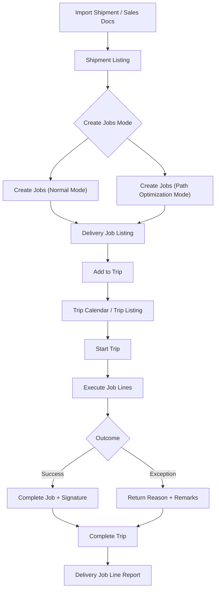


**In review**: This user guide is in review.


## Purpose and Overview

The **Delivery & Installation Applet** is an end-to-end logistics and field execution solution that connects warehouse planning with on-road delivery and installation outcomes. It helps teams move from fragmented manual coordination to a structured, trackable flow across **Shipments**, **Jobs**, and **Trips**.


**Core Concept**: The applet links **what must be delivered** (Job from `SO` = Sales Order, `SI` = Sales Invoice, `DO` = Delivery Order), **how it is grouped** (Shipment), and **how it is executed** (Trip with driver, vehicle, and real-time status updates).


## Key Features Overview

### Who Benefits from This Applet?

**Dispatch & Logistics Coordinators:**
- Plan trips visually with Trip Calendar
- Consolidate and assign jobs at scale
- Apply batch actions (status, dates, remarks, trip assignment)
- Track progress without switching systems

**Drivers & Installation Teams:**
- View assigned trips and jobs clearly
- Update trip/job statuses in the field
- Capture return reasons consistently
- Record delivery signatures and completion evidence

**Warehouse & Operations Managers:**
- Convert shipments into jobs quickly
- Use normal or path-optimized job creation modes
- Monitor allocation, quantity balance, and delivery workload
- Standardize execution across branches and regions

**Customer Service & Back Office Teams:**
- Use Delivery Job Line Report for item-level visibility
- Access clean return/failure reasons for follow-up
- Print operational documents with controlled templates
- Respond faster to customer delivery inquiries

### What Problems Does This Solve?

**The Fragmented Delivery Operations Problem:**

Traditional delivery operations often run across disconnected spreadsheets, chat updates, and paper manifests. Common issues include:
- Difficulty grouping shipments and assigning them to trips efficiently
- No unified visibility across SO/SI/DO-based delivery jobs
- Inconsistent field updates and poor return reason quality
- Delayed handover between dispatch, drivers, and customer service
- Hard-to-audit proof of execution at job-line level

**The Delivery & Installation Applet V2 Solution:**

- **Unified workflow** - Manage Trip Calendar, Shipment, Delivery Job, and Trip execution in one applet
- **Actionable bulk operations** - Perform bulk status updates, bulk date edits, and bulk remarks on jobs
- **Operational traceability** - Track each job line with timestamps, driver, vehicle, and customer references
- **Proof-ready execution** - Support signature capture and structured return reason logging
- **Flexible controls** - Configure visibility, statuses, defaults, menu access, and printable formats
- **Import and recoverability** - Import shipment files and diagnose failures via process status and user error messages

## Key Features Overview


  

  

  

  

  

  

  

  




---

## Key Concepts

### Understanding the Delivery Framework

| Aspect | Component | Practical Example |
|--------|-----------|------------------|
| **What** needs action? | Delivery Job (SO/SI/DO) | Install 2 units for Customer A |
| **How** is it grouped? | Shipment | Group multiple lines into a shipment plan |
| **Who/When** executes? | Trip | Assign driver + vehicle + trip date/time |


**Real-World Example**: A shipment is imported, converted into jobs, grouped by region, attached to a trip, then completed on-site with return reason/signature capture where needed.


### Delivery Hierarchy

```text
Import Shipment / Sales Docs
│
├── Delivery Jobs (SO, SI, DO)
│   │
│   ├── Job Actions (Ready To Ship, Start, Complete, Cancel)
│   └── Job Line Details (serials, signature, return reason)
│
├── Shipments
│   └── Create Jobs (Normal / Path Optimization)
│
└── Trips
    ├── Trip Calendar (planning)
    └── Trip Listing (execution and reporting)
```

### Route Map (Source-Verified)

The applet route tree (`app.routing.ts`) maps the core modules below:

| Route | Module | Main Purpose |
|-------|--------|--------------|
| `trip-calendar` | Trip Calendar | Plan trips by date/driver/vehicle/region |
| `trip-listing` | Trips | Execute trip status and print trip reports |
| `shipment-listing` | Shipment | Convert shipment lines into delivery jobs |
| `file-import` | Import Shipment | Upload shipment import files and monitor processing |
| `job-shipment-listing` | Delivery Job | Run bulk actions for shipment-based jobs |
| `sales-order-jobs` | Job Sales Order | Execute SO-based delivery jobs |
| `sales-invoice-jobs` | Job Sales Invoice | Execute SI-based delivery jobs |
| `job-delivery-order` | Job Delivery Order | Execute DO-based delivery jobs |
| `delivery-job-line-report` | Delivery Job Line Report | Generate line-level delivery report output |
| `delivery-region-listing` | Delivery Region Listing | Maintain delivery region master |
| `vehicle-listing` | Vehicle Listing | Maintain vehicle master |
| `driver-listing` | Driver Listing | Maintain driver master |
| `logistic-hub` | Logistic Hub | Maintain logistic hub master |
| `logistic-hub-network` | Logistic Hub Network | Maintain hub-network setup for optimization |
| `settings/*` | Settings Center | Configure behavior, field visibility, defaults, and controls |
| `personalization` | Personalization | Set user-level defaults for branch/location context |

### Delivery Execution Flow



---

## Quick Start Guide

Get started quickly with these role-specific workflows.


**Before you start**
1. Confirm your default branch/location in `Settings > Default Selection` or `Personalization > Default Selection`
2. Ensure master data is ready (Driver, Vehicle, Delivery Region, Logistic Hub, Logistic Hub Network)
3. Verify user permissions for Delivery Job, Trip Listing, and Shipment Listing


### For Dispatchers: Plan and Assign Daily Work

**Goal:** Move pending jobs into planned trips with clear accountability.

1. Open **Shipment Listing** and create jobs for pending shipment lines (`Normal Mode` or `Path Optimization Mode`).
2. Open **Trip Calendar** and create a trip for the target date, driver, and vehicle.
3. Open **Delivery Job** (`Job Shipment Listing`) and filter by location/region.
4. Use **Add to Trip** to assign selected jobs to a chosen trip.
5. Use **Job Status** to move jobs into `Ready To Ship` before dispatch.
6. Use **Bulk Date Edit** and **Bulk Remarks** when you need coordinated updates.
7. Use **Printing** to prepare trip/job documents before handover.
8. Use **Custom Status** for business-specific milestones where needed.

**What happens next?** Drivers can execute assigned trips with cleaner job context and fewer manual clarifications.

**Pro Tip:** Reserve `Cancel Job` for true cancellations and use `Custom Status` for intermediate checkpoints to keep KPI reporting clean.

---

<a id="for-drivers--installers-execute-and-close-jobs"></a>
### For Drivers & Installers: Execute and Close Jobs

**Goal:** Complete field jobs with accurate timestamps and evidence.

1. Open **Trip Listing** and confirm the assigned driver, vehicle, and route details.
2. Set **Trip Status** to `Start Trip` when physically departing.
3. If network is delayed, use **Trip Status Date** to record the actual event time.
4. Open assigned job lines and update execution outcomes in sequence.
5. When a delivery fails, select the correct standardized **Return Reason** and add remarks.
6. Capture proof using **Open Signature** in job item line edit where required.
7. Set job status updates accurately (`Start Job` / `Complete Job`) to avoid end-of-day mismatch.
8. Mark trip as `Complete Trip` only after all assigned jobs are finalized.

**What happens next?** Dispatch and customer service can immediately see accurate completion and exception details for follow-up.

**Pro Tip:** Complete status updates at each stop, not only at end of day, so escalation teams can react in near real time.

---

### For Admins: Configure the Applet for Operations

**Goal:** Set up master controls so users can execute consistently.

1. Maintain operational masters: **Delivery Region Listing**, **Vehicle Listing**, **Driver Listing**, **Logistic Hub**, and **Logistic Hub Network**.
2. Configure defaults at `Settings > Default Selection` (default branch/location).
3. Configure operational behavior at `Settings > Application Settings` (visibility toggles and process controls).
4. Standardize outcomes at `Settings > Return Reasons Settings`.
5. Create business milestones at `Settings > Custom Status Settings`.
6. Configure output templates at `Settings > Printable Format Settings`.
7. Restrict menu and feature access by role using **Menu Containers**, permission pages, and **Feature Visibility**.
8. Run a pilot day with one dispatcher and one driver team, then tune field visibility and printable output.

**What happens next?** The applet behaves consistently across teams, with fewer manual workarounds and cleaner reporting data.


**New rollout recommendation:** Start with one pilot route and one dispatcher team, finalize Return Reasons and Printable Formats, then expand to all branches.


---

<a id="delivery-job-workbench"></a>
## Delivery Job Workbench

The **Delivery Job** screen (`Job Shipment Listing`) is the operational control center for high-volume assignment and updates.



### Built-in action tabs

- **Add to Trip**: Attach selected jobs to a selected trip
- **Printing**: Batch print or custom batch print with optional custom delivery date
- **Job Status**: Apply `Ready To Ship`, `Start Job`, `Complete Job`, `Cancel Job`
- **Bulk Remarks**: Update remarks across selected jobs
- **Add Logistic Hub**: Attach a logistics hub to selected jobs
- **Custom Status**: Apply user-defined custom status with optional datetime
- **Bulk Date Edit**: Update arrival/departure datetime in batch



### Why this matters

This workbench reduces dispatcher effort from job-by-job updates to controlled batch execution, while keeping the process auditable.



---

<a id="shipment-listing"></a>
## Shipment Listing

**Shipment Listing** is where available shipment quantities are turned into executable jobs.






### Modes supported

- **Normal Mode**: Create jobs directly from selected shipments
- **Path Optimization Mode**: Create jobs with optimization method (`DISTANCE`, `COST`, or `TIME`) and a selected logistic hub network

### Practical flow

1. Select shipment rows.
2. Review/adjust **Allocate Job Qty**.
3. Choose mode and (if needed) optimization method/network.
4. Click **Create Jobs**.

You can also use **Import** to load shipment files and track processing through **Import Shipment** screens.

---

<a id="trip-listing"></a>
## Trip Listing

**Trip Listing** is the execution hub for route-level operations.



### Available functions

- **Printing**: `Batch Print` (if enabled) and `Trip Report`
- **Trip Status**: `Start Trip`, `Complete Trip`, `Cancel Trip`
- **Trip Status Date**: Record the real status event timestamp

This keeps dispatch and field timelines aligned, even when updates arrive late.

---

<a id="trip-calendar"></a>
## Trip Calendar

The **Trip Calendar** provides visual planning with monthly/weekly/daily/agenda views.



### Planner capabilities

- Filter events by **Driver**, **Vehicle**, or **Region**
- Use basic and advanced search (driver/date range/vehicle/region)
- Click dates to create new trips quickly
- Click existing events to jump into trip details

This helps teams detect load imbalance, vehicle conflicts, and capacity gaps early.

---

<a id="job-sources-so-si-do"></a>
## Job Sources (SO, SI, DO)

V2 supports parallel delivery job streams for:
- **Job Sales Order**
- **Job Sales Invoice**
- **Job Delivery Order**

Across these sources, teams can run consistent job statuses (`Ready To Ship`, `Start Job`, `Complete Job`, `Cancel Job`) and handle serialized item workflows through scan/import interfaces.







---

<a id="delivery-job-line-report"></a>
## Delivery Job Line Report

The **Delivery Job Line Report** gives line-level traceability and reporting.



### Core output fields

- Item code/name, quantity, UOM
- Trip no., vehicle no., driver name
- Job ID, start/end delivery datetime
- Sales order no., customer name

### Reporting workflow

1. Set **Start Date** and **End Date** (optional).
2. Select a printable format.
3. Click **Generate Delivery Job Line Report** to export PDF.

---

<a id="configuration--settings"></a>
## Configuration & Settings

Use the Settings area to enforce business rules and keep operations clean.



### `Settings > Application Settings`

Controls visibility and behavior for Trips, Shipment, and Job screens. Commonly used controls include:
- Batch print visibility
- Shipment field visibility (sender, recipient, tracking, quantity, CBM, process status)
- Job field visibility (trip/vehicle/driver, statuses, process resolution)
- Optional custom delivery date behavior for job printing

### `Settings > Field Settings`

Provides additional field-level toggles and UI preferences to align data entry screens with your operation model.

### `Settings > Default Selection`

Set applet-wide defaults:
- Default Branch
- Default Location

### `Personalization > Default Selection`

Set user-level defaults that override applet defaults for individual users.

### `Settings > Custom Status Settings`

Create custom milestones with:
- Code
- Name
- Description
- Optional image/attachment

These statuses can then be applied from Delivery Job bulk actions.

### `Settings > Return Reasons Settings`

Define standardized return reason codes and names (used for failed/returned outcomes). This improves reporting quality and prevents free-text inconsistency.

### `Settings > Printable Format Settings`

Manage printable templates (code, name, file) and assign defaults for major transaction contexts such as Trips, Job Shipment, Sales Order, and Sales Invoice.

### `Settings > Menu Containers`

Control menu visibility for different user groups so field users only see what they need.

### Additional system controls in Settings

- Feature Visibility
- Webhook
- Permission Wizard and permission management pages

---

## Personalization

### Default Selection (`Personalization > Default Selection`)

Set user-level defaults so each user opens the applet with the right context:

| Setting | Purpose |
|---------|---------|
| **Default Branch** | Your personal default branch context |
| **Default Location** | Your personal default location context |

These user defaults can override applet-level defaults for day-to-day execution convenience.

---

## FAQ

### Why can I not add selected jobs into a trip?

Common causes:
- No trip is created yet for the selected date or route
- Jobs are not in a selectable state (for example not moved to `Ready To Ship`)
- Branch/location context does not match the trip context

Check trip setup first, then re-run selection from **Delivery Job > Add to Trip**.

### Why is the Create Jobs action in Shipment Listing not behaving as expected?

Usually this happens when:
- `Allocate Job Qty` is missing or exceeds available quantity
- Required optimization inputs are missing in `Path Optimization Mode` (method or network)
- Shipment rows are in a state that does not allow conversion

Validate quantities and mode-specific inputs, then retry job creation.

### Why do trip status and job status look inconsistent?

Trip and job statuses are related but updated separately. A trip can be started while some jobs are still pending update. Use:
1. `Trip Listing > Trip Status Date` for accurate trip event timestamps
2. `Delivery Job > Job Status` bulk action to align job-level progress

This keeps both route-level and job-level timelines audit-ready.

### How should we handle failed deliveries in a consistent way?

Use a standard flow:
1. Update the job to the correct outcome state
2. Select a reason from `Settings > Return Reasons Settings`
3. Add remarks with actionable detail
4. Capture signature or other proof when available

This produces cleaner exception data for customer service and operations review.

### When should we use Custom Status instead of default job statuses?

Use default statuses (`Ready To Ship`, `Start Job`, `Complete Job`, `Cancel Job`) for core operational lifecycle. Use **Custom Status** for internal milestones such as `Arrived Site`, `Awaiting Customer`, or `Installer En Route` that should not replace the core lifecycle.

### How do we produce an audit-ready item-level delivery report quickly?

Go to **Delivery Job Line Report**, set date range, choose the correct printable format, and generate PDF. For best audit quality, ensure trip and job statuses were updated on time and return reasons were captured for exceptions.
