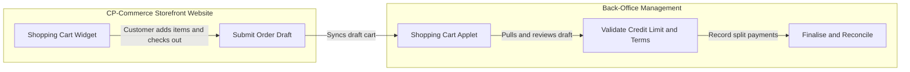
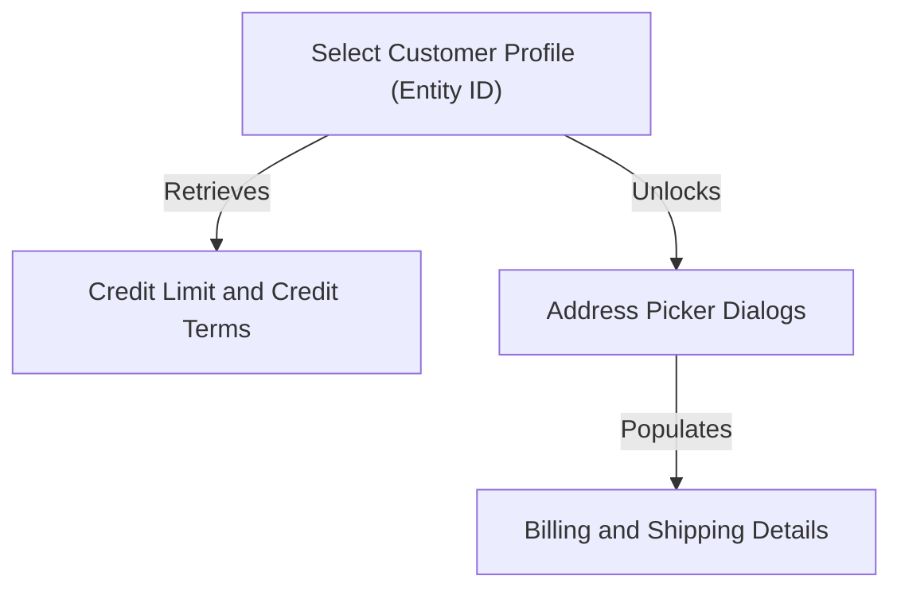

## Purpose and Overview

The **Shopping Cart Applet** serves as the central back-office administration and settlement hub for transaction carts in the BigLedger ecosystem. It manages shopping carts initiated by internal agents as well as online checkouts submitted by customers using the **CP-Commerce Shopping Cart Widget** on your e-commerce storefront website. 

Rather than acting as a standalone checkout terminal, the applet bridges customer-facing online retail activity with back-office operations, allowing sales agents and administrators to review customer cart drafts, validate credit terms, apply customer-specific contract pricing, and process multi-method split settlements.


**Core Integration**: The applet links **storefront customer activity** (items added via the CP-Commerce website widget) with **back-office verification** (real-time credit checks, address picker resolution, and payment ledger entries) to successfully process and finalize sales.


### Who Benefits from This Applet?

**Sales Agents and Cashiers:**
- Instantly pull up draft carts submitted by customers online to finalize the transaction.
- Perform real-time customer credit limit and terms checks before releasing orders.
- Split payment settlements across multiple methods (Cash, Card, Voucher, Points) based on customer preferences.

**E-Commerce and Operations Managers:**
- Reconcile pending storefront cart checkouts and track draft orders at the branch level.
- Re-assign sales agents or modify quantities and pricing inline before final processing.
- Perform bulk finalisation of storefront draft carts to close sales periods efficiently.

**Administrators and Setup Teams:**
- Define default branches, store locations, and webhook routing rules for website checkouts.
- Manage strict field-level visibility constraints and role-based editing permissions.
- Map settlement accounts for online payment methods.

---

### What Problems Does This Solve?

**The Disconnected Storefront and Back-Office Problem:**

When customers add items to shopping carts on an e-commerce website, operations teams have no way to verify custom credit limits or record complex split settlements (for example, paying via points plus cash) without manually re-entering the data. Common issues include:
- Manual transcription of online orders into the back-office system
- No real-time validation of customer credit before order release
- Delayed order processing due to disconnected systems

**The Shopping Cart Applet Solution:**

- **Direct synchronization** - Customer website activity from the CP-Commerce Shopping Cart Widget flows directly into the applet as draft documents for instant validation and settlement
- **Embedded CRM editor** - Search, register, or edit customer parameters (including credit limits, custom pricing schemes, and contacts) inline during checkout without switching to an external system
- **Split payment ledger** - An outstanding balance calculation ledger tracks total line-item debt against a collection of separate settlement lines, supporting multi-method payments (Cash, Card, Voucher, Points, Cheque)

---

## Key Features Overview


  

  

  

  

  

  

  

  


---

## Key Concepts

### CP-Commerce Storefront Integration

The Shopping Cart Applet acts as the administrative back-office companion to the customer-facing e-commerce storefront website. The relationship between the customer storefront activity and back-office settlement flows is visualized below:

- **Draft Synchronization**: When a storefront user interacts with the **CP-Commerce Shopping Cart Widget** (e.g. adding products, editing quantities, or selecting shipping options), the website synchronizes this data in real time, creating or updating a corresponding cart record with a `DRAFT` posting status in the Shopping Cart Applet database.
- **Review and Settlement**: The cashier or sales lead opens the pending storefront cart, verifies customer-specific parameters (such as outstanding balance, credit terms, and addresses), modifies line items if necessary, and records the settlement transactions (split payment ledger) to post the cart as `FINAL`.

---

### Purchasing Framework

Every transaction processed by the Shopping Cart Applet must address three fundamental aspects. The system provides structured handling for each:

| Aspect | Component | Practical Example |
|--------|-----------|------------------|
| **Who** is purchasing? | Customer / Member | Walk-in Customer, Corporate Account, Loyalty Member |
| **What** is being bought? | Item and Pricing Scheme | Standard Item Code, Retail Price, Wholesaler Discount |
| **How** is it settled? | Payment Method and Credit | Cash, Credit Card, Voucher, Credit Terms (30 Days) |

### The Customer-Address Relation Chain

To prevent data entry errors and ensure accurate shipping/billing calculations, fields are linked in a strict dependency sequence:

**Flow Details:**
1. **Customer Selection**: The agent clicks the **Entity ID** picker to select a customer.
2. **Credit Activation**: The system fetches the customer's credit parameters, enabling and auto-populating the **Credit Limit** and **Credit Terms** dropdowns in the Main Details header.
3. **Address Pickers**: The billing and shipping address selector buttons are unlocked, ensuring only addresses associated with the selected customer can be chosen.

---

## Quick Start Guide

Get up and running quickly with these essential workflows.

### For Sales Agents: Settle an Order

**Goal:** Create a cart or open a storefront draft, verify credit, record payment, and finalise the order.

1. **Locate or Start Cart**: 
   - **Manual**: Click the **"+"** button on the listing.
   - **Storefront**: Find the draft cart synced from the **CP-Commerce storefront** in the list and click it.
2. **Assign Customer**: Go to **Account > Entity Details**, select the customer's **Entity ID** (if not already synced from the storefront).
3. **Set Branch**: In **Main Details**, select the **Branch** and **Location** (Credit Terms and Limits will auto-populate).
4. **Configure Items**: Go to **Line Items**, adjust quantities/UOM, select the tax code, or click **"+"** to add new items.
5. **Record Payment and Finalise**: Go to **Payment**, click **"+"**, select your payment method, enter the amount, and click **FINALISE** to post the order.

---

### For Supervisors: Process Pending Storefront Carts

**Goal:** Review, bulk-finalise, or delete draft sales carts synced from the e-commerce website.

1. **Open Queue**: Open the **Shopping Cart** listing.
2. **Identify Storefront Drafts**: Filter the listing grid to display draft carts.
3. **Bulk Finalise**: Select multiple check-boxes on the draft carts in the grid, then click **FINALISE** at the top.
4. **Delete Draft**: Open an individual draft, click **DELETE** at the bottom, and click **CLICK AGAIN TO CONFIRM**.

---

### For Admins: Initial System Setup

**Goal:** Configure operating defaults and visibility rules for the team.

1. **Configure Defaults**: Navigate to `Settings > Default Selection` and set the default **Branch** and **Location**.
2. **Set Visibility Rules**: Go to `Settings > Feature Visibility` to hide unnecessary fields or enable delete buttons.
3. **Add Webhooks**: Go to `Settings > Webhook` to configure server payloads for automatic system integrations.
4. **Establish Permissions**: Go to `Settings > Permission Set Listing` to define security clearance levels.

---

## For Sales Agents and Cashiers

This section is your guide to day-to-day transactions and point-of-sale checkout workflows.

### My Carts - The Sales Listing

This is your main dashboard showing all pending and completed transactions. It displays both manual cashier carts and draft orders synced from the **CP-Commerce Storefront**.



**What You Can Do:**
- **Create a New Cart**: Click the **"+"** button to start a manual transaction.
- **Search and Filter Carts**: Use the Advanced Search bar to filter by document number, branch, or customer name to locate storefront draft sessions.
- **View or Edit**: Click on any row to open the details of that shopping cart.
- **Toggle Column Layout**: Click the Column Toggle button to switch between single-column and double-column grid layouts.
- **Bulk Finalise**: Select multiple draft carts and click **FINALISE** to lock them in bulk.

---

### Creating and Editing Shopping Carts

Opening a cart loads the main transaction workspace. The sections are organized as tabs (horizontal) or expansion panels (vertical).



#### Main Details Tab/Panel

Defines basic document metadata, responsible agents, and terms.

| Field | Purpose | Required | Example |
|-------|---------|----------|---------|
| **Branch** | Select the operating branch. Auto-fills company code and currency. | Yes | `KL HQ Branch` |
| **Location** | Select store or warehouse location. Auto-fills branch default location if configured. | Yes | `Retail Store A` |
| **Sales Agent** | Salesperson responsible for the sale. | Yes | `Agent Sarah` |
| **Currency** | Transaction currency. Auto-populated from the selected Branch settings. | Yes | `MYR`, `USD` |
| **Credit Terms** | Payment term code. *Conditional* - Enabled and populated after selecting a Customer. | Yes | `30 Days` |
| **Credit Limit** | Maximum credit allowance. *Conditional* - Enabled and populated after selecting a Customer. | Yes | `Limit USD 10,000` |
| **Transaction Date** | Date of the transaction. Defaults to current date. | No | `2026-06-15` |
| **Sales Lead** | Categorizes lead source. Selection: Corporate or Non-Corporate. | No | `Corporate` |
| **Permit No** | Business permit reference number. | No | `PMT-9099-AA` |
| **Tracking ID** | Courier or shipment tracking identifier. | No | `TRK-882910` |
| **CRM Contact** | Secondary contact key for customer correspondence. | No | `Sarah Connor (Manager)` |
| **Member Card** | Linked customer membership card. Clickable to open selection. | No | `MEM-55102` |
| **Remarks** | Free-text comments. Includes character counter. | No | `Delivery requested by Friday afternoon.` |

*Edit-Mode Read-Only Fields:*
When viewing an existing cart, the header exposes read-only audit fields at the top:
- **Doc Short Code**: The short identifier (e.g. `SC` for Shopping Cart).
- **Tenant Doc No** (`tenantDocNo`): Primary server document identifier.
- **Company Doc No** (`companyDocNo`): Company-specific reference.
- **Branch Doc No** (`branchDocNo`): Branch-specific tracking number.

---

#### Account Details Tab/Panel

Holds customer profile selections and associated address details. It is divided into three nested sub-tabs:

##### 1. Entity Details Sub-tab
- **Entity ID** (Required): Click this field to open the Customer Selector Dialog.
- **Customer Metadata** (Read-only): Displays the customer's name, type (Individual/Corporate), ID Number, GL Code, Email, Phone, and status once selected.

##### 2. Bill To Sub-tab
- **Billing Contact Info** (Editable): Enter the Billing Name, Email, and Phone Number.
- **Billing Address Picker**: Click the address input to open the billing address selection dialog. Disabled until an Entity ID is selected.
- **Address Details** (Read-only): Displays Address Line 1-5, City, State, Postcode, and Country once selected.

##### 3. Ship To Sub-tab
- **Recipient Contact Info** (Editable): Enter the Recipient Name, Email, and Phone Number.
- **Shipping Address Picker**: Click the address input to open the shipping address selection dialog. Disabled until an Entity ID is selected.
- **Address Details** (Read-only): Displays Address Line 1-5, City, State, Postcode, and Country once selected.

---

#### Line Items Tab/Panel

Handles itemized stock listings, quantities, tax computations, and pricing.



- **Totals Section**: Displays the **Total Txn Amount** and **Tax Amount** in the top right.
- **Add Item Action**: Clicking the **"+"** button opens the Add Line Item Dialog (disabled if document status is `FINAL`).
- **Grid Columns**:
  - **Item Code / Item Name**: Stock identifier.
  - **UOM**: Selected unit of measure.
  - **Delivery**: Uses a slider component allowing agents to adjust the quantity base visually.
  - **Qty**: Base numeric quantity.
  - **Unit Price**: Standard item price (automatically calculated).
  - **SST/VAT/GST**: Line item tax amount.
  - **Txn Amount**: Total line item amount including taxes.

---

#### Payment Tab/Panel

Tracks payment settlements recorded against the cart.



- **Summary section**:
  - **Total**: Displays total cash/payments logged.
  - **Outstanding**: Calculated as `Total Line Item Debt - Total Payments`. Displays in red if there is a remaining balance.
- **Grid Columns**:
  - **Date**: Payment date (YYYY-MM-DD).
  - **Amount**: Net payment amount.
  - **Details**: Payment details (e.g. Credit Card brand, Cash account).
  - **Remarks**: Payment remarks.
- **Add Payment Action**: Clicking the **"+"** button opens the Add Payment Dialog (disabled once the Outstanding balance is `0.00`).

---

## Customer Selection and CRM Management

When selecting a customer, the Customer Selection screen slides into view:

- **Mode Slider Toggle**:
  - **Select Mode**: Click any row in the customer list grid to choose that customer for the cart.
  - **Create/Edit Mode**: Shows the **"+"** add button. Clicking a customer row in this mode opens the Customer Edit View.

---

### Editing Customer Profiles

When editing a customer record, a comprehensive multi-tab layout is displayed to configure profiles, categories, logins, payment configs, tax, addresses, contacts, branches, custom pricing, and credit limits.

#### Main Tab

Contains basic identity information.

| Field | Purpose | Required | Example |
|-------|---------|----------|---------|
| **Customer Name** | Full name of the customer. | Yes | `Alice Johnson Ltd` |
| **Customer Code** | Unique identifier for accounting. | Yes | `CUST-99081` |
| **Status** | Account status. Selection: ACTIVE or INACTIVE. | Yes | `ACTIVE` |
| **Type** | Account type. Selection: CORPORATE or INDIVIDUAL. | Yes | `CORPORATE` |
| **Identity Type** | *Conditional* - Type of ID. Shows only if Type is INDIVIDUAL. | No | `IDENTITY CARD (IC)` |
| **ID Number** | ID Card or Passport number. | No | `920112-14-5567` |
| **Gender** | *Conditional* - Gender. Shows only if Type is INDIVIDUAL. | No | `FEMALE` |
| **Tax ID** | Tax registration number. | No | `TX-9901-AA` |
| **Currency** | Default currency for transactions. | Yes | `MYR` |
| **Description** | Internal notes. | No | `VIP Wholesaler customer.` |
| **AR / AP Type** | Accounts Receivable / Payable category. | No | `DEBTOR` |
| **GL Code** | General Ledger account mapping. | Yes | `3000-Trade Debtors` |
| **Phone** | Primary contact phone number. | No | `+6012-3456789` |
| **Email** | Primary email address for notifications and statements. | Yes | `alice@johnsonltd.com` |

*Read-Only Audit Fields:*
- **Created By** / **Created Date**
- **Modified By** / **Modified Date**

---

#### Customer Category Tab

Assigns custom categories to segment customers for reporting and discount rules.

- **How to Add Category**: Click **"+ Add"**, select the category from the dropdown, and save.
- **Fields**: Category Code, Category Name, Level Value.

---

#### Login Tab

Configures credentials for customer self-service portals.

- **How to Create Login**: Click **"+ Add"**, enter the user's email, check **Verify Email** if required, select the role (OWNER, ADMIN, MANAGER, MEMBER, GUEST), and click **CREATE**.

---

#### Payment Config Tab

Maps preferred settlement accounts and payment terms.

- **Fields**: Payment Type, Bank, Bank Identifier Code, Bank Acc. No., Bank Acc. Holder Name.

---

#### Tax Tab

Defines customer-specific tax configurations and tax registration numbers.

- **Fields**: Tax Code, Tax Type, Tax Rate, Tax Option (Include Tax, Exclude Tax).

---

#### Address Tab

Maintains billing and shipping address databases.

- **How to Create Address**: Click **"+ Add"**, select the country first, fill in Address Line 1-5, City, State, Postcode, and check **Set as default** or **Main Address** if applicable.

---

#### Contact Tab

Tracks client-side contact individuals, designations, and telephone extensions.

- **Fields**: Contact Name, Designation/Position, Office No, Extension No, Mobile No, Fax No, User Email.

---

#### Branch Tab

Maps customer branch sub-entities to corporate parent accounts.

- **Fields**: Branch Code, Branch Name, Location Name, default currency.

---

#### Item Pricing Tab

Overrides standard retail prices with custom contract pricing schemes for specific items.

- **Fields**: Customer Item Code, Customer Item Name, Purchase Price, Sales Price.

---

#### Credit Term and Limit Tab

Contains nested sub-tabs to enforce transaction limits:

##### A. Credit Term Sub-tab
- Configure terms like Cash, 15 Days, 30 Days, 60 Days.
- **Fields**: Credit Term Code, Credit Term Name, Day count (e.g. 30).

##### B. Credit Limit Sub-tab
- Set the maximum outstanding balance allowed.
- **Fields**: Credit Limit Code, Credit Limit Name, Credit Limit Amount.

---

## Line Item Selection and Configuration

Clicking the **"+"** button on the Line Items tab opens the item search window.

- **Search Item Tab**: Enter keywords to search the catalog, showing Item Code, Name, Stock Balance, and details. Selecting an item opens the Configuration screen.

---

### Item Configuration Form

Allows adjusting quantities, UOMs, and pricing schemes.

> [!WARNING]
> Many fields in this dialog are conditional and can be toggled on/off under Admin settings.

| Field | Purpose | Required | Example |
|-------|---------|----------|---------|
| **Item Code** | Unique item code (Read-only). | Yes | `ITM-0012` |
| **Item Name** | Display name of the item. | Yes | `Premium Engine Oil` |
| **UOM** | Unit of measure selection. *Conditional* - Hidden if `HIDE_UNIT_PRICE_STD_PRICING_SCHEME` is enabled. | Yes | `Carton` |
| **Pricing Scheme** | Custom pricing scheme. *Conditional* - Hidden if `HIDE_UNIT_PRICE_STD_PRICING_SCHEME` is enabled. | Yes | `Standard Wholesaler` |
| **Quantity Base** | Quantity in base units. *Conditional* - Hidden if `HIDE_QTY_BASE` is enabled. | Yes | `10` |
| **Quantity by UOM** | Quantity in selected UOM. *Conditional* - Hidden if `HIDE_QTY_UOM` is enabled. | Yes | `1` (1 Carton = 10 Bottles) |
| **UOM to Base Ratio** | Conversion ratio (Read-only). *Conditional* - Hidden if `HIDE_UOM_TO_BASE_RATIO` is enabled. | Yes | `10.0` |
| **Unit Price STD (Excl)** | Standard unit price excluding tax (Read-only). *Conditional* - Hidden if `HIDE_UNIT_PRICE_STD_EXCL_TAX` is enabled. | Yes | `120.00` |
| **Unit Price STD (Incl)** | Standard unit price including tax (Read-only). *Conditional* - Hidden if `HIDE_UNIT_PRICE_STD_INCL_TAX` is enabled. | Yes | `127.20` |
| **Unit Discount** | Discount per unit. *Conditional* - Hidden if `HIDE_UNIT_DISCOUNT` is enabled. | No | `5.00` |
| **Tax Code** | Tax selector dropdown (SST/GST/VAT). *Conditional* - Hidden if `HIDE_TAX_CONFIG_SELECTION` is enabled. | Yes | `SST-6%` |
| **Tax Rate** | Tax percentage (Read-only). | Yes | `6.0` |
| **Tax Amount** | Calculated tax value (Read-only). | Yes | `6.90` |
| **WHT Code** | Withholding tax selector dropdown. *Conditional* - Hidden if `HIDE_WHT_CONFIG_SELECTION` is enabled. | No | `WHT-3%` |
| **WHT Rate** | Withholding tax percentage (Read-only). | Yes | `3.0` |
| **WHT Amount** | Calculated Withholding tax value (Read-only). | Yes | `3.45` |
| **Txn Amount** | Final line item transaction amount including taxes. *Conditional* - Hidden if `HIDE_AMOUNT_TXN` is enabled. | Yes | `123.75` |
| **Remarks** | Remarks specific to this line item. | No | `Fragile packing required.` |

---

## Add Payment / Settlement Methods

Clicking the **"+"** button on the Payment tab opens the settlement dialog. You can select a payment method and fill in the corresponding fields:

| Settlement Method | Required Fields | Method-Specific Inputs | Purpose / Notes |
|-------------------|-----------------|------------------------|-----------------|
| **CASH** | Date, Amount | None | Standard physical cash collection. |
| **CASH_BACK** | Date, Amount | Cash Back | Records cash returned to customer; computes Net Paid. |
| **CREDIT_CARD** | Date, Amount | Card Number, Name, Issuer, Card Type, Expiry, CVV | Standard merchant card processing info. |
| **VOUCHER** | Amount | Voucher Number | Redeems pre-issued credit or gift vouchers. |
| **BANK_TRANSFER** | Date, Amount | Transaction Number | Records direct online bank wire references. |
| **MEMBERSHIP_POINT_CURRENCY** | Date, Amount | Points Select, Point Currency Value | Deducts membership loyalty points to settle balances. |
| **CHEQUE** | Date, Amount | Cheque Number | Records bank cheque routing numbers. |

---

## Configuration and Settings

Admin configurations are accessible under settings paths:

#### Default Selection (`Settings > Default Selection`)
- **Default Branch**: Fallback branch for new transactions.
- **Default Location**: Fallback store or warehouse location.

#### Field Settings (`Settings > Field Settings`)
Allows overriding field validation rules, default formatting, or making fields mandatory (e.g. `MANDATORY_REASON_FIELD`).

#### Printables (`Settings > Printables`)
Configure PDF formats, layout codes, and printable templates for receipts and invoices.

#### Webhook (`Settings > Webhook`)
Define HTTP post target URLs to trigger integrations when shopping carts are created, saved, or finalized.

#### Feature Visibility (`Settings > Feature Visibility`)
A collection of toggles to control UI features:
- `SHOW_DOCUMENT_DELETE_BUTTON`: Displays the Delete button.
- `HIDE_DOC_NO_TENANT` / `HIDE_DOC_NO_COMPANY` / `HIDE_DOC_NO_BRANCH`: Hides document numbers.
- `HIDE_QTY_BASE` / `HIDE_QTY_UOM`: Hides quantity inputs in line items.
- `HIDE_UNIT_DISCOUNT`: Hides unit discount fields.
- `HIDE_TAX_CONFIG_SELECTION`: Hides tax code selectors.
- `DISALLOW_SELL_BELOW_MIN_PRICE`: Enforces strict pricing floor rules.
- `LOCK_PURCHASER_TO_CURRENT_USER`: Locks the sales agent selector to the logged-in cashier.

#### Permissions Settings
- **Permission Set Listing**: Manage permission matrices.
- **User / Team / Role Permissions**: Maps permission sets to specific users, departments, or roles.

---

## Personalization

Personal configurations reside under personalization paths:

#### Personal Default Selection (`Personalization > Personal Default Selection`)
- **Default Branch / Location**: Overrides Applet default settings.
- **Default Toggle Column**: Toggles between single-column (`SINGLE`) or double-column (`DOUBLE`) grid list layout.
- **Default Tab Orientation**: Configures the default tab orientation (`HORIZONTAL` for tabs, `VERTICAL` for expansion panels).

#### Sidebar Configuration (`Personalization > Sidebar`)
Allows customizing the user's sidebar layout.

---

## Audit

#### Audit Trail (`Settings > Applet Log`)
A comprehensive log of every action taken within the Shopping Cart Applet.

**What You Can See:**
- **Table Name**: Database table affected (e.g., `bl_fi_generic_doc_hdr`).
- **Action**: CREATE, UPDATE, DELETE, FINALISE, VOID.
- **Action Date**: Timestamp of the change.
- **Description**: Detailed before/after values.
- **Status**: Record status.

---

## FAQ

**Q: Can I edit a shopping cart once it is finalized?**  
A: No. Clicking **FINALISE** sets the posting status to `FINAL`, locking the document from further edits, line additions, or deletions to ensure compliance with financial accounting standards.

**Q: Why are the Billing and Shipping address picker buttons disabled?**  
A: Address pickers are disabled until you select an **Entity ID** in the Entity Details sub-tab. Addresses must be linked to a valid customer profile.

**Q: How does the system compute outstanding balances?**  
A: The outstanding balance is computed in real time as the total line items' net transaction amount minus the sum of all recorded payments under the Payment tab.

**Q: Why does my screen show expansion panels instead of horizontal tabs?**  
A: The applet uses a responsive design. If your screen width is 768px or smaller (mobile view), it automatically switches to vertical expansion panels. You can override this preference under `Personalization > Personal Default Selection > Default Tab Orientation`.

---

## Glossary

- **Entity ID**: The unique record locator for a customer or corporate account in the system.
- **Posting Status**: The lifecycle state of a cart (`DRAFT` means editable; `FINAL` means committed/locked; `VOID` means canceled).
- **Split Payment**: Recording multiple separate payments using different settlement methods against a single shopping cart order.
- **Settlement Method**: The payment medium (Cash, Card, Points, Cheque, Bank Transfer, Voucher) used to resolve transaction debt.
- **UOM (Unit of Measure)**: The standard unit packaging (e.g. Piece, Box, Carton) assigned to a line item.
