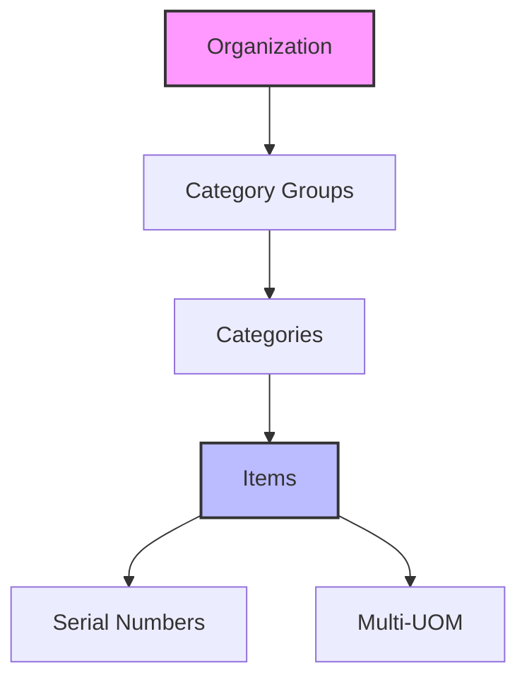

## Purpose and Overview

The **Inv Item Maintenance Applet** serves as the backbone of your inventory ecosystem. It provides a comprehensive suite of tools to manage the entire lifecycle of an inventory item—from initial creation and categorization to advanced serial number tracking and obsolete stock analysis.


**Core Concept**: The system centralizes **what** you sell (Items), **how** they are grouped (Categories), and **where** specific units are (Serial Numbers), while providing deep insights into **how long** they've been in stock (Aging).




### Who Benefits from This Applet?

**Inventory & Warehouse Managers:**

- Maintain accurate item registries
- Track individual units with serial number tracing
- Monitor stock health via aging reports to prevent obsolescence
- Streamline bulk data entry via file imports

**Sales & Customer Service Teams:**

- Quick visibility into item details and specifications
- Respond faster to customer inquiries regarding item history (Serial No Trace)
- Verify item availability across categories

**Procurement & Finance Teams:**

- Ensure correct categorization for financial reporting
- Track Multi-UOM (Unit of Measure) for accurate purchasing and costing
- Analyze capital tied up in aging stock

### What Problems Does This Solve?

**The Inventory Chaos Problem:**
Without a centralized maintenance system, businesses face:

- **Data Inconsistency**: Duplicate items or conflicting specifications
- **Untraceable Units**: Inability to track specific high-value items via serial numbers
- **Dead Stock**: Hidden obsolete inventory that ties up capital and warehouse space
- **Cluttered Structures**: Poor categorization making it difficult to find items or run reports

**The Inv Item Maintenance Solution:**

- **Standardized Registry** - A single source of truth for all inventory items
- **Granular Categorization** - Multi-level grouping (Groups and Categories) for precise organization
- **Serial Number Lifecycle** - Full traceability from entry to exit
- **Automated Aging Analysis** - At-a-glance visibility into stock duration buckets
- **Bulk Operations** - High-speed data management with robust import tools

## Key Features Overview

















---

## Key Concepts

### Understanding the Inventory Framework

Effective inventory management requires a structured approach to data. The Inv Item Maintenance Applet uses a hierarchical framework:

| Aspect             | Component           | Practical Example                        |
| ------------------ | ------------------- | ---------------------------------------- |
| **Classification** | Groups & Categories | Group: Electronics > Category: Laptops   |
| **Identity**       | Basic Item Info     | Item Code: "LAP-X1", Name: "ThinkPad X1" |
| **Traceability**   | Serial Numbers      | SN: "LR012345"                           |
| **Utility**        | Multi-UOM           | Box of 10 vs. Individual Unit            |


**Real-World Example**: You define a **Category Group** "IT Hardware". Under it, you create a **Category** "Laptops". Every time you receive a "ThinkPad X1", you record its unique **Serial Number** for warranty and history tracking.


### The "Golden Triangle" of Inventory

To effectively manage the system, it is crucial to understand how **Item Groups**, **Categories**, and **Items** work together.

| Component          | Analogy          | Definition                                                | Example                            |
| ------------------ | ---------------- | --------------------------------------------------------- | ---------------------------------- |
| **Category Group** | The "Department" | A high-level bucket for broader classification.           | **Electronics**, **Furniture**     |
| **Category**       | The "Aisle"      | A specific segment within a group for finer organization. | **Laptops**, **Office Chairs**     |
| **Item**           | The "Product"    | The actual stock unit being tracked and sold.             | **ThinkPad X1**, **ErgoMaster v2** |

**How they link:**

1. You create a **Category Group** (e.g., Electronics).
2. You create a **Category** linked to that Group (e.g., Laptops).
3. You create **Items** (e.g., ThinkPad X1) and link them to the **Category**.
4. This hierarchy ensures that when you run a report for "Electronics", all "Laptops" and their specific "Items" are included.

---

### Technical Specifications

The applet supports various item and stock handling types to cater to different business models.

#### Item Transaction Types

| Type               | Use Case                                      |
| ------------------ | --------------------------------------------- |
| **Basic Item**     | Standard inventory product.                   |
| **Grouped Item**   | Component-based assembly.                     |
| **Bundle**         | Pre-packaged collection of items.             |
| **Service**        | Non-inventory billable activity.              |
| **Warranty**       | Intangible coverage associated with products. |
| **Batch & Expiry** | Stock requiring date-based tracking.          |
| **Coupon**         | Redeemable value or discount items.           |

#### Stock Handling (Sub-Item Types)

| Type               | Description                                           |
| ------------------ | ----------------------------------------------------- |
| **Basic Quantity** | standard numeric tracking (e.g., 50 units).           |
| **Serial Number**  | Tracking individual unique units (e.g., IMEI).        |
| **Batch Number**   | Group-based tracking for perishables/regulated goods. |
| **Bin Number**     | Location-specific tracking within a warehouse.        |

---

### Hierarchical Organization

**System Workflow:**

1. **Category Groups**: High-level classification (e.g., Raw Materials).
2. **Categories**: Specific classification (e.g., Steel, Plastics).
3. **Items**: The actual product (e.g., Steel Rod 10mm).
4. **Details**: Individual unit tracking (SN) and measurement variations (UOM).

---

## Quick Start Guide

Get up and running quickly with these essential workflows.



### For Data Entry: Create Your First Item

**Goal:** Register a new product in the system in 5 simple steps.

1. **Navigate**: Go to **Items** from the sidebar.
2. **Launch**: Click **"+" (Add New)**. A panel appears on the right.
   
3. **Primary Info**:
   - Enter **Item Code** (Unique identifier).
   - Enter **Item Name** (Public facing name).
   - Select **Type** (e.g., BASIC_ITEM).
4. **Link Hierarchy**:
   - Select the **Category** from the dropdown.
   - The **Group** will automatically link based on category settings.
5. **Save**: Click **Create**. The item is now live and ready for stock transactions.

### For Admins: Initial System Setup

**Goal:** Prepare the categorization hierarchy for your team.
**Step 1: Create Category Groups** (`Category Groups > "+"`)

- Define broad departments (e.g., "Hardware", "Services").
  
  **Step 2: Create Categories** (`Categories > "+"`)
- Link them to the Groups created in Step 1.
  
  **Step 3: Test the Chain**
- Create an item and verify it correctly inherits the Group and Category relationship.

---

## Feature Sections

### Inventory Specialists: Maintenance & Traceability

This section is your guide to detailed item management and unit tracking.

#### Detailed Item Maintenance

The **Item Listing** is your workspace. For any item, click to open the **Edit** view:

- **Tabs**: Navigate between _Main Details_, _Multi UOM_, _Images_, and _Location Balance_.
- **Multi-UOM**: Set up secondary units (e.g., 1 Box = 12 Units).
- **Images**: Upload product photos for visual identification on POS or invoices.
  

#### Serial Number Traceability

For high-value or regulated items, use **Trace Serial No**:

1. Scan or enter a Serial Number.
2. View the **Transaction History**: See exactly when it was received, transferred, or sold.
3. Check **Current Status**: Is it in stock? Sold? Under repair?
   

### Admin & Data Teams: Bulk Operations

Handle high-volume data without manual entry.

#### Bulk Serial Number Import

When receiving large shipments, use the **Import File** feature:

1. **Download Template**: Get the standard CSV/Excel format.
2. **Fill Data**: Map Serial Numbers to their respective Item Codes.
3. **Upload**: Process the file to bulk-register thousands of units in seconds.
   

### Management: Analytics & Controls

Strategic oversight for inventory health.

#### Stock Aging Reports

Monitor how long capital is tied up in stock.

- **Dynamic Filtering**: Filter by Location, Category, or Date Range.
- **Export**: Generate PDF/Excel reports for month-end meetings.
  

## Configuration & Settings

Tailor the applet behavior to your business.


- **Default Selection**: Set "Sticky" defaults for faster data entry.
- **Field Settings**: Hide unused fields to simplify the interface for staff.
- **Permission Wizard**: Role-based access control (e.g., "Warehouse Staff" can view but not delete).

### Technical Constraints & Fields

#### Data Validation

- **Max Length**: All primary text fields (Code, Name, Description) have a **255-character limit**.
- **Case Sensitivity**: **Item Code** and **Item Name** are automatically converted to **UPPERCASE** upon saving to ensure data consistency.
- **Mandatory Fields**: Item Code, Name, Type, and Base UOM are required for all item types.

#### Available Pricing Fields

The system maintains a comprehensive set of pricing dimensions for each item:

- **List Price**: Standard MSRP or retail price.
- **Wholesale Price**: Price for bulk or B2B transactions.
- **Discounted Price**: Promotional or special offer pricing.
- **Price Brackets**: Includes Minimum and Maximum limits for both **Selling** and **Purchase** prices to prevent data entry errors.

---

## FAQ

**Q: Can I change an item's Category after it's been used in transactions?**
A: Yes, but it is recommended to do this carefully as it may affect historical reporting and inventory valuation groupings.

**Q: What is Multi-UOM and why use it?**
A: It allows you to buy in one unit (e.g., Pallet) and sell in another (e.g., Each), while the system handles the conversion automatically. This is essential for accurate stock tracking and pricing.

**Q: Why is my Serial Number not showing up in the Trace Serial No?**
A: Ensure the item is set to "Serialized" type and that the Serial Number has been correctly imported or keyed in during a receiving transaction.

**Q: My Stock Aging Report is empty. Why?**
A: This usually happens if there are no items in the selected location or if your "Aging As Of" date is set before any stock was received.

**Q: How do I bulk delete items?**
A: For security, bulk deletion is restricted. You must deactivate items individually or contact your system administrator for backend cleanup if necessary.
