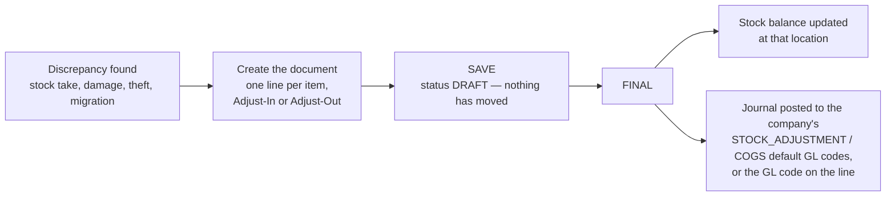

## Overview

The Stock Adjustment (Internal) applet is where you correct what the system thinks you have. When a count, a damaged carton, a theft or a migration leaves the stock ledger out of step with the shelf, you raise an adjustment document — **Adjust-In** to add quantity, **Adjust-Out** to remove it — and finalise it. Finalising updates the stock balance at that location and posts a journal, so the stock value in the ledger moves with the quantity.

It is used by warehouse supervisors and stock controllers for quantity corrections, and by finance for the **Reset Moving Average (MA)** tools that correct an item's unit cost. It comes after a stock take or an investigation in [Stock Availability](/applets/inventory-workflow/stock-availability-applet/), and before the corrected balance shows in [Stock Balance](/applets/inventory-workflow/stock-balance-applet/) and the financial reports.

There is **no approval step**. A line is either Adjust-In or Adjust-Out — there is no third "correction" type — and FINAL posts immediately. The only separation of duties available is the pair of settings `HIDE_GENDOC_SAVE_BUTTON` and `HIDE_GENDOC_FINAL_BUTTON`, which let one group draft and another group post.

## Where it fits

| Direction | Applet / document | Why |
|---|---|---|
| Upstream | [Stock Take](/applets/inventory-workflow/stock-take-applet/), [Stock Availability](/applets/inventory-workflow/stock-availability-applet/) | Where the discrepancy is found |
| Upstream | [Inventory Item Maintenance](/applets/master-data/inv-item-maintenance-applet/) / [Doc Item Maintenance](/applets/master-data/doc-item-maintenance-applet/) | Items and their tracking type (basic, serial, batch, bin) |
| Upstream | [Organisation](/applets/master-data/organisation-applet/) | Company, branch and location on the document |
| Upstream | [Chart of Account](/applets/master-data/chart-of-account-applet/) | The `STOCK_ADJUSTMENT` and `COGS` / stock default GL codes the journal posts to, or a GL code chosen per line |
| Downstream | [Stock Balance](/applets/inventory-workflow/stock-balance-applet/), [Stock Availability](/applets/inventory-workflow/stock-availability-applet/) | Show the corrected quantity and cost |
| Downstream | [General Ledger](/applets/finance/general-ledger-applet/) | The adjustment journal |

Modules: Inventory, Financial Accounting.

## Screens and menus

| Menu | Purpose | When to use |
|---|---|---|
| **Stock Adjustment** | Multi-line adjust-in / adjust-out document | Count corrections, write-offs, write-ons |
| **Stock Adjustment By Batch Item** | Adjustment at batch-number level | Batch / expiry-tracked items |
| **Serial Number Adjustment** | Adjust-in / adjust-out of individual serial numbers (menu state `serial-data-fix`) | Adding or removing specific serials |
| **File Import** | Bulk adjustments from a spreadsheet | Annual stock take, migrations |
| **Reset MA** | Reset an item's moving-average cost company-wide | Cost correction across locations |
| **Reset MA By Location** | Reset the cost at one location | Cost wrong at one warehouse |
| **File Import Reset MA** | Bulk cost resets | Go-live, migration |
| **Stock Adjustment by Reset MA** | Quantity adjustment and cost reset in one document | Both are wrong |
| **Audit Trail** | Change history | — |

Gear (Settings) menu: **Application Settings**, **Default Selection**, **Printable Format Settings**. Personalisation: per-user **Default Selection**.

### Stock Adjustment document



Create with **+**. The **Main Details** tab takes the document type, transaction date, branch / company / tenant document numbers (generated) and remarks; branch and location come from the defaults or are chosen here.



On the **Line Items** tab add one line per item: pick the item, choose **Adjust-In** or **Adjust-Out**, enter the quantity, pick the **Base On** cost basis, confirm or override the unit price, and write the reason in remarks. The line shows the current company and location stock balance and the current moving-average unit cost for reference, and can carry its own GL code.



For tracked items the line opens extra tabs — **Serial Number** (enter or scan; with *Listing*, *Scan* and *Import* sub-tabs), **Batch Number** (batch, quantity, container measure and quantity, issue and expiry date) and **Bin Number** (bin code, quantity).

Other tabs: **Attachment** (count sheets, photos) and **Export**.



Buttons: **SAVE** keeps the document in `DRAFT`; **FINAL** posts it; **CLONE** copies a document into a new draft. Both SAVE and FINAL can be hidden by setting (see Configuration).

### Stock Adjustment By Batch Item



Select the item and batch number, choose Adjust-In / Adjust-Out, enter the quantity and remarks, SAVE then FINAL.

### Serial Number Adjustment



Select the item, enter or scan the serial, choose Adjust-In (add the serial to stock) or Adjust-Out (remove it), remarks, SAVE then FINAL. Because it can create or destroy serial history, tenants usually restrict this menu to administrators (see *Feature visibility / permissions*).

### File Import



Download the template, fill it (branch code, location code, item code, GL code, quantity — positive for adjust-in, negative for adjust-out — serial number, batch number, remarks), upload, review the validation flags, fix and re-upload if needed, then process. `.xlsx` and `.csv` are accepted.

### Reset Moving Average



Select the company and item, enter the date, quantity, old MA cost and new MA cost, SAVE then FINAL. **Reset MA By Location** does the same for one location; **File Import Reset MA** does it in bulk; **Stock Adjustment by Reset MA** combines a quantity adjustment with the cost reset.


Resetting the moving average changes inventory valuation on the balance sheet and cost of goods sold on the income statement. Restrict it to finance. The date on Reset MA forms can be locked to today with `RESET_MA_DATE_NOT_EDITABLE`.


## Configuration

### Before you can use it

| Prerequisite | Where | Why |
|---|---|---|
| Company, branches, locations | [Organisation](/applets/master-data/organisation-applet/) | Every document is for one location |
| Items with the right tracking type | [Inventory Item Maintenance](/applets/master-data/inv-item-maintenance-applet/) | Serial / batch / bin tabs appear only for tracked items |
| Default GL codes `STOCK_ADJUSTMENT`, `COGS`, `STOCK_BALANCE` for the company | [Chart of Account](/applets/master-data/chart-of-account-applet/) > Companies > Default GL Codes | Without them the document saves but the journal is not posted |
| An open fiscal period for the transaction date | Chart of Account > Fiscal Year | `LOCK_TXN` / `LOCK_ALL` periods reject the document |
| Permissions | Applet permission assignment | See below; menus hidden by setting need the `SHOW_*` permission |

### Applet settings

The applet reads one tenant-wide settings record (edited under **Settings > Application Settings**); there is no per-panel screen in the applet itself, the platform settings editor shows the keys below.

| Setting | What it controls | Default | Effect when changed |
|---|---|---|---|
| `HIDE_SERIAL_NUMBER_ADJUSTMENT_MENU`, `HIDE_BATCH_NUMBER_ADJUSTMENT_MENU`, `HIDE_SERIAL_DATA_FIX_MENU`, `HIDE_FILE_IMPORT_MENU`, `HIDE_RESET_MA_MENU`, `HIDE_FILE_IMPORT_RESET_MA_MENU`, `HIDE_STOCK_ADJUSTMENT_RESET_MA_MENU` | Left-menu entries | off (shown) | Hidden for everyone except holders of the matching `SHOW_*` permission |
| `HIDE_GENDOC_SAVE_BUTTON` | Removes SAVE, so users must FINAL immediately | off | No drafts pile up |
| `HIDE_GENDOC_FINAL_BUTTON` | Removes FINAL | off | Users can only draft; posting is done by someone with the button |
| `HIDE_CLONE_BUTTON` | Removes CLONE | off | — |
| `DISABLE_GEN_DOC_LISTING`, `DISABLE_ITEM_LISTING` | Disable the document / item listings | off | — |
| `HIDE_CREATED_BY_DETAILS` | Hide created-by on the view | off | — |
| `HIDE_UNIT_PRICE_TXN` | Hide unit price on lines | off | Warehouse users see quantities only; overridden per user by `SHOW_UNIT_PRICE_TXN` |
| `HIDE_AMOUNT_TXN_MAIN_LISTING` | Hide the amount column on the listing | off | Overridden by `SHOW_AMOUNT_TXN_MAIN_LISTING` |
| `DEFAULT_ADJUSTMENT_METHOD` | Pre-selects Adjust-In or Adjust-Out on new lines | — | — |
| `DEFAULT_TRANSACTION_DATE`, `DEFAULT_STATUS`, `DEFAULT_POSTING_STATUS` | Defaults on a new document | — | — |
| `RESET_MA_DATE_NOT_EDITABLE` | Locks the date on Reset MA forms | off | — |
| `INCLUDE_SEGMENT`, `INCLUDE_DIMENSION`, `INCLUDE_PROFIT_CENTER`, `INCLUDE_PROJECT` | Show the analysis-dimension selectors on the document | off | Journal lines carry the chosen dimension |
| `INCLUDE_SST`, `INCLUDE_WHT` | Show tax fields | off | — |
| `PRINTABLE` | Printable format used | — | — |
| `DEFAULT_TOGGLE_COLUMN`, `DEFAULT_ORIENTATION`, `VERTICAL_ORIENTATION` | Form layout (single / double column, vertical tabs) | — | Presentation |
| `DEFAULT_BRANCH`, `DEFAULT_LOCATION`, `DEFAULT_COMPANY` | Defaults for new documents (also on **Default Selection** and per user under Personalisation) | empty | — |

**Settings > Field Settings** shows eight toggles (Unit Discount, SST/VAT/GST, WHT, Blanket Order, Segment, G/L Dimension, Profit Center, Project). They are not bound to any stored setting in the current build and have no effect; use the `INCLUDE_*` keys above.

**Settings > Printable Format Settings** — printable formats for the adjustment document.

### Document behaviour settings

| Setting | Effect |
|---|---|
| `HIDE_GENDOC_SAVE_BUTTON` / `HIDE_GENDOC_FINAL_BUTTON` | Force immediate posting, or separate drafting from posting |
| `DEFAULT_POSTING_STATUS`, `DEFAULT_STATUS` | Initial statuses of a new document |
| `PRINTABLE` | Printable format |

There is no approval workflow and no e-Invoice submission for stock adjustments.

### Feature visibility / permissions

Registered client-side permissions for `erp_stock_adjustment_applet`:

| Permission | Unlocks |
|---|---|
| `SHOW_SERIAL_ADJUSTMENT_MENU`, `SHOW_BATCH_ADJUSTMENT_MENU`, `SHOW_SERIAL_DATA_FIX_MENU`, `SHOW_FILE_IMPORT_MENU`, `SHOW_RESET_MA_MENU`, `SHOW_FILE_IMPORT_RESET_MA_MENU`, `SHOW_STOCK_ADJUSTMENT_RESET_MA_MENU` | The corresponding menu when the tenant hides it |
| `SHOW_SERIAL_NUMBER_ADJUSTMENT_TAB` | The Serial Number Adjustment screen (used with `HIDE_SERIAL_DATA_FIX_MENU` to keep it admin-only) |
| `SHOW_UNIT_PRICE_TXN`, `SHOW_AMOUNT_TXN_MAIN_LISTING` | Unit price on lines / amount on the listing when hidden |
| `SHOW_TRANSACTION_DATE` | Edit the transaction date |

Recommended: hide the Serial Number Adjustment and Reset MA menus tenant-wide and grant the `SHOW_*` permissions to administrators and finance only.

## Fields

### Main Details

| Field | Meaning | Required | Notes |
|---|---|---|---|
| Document type | `INTERNAL_STOCK_ADJUSTMENT` | — | Fixed |
| Transaction date | Posting date | Yes | Must fall in an open fiscal period; editable only with `SHOW_TRANSACTION_DATE` |
| Branch / Company / Tenant document no. | Running numbers | generated | — |
| Branch, Location | Where stock is adjusted | Yes | From defaults |
| Segment, Dimension, Profit Center, Project | Analysis tags | No | Shown when `INCLUDE_*` is on |
| Remarks | Reason | No | — |

### Line item

| Field | Meaning | Required | Notes |
|---|---|---|---|
| Item Code / Item Name / Inventory Type / Base UOM | The item | Yes | Read-only once chosen |
| GL Code | Account for this line's journal entry | No | Overrides the company default `STOCK_ADJUSTMENT` |
| Adjust | `Adjust-In` or `Adjust-Out` | Yes | Default from `DEFAULT_ADJUSTMENT_METHOD` |
| Current Company Stock Balance, Current Location Stock Balance, System Stock Balance, Reflected Stock Balance | Reference quantities before and after | — | Read-only |
| Base On | Cost basis: `cost_ma_price`, `cost_fifo_price`, `cost_lifo_price`, `cost_last_purchase_company` | Yes | Fills unit price |
| Current Moving Average Unit Cost | Reference | — | Read-only |
| Quantity | Units to add or remove | Yes | Positive; direction comes from *Adjust* |
| Unit Price | Cost per unit used for the journal | Yes | Auto from Base On, editable; hidden by `HIDE_UNIT_PRICE_TXN` |
| Remarks | Reason | No | — |
| Serial Number tab | Serials in / out | For serial items | Listing, Scan, Import |
| Batch Number tab | Batch no., qty, container measure / qty, issue date, expiry date | For batch items | — |
| Bin Number tab | Bin code, qty | For bin items | — |

## Lifecycle and posting

| Status | Meaning | Allowed next |
|---|---|---|
| `DRAFT` | Saved, not posted; fully editable | `FINAL`, `DISCARDED` |
| `FINAL` | Posted: stock balance and journal updated; not editable | (counter-adjustment) |
| `DISCARDED` | Abandoned draft | — |

On **FINAL**, for every line the backend:

1. Updates the location stock balance by the signed base quantity (adjust-out is negative), at the line's unit cost, and feeds the moving-average / FIFO / LIFO costing.
2. Posts one journal. The document type handler maps the line's P&L side to the company default `STOCK_ADJUSTMENT` and the stock side to `COGS` / the stock balance account; a GL code on the line (or on the header) takes precedence over the default.

| Line | Dr | Cr |
|---|---|---|
| Adjust-Out (quantity < 0) | Stock adjustment expense (`STOCK_ADJUSTMENT`, or the line's GL code) | Stock |
| Adjust-In (quantity > 0) | Stock | Stock adjustment (`STOCK_ADJUSTMENT`, or the line's GL code) |

Amount = quantity × unit price. Documents dated in a `LOCK_TXN` or `LOCK_ALL` fiscal period are rejected. A finalised document cannot be edited or deleted; raise a counter-adjustment with the opposite direction.

## Related applets

- [Stock Availability](/applets/inventory-workflow/stock-availability-applet/) — find the discrepancy and, afterwards, confirm the corrected balance and cost.
- [Stock Balance](/applets/inventory-workflow/stock-balance-applet/) — the ledger the adjustment writes to.
- [Stock Take](/applets/inventory-workflow/stock-take-applet/) — counted variances that become adjustments.
- [Inventory Item Maintenance](/applets/master-data/inv-item-maintenance-applet/) and [Doc Item Maintenance](/applets/master-data/doc-item-maintenance-applet/) — item tracking type and item-level GL code links.
- [Chart of Account](/applets/master-data/chart-of-account-applet/) — default GL codes and fiscal period locks.
- [General Ledger](/applets/finance/general-ledger-applet/) — the posted journal.
- [Organisation](/applets/master-data/organisation-applet/) — branches and locations.

## Troubleshooting

| Symptom | Cause | Fix |
|---|---|---|
| FINAL fails or the document stays in draft after choosing a GL code | The selected GL code has no sub-ledger for the company's primary ledger, or the fiscal period is locked | Pick a GL code from the company's chart; check the period status in Chart of Account |
| Document is FINAL but no journal | Default GL codes `STOCK_ADJUSTMENT` / `COGS` / `STOCK_BALANCE` not mapped for the company | Map them, then re-post |
| Item does not appear in the line item search | Item is inactive, not stock-tracked, or not linked to the document's company / branch | Check status, inventory flag and Company / Branch Linking in Doc Item Maintenance |
| Serial number adjustment visible to warehouse users | Menu not hidden | Set `HIDE_SERIAL_DATA_FIX_MENU` and grant `SHOW_SERIAL_DATA_FIX_MENU` / `SHOW_SERIAL_NUMBER_ADJUSTMENT_TAB` to administrators only |
| Serial shows in Stock Balance but not in the stock movement report after an adjustment | Known reporting defect (2026) when a serial number is changed by adjustment | Update the backend; verify with Trace Serial No in Stock Availability |
| Cost after adjustment looks wrong | Unit price was overridden, or the moving average needs a reset | Check the line's Base On and unit price; use Reset MA (finance) |
| Users cannot see unit price or amount | `HIDE_UNIT_PRICE_TXN` / `HIDE_AMOUNT_TXN_MAIN_LISTING` on | Grant `SHOW_UNIT_PRICE_TXN` / `SHOW_AMOUNT_TXN_MAIN_LISTING` |
| Need to undo a finalised adjustment | FINAL documents cannot be edited | Create a counter-adjustment (opposite direction, same quantity and unit price) |

## Related documentation

- [Inventory module](/modules-v2/inventory/) — [core concepts](/modules-v2/inventory/core-concepts/), [configuration](/modules-v2/inventory/configuration/), [best practices](/modules-v2/inventory/best-practices/).
- [Inventory guides](/guides/inventory-guides/).
