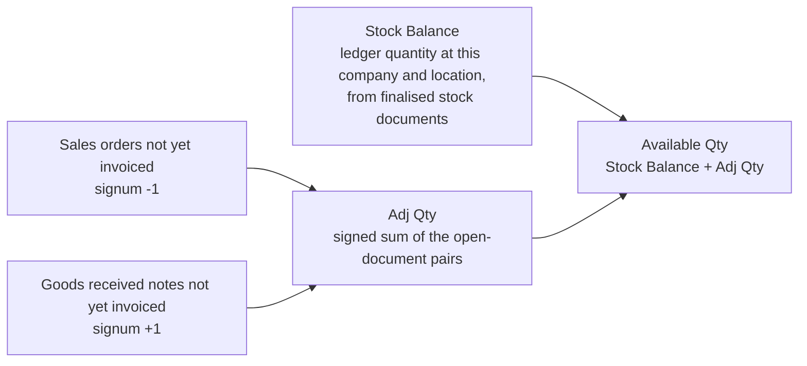

## Overview

The Stock Availability applet is the read-only window onto inventory: what you physically hold, what open documents have already claimed or promised, and therefore what you can still sell — by company, location and bin, down to individual serial and batch numbers. It sits on top of the stock ledger written by purchasing, sales, transfers, adjustments and stock takes; nothing is created here.

Sales staff open it before promising stock, warehouse staff to find where an item sits, purchasing to see what is on order, and finance for the cost columns (which can be hidden from everyone else by setting and re-opened per user by permission).

### How availability is calculated

Available Qty is not "physical stock minus reservations". It is the physical balance plus a **signed** adjustment for open documents, and the adjustment can be positive:

Those two pairs are the backend's default when a screen sends no list of its own (`StockAvailabilityService.getCorrectServerDocTypeSignumDto`): `INTERNAL_SALES_ORDER` against `INTERNAL_SALES_INVOICE` at −1, and `INTERNAL_PURCHASE_GOODS_RECEIVED_NOTE` against `INTERNAL_PURCHASE_INVOICE` at +1. The Details screens send longer lists that add delivery orders, quotations and the draft sections.

| Column | Meaning |
|---|---|
| **Stock Balance** (physical) | The ledger quantity at that company / location, from finalised stock documents |
| **Adj Qty** | The signed sum above. It is negative when open sales orders outweigh uninvoiced receipts, positive when they do not |
| **Available Qty** | `Stock Balance + Adj Qty` — what a new order can still take |
| **Min / Max level** | The item's minimum and maximum stock levels for the location, returned by the backend and shown as columns when the Optional filter includes `SHOW_MIN_QTY` / `SHOW_MAX_QTY` |

The Details screen shows the documents behind Adj Qty per type (Sales Order, Purchase Order, GRN, GRN draft, GRN stock-in draft, Delivery Order, Sales Invoice draft, Sales Quotation), so "50 physical but 0 available" is always traceable to specific documents.

## Where it fits

| Direction | Applet / document | Why |
|---|---|---|
| Upstream | [Stock Balance](/applets/inventory-workflow/stock-balance-applet/) | The ledger balances this applet reads |
| Upstream | [Inventory Item Maintenance](/applets/master-data/inv-item-maintenance-applet/), [Doc Item Maintenance](/applets/master-data/doc-item-maintenance-applet/) | Item master, category levels, pricing schemes and prices shown as columns |
| Upstream | [Organisation](/applets/master-data/organisation-applet/) | Companies, branches, locations and bins |
| Upstream | [Sales Order](/applets/sales-workflow/internal-sales-order-applet/), [Purchase Order](/applets/purchase-workflow/internal-purchase-order-applet/), [Purchase GRN](/applets/purchase-workflow/internal-purchase-grn-applet/) and other stock documents | Open documents that make up Adj Qty and appear in Details |
| Sibling | [Stock Reservation](/applets/inventory-workflow/stock-reservation-applet/) | Reserved and locked quantities shown on Stock Card & Planning |
| Sibling | [Stock Take](/applets/inventory-workflow/stock-take-applet/), [Stock Adjustment](/applets/inventory-workflow/stock-adjustment-applet/) | Correct the balance this applet displays |
| Sibling | [Warehouse Management](/applets/inventory-workflow/warehouse-management-applet/) | Bins shown in Bin Availability |

Modules: Inventory, Purchasing, POS.

## Screens and menus

| Menu | What it shows | Visible by default |
|---|---|---|
| **Stock Availability** | Item × company × location grid: stock balance, adj qty, available qty, costs (moving-average at location and company, last purchase, FIFO, LIFO); drill-down opens the item view with its bins, categories, images, NSTI, pricing schemes and serial numbers | yes |
| **Stock Availability Details** | One item at a time with the documents behind each quantity, per location, plus the price columns per pricing scheme | yes |
| **Stock Aging Report** | Balance grouped by age bucket (months, or days when the tenant setting `AGING_PERIOD_TYPE` is `DAY`) | yes |
| **Stock Availability with SO and PO** | Only the sales-order and purchase-order commitments | yes |
| **Trace Serial No** | Movement history of one serial number | yes |
| **Serial Number Balance** | Serial numbers currently in stock, by location | yes |
| **Trace Batch No** | Movement history of one batch number | yes |
| **Bin Availability** | Quantity per bin, with bin code and name | yes |
| **Stock Card & Planning** | Per item: total, reserved (and by whom), locked, packed, ad-hoc and available quantity with bin, UOM, job order, completion date and status | **no** — `defaultHidden: true` in `menu-items.ts`; switch `HIDE_STOCK_CARD_PLANNING_MENU` off to show it |
| **Audit Trail** | Change history | yes |

A **Stock Transfer Queue** route also exists (`stock-transfer`) but its menu entry is commented out, so it is reachable only by URL.

Gear (Settings) menu: **Application Settings**, **Default Selection**, plus the shared permission, webhook, release-notes and applet-log screens. Personalisation: per-user **Default Selection**. A `field-settings` route exists but is not in the menu and its template contains no controls.

### Stock Availability listing



Filter by company, branch, location, item and category levels; the same item can be seen company-wide or per location. Rows are merged per item × location × company and Available Qty is recomputed on every load. Every cost and quantity column has a tenant-wide hide switch and a matching permission (see Configuration).

### Stock Availability Details



The advanced search has an **Optional** multi-select that, by default, hides zero balances and the document-balance sections — `HIDE_ZERO_BALANCE`, `HIDE_GOODS_RECEIVE_NOTE_BALANCE`, `HIDE_PURCHASE_ORDER_BALANCE`, `HIDE_SALES_ORDER_BALANCE`, `HIDE_DELIVERY_ORDER_BALANCE`, `HIDE_SALES_INVOICE_DRAFT_BALANCE`, `HIDE_GOODS_RECEIVE_NOTE_DRAFT_BALANCE`, `HIDE_GRN_STOCK_IN_DRAFT_BALANCE`. Untick one to open that section; `SHOW_MIN_QTY`, `SHOW_MAX_QTY` and `SHOW_OTHER_IMAGES_1..3 / _ALL` add the level columns and item images. These are per-search options, not settings. Each document tab (GRN, PO, SO, DO, Sales Invoice draft, GRN draft, GRN stock-in draft, Sales Quotation) can also be hidden tenant-wide, and the item row opens a **Stock Movement** pop-up.

### Stock Aging Report



### Stock Availability with SO and PO



### Trace Serial No, Serial Number Balance, Trace Batch No





Search by exact serial or batch number, keyword or date range. Sales invoice lines are shown as negative quantities so the running balance reads correctly. Serial tracing works forwards (which customer received this unit) and backwards (which GRN and supplier it came from); batch tracing lists every document a batch passed through.

### Bin Availability



## Configuration

### Before you can use it

| Prerequisite | Where | Why |
|---|---|---|
| Items with an inventory record | [Inventory Item Maintenance](/applets/master-data/inv-item-maintenance-applet/) / [Doc Item Maintenance](/applets/master-data/doc-item-maintenance-applet/) | Only stock-tracked items have balances |
| Companies, branches, locations, bins | [Organisation](/applets/master-data/organisation-applet/), [Warehouse Management](/applets/inventory-workflow/warehouse-management-applet/) | The dimensions of every screen |
| Pricing schemes | Doc Item Maintenance > Pricing Schemes | `PRICING_SCHEMES` picks which schemes become price columns on the Details screen |
| Finalised stock documents | GRN, sales, transfers, adjustments, stock take | Without them every balance is zero |
| Backend read permissions | Permission assignment | The applet requests `API_TNT_DM_ERP_INV_STOCK_AVAILABILITY_READ`, `…_AVG_COST_READ`, `…_SALES_REPORT_READ`, `API_TNT_DM_ERP_STOCK_AGING_REPORT_READ`, `API_TNT_DM_ERP_STOCK_REPORT_READ`, `API_TNT_DM_ERP_INV_BATCH_READ`, `TNT_API_BIN_READ` (`app.component.ts`) |

### Applet settings

Settings live in **applet-local** components (`settings-container/application-settings`, `default-settings`); the applet does not use the shared `FieldConfigurationComponent`. Both save through `SessionActions.saveMasterSettingsInit`, so a change applies to every user of the applet; Personalisation > Default Selection saves per user. Anyone who can open the gear menu can change them — no permission guards the settings screens.

**Settings > Application Settings** — six tabs. Each row is declared in `applet-settings.model.ts`, rendered as a control, saved by SAVE and read where *Effect* says; rows marked *rendered but not consumed* have no reader anywhere in the applet (repository search at commit `980bd5f`).

| Setting (tab) | What it controls | Default | Effect when changed |
|---|---|---|---|
| `HIDE_STOCK_AVAILABILITY_MENU`, `HIDE_STOCK_AVAILABILITY_DETAILS_MENU`, `HIDE_STOCK_AGING_REPORT_MENU`, `HIDE_STOCK_AVAILABILITY_SO_PO_MENU`, `HIDE_TRACE_SERIAL_NO_LISTING_MENU`, `HIDE_SERIAL_NUMBER_BALANCE_MENU`, `HIDE_TRACE_BATCH_NO_LISTING_MENU`, `HIDE_BIN_AVAILABILITY_MENU`, `HIDE_STOCK_CARD_PLANNING_MENU`, `HIDE_AUDIT_TRAIL_MENU` (*Sidebar Menu*; keys generated from the menu state) | Menu visibility | off, except `HIDE_STOCK_CARD_PLANNING_MENU` = **on** (`defaultHidden: true`); an unset key falls back to that default | `menu-visibility.ts`: hidden when the user lacks `SHOW_<KEY>_MENU` **and** the switch (or its default) is on; the applet opens on the first visible menu |
| `HIDE_LISTING_AVG_COST`, `HIDE_LISTING_LAST_PURCHASE_COST`, `HIDE_LISTING_FIFO_COST`, `HIDE_LISTING_LIFO_COST` (*Stock Availability Listing*) | Cost columns | off (no value; unset = shown) | Column removed on the listing, Bin Availability, Stock Card & Planning, the Details listing and the cost tooltip unless the user holds the matching `SHOW_LISTING_*` permission |
| `HIDE_LISTING_COMPANY`, `HIDE_LISTING_LOCATION`, `HIDE_LISTING_STOCK_BALANCE`, `HIDE_LISTING_ADJ_QTY`, `HIDE_LISTING_AVAILABLE_QTY` (*Listing*) | Structural and quantity columns | off | Listing, Bin Availability and Stock Card & Planning |
| `HIDE_LISTING_PURCHASE_PRICE`, `HIDE_LISTING_SALES_PRICE`, `HIDE_LISTING_SALES_MAX_PRICE`, `HIDE_LISTING_SALES_MIN_PRICE`, `HIDE_LISTING_REPLACEMENT_PRICE`, `HIDE_LISTING_REF_PRICE_1..3`, `HIDE_LISTING_DELTA_PRICE_1..3`, `HIDE_LISTING_REBATE_PRICE_1..3` (*Listing*) | Price columns and the pricing tooltip | off | **Details** listing and its pricing-scheme tooltip (the main listing has no price columns) |
| `PRICING_SCHEMES` (multi-select), `PRICE_METRICS` (single: `PURCHASE_UNIT_PRICE`, `SALES_UNIT_PRICE`, `SALES_MAX_PRICE`, `SALES_MIN_PRICE`, `REPLACEMENT_UNIT_PRICE_EXCL_TAX`, `DELTA_PRICE1..3_EXCL_TAX`, `REF_PRICE1..3_EXCL_TAX`, `REBATE_PRICE1..3_EXCL_TAX`) (*Listing*) | One column per selected scheme on the **Details** listing; the metric chooses which price value fills every scheme column | none | Adding a scheme adds a column; changing the metric changes the value in all scheme columns at once (#9812) |
| `ENABLE_FILTER_BY_TODAYS_TXN` (*Listing*) | — | off | **Rendered but not consumed** |
| `HIDE_REPORT_DOC_SHORT_CODE`, `HIDE_REPORT_UNIT_PRICE`, `HIDE_REPORT_UNIT_COST`, `HIDE_REPORT_INVENTORY_VALUE`, `HIDE_REPORT_AMOUNT_STD`, `HIDE_REPORT_AMOUNT_DISC`, `HIDE_REPORT_AMOUNT_NET`, `HIDE_REPORT_AMOUNT_TAX`, `HIDE_REPORT_AMOUNT_TXN` (*Listing*) | Columns of the **Stock Movement** pop-up on the Details screen | off | Column hidden unless the user holds `SHOW_REPORT_*` (not the aging or trace reports) |
| `HIDE_STOCK_MOVEMENT`, `HIDE_PURCHASE_DOCUMENTS`, `HIDE_PURCHASE_DOCUMENTS_IN_STOCK_MOVEMENT`, `HIDE_INTERNAL_STOCK_ADJUSTMENT`, `HIDE_TOOLTIP_PRICING_DETAILS`, `INCREASE_ITEM_IMAGE_SIZE` (*Stock Availability Details*) | Stock Movement pop-up; which document families it lists (supplier-side documents, internal stock adjustments); the pricing tooltip; larger thumbnails | **Displayed ON when never saved** (control initialised `true`, a stored `null` is patched to `true`), but the readers test the stored value, so the feature stays visible until the screen is saved once — after that first SAVE these six are persisted as `true` and take effect | `stock-availability-details-view` (`=== true`), `…-view-movement` (`=== true`), Details listing |
| `HIDE_PURCHASE_GRN_PURCHASE_PRICE`, `HIDE_PURCHASE_GRN_SUPPLIER_NAME` (*Details*) | — | displayed ON (same null-to-true patch) | **Rendered but not consumed**: the GRN tab does not read them |
| `HIDE_GOODS_RECEIVED_NOTE_TAB`, `HIDE_PURCHASE_ORDER_TAB`, `HIDE_SALES_ORDER_TAB`, `HIDE_DELIVERY_ORDER_TAB`, `HIDE_SALES_QUOTATION_TAB`, `HIDE_SALES_INVOICE_TAB`, `HIDE_GRN_DRAFT_TAB`, `HIDE_GRN_STOCK_IN_DRAFT_TAB` (*Details*) | Document tabs on the Details screen | off (`false`; patched `=== true`) | Tab removed for everyone (no permission override) |
| `ITEM_CATEGORY_GROUP_0..20`, `HIDE_ITEM_CATEGORY_GROUP_0..20` (*Item Category Group*) | — | empty / off | **Rendered but not consumed**: no screen in this applet reads them; the category filters and columns come from the item master's category levels |
| `HIDE_UNIT_COST_AMOUNT` (*Trace Serial Number*) | The amount column on Trace Serial No | displayed ON when never saved (same null-to-true patch); effective after the first save | Hidden unless the user holds `SHOW_UNIT_COST_AMOUNT` |
| `HIDE_DOC_POPUP_COST_AMOUNT`, `HIDE_DOC_POPUP_GP` (*Miscellaneous*) | — | off | **Rendered but not consumed** (the matching `SHOW_DOC_POPUP_*` permissions are seeded but nothing checks them either) |


**Cost and supplier data are hidden after the first save of Application Settings.** Six switches on the *Stock Availability Details* tab and `HIDE_UNIT_COST_AMOUNT` come up ON in the form. Saving the screen for any other reason therefore hides the Stock Movement pop-up, supplier-side documents, internal stock adjustments, the pricing tooltip and the serial-trace amount for every user without a `SHOW_*` permission. Turn them off deliberately before saving if you want them visible.


**Keys read at runtime without a control** (set by other screens or only by hand in the master settings record):

| Key | Read by | Effect |
|---|---|---|
| `HIDE_UOM`, `HIDE_STOCK_BALANCE`, `HIDE_ADJ_QTY`, `HIDE_AVAILABLE_QTY`, `HIDE_AVG_COST`, `HIDE_LAST_PURCHASE_COST` | The item view opened from the listing (`stock-availability-view-main`) and the Stock Transfer Queue view | Field hidden unless the user holds `SHOW_UOM` / `SHOW_STOCK_BALANCE` / `SHOW_ADJ_QTY` / `SHOW_AVAILABLE_QTY` / `SHOW_AVG_COST` / `SHOW_LAST_PURCHASE_COST` |
| `HIDE_PURCHASE_ORDER_DOCUMENTS` | Details view | Purchase documents hidden unless the user holds `SHOW_PURCHASE_DOCUMENTS` |
| `AGING_PERIOD_TYPE` | Stock Aging Report | `DAY` ages by days; anything else by months |
| `PRINTABLE` | Document export from the Details view | Default printable format |
| `DISABLE_STOCK_AVAILABILITY_LISTING` | Stock Transfer Queue screen | Disables that listing |

**Settings > Default Selection** — `DEFAULT_BRANCH`, `DEFAULT_LOCATION` (pre-select the search filters), `DEFAULT_TOGGLE_COLUMN` (`SINGLE` / `DOUBLE` form layout, read by the Details listing) and **side bar Ordering** — drag the menu names into order, saved as `SIDE_BAR_ORDER`; **RESET** restores the built-in order. New menu items added in a later build are appended to a saved order.

**Personalisation > Default Selection** — the same branch, location and toggle-column values per user.

### Document behaviour settings

Not applicable — the applet creates no documents (routes and settings components checked at commit `980bd5f`).

### Feature visibility / permissions

The registry seeds 49 active client-side permissions for `stockAvailability` (`bl_applet_client_side_perm_dfn`, checked 2026-09-05). Each re-enables one hidden column, pop-up or menu for its holder:

| Permission group | Codes |
|---|---|
| Menus | `SHOW_STOCK_AVAILABILITY_MENU`, `SHOW_STOCK_AVAILABILITY_DETAILS_MENU`, `SHOW_STOCK_AGING_REPORT_MENU`, `SHOW_STOCK_AVAILABILITY_SO_PO_MENU`, `SHOW_TRACE_SERIAL_NO_LISTING_MENU`, `SHOW_SERIAL_NUMBER_BALANCE_MENU`, `SHOW_TRACE_BATCH_NO_LISTING_MENU`, `SHOW_BIN_AVAILABILITY_MENU` |
| Listing columns | `SHOW_LISTING_AVG_COST`, `SHOW_LISTING_LAST_PURCHASE_COST`, `SHOW_LISTING_FIFO_COST`, `SHOW_LISTING_LIFO_COST`, `SHOW_LISTING_PURCHASE_PRICE`, `SHOW_LISTING_REPLACEMENT_PRICE`, `SHOW_LISTING_SALES_PRICE`, `SHOW_LISTING_SALES_MAX_PRICE`, `SHOW_LISTING_SALES_MIN_PRICE`, `SHOW_LISTING_REF_PRICE_1..3`, `SHOW_LISTING_DELTA_PRICE_1..3`, `SHOW_LISTING_REBATE_PRICE_1..3`, `SHOW_LISTING_COMPANY`, `SHOW_LISTING_LOCATION`, `SHOW_LISTING_STOCK_BALANCE`, `SHOW_LISTING_ADJ_QTY`, `SHOW_LISTING_AVAILABLE_QTY` |
| Item view and pop-ups | `SHOW_AVG_COST`, `SHOW_LAST_PURCHASE_COST`, `SHOW_UNIT_COST_AMOUNT`, `SHOW_TOOLTIP_PRICING_DETAILS`, `SHOW_STOCK_MOVEMENT`, `SHOW_PURCHASE_DOCUMENTS`, `SHOW_PURCHASE_DOCUMENTS_IN_STOCK_MOVEMENT`, `SHOW_INTERNAL_STOCK_ADJUSTMENT` |
| Stock Movement columns | `SHOW_REPORT_DOC_SHORT_CODE`, `SHOW_REPORT_UNIT_PRICE`, `SHOW_REPORT_UNIT_COST`, `SHOW_REPORT_AMOUNT_STD`, `SHOW_REPORT_AMOUNT_DISC`, `SHOW_REPORT_AMOUNT_NET`, `SHOW_REPORT_AMOUNT_TAX`, `SHOW_REPORT_AMOUNT_TXN` |
| Seeded but checked nowhere | `SHOW_DOC_POPUP_COST_AMOUNT`, `SHOW_DOC_POPUP_GP` |

Checked in code but **not seeded** (the feature can only be hidden for everyone until they are added): `SHOW_STOCK_CARD_PLANNING_MENU`, `SHOW_AUDIT_TRAIL_MENU`, `SHOW_LISTING_COMPANY_AVG_COST`, `SHOW_UOM`, `SHOW_STOCK_BALANCE`, `SHOW_ADJ_QTY`, `SHOW_AVAILABLE_QTY`, `SHOW_REPORT_INVENTORY_VALUE`.

## Fields

The applet has no create or edit forms. Listing columns:

| Column | Meaning |
|---|---|
| Item Code, Item Name, EAN Code, Type, Sub Type, UOM / Base UOM | From the item master |
| Company, Location, Bin Code / Bin Name | Where the balance sits |
| Stock Balance, Adj Qty, Available Qty | See *How availability is calculated* |
| Qty, Base Qty, Container Qty / Ctn Qty, Container Measure | Quantity in the item's UOM and base UOM, and per container for batch / bin items |
| Serial Number, Batch No., Expiry Date | For serialised and batch-tracked items |
| Company Avg Cost, Location Avg Cost, Last Purchase Cost, FIFO Cost, LIFO Cost, Amount | Valuation columns |
| Category levels | From the item master |
| NSTI Code / Name | Non-stock trade-in items |
| Created / Modified / Updated Date | Audit |

Details listing adds one column per pricing scheme selected in `PRICING_SCHEMES`, valued by `PRICE_METRICS`, plus Min / Max Qty and item images when chosen in the Optional filter.

Stock Card & Planning columns: Total Qty, Reserved Qty, Reserved By, Locked Qty, Packed Qty, Ad Hoc Qty, Available Qty, Bin Code, UOM, Job Order, Completion Date, Status.

## Lifecycle and effects

Read-only — the applet writes nothing. Balances change only when stock documents are finalised elsewhere. On every load the listing merges the backend rows per item × location × company and recomputes `qty_available = qty_balance + Σ(qty_adjustment × qty_signum)` (`stock-availability-listing.component.ts`). The backend (`StockAvailabilityService`) returns the ledger balance, the open-document quantities for each requested document-type pair, stock in transit, min / max levels and the four cost bases; when a caller sends no pairs, or an incomplete one, it substitutes the defaults sales order → sales invoice (−1) and goods received note → purchase invoice (+1).

## Related applets

- [Stock Balance](/applets/inventory-workflow/stock-balance-applet/) — the ledger this applet summarises.
- [Inventory Item Maintenance](/applets/master-data/inv-item-maintenance-applet/) and [Doc Item Maintenance](/applets/master-data/doc-item-maintenance-applet/) — item master, categories, pricing schemes; the item's own Stock Availability and Stock Card tabs show the same data for one item.
- [Stock Reservation](/applets/inventory-workflow/stock-reservation-applet/) — reserved and locked quantities on Stock Card & Planning.
- [Stock Take](/applets/inventory-workflow/stock-take-applet/) and [Stock Adjustment](/applets/inventory-workflow/stock-adjustment-applet/) — fix a balance that disagrees with the shelf.
- [Warehouse Management](/applets/inventory-workflow/warehouse-management-applet/) — bins.
- [Sales Order](/applets/sales-workflow/internal-sales-order-applet/), [Purchase Order](/applets/purchase-workflow/internal-purchase-order-applet/), [Purchase GRN](/applets/purchase-workflow/internal-purchase-grn-applet/) — the documents that make up Adj Qty.
- [Organisation](/applets/master-data/organisation-applet/) — companies, branches, locations.

## Troubleshooting

| Symptom | Cause | Fix |
|---|---|---|
| Physical shows 50, Available shows 0 | Open sales orders (or delivery orders) have committed the stock | Open **Stock Availability Details**, untick `HIDE_SALES_ORDER_BALANCE` in the Optional filter to see which orders |
| Item is out of stock but a colleague says it is on order | Incoming documents are hidden by the default Optional filter | Untick `HIDE_PURCHASE_ORDER_BALANCE` / `HIDE_GOODS_RECEIVE_NOTE_BALANCE` |
| Cost columns missing for a user | Hidden by `HIDE_LISTING_*_COST` and the user lacks the `SHOW_LISTING_*` permission | Grant the permission or clear the setting |
| Stock Movement pop-up, supplier documents or the serial-trace amount vanished after someone saved Application Settings | The Details-tab switches and `HIDE_UNIT_COST_AMOUNT` come up ON and were persisted by that save | Open Application Settings, switch them off, save again |
| Stock Card & Planning is not in the menu | Hidden by default (`defaultHidden: true`) and its `SHOW_STOCK_CARD_PLANNING_MENU` permission is not seeded | Set `HIDE_STOCK_CARD_PLANNING_MENU` off in Application Settings |
| Pricing scheme columns show the wrong price type, or appear only on Details | `PRICE_METRICS` selects one value for every scheme column; scheme columns exist only on the Details listing (#9812) | Set the metric you need; different metrics side by side are not supported |
| Category filter returns different items here and in Doc Item Maintenance | The two applets filtered on different category levels for "category 2" (#9149, fixed) | Update both builds; use the same level in both searches |
| Average cost looks wrong in Stock Movement or in the sales report section | Costs shown are the moving-average values computed by the backend; display defects were fixed in 2026 (#6078, #6164, #6394) and an enhancement to show reset-MA state in the UI is open (repo issue #22) | Update the build; confirm the item's cost in Inventory Item Maintenance |
| Clicking a document in the Sales Invoice draft section opens the wrong document | Defect in the draft section's drill-down, fixed in 2026 (#7450) | Update the applet build |
| Sales Order tab does not show who the order is for | Entity column added in 2026 (#3333) | Update the applet build |
| Trade-in stock missing from the historical balance | Trade-in (NSTI) stock is not included there (#1422, open) | Use the NSTI columns on the listing |
| Serial trace shows negative quantities | Sales invoice lines are shown negative by design so the running balance is correct | No action |

## Related documentation

- [Inventory module](/modules/inventory/) — [configuration](/modules/inventory/configuration/), [reports](/modules/inventory/reports/) and [use cases](/modules/inventory/use-cases/).
