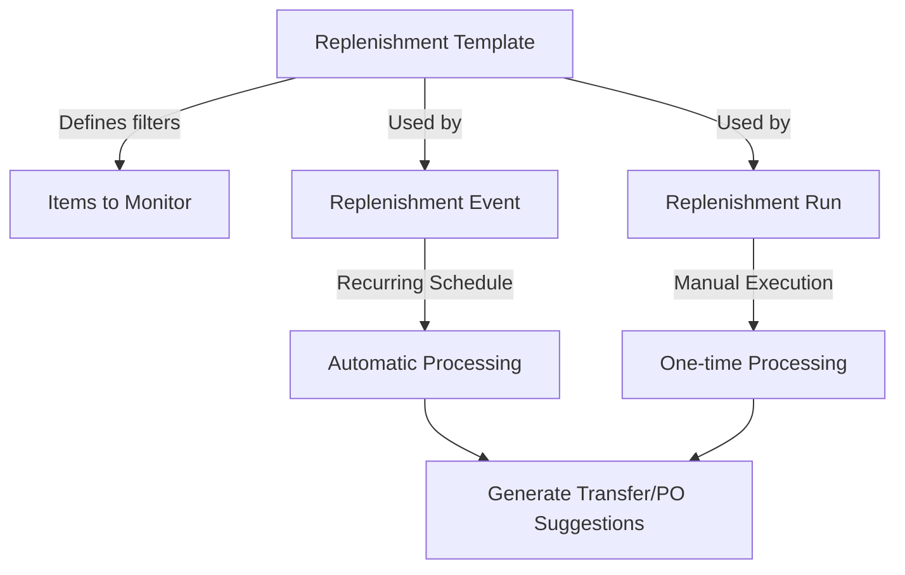

---
title: "Stock Transfer Applet"
description: "Internal and outbound stock transfers between locations and warehouses with approval workflows"
tags:
- stock-transfer
- inventory-management
- warehouse
- inter-location-transfer
- stock-movement
---

## Purpose and Overview

The **Stock Transfer Applet** enables seamless movement of inventory between locations, warehouses, and bins within your organization. It provides complete visibility and control over internal stock transfers with approval workflows.


**Core Concept**: Stock transfers move inventory from a **Source Location** to a **Destination Location**, maintaining complete traceability of all stock movements.



## Key Features Overview

### Who Benefits from This Applet?

**Warehouse Staff:**
- Create and process stock transfers
- Track items being transferred
- Receive incoming transfers
- Manage bin-level movements

**Inventory Managers:**
- Monitor inter-location stock movements
- Approve transfer requests
- Ensure inventory accuracy across locations
- Track transfer performance metrics

**Operations Teams:**
- Coordinate stock balancing between locations
- Manage seasonal inventory distribution
- Handle urgent stock replenishment
- Monitor transfer lead times

**Finance Teams:**
- Track inventory valuation across locations
- Ensure accurate stock costing
- Monitor high-value transfers
- Generate transfer reports

### What Problems Does This Solve?

**Traditional Stock Transfer Challenges:**
- Manual transfer tracking prone to errors
- No visibility into stock in transit
- Difficult to trace movement history
- Delayed receiving and posting
- Inconsistent transfer procedures

**The Stock Transfer Solution:**
- **Digital workflows** - Create and approve transfers electronically
- **Real-time tracking** - See transfer status at every stage
- **Complete traceability** - Full audit trail of all movements
- **Approval controls** - Multi-level approval for transfers
- **Integration ready** - Links to inventory and accounting systems

## Key Features Overview


  

  

  

  

  

  


---

## Key Concepts

### Stock Transfer Types

| Type | Description | Example |
|------|-------------|---------|
| **Internal Transfer** | Between locations within same company | Main Warehouse → Branch Store |
| **Outbound Transfer** | From your location to another | HQ Warehouse → Regional DC |
| **Inbound Transfer** | Receiving from another location | Receiving from HQ |


### Transfer Status Flow

```
Draft → Submitted → In Transit → Received → Completed
                 ↓
              Rejected (if failed approval)
```

**Status Definitions:**
- **Draft**: Transfer created but not yet submitted
- **Submitted**: Awaiting approval or processing
- **In Transit**: Goods have left source location
- **Received**: Destination has acknowledged receipt
- **Completed**: Transfer fully processed and posted
- **Rejected**: Transfer was rejected by approver

---

## Quick Start Guide

### For Warehouse Staff: Create a Stock Transfer

**Goal:** Transfer stock from your location to another in 5 steps.

1. **Navigate**: Go to **Stock Transfer Listing** from the sidebar
2. **Create Header**: Click **"+"** → Enter transfer details:
   - **Source Location**: Your warehouse/location
   - **Destination Location**: Where items are going
   - **Transfer Date**: Date of transfer
   - **Reference**: Transfer reference number
3. **Add Items**:
   - Click **"Add Line"**
   - Select **Item Code** from dropdown
   - Enter **Quantity** to transfer
   - Select **Bin** (if applicable)
   - Repeat for all items
4. **Review**: Verify all items and quantities
5. **Submit**: Click **Submit** → Transfer goes for approval/processing

**What happens next?** Transfer is processed and items move to destination.

---

### For Managers: Approve Transfers

**Goal:** Review and approve pending stock transfers.

1. **Check Pending**: Go to **Pending Approvals** (notification badge shows count)
2. **Review Details**:
   - Source and destination locations
   - Items and quantities being transferred
   - Transfer justification/notes
3. **Decide**:
   - **Approve**: Click ✓ **Approve** → Transfer proceeds
   - **Reject**: Click ✗ **Reject** → Add reason → Transfer cancelled
   - **Query**: Request more information from requestor

---

### For Admins: Configure Transfer Settings

**Goal:** Set up stock transfer options and workflows.

1. **Approval Settings**: Define who can approve transfers
2. **Location Mapping**: Configure allowed transfer routes
3. **Default Settings**: Set up default values for new transfers
4. **Permissions**: Control who can create/edit/delete transfers

---

## Stock Transfer Listing

### Main Transfer Listing


View all stock transfers with filters for:
- **Status** - Draft, Submitted, In Transit, Completed
- **Date Range** - Filter by transfer date
- **Source Location** - Where transfers originate
- **Destination Location** - Where transfers go

### Key Columns

| Column | Description |
|--------|-------------|
| Transfer No | Unique transfer identifier |
| Date | Transfer date |
| Source | Origin location/warehouse |
| Destination | Receiving location/warehouse |
| Status | Current transfer status |
| Items | Number of line items |
| Total Qty | Total quantity being transferred |

---

## Create Stock Transfer


### Transfer Header

Enter the following information when creating a new transfer:

| Field | Description | Required |
|-------|-------------|----------|
| Source Location | Where items are coming from | Yes |
| Destination Location | Where items are going | Yes |
| Transfer Date | Date of the transfer | Yes |
| Reference | External reference number | No |
| Notes | Additional information | No |

### Adding Line Items

For each item to transfer:

1. **Select Item**: Choose from item master
2. **Enter Quantity**: How many units to transfer
3. **Select Bin** (if using bin management): Source bin location
4. **Add Notes**: Item-specific notes if needed

### Serial/Batch Items

For items with tracking:
- **Serial Numbers**: Select specific serial numbers to transfer
- **Batch Numbers**: Select batches and quantities

---

## Transfer Details

### Viewing a Transfer

Open any transfer to see:
- **Header Information**: Source, destination, dates
- **Line Items**: Items being transferred with quantities
- **Status History**: Complete audit trail
- **Attachments**: Supporting documents

### Editing a Transfer

Only **Draft** status transfers can be edited:
- Modify quantities
- Add/remove items
- Update notes
- Change dates

---

## Approval Workflow

### Approval Process

Depending on your organization's settings:

1. **Automatic Approval**: Low-value transfers may proceed without approval
2. **Single Approval**: One approver reviews and decides
3. **Multi-Level Approval**: Multiple approvers based on value or type

### Approval Actions

| Action | Effect |
|--------|--------|
| **Approve** | Transfer proceeds to next stage |
| **Reject** | Transfer cancelled with reason |
| **Query** | Request more information |
| **Delegate** | Assign to another approver |

---

## Stock Replenishment System

The **Stock Replenishment System** automates the process of identifying and replenishing low stock items. It uses a **Template → Events → Runs** pattern for flexible, automated stock management.


**Understanding the Relationship**: These three settings work together:
- **Template** → Defines WHAT to replenish (item filters, supplier filters, location filters)
- **Events** → Defines WHEN to replenish (schedule, recurring rules)
- **Runs** → Executes the replenishment (manual or automated processing)




---

### Replenishment Template (`Stock Replenishment Template`)

Templates define **which items** to monitor for replenishment and **from whom** to replenish.

**Creating a Template - Field-by-Field Guide:**

| Field | Purpose | Required |
|-------|---------|----------|
| **Template Name** | Identifies this template | Yes |
| **Description** | Explain the template's purpose | No |
| **Status** | Active/Inactive | Yes |

**Editing a Template - 6 Tabs:**

When you select a template to edit, you'll see:

| Tab | Purpose |
|-----|---------|
| **Details** | Basic info + audit fields (Created By, Modified By, etc.) |
| **Items Filter** | Select which items to include/exclude from replenishment |
| **Suppliers Filter** | Filter by preferred suppliers |
| **Locations Filter** | Which locations to monitor for low stock |
| **Category Filter** | Filter by item categories |
| **Items List** | View the resulting list of items to monitor |

**Real-World Scenario - Setting Up a Template:**

*Goal*: Monitor all electronics in the Main Warehouse from approved suppliers.

1. Create Template: "Electronics Replenishment"
2. In **Items Filter** tab: Select electronics item codes
3. In **Suppliers Filter** tab: Add approved electronics vendors
4. In **Locations Filter** tab: Select "Main Warehouse"
5. In **Category Filter** tab: Select "Electronics" category
6. Save → Check **Items List** tab to verify the items included

---

### Replenishment Events (`Stock Replenishment Events`)

Events define **when** replenishment checks should occur—either one-time or on a recurring schedule.

**Creating an Event - Field-by-Field Guide:**

| Field | Purpose | Required |
|-------|---------|----------|
| **Replenishment Template** | Which template to use | Yes |
| **Event Code** | Unique identifier for this event | Yes |
| **Event Name** | Descriptive name | Yes |
| **Cycle Start Date** | When to start checking | No |
| **Cycle End Date** | When to stop (for one-time events) | No |
| **Recurring** | Enable recurring schedule | No |
| **Recurrence Editor** | Define frequency (daily, weekly, monthly) | Conditional - shows when Recurring is checked |
| **Description** | Additional notes | No |
| **Status** | Active/Inactive | Yes |

**Real-World Scenario - Monthly Replenishment Check:**

*Goal*: Check electronics stock every 1st of the month.

1. Create Event: "Monthly Electronics Check"
2. Select Template: "Electronics Replenishment"
3. Check **Recurring** checkbox
4. In Recurrence Editor: Set to "Monthly" on day 1
5. Set Status: Active
6. Save → System will automatically run on the 1st of each month

---

### Replenishment Runs (`Stock Replenishment`)

Runs are **manual executions** of replenishment checks. Use these for ad-hoc or one-time replenishment processing.

**Creating a Run - Field-by-Field Guide:**

| Field | Purpose | Required |
|-------|---------|----------|
| **Replenishment Template** | Which template to use | No |
| **Run Name** | Identify this run | Yes |
| **Current Run Start Date** | Date range for this run | No |
| **Current Run End Date** | End of date range | No |
| **Previous Run Name** | Reference to last run (read-only) | No |
| **Previous Run Start Date** | Last run's start date | No |
| **Previous Run End Date** | Last run's end date | No |
| **Description** | Notes for this run | No |
| **Status** | Status of the run | Yes |

**Real-World Scenario - Emergency Stock Check:**

*Goal*: Run an urgent replenishment check after a large order depleted stock.

1. Go to Stock Replenishment → Create Run
2. Select Template: "Electronics Replenishment"
3. Set Run Name: "Emergency Check - March 2024"
4. Set dates for the period to analyze
5. Save → Review the items list generated
6. Create transfer requests or POs based on results

---

### Best Practices for Stock Replenishment

✓ **Start with Templates**: Set up comprehensive templates with all filters before creating events

✓ **Use Recurring Events for Regular Checks**: Weekly or monthly schedules reduce manual work

✓ **Manual Runs for Ad-hoc Needs**: Use runs for urgent or one-off replenishment checks

✓ **Review Items List**: Always check the Items List tab after editing filters to verify coverage

✗ **Avoid Too Many Overlapping Events**: Multiple events on the same template can create duplicate suggestions

---

## Configuration & Settings


### Custom Status (`Settings > Custom Status`)

Define custom transfer statuses beyond the default ones to match your workflow.

| Field | Purpose | Example |
|-------|---------|---------|
| **Status Name** | Display name | "Pending Inspection" |
| **Status Code** | Internal code | "PENDING_INSPECT" |
| **Description** | Explain when to use | "Waiting for quality check" |

**Use Case**: Add "Quality Check" status for transfers that need inspection before receiving.

---

### Default Settings (`Settings > Default Settings`)

Configure default values that auto-populate when creating new transfers.

| Setting | What It Does |
|---------|--------------|
| **Default Source Location** | Pre-selects your usual source warehouse |
| **Default Destination** | Pre-selects common destination |
| **Default Transfer Type** | Internal, Inbound, or Outbound |

---

### Field Configuration (`Settings > Field Configuration`)

Customize which columns appear in listing views and their order.

- Add/remove columns from listings
- Reorder columns by drag-and-drop
- Save configurations per user

---

### Printable Format Settings

The applet has **two separate printable format settings** for inbound and outbound transfers:

#### Inbound Printable Format (`Settings > Inbound Printable Format Settings`)

Configure print templates for receiving documents.

**Edit View Tabs:**
| Tab | Purpose |
|-----|---------|
| **Details** | Template name, format settings |
| **Line** | Line item layout configuration |

#### Outbound Printable Format (`Settings > Outbound Printable Format Settings`)

Configure print templates for shipping documents.

**Edit View Tabs:**
| Tab | Purpose |
|-----|---------|
| **Details** | Template name, format settings |
| **Line** | Line item layout configuration |

---

### Applet Log (`Settings > Applet Log`)

Audit trail showing all user actions within the applet.

| Column | Description |
|--------|-------------|
| **Table Name** | Which data was affected |
| **Action** | CREATE, UPDATE, DELETE |
| **Action Date** | When it happened |
| **Description** | Details of the change |

---

### Release Notes (`Settings > Release Notes`)

View applet version history and feature updates.

---

## Personalization


### Personal Default Settings
Save your preferred source location and filters.

### Sidebar Customization
Arrange menu items to match your workflow.

---

## FAQ

**Q: Can I transfer items between different companies?**
A: No, stock transfers are within the same company. For cross-company movements, use Inter-Company Stock Transfer or Sales/Purchase documents.

**Q: What happens if destination rejects the transfer?**
A: The items remain at the source location. Review the rejection reason and create a new transfer if needed.

**Q: Can I track partial receipts?**
A: Yes, destination can receive partial quantities. The transfer shows partial receipt status until fully received.

**Q: How do I cancel a transfer in transit?**
A: Transfers in transit cannot be cancelled. Destination must receive and then create a return transfer.

**Q: Can I transfer items with serial numbers?**
A: Yes, you must select specific serial numbers during transfer creation. They will be moved to the destination.

