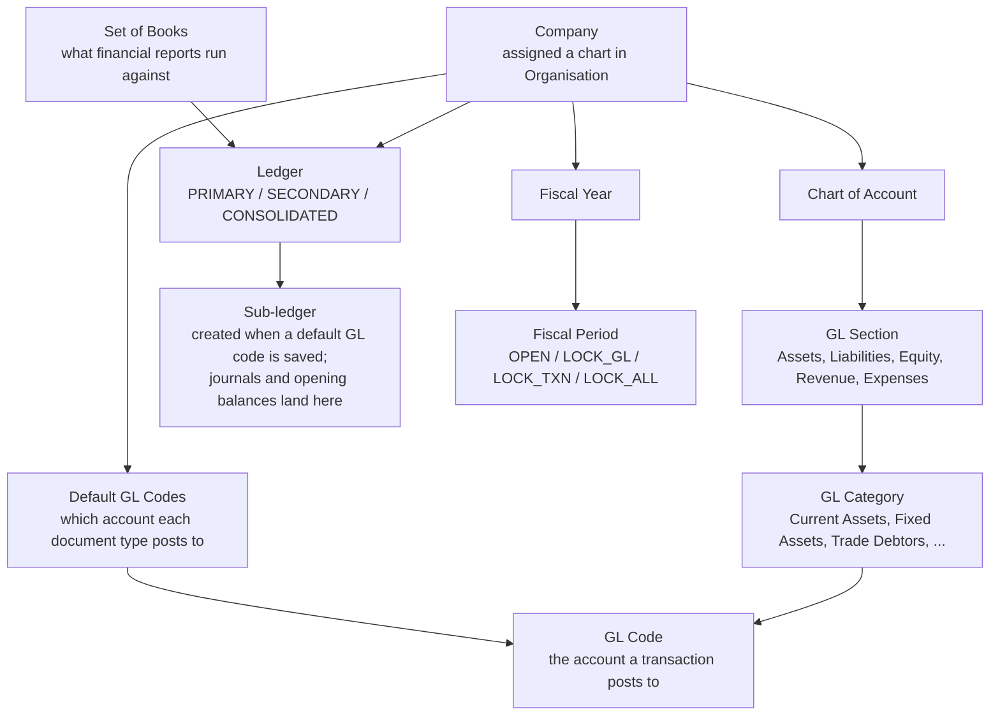

---
title: "Chart of Account"
description: "Reference for the Chart of Account applet, used by finance administrators and accountants to maintain GL sections, categories and codes, company default GL mappings, ledgers, sets of books, fiscal years, period locks and month-end closing-stock values."
applet_code: "chartOfAccountApplet"
applet_repo: "blg-applet-wavelet-chart-of-account-applet"
modules: [core, financial-accounting]
related_applets: [organisation-applet, general-ledger-applet, ledger-and-journal-applet, financial-report-applet, cashbook-applet, doc-item-maintenance-applet, customer-maintenance-applet, supplier-applet-1, tax-configuration-applet, stock-transfer-applet]
guides: [/guides/accounting-guides/chart-of-accounts-setup/]
sources:
  configuration:
    - blg-applet-wavelet-chart-of-account-applet/micro-fe/projects/wavelet-erp/applets/chart-of-account-applet/src/app/app.routing.ts
    - blg-applet-wavelet-chart-of-account-applet/micro-fe/projects/wavelet-erp/applets/chart-of-account-applet/src/app/models/menu-items.ts
    - blg-applet-wavelet-chart-of-account-applet/micro-fe/projects/wavelet-erp/applets/chart-of-account-applet/src/app/models/applet-settings.model.ts
    - blg-applet-wavelet-chart-of-account-applet/micro-fe/projects/wavelet-erp/applets/chart-of-account-applet/src/app/components/settings-container/general-settings/general-settings.component.ts
    - blg-applet-wavelet-chart-of-account-applet/micro-fe/projects/wavelet-erp/applets/chart-of-account-applet/src/app/components/settings-container/general-settings/general-settings.component.html
    - blg-applet-wavelet-chart-of-account-applet/micro-fe/projects/wavelet-erp/applets/chart-of-account-applet/src/app/components/settings-container/default-settings/default-settings.component.ts
    - blg-applet-wavelet-chart-of-account-applet/micro-fe/projects/wavelet-erp/applets/chart-of-account-applet/src/app/components/settings-container/default-settings/default-settings.component.html
    - blg-applet-wavelet-chart-of-account-applet/micro-fe/projects/wavelet-erp/applets/chart-of-account-applet/src/app/components/settings-container/field-configuration/field-configuration.component.html
    - blg-applet-wavelet-chart-of-account-applet/micro-fe/projects/wavelet-erp/applets/chart-of-account-applet/src/app/components/personalization-container/personal-default-settings/personal-default-settings.component.ts
    - blg-applet-wavelet-chart-of-account-applet/micro-fe/projects/wavelet-erp/applets/chart-of-account-applet/src/app/components/chart-container/chart-edit/chart-edit.component.ts
    - blg-applet-wavelet-chart-of-account-applet/micro-fe/projects/wavelet-erp/applets/chart-of-account-applet/src/app/components/company-container/company-view/company-view.component.html
    - blg-applet-wavelet-chart-of-account-applet/micro-fe/projects/wavelet-erp/applets/chart-of-account-applet/src/app/components/company-container/company-view/company-view.component.ts
    - blg-applet-wavelet-chart-of-account-applet/micro-fe/projects/wavelet-erp/applets/chart-of-account-applet/src/app/components/company-container/company-view/fiscal-year-listing/fiscal-year-listing.component.ts
    - blg-applet-wavelet-chart-of-account-applet/micro-fe/projects/wavelet-erp/applets/chart-of-account-applet/src/app/components/company-container/company-view/fiscal-year-view/fiscal-year-view.component.ts
    - blg-applet-wavelet-chart-of-account-applet/micro-fe/projects/wavelet-erp/applets/chart-of-account-applet/src/app/components/company-container/company-view/fiscal-year-view/fiscal-year-view.component.html
    - blg-applet-wavelet-chart-of-account-applet/micro-fe/projects/wavelet-erp/applets/chart-of-account-applet/src/app/components/company-container/default-glcode/default-glcode.component.html
    - blg-akaun-platform-java/javasdk/src/main/java/com/bigledger/core2/domain/tenant/JournalPostingService.java
    - blg-akaun-platform-java/javasdk/src/main/java/com/bigledger/core2/domain/tenant/FinancialReportService.java
  fields:
    - blg-applet-wavelet-chart-of-account-applet/micro-fe/projects/wavelet-erp/applets/chart-of-account-applet/src/app/components/gl-code-container/gl-code-create/gl-code-create.component.ts
    - blg-applet-wavelet-chart-of-account-applet/micro-fe/projects/wavelet-erp/applets/chart-of-account-applet/src/app/components/company-container/company-view/company-view-main/company-view-main.component.html
    - blg-applet-wavelet-chart-of-account-applet/micro-fe/projects/wavelet-erp/applets/chart-of-account-applet/src/app/components/company-container/ledger-create/ledger-create.component.html
    - blg-applet-wavelet-chart-of-account-applet/micro-fe/projects/wavelet-erp/applets/chart-of-account-applet/src/app/components/company-container/subledger-listing/subledger-listing.component.html
    - blg-applet-wavelet-chart-of-account-applet/micro-fe/projects/wavelet-erp/applets/chart-of-account-applet/src/app/components/company-container/opening-balance/journal-create-line/journal-create-line.component.ts
    - blg-applet-wavelet-chart-of-account-applet/micro-fe/projects/wavelet-erp/applets/chart-of-account-applet/src/app/components/company-container/remove-journal/remove-journal.component.html
    - blg-applet-wavelet-chart-of-account-applet/micro-fe/projects/wavelet-erp/applets/chart-of-account-applet/src/app/components/company-container/company-view/fiscal-year-view-stock/fiscal-year-view-stock.component.ts
    - blg-applet-wavelet-chart-of-account-applet/micro-fe/projects/wavelet-erp/applets/chart-of-account-applet/src/app/components/company-container/company-view/fiscal-year-view-stock/fiscal-year-view-stock.component.html
    - blg-applet-wavelet-chart-of-account-applet/micro-fe/projects/wavelet-erp/applets/chart-of-account-applet/src/app/components/set-of-books-container/set-of-books-create/set-of-books-create.component.ts
    - blg-applet-wavelet-chart-of-account-applet/micro-fe/projects/wavelet-erp/applets/chart-of-account-applet/src/app/components/set-of-books-container/set-of-books-edit/set-of-books-edit.component.html
    - blg-applet-wavelet-chart-of-account-applet/micro-fe/projects/wavelet-erp/applets/chart-of-account-applet/src/app/components/set-of-books-container/ledger-sob-edit/ledger-sob-edit.component.ts
    - blg-applet-wavelet-chart-of-account-applet/micro-fe/projects/wavelet-erp/applets/chart-of-account-applet/src/app/components/fiscal-year-container/fiscal-year-edit/fiscal-year-edit.component.ts
    - blg-akaun-platform-java/javasdk/src/main/java/com/bigledger/core2/validator/paymentConfigurationDataConsistencyObjects/GlcodeDataConsistencyObject.java
  lifecycle:
    - blg-akaun-platform-java/javasdk/src/main/java/com/bigledger/core2/domain/tenant/GenericDocumentService.java
    - blg-akaun-platform-java/akaun-api/src/main/java/app/api/core2/controller/tenant/dm/erp/journal/JournalController.java
    - blg-akaun-platform-java/javasdk/src/main/java/com/bigledger/core2/domain/tenant/JournalPostingService.java
    - blg-akaun-platform-java/javasdk/src/main/java/com/bigledger/core2/domain/tenant/FinancialReportService.java
    - blg-applet-wavelet-chart-of-account-applet/micro-fe/projects/wavelet-erp/applets/chart-of-account-applet/src/app/services/api-service.ts
  troubleshooting:
    - blg-akaun-platform-java/javasdk/src/main/java/com/bigledger/core2/domain/tenant/JournalPostingService.java
    - blg-akaun-platform-java/javasdk/src/main/java/com/bigledger/core2/validator/paymentConfigurationDataConsistencyObjects/GlcodeDataConsistencyObject.java
tags:
- financial-management
- general-ledger
- chart-of-accounts
- fiscal-year
- accounting-setup
weight: 20
aliases:
- /applets/chart-of-account-applet/
---

## Overview

The Chart of Account applet defines the structure every journal in BigLedger posts into: **GL Sections** (Assets, Liabilities, Equity, Revenue, Expenses), **GL Categories** within them, and the **GL Codes** that transactions actually hit. It also holds, per **Company**, the ledgers, the **Default GL Codes** that tell sales, purchase, stock, forex and consignment documents which accounts to post to automatically, the **Sets of Books**, the **Fiscal Years** whose periods can be locked, and the month-end **Closing Stock Balance** values the Profit and Loss report uses.

It is opened by the finance administrator during implementation and by the accountant at month-end. It sits before every posting document: an invoice cannot post to the General Ledger until the company's default GL codes are mapped, and it cannot be dated into a locked fiscal period.


**Core concept.** Every transaction ends in a GL Code; every GL Code belongs to a GL Category; every GL Category belongs to a GL Section. Companies, ledgers and fiscal years decide *where* and *when* that posting is allowed.


## Where it fits

| Direction | Applet / document | Why |
|---|---|---|
| Upstream | [Organisation](/applets/master-data/organisation-applet/) | Companies are created there and assigned a chart of accounts; they then appear under **Companies** here |
| Downstream | [General Ledger](/applets/finance/general-ledger-applet/), [Ledger and Journal](/applets/finance/ledger-and-journal-applet/) | Manual journals post to GL codes and are blocked by `LOCK_GL` / `LOCK_ALL` periods |
| Downstream | [Financial Report](/applets/finance/financial-report-applet/) | Trial balance, P&L and balance sheet roll GL codes up through categories and sections; the P&L reads the company's *Inventory cost base on* and the month-end **Closing Stock Balance** values maintained here |
| Downstream | [Cashbook](/applets/master-data/cashbook-applet/) | Each cashbook is tied to a bank / cash GL code |
| Downstream | Sales, purchase, stock, consignment and forex documents | Post through the company's **Default GL Codes**; blocked by `LOCK_TXN` / `LOCK_ALL` periods (stock transfers excepted, see *Lifecycle*) |
| Downstream | [Doc Item Maintenance](/applets/master-data/doc-item-maintenance-applet/) | *Account Code* items and the **GL Code Create Item** tool link items to GL codes |
| Downstream | [Customer Maintenance](/applets/master-data/customer-maintenance-applet/), [Supplier](/applets/master-data/supplier-applet-1/) | Entity-level receivable / payable GL codes |
| Downstream | [Tax Configuration](/applets/master-data/tax-configuration-applet/) | Tax lines on documents post to the `INPUT_TAX` / `OUTPUT_TAX` defaults mapped here |

Modules: Core, Financial Accounting.

## Screens and menus

| Menu item | Description |
| :--- | :--- |
| **Chart of Account** | The hierarchical tree. Tabs: **Details**, **GL Code Link**, **GL Code**, **Segment Tree**, **Dimension Tree**, **Profit Center Tree**, **Project Tree** |
| **GL Section** | Top-level reporting sections (Assets, Liabilities, …) |
| **GL Category** | Groups of accounts within a section. Tabs: **Details**, **GL Code**, **GL Section** |
| **Import GL Category** | CSV upload of categories |
| **GL Code** | All GL codes with search, create and edit |
| **Import GL Code** | CSV upload of GL codes |
| **Companies** | Legal entities. Tabs: **Main**, **Ledgers**, **Fiscal Year**, **Default GL Codes** (the last tab appears only once the company has a chart of accounts assigned) |
| **Set Of Books** | Books that group ledgers. Tabs: **Details**, **Ledgers** |
| **Fiscal Year** | Financial years and their periods. Tabs: **Main**, **Fiscal Period** |
| **GL Code Merge** | Move one GL code's history into another |
| **GL Code Create Item** | Generate saleable items from GL codes |
| **Audit Trail** | Change history |

Gear (Settings) menu, group *System Configuration*: **General Settings**, **Field Settings**, **Default Selection**, plus the shared Webhook, Feature Visibility, permission and Release Notes screens. Personalisation menu: **Default Selection** (per user).

### Chart of Account (tree view)



Drill from Section to Category to Code, search, create a new chart, or delete one (with confirmation). A tenant normally has one chart; several are possible when companies keep different structures.

| Tab | Purpose |
| :--- | :--- |
| **Details** | COA Code (read-only after creation), COA Name, Description, audit trail |
| **GL Code Link** | Add or remove a GL code's membership of this chart |
| **GL Code** | All GL codes within this chart |
| **Segment Tree** | Reporting segments — tag transactions by business unit (Retail, Wholesale, Online) |
| **Dimension Tree** | Analysis dimensions — free tags such as Department, Region, Campaign |
| **Profit Center Tree** | Profit centres — P&L per branch or business line |
| **Project Tree** | Projects — revenue and cost per initiative |

Tab order is configurable (`CHART_OF_ACCOUNT_DETAILS_TAB_ORDER`, see Configuration).



Segments, dimensions, profit centres and projects share one shape: a **Code** (immutable), a **Name**, an optional **Description**, an optional **Parent** (select *No Parent* for the top level), a **Status**, and **Ref 1 – Ref 5** (code, name, description) for extra tagging. Use them instead of duplicating GL codes per branch: keep one `6000 Rent` and tag the profit centre.




### GL Section, GL Category, GL Code

| Level | Component | Purpose | Example |
| :--- | :--- | :--- | :--- |
| 1 | **GL Section** | Financial-statement heading | Assets, Liabilities, Equity, Revenue, Expenses |
| 2 | **GL Category** | Sub-total grouping within a section | Current Assets, Fixed Assets, Trade Debtors |
| 3 | **GL Code** | The account a transaction posts to | `CASH-PRI-KV01`, `DEBTOR-TRADE-RETAIL`, `SALES-SMARTPHONE-KV01` |

GL Sections usually come pre-populated; you can add or rename them (**Name**, **Account No.**).



A GL Category has a **Details** tab (code — read-only after creation — name, chart of account, parent category, description, account no.), a **GL Code** tab where codes can be created with the category pre-selected, and a **GL Section** tab that links the category to its section. Categories are created independently; the link to a section is made on the GL Section tab.




A GL Code has a **Details** tab and a **Chart of Account Link** tab (one code can belong to more than one chart).

### Companies

Companies appear here once a chart of accounts has been assigned to them in the Organisation applet.



- **Main** — Company Code (read-only), Company Name, Registration No., Currency, Tax ID, SST ID, Chart of Account, Inventory Cost Base On.
- **Ledgers** — create ledgers (Code, Name, Type `PRIMARY` / `SECONDARY` / `CONSOLIDATED`, Currency). Clicking a ledger opens its sub-ledger listing with an **Opening Balance** tab (primary ledgers only) and a **Remove Journal** tab.
- **Fiscal Year** — the fiscal years of this company. When at least one *Closing Stock Balance* toggle is on (see Configuration), clicking a year opens the **Closing Stock Balance** screen: one tab per stock class (**Inventory**, **Raw Material**, **WIP**, **Finished Goods**, **NSTI**), each a month-by-month grid of *Stock Value (System)*, *Stock Value (Manual)*, *Select System* and *Select Manual*. The Inventory tab also has a **BASE ON** cost-basis selector (`MA_COST`, `WA_COST`, `FIFO_COST`, `LIFO_COST`, `REPLACEMENT_COST`, `MANUAL_COST`).
- **Default GL Codes** — the mapping table that lets documents post automatically (see Configuration). Shown only when the company has a chart of accounts.



### Set of Books

A set of books groups one or more ledgers for a reporting purpose (statutory, management, consolidation). **Details** holds the name; **Ledgers** links existing company ledgers (each link shows the ledger's code, type, name and currency read-only, with a **Delete** to unlink).



### Fiscal Year and Fiscal Periods



Create a fiscal year with **Company**, **Name**, **Start Date** and **End Date**; the periods are generated from the date range. The year itself has a status of `ACTIVE` or `CLOSED`; each period has a **Closing Status** of `OPEN`, `LOCK_GL`, `LOCK_TXN` or `LOCK_ALL` (see *Lifecycle*). Click a period row to open **Fiscal Period Details**, change the status and **Save**. The year's **Main** tab also carries a two-click **DELETE**.



### Import GL Category / Import GL Code

Download the **\*Sample Format** CSV from the import screen, fill it, drag-and-drop or upload, review the row flags (green = ready, red = error, hover for the reason) and click **ADD**.

GL Code template columns: `CHART_OF_ACC | GL_CATEGORY | GL_CODE | GL_NAME | DESC` — `CHART_OF_ACC` is the chart's code, `GL_CATEGORY` must match an existing category name exactly.

### GL Code Merge

Choose the chart, the category, the **Source** (duplicate) code and the **Target** (surviving) code, click **MERGE** and confirm. All history moves to the target and the source is deactivated. Both codes must be in the same GL Category.

### GL Code Create Item



Select a GL Category, **SEARCH** to list its GL codes, **CREATE** to generate one *Account Code* item per GL code in [Doc Item Maintenance](/applets/master-data/doc-item-maintenance-applet/). Sales staff can then invoice "Consulting income" as a line and the revenue lands on the right account.

## Configuration

### Before you can use it

| Prerequisite | Where | Why |
|---|---|---|
| Company created and assigned a chart of accounts | [Organisation](/applets/master-data/organisation-applet/) | Only then does the company appear under **Companies** here, and only then does its **Default GL Codes** tab render |
| GL sections, categories and codes | this applet (or CSV import) | Default GL Codes can only be mapped to codes that exist in the company's chart |
| At least one `PRIMARY` ledger per company | **Companies > Ledgers** | Saving a default GL code creates (or reuses) a sub-ledger on the primary ledger; journals post into it; opening balances are entered on it |
| Default GL Codes mapped | **Companies > Default GL Codes** | Which mapping is needed depends on the document — see the failure rules under *Applet settings* |
| A fiscal year covering today | **Fiscal Year** | Documents and journals are validated against the period of their transaction date |
| A set of books | **Set Of Books** | Financial reports run against a set of books |

**Recommended setup order:** verify the company → create ledgers → build (or import) sections, categories, codes → map Default GL Codes → create a set of books and link the ledgers → create the fiscal year.

### Applet settings

Settings live in **applet-local** components (`settings-container/general-settings`, `default-settings`, `field-configuration`); the applet does not use the shared `FieldConfigurationComponent`. All three save to the tenant-wide master settings (`SessionActions.saveMasterSettingsInit`), so a change applies to every user of the applet. The Personalisation > Default Selection screen saves per user. Anyone who can open the applet's gear menu can change them: the applet registers no permission definitions (see *Feature visibility / permissions*).

**Settings > General Settings**

| Setting | What it controls | Default | Effect when changed |
|---|---|---|---|
| `SHOW_INVENTORY_STOCK_VALUE` | Shows the **Inventory** tab of the Closing Stock Balance screen | off (form control created with no value; patched to `true` only when a truthy value is stored) | With at least one of the five toggles on, clicking a fiscal year under **Companies > Fiscal Year** opens the Closing Stock Balance screen; with all five off the row click does nothing. Each toggle shows or hides its own tab |
| `SHOW_RAW_MATERIAL_STOCK_VALUE` | Shows the **Raw Material** tab | off | As above |
| `SHOW_WIP_STOCK_VALUE` | Shows the **WIP** tab | off | As above |
| `SHOW_FINISHED_GOODS_STOCK_VALUE` | Shows the **Finished Goods** tab | off | As above |
| `SHOW_NSTI_STOCK_VALUE` | Shows the **NSTI** (non-stock and trade-in) tab | off | As above |

The toggles only govern screen visibility inside this applet; no report or backend service reads them (repository-wide search, 2026-09-05). What the Profit and Loss report reads is the *data* entered on those tabs — see *Lifecycle and effects*.

**Rendered but not consumed.** The **Default GL Code** text area on the same screen saves its content as `COA_DEFAULT_GL_CODE`. No component, service or backend class reads that key (repository-wide search of all applet and backend sources, 2026-09-05). It has no effect on posting; leave it empty.

**Settings > Default Selection**

| Setting | What it controls | Default | Effect when changed |
|---|---|---|---|
| `CHART_OF_ACCOUNT_DETAILS_TAB_ORDER` | Order of the tabs on the Chart of Account edit screen (drag the tab names into order and **SAVE**) | Details, GL Code Link, GL Code, Segment Tree, Dimension Tree, Profit Center Tree, Project Tree | The chart edit screen renders the tabs in the saved order for every user (`chart-edit.component.ts`); tabs added in a later build that are missing from a saved order are appended |

**Rendered but not consumed.** The same screen offers **Default Branch** / **Default Location** pickers (`DEFAULT_BRANCH`, `DEFAULT_LOCATION`; the branch pick also stores `DEFAULT_COMPANY`) and the Personalisation > Default Selection screen stores the per-user pair. No screen in this applet reads them (the applet has no branch- or location-scoped listing); they are declared in `applet-settings.model.ts` for parity with other applets only.

**Settings > Field Settings** shows eight slide toggles (Unit Discount, SST/VAT/GST, WHT, Blanket Order, Segment, G/L Dimension, Profit Center, Project). None is bound to a form control or a stored key; the screen has no effect.

**Companies > Default GL Codes** — the mapping that matters most. Each key takes exactly one GL code from the company's chart; saving creates a `bl_fi_mst_company_glcode_link` row (`txn_code` = the key) and, if the primary ledger has no sub-ledger for that GL code yet, creates one and links it:

| Tab | Keys |
| :--- | :--- |
| **General** | `RETAINED_EARNING`, `PROFIT_LOSS`, `NSTI`, `FIXED_ASSET_REGISTER`, `ROUNDING`, `SETTLEMENT_CHARGES` |
| **Entity** | `DEBTOR`, `DEBTOR_NON_TRADE`, `DEBTOR_NOT_INVOICED`, `DEBTOR_NON_TRADE_NOT_INVOICED`, `CREDITOR`, `CREDITOR_NON_TRADE`, `CREDITOR_NOT_INVOICED`, `CREDITOR_NON_TRADE_NOT_INVOICED`, `MERCHANT_RECEIVABLE`, `MERCHANT_PAYABLE`, `EMPLOYEE_OTHER_PAYABLE` |
| **Sales** | `SALES`, `SALES_RETURN`, `SALES_DISCOUNT`, `OUTPUT_TAX` |
| **Purchase** | `PURCHASE`, `PURCHASE_RETURN`, `PURCHASE_DISCOUNT`, `INPUT_TAX` |
| **Stock** | `STOCK_ADJUSTMENT`, `RESET_MA`, `STOCK_BALANCE`, `COGS`, `INVENTORY_NOT_INVOICED`, `STOCK_BALANCE_RAW`, `COGS_RAW`, `STOCK_BALANCE_WIP`, `COGS_WIP`, `STOCK_BALANCE_FG`, `COGS_FG`, `STOCK_BALANCE_NSTI`, `COGS_NSTI` |
| **Forex** | `FOREX_GAIN`, `FOREX_LOSS` |
| **Consignment** | `CONSIGNMENT_STOCK`, `CONSIGNMENT_LIABILITY` |

Screenshots: [General](/images/chart-of-account-applet/screenshots/default-gl-codes-general.png) · [Entity](/images/chart-of-account-applet/screenshots/default-gl-codes-entity.png) · [Sales](/images/chart-of-account-applet/screenshots/default-gl-codes-sales.png) · [Purchase](/images/chart-of-account-applet/screenshots/default-gl-codes-purchase.png) · [Stock](/images/chart-of-account-applet/screenshots/default-gl-codes-stock.png) · [Forex](/images/chart-of-account-applet/screenshots/default-gl-codes-forex.png) · [Consignment](/images/chart-of-account-applet/screenshots/default-gl-codes-consignment.png)


**What happens on FINAL when a mapping is missing depends on the mapping type** (`JournalPostingService`, backend commit `871dbf5c`):

- **Entity mappings** (`DEBTOR*` / `CREDITOR*` chosen from the entity's AR/AP type, `CONSIGNMENT_LIABILITY`, `CONSIGNMENT_STOCK`, `CREDITOR_NOT_INVOICED`, `INVENTORY_NOT_INVOICED`): the backend **rejects** the document with `MISSING_DEFAULT_GL_CODE: <key>` (lines 339, 412, 448, 490 and 526). Nothing is saved as FINAL and no journal is created.
- **Item, tax, charges and stock-balance lines** (`SALES`, `SALES_RETURN`, `PURCHASE`, `PURCHASE_RETURN`, `NSTI`, `ROUNDING`, `OUTPUT_TAX`, `INPUT_TAX`, `SETTLEMENT_CHARGES`, `STOCK_BALANCE*`): the GL code is resolved in the order *line GL code → document header GL code → item-company GL link → company default* (lines 139–190). If none is found the journal line is **silently omitted** (lines 236, 271, 307, 361, 393) — and the journal then fails the balance check, so FINAL is rejected with `TOTAL_DEBITS_AND_TOTAL_CREDITS_NOT_BALANCES: Total Debits: …, Total Credits: …` (line 575), or with `NO_JOURNAL_CREATED` when no line at all could be resolved (line 580).

Either way the document does not finalise. Add the mapping under **Companies > Default GL Codes** and finalise again.


### Document behaviour settings

Not applicable — the applet maintains master data and has no document status flow of its own. Posting behaviour is governed by the Default GL Codes and fiscal period locks described here, not by document switches.

### Feature visibility / permissions

No client-side permission definitions are registered for `chartOfAccountApplet` (registry check 2026-09-05), and the applet's code contains no `SHOW_*` / `HIDE_*` checks. Access is controlled by installing the applet for a user; there is no per-tab or per-menu permission inside it. The only conditional screen is the **Default GL Codes** tab, which renders when the company has a `chart_of_acc_guid` (`company-view.component.ts`).

## Fields

### GL Code — Details

| Field | Meaning | Required | Notes / validation |
| :--- | :--- | :--- | :--- |
| GL Code | Account code | Yes | Max 255; immutable after creation; the backend rejects a duplicate (`GLCODE_OBJECT_VIOLATE_UNIQUE_CONSTRAINTS`) |
| GL Name | Account name | Yes | Max 255 |
| Chart of Account | Chart the code belongs to | Yes in practice | Must exist (`GLCODE_OBJECT_CHART_OF_ACC_GUID_DOES_NOT_EXIST`) |
| GL Category | Category the code belongs to | Yes in practice | Must exist (`GLCODE_OBJECT_GL_CATEGORY_GUID_DOES_NOT_EXIST`) |
| Description | Free text | No | Max 255 |
| Account No. | Alternative numbering | No | — |
| Status | `ACTIVE` / `INACTIVE` | — | Inactive codes disappear from document dropdowns |

### GL Category — Details

| Field | Required | Notes |
| :--- | :--- | :--- |
| GL Category Code | Yes | Immutable after creation |
| GL Category Name | Yes | — |
| Chart of Account | — | Editable (moves the category) |
| GL Category (parent) | No | For sub-categories |
| Description, Account No. | No | — |

### Chart of Account, Segment, Dimension, Profit Center, Project

| Field | Required | Notes |
| :--- | :--- | :--- |
| Code | Yes | Immutable after creation |
| Name | Yes | — |
| Description | No | — |
| Parent | No | Segments, dimensions, profit centres and projects only; *No Parent* = top level |
| Status | — | Editable after creation |
| Ref 1 – Ref 5 (code, name, description) | No | Segments, dimensions, profit centres and projects only |

### Company — Main

| Field | Required | Notes |
| :--- | :--- | :--- |
| Company Code | — | Read-only |
| Company Name | Yes | — |
| Company Registration No. | Yes | Upper-cased on display |
| Currency | Yes | Picked from the currency list |
| Tax ID#, SST ID# | Yes | — |
| Chart of Account | No | Select from the tenant's charts; enables the **Default GL Codes** tab |
| Inventory cost base on | No | `MA_COST`, `WA_COST`, `FIFO_COST`, `LIFO_COST`, `REPLACEMENT_COST`, `MANUAL_COST`; read by the P&L report when computing opening / closing inventory (`FinancialReportService` L545–551, default `MA_COST`) |
| Created By / Date, Modified By / Date | — | Read-only |

### Company — Ledger

| Field | Required | Notes |
| :--- | :--- | :--- |
| Ledger Code, Ledger Name | Yes | — |
| Ledger Type | Yes | `PRIMARY`, `SECONDARY`, `CONSOLIDATED`; opening balances only on primary |
| Currency | Yes | — |

### Company — Ledger detail (sub-ledger listing)

| Tab | Fields | Notes |
| :--- | :--- | :--- |
| **Opening Balance** (primary ledgers only) | Grid of GL Code, Description, Debit, Credit lines; **Add GL Code** opens a picker | Saved as an opening-balance journal on the primary ledger; a **Financial Report** view of that journal (trial balance, P&L, balance sheet) opens from the same tab |
| **Remove Journal** | Search grid (Journal No, Description, Transaction Date, Company, Doc Type, Doc No, Type, Posting, Amount, audit columns); **CONFIRM** key field; **DELETE** | Permanently deletes the selected journals (`fi/journals/permanent/multiple`) once the confirmation key is typed. There is no undo |

### Company — Default GL Codes

| Field | Required | Notes |
| :--- | :--- | :--- |
| One GL Code select per key (41 keys across General, Entity, Sales, Purchase, Stock, Forex, Consignment) | No | Single-select, restricted to codes in the company's chart; **SAVE** on the company header writes every changed key. A missing key has the FINAL-time consequences listed under *Configuration* |

### Company — Closing Stock Balance (per fiscal year, per stock class)

| Field | Editable | Notes |
| :--- | :--- | :--- |
| BASE ON | Yes (Inventory tab only) | Cost basis used to regenerate the *System* column; **refresh** recalculates. Stored as `inventory_closing_base_on` |
| Month | No | One row per fiscal month |
| Stock Value (System) | No | `sysauto_*_closing_value` generated from the stock ledger |
| Stock Value (Manual) | Yes | `manual_*_closing_value`; saved on cell edit (`fi/month-end-closing-stock/direct-update`) |
| Select System / Select Manual | Yes | Mutually exclusive; stored in `property_json.select_<class>_system` / `_manual`. **Select Manual** is what makes the P&L use the manual figure |

### Set of Books

| Screen | Field | Required | Notes |
| :--- | :--- | :--- | :--- |
| Details | Name | Yes | The only editable field; Created / Modified By and Date are read-only |
| Ledgers | Ledger (pick an existing company ledger) | — | The link screen shows Ledger Code, Ledger Type, Ledger Name and Currency read-only; **DELETE** unlinks |

### Fiscal Year / Fiscal Period

| Field | Required | Notes |
| :--- | :--- | :--- |
| Company, Name, Start Date, End Date | Yes | Periods are generated from the range |
| Year Status | — | `ACTIVE` / `CLOSED` |
| Period Name, Start Date, End Date | — | Editable |
| Period Closing Status | — | `OPEN`, `LOCK_GL`, `LOCK_TXN`, `LOCK_ALL` |

## Lifecycle and effects

Chart of account records do not post; they are the targets of posting. The applet nevertheless *writes* four things other applets depend on, and *controls* when posting is allowed.

**What it writes**

| Action | Table / effect | Consumed by |
| :--- | :--- | :--- |
| Save a Default GL Code | `bl_fi_mst_company_glcode_link` (`txn_code`, `guid_glcode`, `guid_comp`, `guid_coa`, `guid_primary_ledger`, `guid_subledger`) and, when needed, a new `bl_fi_sub_ledger_hdr` on the primary ledger | `JournalPostingService` at document FINAL; `FinancialReportService` for `COGS*` / `STOCK_BALANCE*` closing-stock journals |
| Edit Closing Stock Balance | `bl_fi_month_end_closing_stock_hdr` (`manual_*_closing_value`, `sysauto_*_closing_value`, `inventory_closing_base_on`, `property_json.select_*`) | The Profit and Loss report: when `select_inventory_manual` is true and the manual value is non-zero it **replaces** the computed opening / closing inventory (`FinancialReportService` L559–590); for WIP, NSTI, raw material and finished goods the selected value (manual if selected, else system) is posted as a closing-stock journal against the class's `COGS_*` / `STOCK_BALANCE_*` defaults (L590–627); COGS = opening + purchases − purchase returns − closing (L633) |
| Opening Balance | An opening-balance journal on the primary ledger | General Ledger balances |
| Remove Journal | Hard-deletes journal headers and lines | Nothing — the rows are gone |

**Fiscal period locks.** The backend checks the period of the document's or journal's transaction date for its company:

| Closing status | Manual journals (General Ledger / Ledger and Journal) | Operational documents (invoices, bills, stock, payments) |
| :--- | :--- | :--- |
| `OPEN` | Allowed | Allowed |
| `LOCK_GL` | **Blocked** — HTTP 403 `FISCAL_PERIOD_LOCKED` (`JournalController` L126–135); journals flagged `auto_flag = AUTO` still post | Allowed |
| `LOCK_TXN` | Allowed | **Blocked** — `FISCAL_PERIOD_LOCKED` "The selected date falls within a locked fiscal period" (`GenericDocumentService` L1682–1695) |
| `LOCK_ALL` | **Blocked** (`AUTO` journals excepted) | **Blocked** |

Two document types are explicitly exempt from `LOCK_TXN` / `LOCK_ALL`: `INTERNAL_OUTBOUND_STOCK_TRANSFER` and `INTERNAL_INBOUND_STOCK_TRANSFER` (`GenericDocumentService` L1692–1693) — [Stock Transfer](/applets/inventory-workflow/stock-transfer-applet/) documents can still be finalised into a locked period.

Reopening is done by setting the period back to `OPEN`; there is no separate approval step in the applet, so restrict who can install it.

## Related applets

- [Organisation](/applets/master-data/organisation-applet/) — creates companies and branches and assigns each company its chart of accounts.
- [General Ledger](/applets/finance/general-ledger-applet/) and [Ledger and Journal](/applets/finance/ledger-and-journal-applet/) — manual journals against these GL codes; subject to `LOCK_GL`.
- [Financial Report](/applets/finance/financial-report-applet/) — trial balance, P&L and balance sheet by set of books; the P&L reads the company's cost basis and the Closing Stock Balance selections made here.
- [Cashbook](/applets/master-data/cashbook-applet/) — every cashbook maps to a bank or cash GL code.
- [Tax Configuration](/applets/master-data/tax-configuration-applet/) — tax codes whose document lines post to the `INPUT_TAX` / `OUTPUT_TAX` defaults.
- [Doc Item Maintenance](/applets/master-data/doc-item-maintenance-applet/) — *Account Code* items generated by GL Code Create Item; the item-company GL link is the third step of the GL precedence.
- [Customer Maintenance](/applets/master-data/customer-maintenance-applet/) and [Supplier](/applets/master-data/supplier-applet-1/) — the entity's AR/AP type decides which `DEBTOR*` / `CREDITOR*` default is used.
- [Stock Transfer](/applets/inventory-workflow/stock-transfer-applet/) — the one document family that bypasses `LOCK_TXN` / `LOCK_ALL`.

## Troubleshooting

| Symptom | Cause | Fix |
| :--- | :--- | :--- |
| FINAL rejected with `MISSING_DEFAULT_GL_CODE: DEBTOR` (or `CREDITOR`, `CONSIGNMENT_LIABILITY`, `CREDITOR_NOT_INVOICED`, `INVENTORY_NOT_INVOICED`, …) | The entity-side default for that company is not mapped | Map it under **Companies > Default GL Codes** and finalise again |
| FINAL rejected with `TOTAL_DEBITS_AND_TOTAL_CREDITS_NOT_BALANCES` or `NO_JOURNAL_CREATED` | An item, tax, charges or stock-balance line could not resolve any GL code (no line GL, no header GL, no item-company link, no company default such as `SALES` / `OUTPUT_TAX` / `STOCK_BALANCE`), so its journal line was dropped | Map the missing default, or set the GL code on the item; finalise again |
| `MISSING_CASHBOOK: STL_MTHD [code]` or `MISSING_GL_CODE: STL_MTHD [code]` on a receipt / payment | The settlement method has no cashbook, or its cashbook has no GL code | Fix in [Cashbook](/applets/master-data/cashbook-applet/); the GL code itself must exist here |
| "The selected date falls within a locked fiscal period" (`FISCAL_PERIOD_LOCKED`) on a journal | Period is `LOCK_GL` or `LOCK_ALL` | Date the journal in an open period, or reopen the period |
| Documents cannot be finalised for a date | Period is `LOCK_TXN` or `LOCK_ALL` | Same; note that `LOCK_GL` alone does not stop documents, and stock transfers are never stopped |
| **Default GL Codes** tab missing on a company | The company has no chart of accounts assigned | Set it on the company's **Main** tab (or in Organisation) and reopen |
| Clicking a fiscal year under **Companies > Fiscal Year** does nothing | All five `SHOW_*_STOCK_VALUE` toggles are off | Turn on the classes you use under **Settings > General Settings** |
| P&L closing stock ignores the manual figure | *Select Manual* not ticked for that month / class, or the manual value is zero | Tick **Select Manual** and enter a non-zero value on the Closing Stock Balance screen |
| Cannot delete a GL code | It has been used in a transaction (even a voided one) | Set it `INACTIVE`, or move its history with **GL Code Merge** |
| GL Code Merge refuses the pair | Source and target are in different GL Categories | Move one code to the other's category first |
| GL code missing from a document dropdown | Code is `INACTIVE`, or not linked to the chart the company uses | Check status and the **Chart of Account Link** tab |
| Company not listed under Companies | No chart of accounts assigned to it in Organisation | Assign one in the Organisation applet |
| Import GL Code rows flagged red | `GL_CATEGORY` does not exactly match an existing category name, or the code already exists | Fix the CSV and re-upload |

## Related documentation

- [Chart of accounts setup guide](/guides/accounting-guides/chart-of-accounts-setup/) — the walkthrough for a new tenant.
- [Financial Accounting module](/modules/financial-accounting/) and [Opening balances](/modules/financial-accounting/opening-balance/).
- [Core module](/modules/core/).
