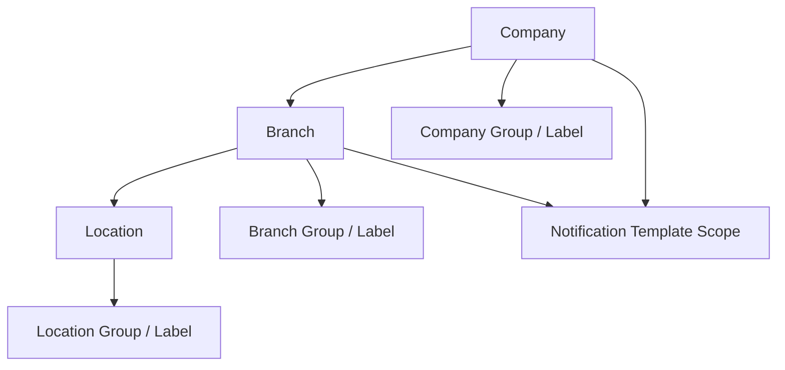

## Purpose and Overview

The **Organisation Applet** is the core master-data applet for setting up the structure that many other BigLedger applets rely on. It is where teams define the legal company, operating branches, physical or operational locations, reusable classification records, and notification templates that shape downstream finance, stock, operations, and messaging workflows.




**Core Concept**: Create **Company** first, then **Branch**, then **Location**. Most advanced setup happens after you save and reopen the record in edit mode.


## Key Features Overview

### Who Benefits from This Applet?

**System Administrators:**
- Create and maintain the organisation structure used across applets
- Control field visibility and default selections
- Manage reusable group, label, and category master data
- Review route-based admin pages such as release notes and feature visibility

**Finance & Back-Office Teams:**
- Maintain company registration, tax, chart-of-account, and contact details
- Complete company-level tabs such as Tax, Labels, Knock Off Config, and Intercompany Configuration
- Manage active and closed organisation records with the correct status behavior

**Operations Teams:**
- Set up branches and locations used by day-to-day operational workflows
- Manage branch marketplace, settlement, pick-pack, and linked location setup
- Maintain branch and location labels for operational filtering and organization

**Integration & Messaging Teams:**
- Configure notification templates by document type and action
- Manage placeholders, languages, endpoints, and company or branch scope
- Review conditional e-invoice and Peppol-related company tabs where enabled

### What Problems Does This Solve?

**The Disconnected Organisation Setup Problem:**

Without a single organisation applet, teams usually maintain company, branch, and location details in different places. That creates inconsistent defaults, broken downstream setup, duplicate classification records, and confusion about which record should be created first.

**The Organisation Applet Solution:**

- **Single source of structure** - Company, Branch, and Location are managed in one applet
- **Reusable classification records** - Groups, Labels, and Category Group support cleaner organization
- **Post-save administration** - Edit screens expose the richer configuration users actually need
- **Document messaging support** - Notification templates include placeholders, languages, endpoints, and scope controls
- **Controlled defaults** - Applet-level and user-level defaults reduce repetitive setup in daily work

## Key Features Overview


  

  

  

  

  

  




## Key Concepts

### Understanding the Organisation Framework

The organisation structure in this applet is built around three main record levels plus supporting master data.

| Level | Record | What it controls | Example |
|-------|--------|------------------|---------|
| **1** | **Company** | Legal identity, financial defaults, tax, company-wide links | BigLedger Sdn. Bhd. |
| **2** | **Branch** | Operating unit, settlement setup, marketplace setup, branch links | KL HQ, Penang Branch |
| **3** | **Location** | Physical or operational site, branch association, stock-related setup | Warehouse A, Outlet 2 |
| **Support** | **Groups, Labels, Category Group, Notification Template** | Classification, reusable metadata, and messaging scope | VIP Label, CP_COM Category Group |


**Real-World Example**: A company creates **BigLedger Sdn. Bhd.** as the main legal entity, adds **KL HQ** as a branch, then creates **Main Warehouse** as the location under that branch. After that, the team can add labels, defaults, and notification templates on top of the core structure.


### Organisation Hierarchy Structure

Think of the organisation setup as a structured chain:

```text
Organization (Tenant)
|
|-- Company
|   |-- Branch
|   |   |-- Location
|   |-- Branch
|       |-- Location
|
|-- Company Group
|-- Company Label
|-- Branch Group
|-- Branch Label
|-- Location Group
|-- Location Label
|
|-- Category Group
|
`-- Notification Template
```

**Flow Through the Hierarchy:**

1. **Company**: Establish the legal and accounting record
2. **Branch**: Create the operating unit under the company
3. **Location**: Add the physical or operational site under the branch
4. **Groups and Labels**: Add reusable classification records
5. **Notification Template**: Define document-driven communication scope

This structure helps BigLedger applets share:
- **Default company, branch, and location context**
- **Tax and chart-of-account references**
- **Operational branch and location links**
- **Reusable grouping and labeling metadata**
- **Document notification scope by company or branch**

### The "Golden Chain" of Organisation Setup

To manage the applet well, users need to understand how **Company**, **Branch**, and **Location** work together.

| Record | Simple meaning | Why it matters | Example |
|--------|----------------|----------------|---------|
| **Company** | The legal and financial home | Holds main company identity, tax, chart-of-account, and company-level links | BigLedger Sdn. Bhd. |
| **Branch** | The operating unit | Holds branch-level operations, settlement, marketplace, and linked records | KL HQ |
| **Location** | The execution point | Holds physical or operational location details and stock-related links | Main Warehouse |

**How they link:**
1. Create the **Company** first.
2. Create the **Branch** under that company.
3. Decide whether the branch should create a default location or reuse an existing one.
4. Create or link the **Location**.
5. Add classification records and notification scope after the core structure exists.

---

## Quick Start Guide

Get up and running quickly with these essential workflows.

### For Admins: Create Your First Company

**Goal:** Create the main company record and unlock the company-level configuration tabs.



1. Go to **Company**. This is the default landing page of the applet.
2. Click **Create**.
3. Complete the **Details** tab with fields such as **Company Code**, **Company Name**, **Company Registration No.**, **Company Incorporation Date**, **Currency**, and **Chart of Account**.
4. Complete the **Address** tab.
5. Click **Save**.
6. Reopen the saved company to access additional tabs such as **Tax**, **Branch**, **Location**, **Labels**, **Knock Off Config**, **Employee**, **Engagement Access**, **Intercompany Configuration**, and conditional **E-Invoice** or **Peppol Config**.

**What happens next?** The company becomes the parent record used by branch and location setup.

**Pro Tip:** The **Company Listing** loads **ACTIVE** records by default, and keyword searches shorter than 3 characters are rejected.

---

### For Operations Teams: Add Branches and Locations

**Goal:** Build the operating structure under the selected company.



1. Go to **Branch** and click **Create**.
2. In **Details**, choose whether to **Create default location** or **Choose from existing location**.
3. Fill in **Branch Code**, **Branch Name**, **Company Name**, **Branch Commencement Date**, and the other required branch fields.
4. Complete the **Address** tab and use the **Marketplace** tab if marketplace setup is needed during branch creation.
5. Save the branch, then reopen it to work with **Pick Pack**, **Marketplace**, **Location**, **Settlement**, **Labels**, **Extension**, **Customer**, **Employee**, **Supplier**, and **Intercompany Configuration**.
6. Go to **Location**, create the location with **Location Code**, **Location Name**, **Company Name**, **Branch Name**, **Location Commencement Date**, and **Location Class**, then save and reopen it if you need **Branch**, **Labels**, **Extension**, or **Intercompany Configuration**.

**What happens next?** Your company now has the branch and location structure needed for operational and stock-related workflows.

**Pro Tip:** The **Parent Branch** selector and **XTN mapping** fields only appear when the related field settings are enabled.

---

### For Finance & Back-Office Teams: Complete Company Setup

**Goal:** Finish the company-level information and defaults that other applets depend on.

1. Open the saved company in **Edit** mode.
2. Review **Details** for fields such as **Main Branch**, **Entity**, **Status**, and **Company Closed Date** when the company is closed.
3. Complete company-specific tabs such as **Tax**, **Address**, **Labels**, **Knock Off Config**, **Engagement Access**, and **Intercompany Configuration**.
4. If enabled in the build, review **E-Invoice** and **Peppol Config**.
5. Open **Settings -> Default Selection** to preselect the default branch and location for the applet.

**What happens next?** The company structure becomes more consistent for downstream finance and operational applets.

---

### For Integration & Messaging Teams: Configure a Notification Template

**Goal:** Create a notification template with the correct type, language, and scope.

1. Open **Notification Template** and click **Create**.
2. Complete the **Template** tab with **Code**, **Name**, **Notification Type**, **Document Type**, **Action**, and optional dates.
3. Select **Notification Type** first so the **Languages** tab becomes usable.
4. Add supporting configuration in **Placeholders**, **Languages**, **Endpoints**, **Company**, and **Branch**.
5. Save the template.

**What happens next?** The template can be used by supported document workflows with the selected company or branch scope.

**Pro Tip:** The **Notification Type** options are `WHATSAPP`, `SMS`, and `EMAIL`.

---


**New to the system?** Start with the basics:
1. Create the **Company**
2. Add the **Branch** and **Location**
3. Review **Configuration & Settings**
4. Add labels, category groups, and notification templates after the core structure is stable


---

## Core Organisation Setup

### What is the Organisation Hierarchy?

The core setup area is where users create the three records that anchor the rest of the applet: **Company**, **Branch**, and **Location**. These records are not equal. Company is the parent legal record, Branch is the operating unit under the company, and Location is the physical or operational site tied to the company and branch.

### Company - Your Legal and Accounting Base

Manage company master records and their linked company-level configuration.



**Listing View:**
- Title: **Company Listing**
- Search supports **Company Name** and **Company Registration Number**
- Keyword searches shorter than 3 characters are rejected
- The listing loads **ACTIVE** companies by default
- Columns include:
  - **Company Code**
  - **Company Name**
  - **Co. Registration Number**
  - **Company Inc. Date**
  - **Status**
  - **Created Date**
  - **Modified Date**

**Create View Tabs:**

| Tab | What users do there |
|-----|---------------------|
| **Details** | Enter company code, name, registration number, incorporation date, tax and SST IDs, phone and fax numbers, currency, website, email, description, abbreviation, chart of account, return pricing options, rounding options, group discount item, and upload logo. |
| **Address** | Enter address lines, postal code, city, country, and state. |

**Edit View Tabs:**



| Tab | What users see |
|-----|----------------|
| **Details** | Main company fields plus **Main Branch**, **Entity**, **Default Timezone**, **Chart of Account**, rounding and group-discount defaults, return-pricing defaults, **Status**, and **Company Closed Date** when the company is closed. |
| **E-Invoice** | Company e-invoice details when the tab is available in the current build. |
| **Peppol Config** | Nested tabs for **Peppol Registration**, **Peppol Ids**, and **Notification Config**. |
| **Address** | Company address maintenance. |
| **Tax** | Nested **Sales** and **Purchase** subtabs for default tax-code and inclusive-tax setup. |
| **Branch** | Company-scoped branch listing showing **Branch Code**, **Branch Name**, and **Status**. |
| **Location** | Company-scoped location listing showing **Location Code**, **Location Name**, and **Status**. |
| **Labels** | Company label listing with **Label Code**, **Label Name**, **Description**, **Modified Date**, and **Status**. |
| **Knock Off Config** | Nested **Knock Off** tab for source-target document knock-off rules. |
| **Employee** | Company employee listing with employee name, code, email, and status. |
| **Engagement Access** | Company-to-company access listing showing accessible company code and name. |
| **Intercompany Configuration** | Company intercompany listing with **Company Code**, **Config Name**, **Config Code**, **Mode**, **Source Gendoc**, and **Target Gendoc**. |

**Company Workspace: What users can do and what it affects**

| Company tab | What users can do | What it affects |
|-----|---------------------|----------------|
| **Details** | Maintain company identity, registration, contact, timezone, currency, chart-of-account, main branch, entity link, return-pricing defaults, rounding setup, group-discount item, logo, and status. | Controls the core company header and several default values reused by downstream finance, organisation, and document workflows. |
| **E-Invoice** | Maintain company e-invoice details when the tab is enabled in the build. | Affects whether company-level e-invoice setup is available for supported invoicing workflows. |
| **Peppol Config** | Create or edit Peppol participant registration records, maintain company Peppol participant IDs, choose the default Peppol ID, and toggle notification channels such as **Peppol**, **Email**, **UCC Channels**, and **Customer Portals**. | Affects Peppol onboarding status, which participant ID is used as the company default, and which notification channels are stored for e-invoice or Peppol-related flows. |
| **Address** | Maintain the company address. | Affects the address stored on the company record and used in company-facing documents or references. |
| **Tax** | Use the **Sales** and **Purchase** subtabs to assign default tax codes and decide whether tax is inclusive on each side. | Affects the company-level default tax behavior applied in downstream sales and purchase flows. |
| **Branch** | Review the company-filtered branch list, add a new branch from the company context, or open a branch row in the full branch workspace. | Affects which branches are attached to the company and helps users manage branch setup without leaving the company context. |
| **Location** | Review the company-filtered location list, add a new location from the company context, or open a location row in the full location workspace. | Affects which locations sit under the company structure and helps users manage locations from the company context. |
| **Labels** | Review labels already linked to the company and open linked label records for maintenance. | Affects company classification, filtering, and any workflow that depends on company labels. |
| **Knock Off Config** | Add, edit, delete, or enable knock-off rules by **Flow Type**, **Server Doc Type 1**, and **Server Doc Type 2**. The applet also prevents conflicting active KO rules for the same source document across certain internal GRN and GRN-stock-in targets. | Affects how matching or knock-off logic behaves for company-level document-flow combinations. If a KO rule is enabled here, downstream matching behavior follows this configuration. |
| **Employee** | Review linked employees with employee name, code, email, and status, then add or edit company employee links. | Affects which employee records are associated with the company in linked workflows. |
| **Engagement Access** | Add another company to the accessible-company list, review which companies are currently accessible, or remove an access link from the detail screen. | Affects which other company records are reachable through engagement-access linking. |
| **Intercompany Configuration** | Create or edit company intercompany configurations with config name, config code, mode, and source or target gendoc mapping, then copy those configurations to company branches. | Affects company-level intercompany behavior and provides the branch-level starting point when configs are copied down. |


**Recommended company setup order**
Save **Details** and **Address** first, then complete **Tax**. Only after the company header is stable should you move to **Branch**, **Location**, **Labels**, **Knock Off Config**, **Engagement Access**, or **Intercompany Configuration**.



**What users should expect**
The company **Create** screen is only the starting point. Most company-specific administration appears after the record is saved and reopened in **Edit** mode.


### Branch - Your Operating Unit

Manage branch master records and branch-level operational configuration.

**Listing View:**



- Title: **Branch Listing**
- Search supports **Company** and **Branch Name**
- Keyword searches shorter than 3 characters are rejected
- The listing loads **ACTIVE** branches by default
- Columns include:
  - **Branch Code**
  - **Branch Name**
  - **Company Name**
  - **Description**
  - **Status**
  - **Creation Date**
  - **Modified Date**

**Create View Tabs:**

| Tab | What users do there |
|-----|---------------------|
| **Details** | Choose whether to create a default location or use an existing location, then maintain branch code, branch name, company, company registration number, optional parent branch, optional XTN mapping fields, commencement date, branch contact fields, and other branch details. |
| **Address** | Maintain the branch address. |
| **Marketplace** | Maintain marketplace-related setup during creation when needed. |


**Create default location vs. Choose from existing location**

This is the first decision to make when creating a branch:

| Option | What it does | When to use it |
|--------|--------------|----------------|
| **Create default location** | Automatically creates a new, linked location record when the branch is saved. | Use when the branch needs a brand-new location immediately. |
| **Choose from existing location** | Links the branch to a location record that already exists in the system. | Use when a location has already been created and should not be duplicated. |

If the location fields feel unpopulated, complete the **Company Name** field first — the dependent dropdowns will load correctly after that.


**Edit View Tabs:**



| Tab | What users see |
|-----|----------------|
| **Details** | Main branch fields plus **Default Entity Branch**, **Main Location**, **Delivery Location**, **Default Pricing**, **Status**, **Branch Closed Date**, and operational fields such as GPS, opening hours, tax-applicable, store-locator, rounding, and logo. |
| **Address** | Branch address maintenance. |
| **Pick Pack** | Checkboxes for delivery quantity balance behavior on Sales Order (Internal), sales invoice, and delivery order. |
| **Marketplace** | Marketplace integration workspace with nested tabs for **Details**, **Settlement**, **Stock Configuration**, **Stock Availability**, **Pricing Scheme**, and **Publish Item**. |
| **Location** | Branch-linked location listing showing **Location Code**, **Location Name**, and **Status**. |
| **Settlement** | Branch settlement-method link listing with settlement code, name, type, and status. |
| **Labels** | Branch label listing with label code, name, description, modified date, and status. |
| **Extension** | Branch extension listing showing active non-JSON extension rows by param code, value string, and param type. |
| **Customer** | Customer-branch link listing with customer code, name, and status. |
| **Employee** | Employee-branch link listing with employee code, name, and status. |
| **Supplier** | Supplier-branch link listing with supplier code, name, and status. |
| **Intercompany Configuration** | Branch intercompany listing with branch code, config name, config code, mode, and source or target gendoc. |

**Branch Workspace Beyond Marketplace**

| Branch tab | What users can do | What it affects |
|-----|---------------------|----------------|
| **Details** | Maintain branch identity, company link, parent branch, entity branch, main and delivery locations, currency, default pricing, branch references, CP Commerce store-locator flag, GPS, opening hours, tax-applicable flag, remarks, rounding setup, group-discount item, skip-e-invoice flag, logo, status, and closed-date information. | Controls the core branch record and several operational defaults reused by downstream branch-aware workflows, storefront behavior, and branch-specific document processing. |
| **Address** | Maintain the branch address and contact location details. | Affects the address stored for the branch and used in branch-related records. |
| **Pick Pack** | Turn on delivery quantity balance checks for **Sales Order (Internal)**, **Sales Invoice (Internal)**, and **Delivery Order (Internal)**. | Affects whether those internal transaction flows enforce delivery quantity balance rules for the branch. |
| **Location** | Review the branch-linked location list, add a location link, or open a linked location in its location workspace. | Affects which locations are attached to the branch structure and which location records users treat as part of that branch. |
| **Settlement** | Link or remove settlement methods for the branch and review settlement code, name, type, and link status. | Affects which general settlement methods are associated with the branch outside the marketplace-specific settlement selection. |
| **Labels** | Review linked branch labels and open the linked label records for maintenance. | Affects branch classification, filtering, and any logic that depends on branch labels. |
| **Extension** | Add or edit active extension rows by **Param Code**, **Value String**, and **Param Type**. JSON-type rows are not shown in this listing. | Affects tenant-specific or extension-driven branch behavior that depends on branch extension values. |
| **Customer** | Link customers to the branch, review linked customer code and name, and remove unwanted links. | Affects which customer records are associated with the branch in linked workflows. |
| **Employee** | Link employees to the branch, review linked employee code and name, and remove unwanted links. | Affects which employee records are associated with the branch in linked workflows. |
| **Supplier** | Link suppliers to the branch, review linked supplier code and name, and remove unwanted links. | Affects which supplier records are associated with the branch in linked workflows. |
| **Intercompany Configuration** | Create or edit branch intercompany configs, choose config name and code, set auto or manual execution options, turn on mapping pairs such as sales invoice to purchase invoice or purchase order to sales order, and copy company configs into the branch when needed. | Affects branch-level intercompany automation and manual intercompany document behavior in linked stock or finance workflows. |

**Marketplace Details Highlights:**
- The **Marketplace Type** dropdown includes values such as **None**, **Lazada**, **Shopee**, **CP Commerce**, **Magento**, **Selluseller**, **Samsung BOPIS**, **Anchanto OMS**, **Shopify**, and **Tiktok**
- Some marketplace choices reveal additional authorization or token fields
- Pricing scheme management includes **No Pricing**, **Syncing**, and **Synced** views

**Marketplace Workspace: What users can do and what it affects**

| Marketplace tab | What users can do | What it affects |
|-----|---------------------|----------------|
| **Details** | Select the marketplace type, complete marketplace-specific authorization or token setup, choose the default entity, and enable **Seller Order Allocation Queue** for **CP Commerce** when needed. | Controls which marketplace the branch connects to, whether the branch shows as authorized for that marketplace, which entity is used as the default marketplace entity, and whether seller-order allocation queue behavior is enabled for CP Commerce. |
| **Settlement** | Select the marketplace settlement method for the branch. | Saves the marketplace settlement method on the branch record and affects how marketplace-related settlement or payment handling is tied back to the branch. |
| **Stock Configuration** | Set the stock configuration type, choose stock mode, maintain manual stock balance or buffer logic, decide whether to use **Buffer Numbers** or **Stock Balance Percentage**, decide whether to overwrite item config, and configure the sales-order handling type. | Affects how the branch calculates marketplace stock balance, whether branch-level stock rules override item-level rules, what buffer method is used, and how sales-order activity influences stock exposed to marketplace flows. |
| **Stock Availability** | Review item-level marketplace balances, sales-order counts, and buffer-based availability results. | This is mainly a monitoring view. It shows the resulting stock picture after the stock configuration rules are applied for the branch. |
| **Pricing Scheme** | Choose the branch's default pricing scheme, run **Sync**, and review the **No Pricing**, **Syncing**, and **Synced** states. | Affects which pricing scheme is treated as the default marketplace price source for the branch and which item price updates are waiting, syncing, or already synced. |
| **Publish Item** | Select item category and item category group labels, link them to the branch marketplace setup, and run the branch item insert queue. | Affects which item/category labels are prepared for marketplace publishing and which branch items are inserted into the publish queue for downstream processing. |


**Important distinction**
The nested **Marketplace -> Settlement** tab is for the marketplace-specific settlement selection. The separate outer **Settlement** tab is for the branch's broader settlement-method linking.



**Conditional branch fields**
The **Parent Branch** selector and **`XTN_MAPPING_01` to `XTN_MAPPING_05`** fields only appear when the corresponding field settings are enabled.



**Recommended branch setup order**
Finish **Details** and **Address** first, confirm the correct **Main Location** and **Delivery Location**, then move to **Location**, **Settlement**, and linked master records such as **Customer**, **Employee**, **Supplier**, or **Labels**. Use **Marketplace** and **Intercompany Configuration** only after the branch core setup is stable.


### Location - Your Physical or Operational Site

Manage location master records and location-level linking or configuration.

**Listing View:**



- Title: **Location Listing**
- Search supports **Company Name**, **Location Name**, and **Status**
- Keyword searches shorter than 3 characters are rejected
- The default search behavior includes both **ACTIVE** and **INACTIVE** locations unless the user applies a status filter
- Columns include:
  - **Location Code**
  - **Location Name**
  - **Company Name**
  - **Description**
  - **Status**
  - **Creation Date**
  - **Modified Date**

**Create View Tabs:**



| Tab | What users do there |
|-----|---------------------|
| **Details** | Maintain location code, location name, company, branch, company registration number, commencement date, phone number, description, and **Location Class**. |
| **Address** | Maintain address lines, postal code, city, country, and state. |

**Edit View Tabs:**



| Tab | What users see |
|-----|----------------|
| **Details** | Main location fields plus company and branch links, contact details, currency, **Location Class**, **Outlet Size**, **Outlet Type**, **Status**, and **Location Closed Date** when the location is closed. |
| **Address** | Location address maintenance. |
| **Branch** | Branch-link listing for the selected location with **Branch Code**, **Branch Name**, and **Status**. |
| **Labels** | Location label listing with **Label Code**, **Label Name**, **Description**, **Modified Date**, and **Status**. |
| **Extension** | Location extension listing showing active non-JSON extension rows by param code, value string, and param type. |
| **Intercompany Configuration** | Intercompany stock configuration listing for target locations. |

**Location Workspace: What users can do and what it affects**

| Location tab | What users can do | What it affects |
|-----|---------------------|----------------|
| **Details** | Maintain location identity, company and branch links, commencement date, mobile, phone, fax, email, currency, description, status, location class, outlet type, outlet size, and closed-date information. | Controls how the location is defined, classified, contacted, and linked into the organisation structure. |
| **Address** | Maintain the location address. | Affects the address stored on the location record. |
| **Branch** | Review branch links for the location, add a branch link, or open a linked branch from the location context. | Affects which branch relationship is attached to the location and helps users manage branch-location linkage from the location side. |
| **Labels** | Review linked location labels and open linked label records for maintenance. | Affects location classification and filtering based on labels. |
| **Extension** | Add or edit active location extension rows by **Param Code**, **Value String**, and **Param Type**. | Affects custom or extension-based location data used by tenant-specific workflows. |
| **Intercompany Configuration** | Link, review, or remove target-location intercompany stock configuration rows. | Affects location-level intercompany stock behavior in linked workflows. |

**Location Class Options:**

When creating a location, the **Location Class** dropdown determines **what kind of location** this represents:

| Class | Full Name | What it means | When to use it |
|-------|-----------|---------------|----------------|
| **BASIC** | Basic (Standard Location) | A **real, physical location** owned and operated by your company — such as a warehouse, retail outlet, office, or distribution center. This is where your company's own stock is stored and managed. | Use for all standard company-owned locations: head office, branch warehouse, retail store, factory, etc. **This is the default for most setups.** |
| **CCSG** | Consignment | A **consignment location** — a temporary or virtual holding point representing stock that is physically at a **customer's or supplier's premises**, but the ownership hasn't fully transferred yet. These are not "real" company locations in the traditional sense. | Use when setting up **Customer Consignment Locations** (your stock held at a customer's site for them to sell/use) or **Supplier Consignment Locations** (a supplier's stock held at your site that you haven't purchased yet). |


**Understanding Consignment (CCSG)**: In a consignment arrangement, stock moves to another party's site but ownership stays with the original party until the stock is sold or consumed. For example, if you send 100 units of product to a retailer's shop but they only pay you when a unit is sold, you need a CCSG location to track that stock separately from your own warehouse inventory. The system uses consignment-specific document types (e.g., Customer Consignment In/Out, Supplier Consignment In/Out) to manage these stock movements.



**Status wording**
On the location edit screen, users see **ACTIVE** and **CLOSED** in the status dropdown. The underlying inactive value is handled by the applet logic.


### Common Scenarios

**Opening a New Branch:**
- Create the branch under the correct company
- Decide whether the branch should create a default location immediately
- Reopen the branch if you need marketplace, settlement, or linked-record setup

**Adding a New Location to an Existing Branch:**
- Create or open the location from **Location**
- Set the correct company and branch
- Reopen the location if you need branch links, labels, extension, or intercompany setup

**Closing an Existing Record:**
- Company and Branch use **CLOSED** status in edit view
- Location shows **CLOSED** to users even though the underlying inactive value is handled internally
- Closed records may not appear in the default active-only listing views

### Tips for Admins

- Treat **Create** as the minimum data-entry screen and **Edit** as the full setup workspace
- Expect **Company** and **Branch** listings to default to active rows
- Use structured filters first when keyword search is too short or too strict
- Finish the core hierarchy before adding labels, category groups, or notification scope

---

## Supporting Master Data

### Category Group

Manage category-group master records and their category members.

**Listing View:**
- Title: **Category Group Listing**
- Search uses the category-group search model and also rejects keywords shorter than 3 characters
- The listing is a code, name, status, and date grid, although some headers in the current build still use branch-oriented wording

**Create View Tabs:**

| Tab | What users do there |
|-----|---------------------|
| **Main** | Maintain **Category Group Code**, **Category Group Name**, **Type**, **Param Code**, **Param Name**, and **Status**. |

**Type Options:**
- `CP_COM`
- `DOC_ITEM`

**Status Options:**
- `ACTIVE`
- `INACTIVE`

**Edit View Tabs:**

| Tab | What users see |
|-----|----------------|
| **Main** | The same category-group fields plus created or modified metadata and remove action. |
| **Categories** | Category records maintained under the selected category group. |

**Category Group Workspace: What users can do and what it affects**

| Category Group tab | What users can do | What it affects |
|-----|---------------------|----------------|
| **Main** | Maintain the category-group header such as code, name, type, param fields, and status. | Controls the category-group master record used for grouped categorization. |
| **Categories** | Add or maintain categories under the selected category group. | Affects which categories are available under that category group, including the deeper image-management flow tied to category maintenance. |


The deeper category editing flow also includes image-management components, so this area is broader than a single code-and-name form.


### Company, Branch, and Location Groups

Use group records when you need reusable classification masters without attaching them directly to a single company, branch, or location record.

**Group Records Available:**

| Group record | Main fields |
|--------------|-------------|
| **Company Group** | **Company Group Code**, **Company Group Name**, **Description** |
| **Branch Group** | **Branch Group Code**, **Branch Group Name**, **Description** |
| **Location Group** | **Location Group Code**, **Location Group Name**, **Description** |

**Listing Behavior:**
- Searchable grid with create action
- Code, name, status, and date style columns
- In the current build, some **Company Group** listings still use label-oriented column wording

**Create / Edit View:**

| Tab | What users do there |
|-----|---------------------|
| **Details** | Maintain the group code, group name, and description. Edit view also shows created or modified metadata where applicable. |

**What a Group affects**
- A **Group** creates the reusable master bucket for classification.
- It does not usually tag a record by itself until related labels or links are used.
- It helps standardize how company, branch, or location records are organized.

### Company, Branch, and Location Labels

Use labels when you need reusable tags that can optionally be linked to the corresponding group type.

**Label Records Available:**

| Label record | Main fields |
|--------------|-------------|
| **Company Label** | **Company Label Code**, **Company Label Name**, optional **Company Group**, **Description** |
| **Branch Label** | **Branch Label Code**, **Branch Label Name**, optional **Branch Group**, **Description** |
| **Location Label** | **Location Label Code**, **Location Label Name**, optional **Location Group**, **Description** |

**Listing Behavior:**
- Searchable grid with create action
- Code, name, status, and date style columns
- **Company Label** explicitly uses the title **Company Label Listing**

**Create / Edit View:**

| Tab | What users do there |
|-----|---------------------|
| **Details** | Maintain the label code, label name, optional related group, and description. |

**What a Label affects**
- A **Label** is the reusable tag that can be linked to the matching record type.
- Linking a label to a **Group** keeps the label structure organized.
- Labels affect filtering, classification, and record organization more directly than groups.


**Group vs Label**
Use a **Group** when you need the classification master. Use a **Label** when you need the actual reusable tag that users can assign or link within the organisation workflow.


### Notification Template



Manage notification templates and their supporting configuration.

**Listing View:**
- Title: **Notification Template Listing**
- Search model supports **Modified Date** and **Status**
- The listing searches `Code` and `Name` through the template query
- The listing loads **ACTIVE** templates by default
- Columns include:
  - **Code**
  - **Name**
  - **Notification Type**
  - **Document Type**
  - **Action**
  - **Creation Date**
  - **Modified Date**
  - **Status**

**Create / Edit View Tabs:**

| Tab | What users do there |
|-----|---------------------|
| **Template** | Maintain **Code**, **Name**, **Notification Type**, **Document Type**, **Action**, **Start Date**, and **End Date**. |
| **Placeholders** | Create, edit, and delete template placeholders. |
| **Languages** | Maintain template language records. |
| **Endpoints** | Link communication endpoints and channels. |
| **Company** | Scope the template to companies. |
| **Branch** | Scope the template to branches. |

**Template Details Users Will See:**
- **Notification Type** options: `WHATSAPP`, `SMS`, `EMAIL`
- **Document Type** is a long selectable list of supported document codes
- The **Languages** tab is visually blocked until **Notification Type** is selected

**Notification Template Workspace: What users can do and what it affects**

| Notification Template tab | What users can do | What it affects |
|-----|---------------------|----------------|
| **Template** | Define the template header record with code, name, notification type, document type, action, and optional active dates. | Controls when the template is identifiable, what document flow it belongs to, and whether it is valid for the selected notification scenario. |
| **Placeholders** | Create, edit, or delete placeholders used by the template. | Affects what dynamic data fields can be inserted into notification content. |
| **Languages** | Maintain language-specific content sections for the template. | Affects multilingual notification content such as header, body, footer, and attachment-related content. |
| **Endpoints** | Link communication endpoints and channels. | Affects where and how the notification can be delivered. |
| **Company** | Link the template to selected companies. | Affects which companies can use the template scope. |
| **Branch** | Link the template to selected branches. | Affects which branches can use the template scope. |


**Recommended workflow**
Start with the **Template** tab, choose the **Notification Type** first, then move on to **Languages**, **Placeholders**, and the company or branch scope tabs.


---

## Configuration & Settings

### Field Settings (`Settings > Field Settings`)



The visible settings menu in the current sidebar includes **Field Settings** and **Default Selection**. The field-settings screen is intentionally narrow and exposes only a small set of toggles.

| Area | What users can change |
|------|------------------------|
| **Company -> Main Details** | `HIDE_SIC_CODE_AND_BUSINESS_ACTIVITY_DESCRIPTION` |
| **Branch -> Main Details** | `XTN_MAPPING_01`, `XTN_MAPPING_02`, `XTN_MAPPING_03`, `XTN_MAPPING_04`, `XTN_MAPPING_05`, `SHOW_PARENT_BRANCH` |

The **Address** tabs exist in the field-settings layout, but they are currently empty in this build.

**What Field Settings affects**
- It controls whether specific optional fields appear in the applet screens.
- It does not create new business records by itself.
- Users may need to reopen the target screen before the change is obvious.

### Default Selection (`Settings > Default Selection`)

Applet-level defaults currently include:

| Setting | Purpose |
|---------|---------|
| **Default Branch** | Preselect a branch in the applet |
| **Default Location** | Preselect a location in the applet |

**What Default Selection affects**
- It changes the branch and location context the applet preselects.
- It helps reduce repeated manual selection during daily setup work.
- It affects convenience and consistency, not the master record itself.

### Additional Route-Based Admin Pages

The applet route tree also includes admin pages such as:
- **Outlet Type**
- **Outlet Size**
- **Webhook**
- **Feature Visibility**
- client-side and role-based permission pages
- **Release Notes**

These are route-defined, but they are not part of the basic sidebar settings menu for every user.

**Release Notes currently mention:**
- **Version 1.49 (2025-09-26)**: fixed advanced-search issues in Company, Branch, and Location; removed date and status filters from advanced search
- **Version 1.02 (2025-09-23)**: moved Company, Branch, and Location modules to `aggrid-custom`

---

## Personalization

### Default Selection (`Personalization > Default Selection`)

User-level defaults currently include:

| Setting | Purpose |
|---------|---------|
| **Default Branch** | Your personal default branch |
| **Default Location** | Your personal default location |
| **Default Language** | Your personal default language |

**What Personal Default Selection affects**
- It changes your own default branch, location, and language context.
- It does not change the applet-wide defaults for other users.
- It helps personalize the starting context when you open or use the applet.


The personalization route tree in the current build defines **Personal Default Selection** and **Sidebar**. If you see other personalization menu items, their availability is build-dependent.


---

## FAQ

### Why can I not find my record in search?

Some organisation listings are stricter than they first appear:
- **Company**, **Branch**, **Location**, and **Category Group** reject keyword searches shorter than 3 characters
- **Company** and **Branch** listings load **ACTIVE** rows by default
- **Location** includes both **ACTIVE** and **INACTIVE** by default unless a status filter is applied

Use the structured filters first, then add a longer keyword when needed.

### Why is my company or branch missing from the default listing?

The record may have been moved to **CLOSED** status.

Check:
1. Whether the status was changed in edit view
2. Whether the listing shows only active rows by default
3. Whether the record has a populated **Closed Date**

### Should I create a default location or choose an existing one when I create a branch?

Choose **Create default location** when the branch should own a fresh location immediately. Choose **Choose from existing location** when the location already exists and should be linked to the branch.

If the branch form feels confusing, complete the company selection first so the dependent fields can populate correctly.

### Why can I not use the Languages tab in Notification Template?

The **Languages** tab stays blocked until you select **Notification Type** on the **Template** tab. Go back to **Template**, choose the notification type, then return to **Languages**.

### What is the difference between a Group and a Label?

A **Group** is the reusable classification master. A **Label** is the reusable tag that can optionally sit under that group.

In practice:
- create the **Group** when you need the category structure
- create the **Label** when you need something users can actually assign or link more directly

### What is the difference between the Company tab Branch list and the sidebar Branch screen?

The **Company -> Branch** tab shows branch records in the context of the selected company. The sidebar **Branch** screen is the full branch workspace for creating, editing, and configuring branch records directly.

Use:
- **Company -> Branch** when you want to review or manage branches from inside a company context
- **Branch** from the sidebar when you want the full branch setup workspace

### How does Knock Off Config work?

**Company -> Knock Off Config** stores company-level knock-off rules.

Each rule is built from:
- **Flow Type**
- **Server Doc Type 1** as the source document
- **Server Doc Type 2** as the target document

Users can:
- add a new KO rule
- edit an existing KO rule
- delete a KO rule
- turn the **Knock Off** toggle on or off

Use this tab only when your team already knows which document flows should be matched or knocked off automatically. It is not a general-purpose company setting.

### Why can I not enable a second Knock Off rule for the same source document?

The applet blocks certain conflicting KO combinations.

For some internal GRN or stock-in target document types, only one active KO path is allowed at a time for the same **Server Doc Type 1**. If another conflicting KO rule is already enabled, the applet shows a warning and turns the new toggle back off.

In practice, disable the old conflicting KO rule first, then enable the new one.

### What does Intercompany Configuration copy do?

There are two different copy behaviors:
- In **Company -> Intercompany Configuration**, the copy action pushes the company's intercompany setup down to company branches.
- In **Branch -> Intercompany Configuration**, the copy action pulls the company-level intercompany setup into the current branch.

Use the company copy when you want branches to start from the same company baseline. Use the branch copy when a specific branch still needs to inherit that baseline.

### What is the difference between Branch Settlement and Marketplace -> Settlement?

They are not the same setting.

- **Branch -> Settlement** links the branch to its general settlement methods.
- **Branch -> Marketplace -> Settlement** selects the settlement method used for the marketplace configuration of that branch.

If users update the wrong one, the branch may look correctly configured in one area but still behave incorrectly in marketplace settlement flows.

### What is Engagement Access used for?

**Company -> Engagement Access** controls which other companies are linked as accessible companies for the selected company.

Users normally use it to:
- add another company to the accessible-company list
- review which companies are already linked
- remove access that should no longer apply

It does not replace normal company creation. It is a cross-company access linkage.

### Does Publish Item send items to the marketplace immediately?

Not directly. The branch marketplace **Publish Item** area links the selected item category and group labels to the branch and can run the branch item insert queue.

That means:
- the selected items are prepared for downstream marketplace publishing
- the queue step is part of the publishing process
- users should not assume this tab alone means instant live publication

### Why do Parent Branch or XTN Mapping fields not appear?

Those fields are controlled by **Settings -> Field Settings**.

Enable:
- `SHOW_PARENT_BRANCH`
- the required `XTN_MAPPING_*` toggle

Then save the setting and reopen the branch screen.

### Why do settings or personalization menus look different between users?

Some pages exist in the route tree but are not shown to every user in the visible menu. Treat **Field Settings**, **Default Selection**, and **Personal Default Selection** as the baseline supported screens, and treat pages such as **Sidebar**, **Feature Visibility**, **Webhook**, permission pages, or release notes as deployment-dependent or permission-dependent.

### Why did changing stock configuration not change the item master directly?

The marketplace **Stock Configuration** tab controls branch-level marketplace stock behavior such as branch stock setting, buffer logic, and sales-order handling.

It is meant to affect marketplace-facing stock calculation for the branch. Users should treat it as branch marketplace configuration, not as a direct edit of every item master record.
