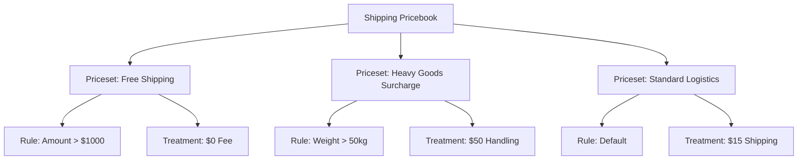

## Purpose and Overview

The **Shipping Pricebook Applet** is a sophisticated logistics engine designed to automate and standardize the calculation of shipping-related fees. In a modern trading or e-commerce environment, shipping costs are rarely static; they fluctuate based on delivery regions, item characteristics, customer profiles, and service levels.


**Core Concept**: The system allows you to define a hierarchy of **Pricebooks** and **Pricesets** that use complex **Rules** to trigger specific **Treatments** (Fees) automatically during document creation.


## Key Features Overview

### Who Benefits from This Applet?

**Logistics & Operations Managers:**
- **Automated Precision**: Eliminate manual fee entry errors and ensure consistent application of delivery charges.
- **Dynamic Surcharges**: Easily manage fluctuating costs like fuel surcharges or peak-season handling fees without changing base prices.
- **Zonal Control**: Define specific rates for different geographic regions (e.g., local delivery vs. international sea freight).

**Sales & Customer Service Teams:**
- **Real-time Quotes**: Instantly provide accurate shipping and handling costs to customers during the order process.
- **Policy Enforcement**: Automatically apply "Free Shipping" or discounted rates for VIP customers or high-value orders based on predefined rules.
- **Transparency**: Clear visibility into why specific fees were applied, reducing customer disputes.

**Finance & Accounting Teams:**
- **Full Cost Recovery**: Ensure that all logistics-related expenses (handling, fuel, transport) are captured and recovered from the customer.
- **Audit Integrity**: Maintain a complete audit trail of fee calculations for every transaction.
- **Revenue Protection**: Prevent under-billing caused by missing or outdated shipping rates.

### What Problems Does This Solve?

**The "Manual Shipping Guesswork" Problem:**
Traditional systems often rely on staff to "eye-ball" shipping costs. Common issues include:
- Inconsistent charging between different sales reps.
- Forgotten fuel surcharges leading to margin erosion.
- Difficulties in handling complex "if-this-then-that" shipping logic manually.

**The Shipping Pricebook Solution:**
- **Logic-Driven Fees** - Fees are triggered only when specific conditions (Rules) are met.
- **Priority Logic** - Multiple pricebooks can coexist, with the system intelligently selecting the most relevant one.
- **Multi-Layered Calculations** - Combine standard shipping, handling, and fuel surcharges into a single automated workflow.
- **Granular Control** - Apply rules at the Header (entire order), Multi-Line (item groups), or Single-Line (specific product) level.

## Key Features Inventory


  

  

  

  

  

  




---

## Key Concepts

### Understanding the Shipping Framework

Every shipping calculation must address three fundamental aspects. The Shipping Pricebook Applet provides structured handling:

| Aspect | Component | Practical Example |
|--------|-----------|------------------|
| **Who** is it for? | Pricebook Group | VIP Customers, Retail Outlets, International Dealers |
| **What** triggers it? | Rules Logic | If Region is "North America" AND Order Weight > 100kg |
| **How** is it charged? | Treatment Type | Flat $50 fee OR 5% of Transaction Amount |

---

### Pricebook Hierarchy Structure

Think of the shipping fee logic as a structured flow that narrows down from general categories to specific charges:



**Flow Through the Hierarchy:**

1.  **Pricebook**: The broad container (e.g., "B2B Standard Rates").
2.  **Priceset**: A specific scenario (e.g., "West Malaysia Distribution").
3.  **Rules**: The "If" conditions (e.g., "Must be Branch HQ").
4.  **Priority**: Lower numerical value = Higher precedence.
5.  **Treatment**: The final financial calculation logic.

---

### The "Golden Triangle" of Shipping Logic

To effectively manage the system, it is crucial to understand how **Rules**, **Priority**, and **Treatments** interact.

| Component | Analogy | Definition | Example |
|-----------|---------|------------|---------|
| **Rules** | The "Gatekeeper" | The specific conditions that must be true for a fee to apply. | **Region = "Sabah"** |
| **Priority** | The "Tie-Breaker" | Decides which rule wins if multiple match an order. | **Priority 1 vs Priority 100** |
| **Treatment** | The "Bill" | The actual math of the fee calculation. | **5% Fuel Surcharge** |

---

## Quick Start Guide

Get up and running quickly with these essential workflows.

### For Sales Team: Check Applied Fees

**Goal:** Understand why a shipping fee was applied to your order in 3 steps.

1.  **Open Document**: Go to your **Sales Order** or **Invoice**.
2.  **Review Header**: Look for the **Shipping Info** tab.
3.  **Check Details**: The system displays the active **Pricebook Header** and the breakdown of Shipping, Handling, and Fuel charges.

**Pro Tip:** If fees seem missing, verify that the **Customer Member Class** matches the rules in the active pricebook.

---

### For Logistics Managers: Create a Regional Surcharge

**Goal:** Add a $20 handling fee for all deliveries to "East Malaysia" in 5 steps.

1.  **Navigate**: Go to **Shipping Pricebook Listing** and open your primary pricebook.
    
2.  **Create Priceset**: Click **"+" (Add Priceset)** → Name it "East Malaysia Surcharge" → Set Priority to `50`.
    
3.  **Add Regional Rule**: 
    - Go to **Rules - Doc Hdr** tab.
    - Click **"Add Delivery Region Rule"**.
    - Select "Sabah" and "Sarawak" from the list.
4.  **Set Treatment**:
    - Go to **Treatment** tab.
    - Check **Handling Fee**.
    - Set Price Source to **Absolute** and Value to `20.00`.
5.  **Finalize**: Click **Create**.

---

### For Admins: Initial System Setup

**Goal:** Configure the foundational settings for the Shipping Pricebook engine.

1.  **Prepare Master Data**: Ensure all **Delivery Regions**, **Zonal Codes**, and **Member Classes** are up to date.
2.  **Toggle Applet Settings** (`Settings > Applet Settings`):
    - **Default Branch/Location**: Pre-fills origin data for new pricebooks.
    - **Visibility Rules**: Hide specific pricing fields if sales reps should only see the final total.
3.  **Validate Logic**:
    - Create a "Draft" Priceset with a high priority (e.g., `1`).
    - Attempt to create a mock Sales Order matching the draft rules.
    - Verify fees appear correctly before setting the Priceset to `Active`.

---

## Understanding the Rules Engine

The Applet provides layers of rules to handle every possible business scenario.

### 1. Header Rules (Doc Hdr)
Logic that applies to the entire document. Supported Rule Types:
- **Valid Date Range**: Trigger specific rates only during promotional periods.
- **Delivery Region**: Destination-based pricing (States, Cities, Postcodes).
- **Entity Rules**: Special rates for specific Member Classes, Member Labels, or Entity Types.
- **Corporate Rules**: Restrict pricebooks to specific Branches or Companies.
**Real-Life Example**: *Applying a "Holiday Shipping Surcharge" for orders originating from the "Kuala Lumpur" Branch during a specific Valid Date Range.*



### 2. Multi-Line Rules
Logic that checks for combinations of items across the entire cart. Supported Rule Types use item criteria but evaluate the order as a whole grouped entity:
- **Item Matches**: Group by specific Item, Item Category, or use Regex on Item Code/Name.
**Real-Life Example**: *Applying a fee if the total quantity of items matching the "Office Supplies" Item Category exceeds 10 units in the order.*



### 3. Single-Line Rules
Logic that applies individually to specific items within the cart. Supported Rule Types:
- **Item & Item Category**: Target explicit products or broad classes.
- **Regex Matching**: Code/Name matching via Item Code Regex, Item Name Regex, Category Code Regex, or Category Name Regex.
**Real-Life Example**: *Automatically adding a "Special Handling" fee if a specific "Glassware" item is detected in the cart, evaluated on a per-piece basis.*



---

## Regional Rules Deep Dive

The regional engine is the most common way to trigger shipping fees. It supports three levels of geographic granularity.

### How Regional Rules Work
When an order is created, the system checks the **Delivery Address** of the customer and maps it against the Rules in the active Priceset.

**Visual Example:**
```
Order Destination: 88000, Kota Kinabalu, Sabah
━━━━━━━━━━━━━━━━━━━━━━━━━━━━━━━━━━━━━━━
Rule A: State = Sabah (Match!)
Rule B: Postcode = 88xxx (Match!)
Rule C: Zone = East Malaysia (Match!)
```

### Real-World Scenarios

**Scenario 1: The "Free Shipping" Threshold**
```
Strategy: Give free shipping to Selangor customers for orders > RM 500.
Rule Logic: 
  - Rule 1 (Doc Hdr): Delivery Region = "Selangor"
  - Rule 2 (Doc Hdr): Transaction Amount > 500
Treatment: 
  - Standard Shipping = Absolute 0.00
Result: Orders meeting both criteria get RM 0 shipping fees automatically.
```

**Scenario 2: The Fuel Surcharge Adjustment**
```
Strategy: Apply 5% fuel surcharge to all heavy equipment shipments.
Rule Logic: 
  - Rule 1 (Single Line): Item Category = "Heavy Equipment"
Treatment: 
  - Fuel Surcharge = Multiply (0.05) against Transaction Amount
Result: Every heavy item in the cart adds 5% of its value to the Fuel Surcharge line.
```

---

## Configuration & Settings

### Creating a Shipping Pricebook

The pricebook serves as the master container for all subsequent policies.





| Field | Purpose | Example |
| :--- | :--- | :--- |
| **Code** | Unique ID for the pricebook | `DOMESTIC_STD_2024` |
| **Name** | Descriptive name for users | `Standard Domestic Rates` |
| **Status** | Controls if the engine uses this book | `ACTIVE` |
| **Icon** | Visual indicator on the dashboard | `airplane-outline` |



### Setting up a Priceset

Within each Pricebook, you build nested Pricesets representing unique scenarios.



| Field | Purpose | Importance |
| :--- | :--- | :--- |
| **Priority Level** | Order of execution | Critical: A Priceset with Priority 1 will override Priority 100. |
| **Rules Logic** | How rules combine | `AND` (All must match) vs `OR` (Any can match). |
| **Negation Logic** | Reverse the rule | `Enabled` means "Apply to everything EXCEPT the selected rule". |



### Understanding Treatment Calculations
After rules are matched, the system applies the configured **Treatments**. You can enable up to three distinct fee types per Priceset: **Standard Shipping Fee**, **Handling Fee**, and **Fuel Surcharge**. 

Each fee is calculated using a combination of **Price Sources** and **Operators**:



| Price Source | Operator Options | Real-Life Example |
| :--- | :--- | :--- |
| **Standard Amount** | Multiply, Absolute, Add, Subtract | Fixed $15 Standard Shipping Fee using `Absolute`. |
| **Base Quantity** | Multiply, Absolute, Add, Subtract | $2 Handling Fee per item, using `Multiply` by Quantity. |
| **Transaction Amount** | Multiply, Absolute, Add, Subtract | 5% Fuel Surcharge, using `Multiply` against Transaction Amount (*0.05*). |
| **Pricing Scheme** | N/A (Uses linked scheme table) | Complex weight-based logic reading from a dynamic Tier Scheme. |
| **Price Unit Cost / Net Amount**| Multiply, Absolute, Add, Subtract | Advanced margin-based freight adjustments. |

### Applet Integration & Permissions
The Shipping Pricebook Applet includes built-in settings for deeper system integration:
- **Webhooks**: Automatically push shipping fee calculations to external 3PL or e-commerce systems in real-time.
- **Feature Visibility**: Toggle specific pricing fields on/off depending on the user's role to simplify the interface.
- **Granular Permissions**: Control exactly who can view, create, or modify pricebooks using User, Team, and Role permission sets.
- **Field Settings**: Customize the mandatory/optional status of form fields to match your organization's workflow.

---

## FAQ

**Q1: What happens if two pricesets have the same priority?**
**A:** The system will select the first one created. It is **Best Practice** to always give unique priority numbers to avoid ambiguity.

**Q2: Can I charge a handling fee ONLY for fragile items?**
**A:** Yes. Use a **Single-Line Rule** targeting the "Fragile" item category. The handling fee will only be calculated for those specific items in the cart.

**Q3: Does the system support "Weight-Based" shipping?**
**A:** Yes, via the **Pricing Scheme** integration. You can map weight bands (e.g., $5 per kg) to the Treatment value.

**Q4: Can I test rules without affecting the entire company?**
**A:** Yes. Create a Priceset and add a **Member Class Rule** where the class is "UAT_TESTING". Only customers assigned that class will trigger the new rates.

**Q5: How are taxes handled on shipping fees?**
**A:** Shipping fees inherit the tax settings from the **G/L Account** and **Financial Item** they are mapped to in the Finance module.

---

## Summary

The **Shipping Pricebook Applet** transforms shipping from a manual guesswork process into a precise, automated financial control. By leveraging a hierarchy of rules and flexible fee treatments, BigLedger ensures your logistics team maintains healthy margins while providing transparent pricing to your customers.


**Implementation Tip**: Combine the Shipping Pricebook with the **Notification Applet** to alert your logistics manager whenever a "High-Priority" surcharge (e.g., Priority <10) is triggered on a large order.

