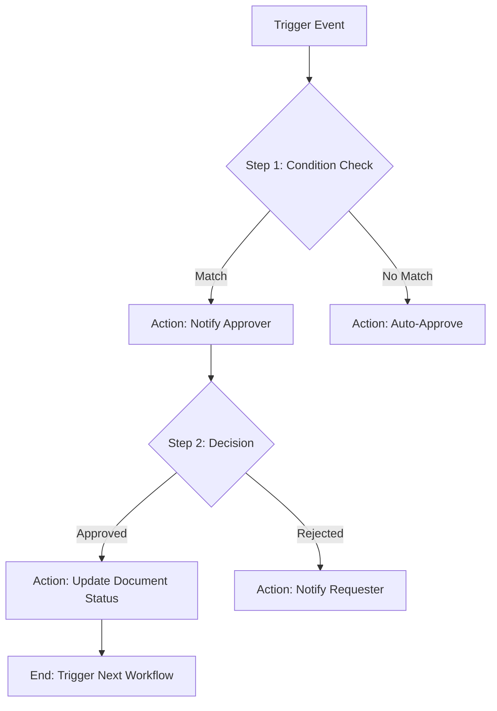

---
title: "Workflow Design Applet"
description: "Business process automation and workflow management for BigLedger operations"
tags:
- core-module
- workflow-automation
- business-process
- approval-workflows
- process-design
weight: 90
---

## Purpose and Overview

The Workflow Design Applet is a powerful Core Module component that enables business process automation and workflow management across BigLedger. This applet provides comprehensive tools for designing, implementing, and managing approval workflows, business processes, and automated operations that streamline organizational efficiency.


**Core Module Applet**: This is one of the 13 essential Core Module applets, enabling process automation and workflow management across all BigLedger modules.


### Who Benefits from This Applet?

**Business Process Owners & Administrators:**
- **Full Control**: Design and modify workflows without coding or complex technical setup.
- **Audit Transparency**: Detailed logs showing who approved what and when.
- **Version Control**: Safely iterate on processes with workflow versioning.

**Department Managers & Team Leads:**
- **Automated Routing**: Ensure requests reach the right approver instantly.
- **Delegation Management**: Easily assign backup approvers when team members are on leave.
- **SLA Tracking**: Monitor how long approvals take and identify bottlenecks.

**Finance & HR Teams:**
- **Compliance Enforcement**: Enforce multi-level approval rules for high-value transactions.
- **Standardized Processes**: Ensure every request follows the official company policy.
- **Seamless Integration**: Automated updates to GL, payroll, or procurement once approved.

### What Problems Does This Solve?

**The "Approval Bottleneck" Problem:**
Orders or leave requests sit in someone's inbox for days because the process is manual, and nobody knows where the document is.
- **Solution**: The applet provides **Real-time Status Tracking** and **Auto-Escalation** if an approval is delayed.

**Lack of Accountability:**
Decisions are made via email or verbal agreement, making it impossible to reconstruct an audit trail months later.
- **Solution**: A **Permanent Audit Trail** is attached to every document, recording every transition and comment.

**Manual Data Entry Errors:**
Passing information between departments leads to typos and data loss.
- **Solution**: **Automated Data Mapping** ensures that once a workflow is approved, the data flows directly into the next module (e.g., Sales Order → Delivery Order).

## Key Features Overview


  

  

  

  

  

  




---

## Key Concepts

### Workflow Hierarchy

To effectively manage workflows, it's important to understand how they are structured within BigLedger.



### Roles and Participants

| Role | Responsibility | Example |
|------|----------------|---------|
| **Requester** | Initiates the workflow | Employee submitting a claim |
| **Approver** | Reviews and decides | Department Manager |
| **Observer** | Can view status but not decide | Internal Auditor |
| **Administrator** | Configures the rules | Workflow Designer |

---

## Core Features in Detail

### Visual Workflow Designer
- **Drag-and-Drop Interface**: Build complex flows using intuitive visual nodes.
- **Condition Engine**: Use logic like `if amount > 5000` or `if department = Sales`.
- **Parallel Tasks**: Allow multiple departments to review a document simultaneously.
- **Loopback Support**: Route a document back to the requester for clarification.

### Approval Workflow Management
- **Hierarchy Mapping**: Link to the "Organization Applet" to automatically find the requester's manager.
- **Proxy Approvals**: Define "Delegates" who can approve when the primary approver is away.
- **SLA Timers**: Set a 24-hour limit for a step before it escalates to the next supervisor.

### Process Automation
- **Status Automation**: Change document status from "Draft" to "Final" automatically upon approval.
- **Document Generation**: Trigger the creation of a PDF or a new record in another applet.
- **API Integration**: Send a webhook to an external CRM or external database.

---

### System Requirements
- **Minimum Access Level**: Workflow Administrator
- **Database Dependencies**: Workflow engine tables
- **Integration Points**: All BigLedger modules
- **API Availability**: Workflow orchestration APIs
- **Real-time Processing**: Event-driven workflow execution

### Workflow Configuration Options
- **Workflow Steps**: Up to 50 steps per workflow
- **Approval Levels**: Up to 10 approval levels
- **Conditional Logic**: Complex business rules support
- **Integration Points**: Unlimited external system connections
- **Custom Fields**: Workflow-specific data capture

### Performance Parameters
- **Concurrent Workflows**: 1,000+ simultaneous executions
- **Response Time**: <2 seconds for workflow initiation
- **Throughput**: 10,000+ workflow executions per hour
- **Monitoring**: Real-time workflow status tracking
- **History Retention**: 5+ years of workflow history

## Integration Points

### Core Module Dependencies
- **Employee Maintenance Applet** - Workflow participant management
- **Organization Applet** - Organizational hierarchy integration
- **Tenant Admin Applet** - User role and permission integration
- **Customer/Supplier Maintenance** - External party workflow involvement

### Module Integration
| Module | Integration Purpose |
|--------|-------------------|
| **Financial Accounting** | Financial approval workflows |
| **Purchasing** | Purchase approval and procurement workflows |
| **Sales & CRM** | Sales process and customer workflow automation |
| **HR & Payroll** | Employee-related approval processes |
| **Inventory Management** | Stock movement and adjustment approvals |
| **Project Management** | Project workflow and milestone automation |
| **Quality Management** | Quality control and inspection workflows |

### External Integrations
- **Email Systems** - Notification delivery
- **Document Management** - Document workflow integration
- **ERP Systems** - Cross-system workflow orchestration
- **Mobile Applications** - Mobile workflow participation
- **Business Intelligence** - Workflow analytics integration
- **Third-party APIs** - External service workflow integration

## Configuration Requirements

### Initial Setup Requirements
1. **Organizational Structure** - Define approval hierarchies
2. **User Roles and Permissions** - Configure workflow participants
3. **Email/SMS Configuration** - Set up notification delivery
4. **Basic Workflow Templates** - Create standard workflow patterns
5. **Integration Endpoints** - Configure external system connections

### Essential Configurations
- **Approval Hierarchies**: Manager, Director, CEO approval levels
- **Standard Workflows**: Purchase Approval, Leave Request, Expense Approval
- **Notification Templates**: Email and SMS message templates
- **Timeout Settings**: Workflow escalation and timeout rules
- **Audit Settings**: Workflow logging and history retention

### Advanced Configurations
- **Complex Business Rules** - Advanced conditional logic
- **Integration Workflows** - Cross-system process automation
- **Custom Workflow Types** - Industry-specific workflows
- **Performance Monitoring** - Advanced analytics and reporting
- **Mobile Workflow Support** - Mobile-optimized workflow interfaces

## Use Cases

### Purchase Approval Workflow
**Scenario**: Multi-level purchase order approval process
- Automatic routing based on purchase amount
- Department manager approval for <$5,000
- Finance director approval for $5,000-$25,000
- CEO approval for >$25,000
- Automatic supplier notification upon approval

**Benefits**: Streamlined procurement with proper controls

### Employee Leave Request Workflow
**Scenario**: HR leave approval and management
- Employee submits leave request
- Direct manager approval/rejection
- HR notification for approved leaves
- Automatic calendar integration
- Leave balance updates

**Benefits**: Efficient leave management with proper documentation

### Sales Quote Approval Workflow
**Scenario**: Sales discount and pricing approval
- Sales representative creates quote
- Automatic approval for standard pricing
- Manager approval required for 10%+ discounts
- Director approval required for 20%+ discounts
- Customer notification upon final approval

**Benefits**: Controlled pricing with sales efficiency

### Quality Control Workflow
**Scenario**: Product quality inspection process
- Incoming goods inspection trigger
- Quality control inspection steps
- Conditional approval based on test results
- Rejection handling and supplier notification
- Certificate generation for approved items

**Benefits**: Systematic quality assurance with documentation

## Related Applets

### Core Module Applets
- **[Employee Maintenance Applet](/applets/employee-maintenance-applet/)** - Workflow participant setup
- **[Organization Applet](/applets/organization-applet/)** - Organizational structure
- **[Tenant Admin Applet](/applets/tenant-admin-applet/)** - User permissions

### Process Management Applets
- **[Process Monitoring Applet](/applets/process-monitoring-applet/)** - Process performance monitoring
- **[Document Management Applet](/applets/document-management-applet/)** - Document workflow integration
- **[Notification Applet](/applets/notification-applet/)** - Advanced notification management

### Business Function Applets
- **[Purchase Approval Applet](/applets/purchase-approval-applet/)** - Procurement workflow specialization
- **[HR Workflow Applet](/applets/hr-workflow-applet/)** - Human resources workflows
- **[Financial Approval Applet](/applets/financial-approval-applet/)** - Financial process workflows

## Setup Guide

### Quick Start
1. **Access Workflow Design** - Navigate to the applet
2. **Define Basic Approval Hierarchy** - Set up organizational approval levels
3. **Create Simple Workflow** - Design a basic approval workflow
4. **Test Workflow Execution** - Process test workflow instances
5. **Monitor Workflow Performance** - Review workflow analytics

### Advanced Setup
1. **Complex Workflow Design** - Create multi-path conditional workflows
2. **Integration Configuration** - Set up external system connections
3. **Custom Notification Setup** - Configure advanced notification rules
4. **Performance Optimization** - Optimize workflow execution performance
5. **Analytics Dashboard Setup** - Configure workflow performance monitoring

## Workflow Design Examples

### Purchase Order Approval Workflow
```yaml
Workflow Name: Purchase Order Approval
Trigger: Purchase Order Creation
Steps:
  1. Initial Review:
     - Condition: Amount < $1,000
     - Action: Auto-approve
     - Next: Send to Supplier
  
  2. Manager Approval:
     - Condition: Amount $1,000 - $5,000
     - Approver: Department Manager
     - Timeout: 2 days
     - Escalation: Director
     - Next: Finance Review
  
  3. Director Approval:
     - Condition: Amount > $5,000
     - Approver: Finance Director
     - Timeout: 3 days
     - Escalation: CEO
     - Next: Final Approval
  
  4. Final Processing:
     - Action: Update PO Status
     - Notification: Supplier and Requester
     - Integration: Accounting System
```

### Employee Onboarding Workflow
```yaml
Workflow Name: Employee Onboarding
Trigger: New Employee Record Creation
Steps:
  1. HR Documentation:
     - Assignee: HR Administrator
     - Tasks: 
       - Collect required documents
       - Create employee file
       - Setup benefits enrollment
     - Timeline: 3 days
  
  2. IT Setup:
     - Assignee: IT Administrator
     - Tasks:
       - Create user accounts
       - Setup equipment
       - Configure system access
     - Timeline: 2 days
  
  3. Department Orientation:
     - Assignee: Department Manager
     - Tasks:
       - Workplace orientation
       - Role-specific training
       - Introduce team members
     - Timeline: 1 week
  
  4. Completion Check:
     - Action: Verify all steps completed
     - Notification: HR, Manager, Employee
     - Integration: HRIS System Update
```

## Best Practices

### Workflow Design Best Practices
- **Keep It Simple** - Design workflows with minimal complexity
- **Clear Naming** - Use descriptive names for workflows and steps
- **Documentation** - Document workflow purpose and procedures
- **Regular Review** - Periodic workflow efficiency assessment
- **User Training** - Comprehensive workflow user training

### Approval Process Best Practices
- **Appropriate Levels** - Right number of approval levels
- **Clear Criteria** - Well-defined approval criteria
- **Reasonable Timeouts** - Appropriate response time requirements
- **Backup Approvers** - Delegate and substitute approver setup
- **Audit Compliance** - Maintain complete approval audit trails

### Performance Optimization Best Practices
- **Bottleneck Identification** - Regular bottleneck analysis
- **Process Streamlining** - Continuous process improvement
- **Automation Opportunities** - Identify manual process automation
- **Resource Allocation** - Proper workflow resource planning
- **Monitoring and Alerting** - Proactive workflow monitoring

## Troubleshooting

### Common Issues
**Workflow not triggering**
- Check trigger conditions and events
- Verify workflow activation status
- Review user permissions and roles
- Confirm integration connectivity

**Approval notifications not sent**
- Check email/SMS configuration
- Verify notification template settings
- Review user contact information
- Confirm notification service connectivity

**Workflow performance issues**
- Analyze workflow execution logs
- Identify bottlenecks and delays
- Review system resource utilization
- Optimize workflow design and logic

### Support Resources
- Workflow design and configuration guide
- Approval process implementation guide
- Performance optimization best practices
- Integration troubleshooting documentation


**Design Tip**: Start with simple workflows and gradually add complexity. Well-designed workflows should improve efficiency without creating unnecessary bureaucracy.

<<<<<<< Updated upstream:content/en/applets/master-data/workflow-design-applet.md
=======

## FAQ

**Q: Can I have different workflows for different branches?**
**A:** Yes. You can define branch-specific conditions within a single workflow or create entirely different workflows triggered by different branch IDs.

**Q: What happens if an approver is on leave?**
**A:** If configured, the "Approval Delegation" feature will automatically route the request to a designated backup. Alternatively, administrators can manually reassign individual pending tasks.

**Q: Can a workflow trigger another workflow?**
**A:** Yes. A common pattern is "Chained Workflows," where the final stage of one process (e.g., Purchase Order Approval) triggers the start of another (e.g., Payment Voucher Creation).

**Q: Is there a limit to the number of approval levels?**
**A:** Technically no, but we recommend keeping workflows under 5-7 levels for operational efficiency.

**Q: Can I attach documents to a workflow?**
**A:** Yes. Requesters and approvers can upload files at any stage, which remain part of the permanent audit trail.

---

## Summary

The **Workflow Design Applet** is the engine of organizational efficiency in BigLedger. By digitizing manual processes, enforcing compliance, and providing real-time visibility into every business decision, it empowers organizations to scale without losing control or transparency.


**Design Tip**: Start with a simple "Line Manager Approval" flow and gradually add complex conditions (like amount-based escalation) as your team becomes familiar with the system.

>>>>>>> Stashed changes:content/en/applets/workflow-design-applet.md
