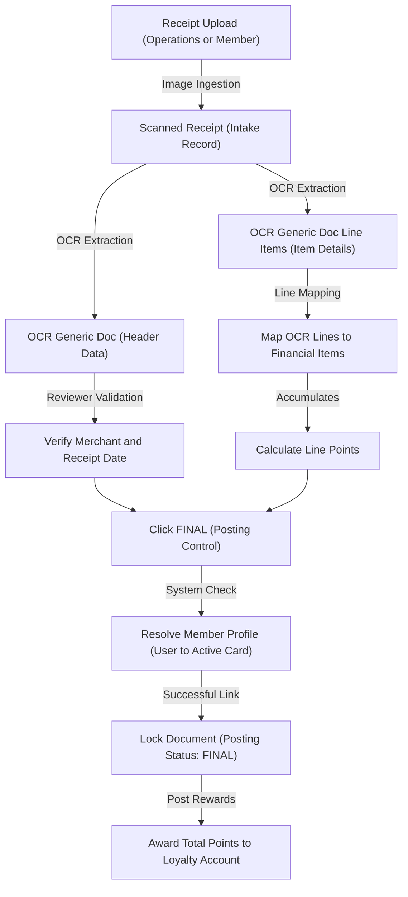

## Purpose and Overview

The **OCR Cash Bill Applet** helps teams convert receipt images into structured financial records with a controlled review workflow. Instead of manual key-in, users upload receipts, review OCR output, map line items, apply process decisions, and finalize documents for downstream processing.


**Core Concept**: Convert receipt images into structured OCR documents, then move them through **review**, **status control**, **line-item mapping**, and **final posting lock**.


### Who Benefits from This Applet?

**Operations / Shared Service Teams:**
- Upload and process receipt images quickly
- Reduce repetitive manual data entry
- Monitor processing outcomes from listing views
- Standardize review decisions with clear statuses

**Finance Reviewers / AP Teams:**
- Validate extracted document details before posting
- Review OCR output side-by-side with receipt images
- Apply rejection reasons consistently
- Finalize review-complete records with lock control

**Master Data Admins:**
- Maintain OCR Company references
- Maintain OCR Item references
- Improve line-item mapping quality
- Standardize merchant and item references for accounting use

**Audit, Compliance, and Finance Leadership:**
- Monitor verification and process outcomes
- Export report files for reconciliation and audit follow-up
- Preserve auditability with finalization controls

### What Problems Does This Solve?

**The Manual Receipt Processing Problem:**

Traditional cash bill handling is often fragmented and error-prone:
- Receipt quality is inconsistent (blurred, cropped, incomplete)
- Manual key-in causes delays and data entry errors
- Duplicate and invalid submissions are hard to control consistently
- Review decisions vary without standardized status usage
- Reporting and audit evidence extraction is slow

**The OCR Cash Bill Applet Solution:**

- **Receipt digitization** - Upload once, process through a structured workflow
- **Controlled statuses** - Standard process states and rejection reasons
- **Line-level mapping** - Link OCR lines to financial items for cleaner accounting
- **Finalization lock** - Prevent post-review accidental edits
- **Master data governance** - Keep company/item references consistent
- **Exportable reporting** - Generate CSV outputs for follow-up and reconciliation

## Key Features Overview


  

  

  

  

  

  

  

  




## Key Concepts

### Understanding the OCR Processing Framework

| Aspect | Component | Practical Example |
|--------|-----------|------------------|
| **What is uploaded?** | Scanned Receipt | Cashier receipt image from a retail purchase |
| **What is reviewed?** | OCR Generic Doc | Extracted doc no, date, amount, and company |
| **What is mapped?** | OCR Generic Doc Line Item | OCR line linked to a financial item |
| **How is it controlled?** | Process + Posting Status | `REJECTED` with reason, then `FINAL` after review |


**Practical Example**: Operations uploads a receipt with `RUN_NOW`, Finance reviews OCR header data, maps line items, sets process status, and finalizes the document when complete.


### OCR Hierarchy Structure

Here is a visual flowchart of the OCR cash bill processing and membership reward lifecycle:



**Flow Through the Hierarchy:**

1. **Scanned Receipt**: Upload and process the receipt image.
2. **OCR Generic Doc**: Validate the extracted header details.
3. **OCR Generic Doc Line Item**: Validate and map individual extracted lines.
4. **Process Status**: Set the operational review decision (`PENDING_REVIEW`, `DUPLICATE`, or `REJECTED`).
5. **Finalization**: Confirm the review is complete to lock the document as `FINAL` and link member details.
6. **Reporting**: Generate a CSV output for tracking and audit reconciliation.

### The "Golden Triangle" of OCR Processing

| Component | Analogy | Role | Example |
|-----------|---------|------|---------|
| **Scanned Receipt** | The "Source Image" | Input document for OCR | Uploaded receipt photo |
| **OCR Generic Doc** | The "Review Header" | Header-level validation and status decision | Process status + rejection reason |
| **OCR Generic Doc Line Item** | The "Accounting Mapping" | Line-level mapping for posting quality | Financial item mapping + quantity/unit price |

**How they link:**
1. The source image creates the scanned receipt record.
2. OCR extraction generates header and line records.
3. Reviewers validate and map extracted data.
4. Finalization locks approved review output.

### Standardized Rejection Reasons

Use one of these reasons when setting process status to `REJECTED`:
- Rejected - Duplicated receipt
- Rejected - Incomplete details
- Rejected - Non-related receipt
- Rejected - Outdated receipt
- Rejected - Exceeded Monthly Submission Limit (Max. 7 receipts per month)
- Rejected - More than 1 receipt

---

## Quick Start Guide

Get up and running quickly with these essential workflows.

Navigation note: If direct URL navigation redirects, open modules from the applet sidebar.

[](https://youtu.be/2lvMSe6y97U?si=ptozYiPHTFgClxQg)

Quick Start Guide video: Click the thumbnail to watch on YouTube.

### For Operations Users: Upload Your First Receipt

**Goal:** Create a scanned receipt and trigger OCR processing.

1. Go to **Scanned Receipt**.
2. Click **+ (Create)**.
3. Set **Status** (default `ACTIVE`).
4. Select **Execution Strategy**:
   - `RUN_NOW` for immediate OCR processing
   - `INSERT_TO_QUEUE` for deferred/queued processing
5. Upload receipt image in **Receipts Upload**.
6. Click **CREATE**.





**What happens next?** The document appears in listing and is ready for reviewer validation in **OCR Generic Doc**.

### For Finance Reviewers: Process an OCR Generic Doc

**Goal:** Validate OCR output, apply process status, and finalize correctly.

1. Open **OCR Generic Doc**.
2. Search by Doc No, Process Status, Verification Status, or date ranges.
3. Open target record and review **Main Details** (amount, receipt date, company, confidence level, status).
4. Set **Process Status** to `PENDING_REVIEW`, `DUPLICATE`, or `REJECTED`.
5. If `REJECTED`, select **Reason to Reject**.
6. Open **Line Items** tab and validate mapping/values.
7. Click **UPDATE**.
8. Click **FINAL** once review is complete.





### For Master Data Admins: Set Up OCR Company and OCR Item

**Goal:** Build clean references for stable line-item mapping.

1. Open **OCR Company** and maintain company master details.
2. Open **OCR Item** and maintain item master records linked to company.
3. Run a sample receipt and verify expected company/item mapping behavior.

### For Reporting Users: Generate OCR Scanned Doc Report CSV

**Goal:** Export OCR process data for operational analysis and audit.

1. Open **OCR Scanned Doc Report**.
2. Set optional created/updated date filters.
3. Click **Generate CSV**.
4. Wait for background processing to complete.
5. Download from listing **Actions**.

### For Applet Admins: Initial System Setup

**Goal:** Prepare production-ready defaults and governance controls.

1. Configure `Settings > Default Selection` (branch, location, timezone).
2. Configure `Settings > Field Settings` for advanced search behavior.
3. Configure user/team/role permissions for Operations, Finance, and Admin users.
4. Load baseline OCR Company and OCR Item records.
5. Test upload -> review -> map -> finalize.
6. Generate a test CSV report to verify reporting access.

---


**New to the system?** Start with this sequence:
1. Operations uploads 5-10 sample receipts.
2. Finance reviews and applies process statuses.
3. Admin validates master data and permission controls.
4. Reporting users verify CSV outputs before go-live.


---

## Processing Status Tracking

**Monitor review, quality, and lock status clearly before finalization.**

### What is Processing Status Tracking?

Processing status tracking helps teams distinguish OCR quality state from operational decision state and final posting lock state.

| Status Type | Values | Usage |
|-------------|--------|-------|
| **Verification Status** | `PASS`, `FAIL`, `FLAGGED` | OCR quality/validation result |
| **Process Status** | `PENDING_REVIEW`, `DUPLICATE`, `REJECTED`, `APPROVED` | Operational review state |
| **Posting Status** | `FINAL` | Finalized lock control |

### How to Check Processing Status

1. Open **Scanned Receipt** to check intake progress.
2. Open **OCR Generic Doc** for verification and process decisions.
3. Review **OCR Generic Doc Line Item** for mapping completeness.
4. Confirm posting status before and after finalization.

### Key Features

- Clear separation between OCR quality and process decision states
- Standardized rejection reason selection
- Finalization lock to protect reviewed data
- Status-driven report export visibility

### Common Scenarios

**Scenario 1: Duplicate Submission**
```
Process Status: DUPLICATE
Action: Mark duplicate and keep audit notes
Outcome: Prevents duplicate posting flow
```

**Scenario 2: Incomplete OCR Data**
```
Verification Status: FLAGGED
Process Status: REJECTED
Reason: Rejected - Incomplete details
Outcome: Controlled rejection with clear audit reason
```

**Scenario 3: Review Completed**
```
Process Status: PENDING_REVIEW -> APPROVED (system flow)
Posting Status: FINAL
Outcome: Record is locked and ready for reporting/reconciliation
```

### Tips for Reviewers

- Use the most specific rejection reason available
- Complete line-item mapping before finalization
- Avoid setting `FINAL` until process checks are complete
- Re-check process and posting statuses before exporting reports

---

## For Operations Users

### Scanned Receipt - Your Intake Workspace



| Feature or Action | Operational Purpose | Description | Interface Element |
| :--- | :--- | :--- | :--- |
| **Upload Receipts** | Ingest cash bills or retail receipts. | Supports batch uploads of image files (PNG, JPG) or PDF documents for automated OCR extraction. | **Upload File** button or drag-and-drop zone |
| **Set Execution Strategy** | Determine OCR processing timeline. | Choose `RUN_NOW` to process the receipt immediately, or `INSERT_TO_QUEUE` to process it asynchronously in the background. | **Execution Strategy** dropdown (defaults to `RUN_NOW`) |
| **Track Process Status** | Monitor parsing lifecycle. | Track whether the document is pending, processing, completed, or failed. | **Process Status** badge in the list view |
| **View OCR Output JSON** | Inspect raw text extraction. | Review the coordinates and text data extracted by the OCR engine for troubleshooting. | **OCR Output** JSON panel in edit mode |
| **Rotate and Zoom Preview** | Adjust image orientation. | Rotate clockwise/counter-clockwise or zoom in/out on the uploaded receipt image. | Image toolbar overlay (Rotate/Zoom icons) |

#### Listing Highlights

| Field | Purpose | Data Type | Example Value |
| :--- | :--- | :--- | :--- |
| **Scanned Doc No.** | Unique identifier generated for the uploaded receipt. | Auto-generated String | `OCR-2026-00041` |
| **Process Status** | Current stage of OCR ingestion and parsing. | Enum / Status Badge | `COMPLETED` or `PENDING_REVIEW` |
| **Creation Date** | Timestamp when the receipt was uploaded. | DateTime | `2026-06-22 10:30` |
| **Modified Date** | Timestamp when the document was last updated. | DateTime | `2026-06-22 10:42` |
| **Created By** | Username of the operator or customer who uploaded the receipt. | String / Email | `operator@company.com` |

> [!NOTE]
> **Edit Behavior and Locking Rules:**
> - The process status can be freely updated during the active review stage.
> - Once a record is marked as approved, it is locked against further process-status modifications.
> - The extracted OCR JSON output remains read-only at all times to maintain a reliable audit trail.

### CP-Commerce (CP-COM) Website or App and Membership Applet Integration

When you utilize the **Akaun** platform, the **CP-Commerce (CP-COM)** website or app, and the **Membership** module together, these systems integrate to allow customers to submit receipts and track their loyalty points directly from the customer-facing website or app.

#### CP-Commerce (CP-COM) Website or App Features
- **Receipt Upload**: Customers can upload photo/scanned images of cash bills and retail receipts directly on the customer-facing website or app to submit them for automated OCR ingestion and review.
- **Points Balance and History**: Customers can view their earned loyalty point balances and historical ledger using the **Point History Widget** on the website or app.

For detailed instructions on setting up layout templates and configuring widgets on the website or app, refer to the [CP-Commerce Admin Applet](/applets/ecommerce/cp-commerce-admin-applet/) documentation.

#### Membership Applet Connection
- The OCR Cash Bill Applet processes the receipt to determine point eligibility and totals.
- Once finalized, the points are posted to the user's loyalty account in the [Membership Admin Applet](/applets/membership/membership-admin-applet/).
- Loyalty programs, point conversion rates, tier settings, and member listings are configured and managed directly in the Membership Admin Applet.

For more details on managing loyalty programs and card settings, refer to the [Membership Admin Applet](/applets/membership/membership-admin-applet/) documentation.

---

## For Finance Reviewers

### OCR Generic Doc - Header Review Workspace



When you edit an OCR Generic Doc, the workspace is split into **two tabs**:

| Tab | Purpose | What You Can Do |
| :--- | :--- | :--- |
| **Main Details** | Displays extracted header metadata and operational status controls. | Update receipt date, change linked merchant, update process decision, or finalize. |
| **Line Items** | Lists the individual lines extracted from the receipt. | View line item breakdown and drill into individual lines to map products. |

---

#### Main Details Tab Field Guide

| Field | Purpose | Required | Example |
| :--- | :--- | :---: | :--- |
| **Doc No** | *Read-only* - Unique document number extracted by OCR. | Yes | `DOC-0021` |
| **Amount** | *Read-only* - Transaction total, automatically aggregated from line totals. | Yes | `250.50` |
| **Receipt Date** | Date the transaction took place (clickable calendar). | Yes | `2026-06-22` |
| **Created Date** | *Read-only* - The timestamp when the receipt was ingested. | Yes | `2026-06-22 09:30:15` |
| **Membership Points** | *Read-only (Finalized)* - Total loyalty points awarded. | Yes | `25.00` |
| **Points Currency** | *Read-only (Finalized)* - Point currency type. | Yes | `POINTS` |
| **Points Type** | *Read-only (Finalized)* - Point reward classification. | Yes | `STANDARD` |
| **Company** | Click to select the correct retailer/company from the master list. | Yes | `Giant Supermarket` |
| **Verification Status** | *Read-only* - System OCR quality check (`PASS`, `FAIL`, or `FLAGGED`). | Yes | `FLAGGED` |
| **Process Status** | Operational state of review (`PENDING_REVIEW`, `DUPLICATE`, or `REJECTED`). | Yes | `PENDING_REVIEW` |
| **Reason to Reject** | *Conditional* - Reason for rejection. | Conditional | Only visible if Process Status is set to `REJECTED`. |
| **Status** | General active status of the document record (`ACTIVE` or `CLOSE`). | Yes | `ACTIVE` |
| **Updated By** | *Read-only* - The last user profile that saved changes to this document. | No | `Jane Smith` |



**Key Controls:**
- **UPDATE** saves reviewer changes
- **FINAL** locks reviewed record
- Process status updates sync to linked scanned receipt status
- `FINAL` posting status restricts editable actions

### Rejection Handling Guide

1. Set **Process Status** to `REJECTED`.
2. Select **Reason to Reject**.
3. Click **UPDATE**.

| Rejection Reason | Use This When | Example Scenario |
|---|---|---|
| Rejected - Duplicated receipt | Same receipt already processed | User uploads the same image twice |
| Rejected - Incomplete details | Key data missing or unreadable | Amount/date/merchant text is unclear |
| Rejected - Non-related receipt | Receipt not valid for this process | Non-cash-bill document uploaded |
| Rejected - Outdated receipt | Submission outside allowed period | Receipt date is beyond policy window |
| Rejected - Exceeded Monthly Submission Limit (Max. 7 receipts per month) | Monthly cap exceeded | 8th receipt submitted in one month |
| Rejected - More than 1 receipt | One upload contains multiple receipts | Single image contains two receipts |

---

### OCR Generic Doc Line Item - Line Mapping Workspace



**Line Item Fields Guide:**

| Field | Purpose | Required | Example |
| :--- | :--- | :---: | :--- |
| **OCR Generic Doc No** | *Read-only* - The parent document number. | Yes | `DOC-0021` |
| **Financial Item** | Link to the target ledger account for financial posting. | Yes | `6100-001 - Office Stationery` |
| **Item Code** | *Read-only* - The mapped merchant's product code. | Yes | `ITM-9982` |
| **Item Name** | The name of the product or service. | Yes | `Mineral Water 500ml` |
| **Description** | *Read-only* - The raw text extracted by OCR for this line. | No | `MINERAL WATER 500ML` |
| **Company** | *Read-only* - The merchant company name. | Yes | `Giant Supermarket` |
| **Membership Points** | *Read-only (Finalized)* - The loyalty points earned on this line. | Yes | `10.00` |
| **Points Currency** | *Read-only (Finalized)* - The unit type of points. | Yes | `POINTS` |
| **Points Type** | *Read-only (Finalized)* - The point reward category. | Yes | `STANDARD` |
| **Remarks** | Custom user remarks for this specific line. | No | `Staff pantry supply` |
| **Quantity** | The quantity of the item. | Yes | `5.00` |
| **Unit Price** | The price per unit. | Yes | `1.20` |
| **Updated By** | *Read-only* - The last user who updated the line details. | No | `John Doe` |
| **Status** | The active status of the record (`ACTIVE` or `CLOSE`). | Yes | `ACTIVE` |

**Mapping Workflow:**
1. Open a line-item record.
2. Click **Financial Item**.
3. Select item from financial item listing.
4. Save update.
5. Use **RESET** if remapping is required.



**Finalization Rule:**
If posting status is `FINAL`, line-item updates are disabled.

---

## Master Data Setup

Master data setup is required to establish clean merchant and product mappings for receipt ingestion. Before processing receipts, ensure you have set up the relevant merchant companies and item codes.

### OCR Company (`Master Data > OCR Company`)

**What is OCR Company?**
This module maintains merchant and retailer profiles. When receipts are ingested, their header data is associated with these company records.

---

**Creating an OCR Company - Field-by-Field Guide:**

| Field | Purpose | Required | Example |
| :--- | :--- | :---: | :--- |
| **Company Code** | Unique identifier code for the merchant/company. | Yes | `MCH-0012` |
| **Company Name** | The official name of the retailer or supplier. | Yes | `Giant Supermarket` |
| **Description** | Brief note or detail about the company. | No | `Retail Groceries Merchant` |
| **Country** | The country where the merchant is registered. | Yes | `Malaysia` |
| **Address** | Physical street address of the company. | No | `No. 12, Jalan Sultan Ismail` |
| **Postal Code** | Postcode of the company's location. | No | `50250` |
| **City** | City name. | No | `Kuala Lumpur` |
| **State** | State name. | No | `Wilayah Persekutuan` |
| **Contact No.** | The company's telephone number. | No | `+603-12345678` |
| **Status** | Active status of the company record (e.g., `ACTIVE` or `CLOSE`). | Yes | `ACTIVE` |

---



### OCR Item (`Master Data > OCR Item`)

**What is OCR Item?**
This module maintains the specific items or products sold by OCR Companies. Linking OCR lines to these item definitions ensures consistent financial categorization.

---

**Creating an OCR Item - Field-by-Field Guide:**

| Field | Purpose | Required | Example |
| :--- | :--- | :---: | :--- |
| **Item Code** | Unique identifier code for the merchant's item. | Yes | `ITM-9982` |
| **Item Name** | Name of the product or service as it appears on receipts. | Yes | `Mineral Water 500ml` |
| **Description** | Detailed description of the item. | No | `Drinking water bottle` |
| **Company** | The OCR Company/merchant this item belongs to. | Yes | `Giant Supermarket` |
| **Remarks** | Additional notes about the item. | No | `Promotion stock item` |
| **Status** | Active status of the item record (`ACTIVE` or `CLOSE`). | Yes | `ACTIVE` |

---



---

## Reporting

### OCR Scanned Doc Report - CSV Export Workflow

Use this module to generate and download report files.



**Report Workflow:**
1. Set optional created/updated date filters.
2. Click **Generate CSV**.
3. Wait for background generation.
4. Download from listing action button.

**Listing Columns:**
- Report Name
- Status
- Error Message
- Created Date
- Updated Date
- Actions (download/delete)

**Scenario-Based Examples:**
1. Daily finance reconciliation:
Set `Created Date` to today, generate CSV, and use the file to match newly scanned receipts against daily finance review workload.
2. Month-end compliance review:
Set `Updated Date` to the month range, export the CSV, and use it as audit evidence for processed, rejected, and finalized receipt records.
3. Exception follow-up by operations:
Generate the report for the target period, then use `Status` and `Error Message` columns to identify failed/blocked records before reprocessing.

**Operational Tip:**
If generation is delayed, check row status and error message before regenerating.

---

## Finalization Control and Membership Point Integration

Finalization is the final step in the review process. It locks the document to prevent accidental changes and triggers the reward points settlement.

### What is Finalization?

When a reviewer finalizes an OCR Generic Doc, the system performs a validation check to link the document to the submitter's membership card and locks the record for accounting and audit integrity. 


**Why Finalize?**: Finalization locks the receipt data so it cannot be modified, resolves the submitting user's membership account, and officially issues the loyalty points earned from the transaction.


### How the Membership Rewards System Connects

Each uploaded cash bill/receipt contains line items that carry reward values. Here is how the system processes and connects these transactions to the membership program:

1. **Member Account Identification**:
   When you click **FINAL**, the system automatically identifies the submitting member. It matches the user account that uploaded the receipt with their active membership card registered in the organization.
   
2. **Document Linkage**:
   The resolved membership account is linked to both the OCR Generic Doc and the Scanned Receipt records. Any previously recorded rejection reason is cleared.

3. **Points Aggregation**:
   The system calculates the total points by summing the reward point values of all mapped line items. 

4. **Reward Display**:
   Once posting status moves to `FINAL`, the Main Details tab displays three new read-only fields:
   - **Membership Points**: The total loyalty points awarded.
   - **Points Currency**: The unit type used for rewards (e.g., points, credits).
   - **Points Type**: The specific reward tier or category.

---

### Scenario-Based Examples

#### Scenario 1: Automatic Membership Account Resolution
*Context*: An operations user uploads a receipt for a member who did not manually input their member card ID.
1. The reviewer verifies the receipt details and clicks **FINAL**.
2. The system automatically searches for the active membership card associated with the member's profile and company.
3. The card details are linked to the receipt, and the status moves to `FINAL` successfully.

#### Scenario 2: Successful Reward Settlement
*Context*: A receipt with three items eligible for membership points is finalized.
1. The reviewer clicks **FINAL**.
2. The system successfully posts the document.
3. The reviewer opens the document and views the **Membership Points**, **Points Currency**, and **Points Type** fields, which are now visible and read-only.
4. The member receives the points in their loyalty wallet.

#### Scenario 3: Finalization Blocked
*Context*: An error occurs because the transaction date falls in a closed accounting period, or there is an inventory/serial mismatch on a mapped line.
1. The reviewer clicks **FINAL**.
2. The system rejects the request and displays a descriptive error message (e.g., "Fiscal Period is Locked").
3. The posting status remains active/pending review. The reviewer must resolve the validation issue before finalizing again.

---

### What Changes After Finalization

Once a document is finalized:
- The **Posting Status** is permanently set to `FINAL`.
- All fields on the OCR Generic Doc, including the **Reason to Reject**, are locked and cannot be edited.
- The **Line Items** tab blocks any further item mapping or quantity/price adjustments.
- **Membership Points** details become visible as read-only fields on the Main Details tab.

---

### When to Finalize

Only finalize a document after:
- The **Process Status** has been reviewed and verified.
- The company and retailer details are correctly selected.
- All line items have been correctly mapped to financial items.
- Line quantities and unit prices are checked for accuracy.

---

### What to Follow Up After Finalizing

1. Confirm that the document's posting status appears as `FINAL` in the search filters.
2. Verify that the edit buttons and inputs are disabled.
3. Review the **Membership Points** fields to ensure rewards were populated as expected.
4. Export the data using the **OCR Scanned Doc Report** if reconciliation or audit follow-ups are needed.

---

## Configuration and Settings

Use the applet left sidebar to open **Settings** and **Personalization** pages.



### Field Settings (`Settings > Field Settings`)

Control advanced search behavior for the OCR Generic Doc listing.

| Setting | Purpose | Default | Description |
| :--- | :--- | :---: | :--- |
| **HIDE_CUSTOMER_ADVANCED_SEARCH** | Controls visibility of customer search options. | Checked | If enabled, hides customer-specific search fields on listing pages. |
| **ENABLE_MEMBER_ADVANCED_SEARCH** | Controls visibility of member search options. | Checked | If enabled, shows membership card search fields on listing pages. |

---

### Default Selection (`Settings > Default Selection`)

Set applet-wide defaults to reduce repetitive user input during manual data updates.

| Default Setting | Purpose | Required | Description |
| :--- | :--- | :---: | :--- |
| **DEFAULT_BRANCH** | The default branch linked to new documents. | Yes | Select a default company branch. |
| **DEFAULT_LOCATION** | The default stock/warehouse location. | Yes | Used for line mapping location contexts. |
| **DEFAULT_TIMEZONE** | The default operational timezone. | Yes | Used to format date/time entries accurately. |

*Note: `DEFAULT_COMPANY` is tenant-dependent and is automatically derived based on the selected branch.*

---



### Personalization > Default Selection

Users can set personal overrides that take precedence over the applet-wide settings.

| Personal Override | Purpose | Required | Description |
| :--- | :--- | :---: | :--- |
| **Default Branch** | User-level default branch override. | No | Overrides the applet-wide `DEFAULT_BRANCH` for the current user. |
| **Default Location** | User-level default location override. | No | Overrides the applet-wide `DEFAULT_LOCATION` for the current user. |

These personal values override applet-level defaults for the user.



### Access, Permission, and Integration Controls

Use admin controls for:
- Webhook
- Client-side permission listing
- Permission sets
- User/team/role permission controls
- Sidebar personalization

---

## Audit

### Audit Trail (`Settings > Applet Log`)

Use Applet Log to track:
- Who performed each action
- What fields changed
- When changes occurred
- Which document/status was affected

This supports compliance checks, investigation workflows, and operational troubleshooting.

---

## Personalization

### Default Selection

Set personal default branch and location to speed up daily processing. Personalization values override applet defaults for the specific user.

---

## FAQ

**Q: Why is the `CREATE` button disabled in Scanned Receipt Create?**
A: At least one receipt image must be uploaded before creation is allowed.

**Q: What is the difference between `Verification Status` and `Process Status`?**
A: `Verification Status` represents OCR quality (`PASS`, `FAIL`, `FLAGGED`), while `Process Status` represents reviewer decision flow (`PENDING_REVIEW`, `DUPLICATE`, `REJECTED`, `APPROVED`).

**Q: Why can I not edit some OCR Generic Docs or line items?**
A: If posting status is `FINAL`, editing is restricted to protect finalized data integrity.

**Q: When should I choose `RUN_NOW` vs `INSERT_TO_QUEUE`?**
A: Use `RUN_NOW` for immediate processing and `INSERT_TO_QUEUE` for deferred or batched processing.

**Q: How do I map OCR lines to accounting items correctly?**
A: Open line item, click **Financial Item**, select correct mapping from list, and update. Use **RESET** if remapping is needed.

**Q: Why can't I set process status to `APPROVED` directly in some screens?**
A: Reviewer flows typically use `PENDING_REVIEW`, `DUPLICATE`, or `REJECTED`. In current behavior, `APPROVED` is generally system-controlled.

**Q: A generated report is not downloadable yet. What should I check?**
A: Check row `Status` and `Error Message` in **OCR Scanned Doc Report**. Download is available only after successful generation.

**Q: Which rejection reason should I use for too many submissions in one month?**
A: Use **Rejected - Exceeded Monthly Submission Limit (Max. 7 receipts per month)**.

**Q: I selected the wrong company on OCR Generic Doc. What should I do?**
A: Open the document, choose the correct company, then recheck line mapping before updating or finalizing.

**Q: A receipt looks duplicated. What is the correct handling flow?**
A: Set process status to `DUPLICATE`, provide a clear remark or rejection context if required, then save for audit traceability.

**Q: How does the system calculate Membership Points for a receipt?**
A: The system aggregates points from individual line items. Each line item has its own point value calculated on the backend during OCR processing and item mapping. The total sum is displayed as **Membership Points** on the main document once finalized.

**Q: What happens if a user doesn't have an active membership card when the receipt is finalized?**
A: The system automatically looks up the active membership card associated with the user's account and organization. If no card is found, the finalization cannot complete, and you must link or register a membership card first.
