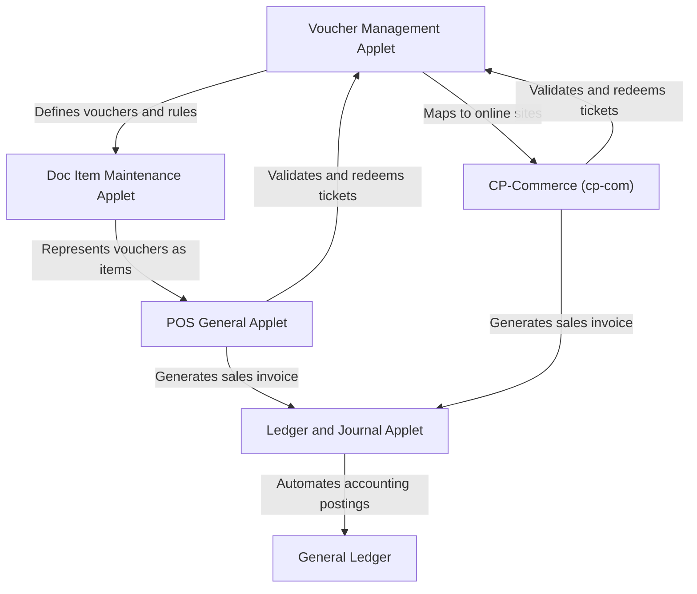

## Purpose and overview

The **Voucher Management Applet** is the control center for creating vouchers, generating and maintaining ticket serial numbers, tracking scanned event usage, running recurring voucher programs, and monitoring import jobs.

Marketing, Sales, Operations, and Customer Service teams use it to create voucher headers, apply redemption rules, issue fixed-value settlement vouchers, manage ticket-based campaigns, and control applet behavior from Settings and Personalization.


**Core Concept: Voucher vs. Ticket vs. Scanned Event vs. Recurring Voucher**
- **Voucher:** The master record that stores the voucher code, type, date windows, security controls, and business rules.
- **Ticket:** An individual serial number generated from a voucher. This is the unit that gets assigned, activated, cancelled, redeemed, or traced.
- **Scanned Event:** The scan or redemption log for event-style or ticket-based usage, including remarks, points, and attachments.
- **Recurring Voucher:** A voucher template that repeats on a schedule using a recurrence rule.


## Key features overview

### Who benefits from this applet?

- **Marketing and Campaign Managers:**
  - Create targeted discount campaigns and rewards to drive customer acquisition.
  - Run seasonal promotion codes (like `BF2024`) with strict date and category rules.
  - Automate recurring reward voucher cycles (e.g., birthday or anniversary vouchers) to maintain member engagement.
- **Sales Agents and Cashiers:**
  - Verify and redeem customer vouchers instantly at the counter or online checkout.
  - Eliminate the hassle of manually checking promo eligibility or tracking manual discount paper slips.
- **Customer Service Teams:**
  - Instantly issue compensation or settlement vouchers to resolve customer complaints.
  - Track individual ticket history and status to handle disputed scan events or balance queries.
- **Accounting and Finance Teams:**
  - Automate financial liability tracking for unused voucher credit (deferred revenue).
  - Streamline journal postings for redemptions and unredeemed expired vouchers (breakage income).

### What problems does this solve?

**The Manual Promotion and Fraud Problem:**

Manual voucher handling often leads to coupon abuse, duplicate redemptions, and staff input errors that cause revenue leakage.
- **Secure validation** - Real-time ticket code validation enforces unique single-use serials, activation PINs, and secure softpins.

**Disconnected Sales Channels:**

Promotions created for physical stores are often unusable online, causing customer frustration and fractured sales operations.
- **Unified retail experience** - Native integration maps voucher codes directly to CP-Commerce websites and the POS General Applet.

**Inaccurate Accounting and Liabilities:**

Tracking outstanding gift card liabilities or campaign discount expenses on spreadsheets leads to messy monthly closings.
- **Automated financial posting** - Integration with the Doc Item Maintenance and Ledger and Journal Applets automates liability accounting, redemptions, and breakage recognition.

### Main work areas in the sidebar

| Sidebar Menu | What users do there |
|:---:|---|
| **Voucher** | Create and edit voucher headers, treatments, rules, images, website links, ticket generation, and audit history. |
| **Ticket** | Create standalone tickets from existing vouchers and maintain individual ticket statuses and history. |
| **Scanned Event** | Review scan or redemption records, shipping address details, remarks, and attachments. |
| **Recurring Voucher** | Create vouchers that repeat on a schedule. |
| **Import Tickets** | Upload import files and review processing and checking results. |
| **Settings** | Set applet defaults, reorder voucher edit tabs, and manage field toggles. Some admin-enabled builds also expose feature visibility, webhook, and permission pages. |
| **Personalization** | Save user-level defaults and, where enabled, maintain personal sidebar preferences. |

---

## Strategic configuration: building your voucher logic

Creating a standard voucher in this applet uses two work stages, but the first stage depends on the voucher type:

1. Use **Create Voucher** to complete **Details**. If the voucher type is `DISCOUNT` or `REWARDS`, the create screen also exposes **Treatment Value** before the first save.
2. After the voucher is saved, reopen it from **Voucher Listing** to use the full edit workspace: **Details**, **Treatment Value**, **Apply Rules**, **Image**, **Ticket Management**, **Website Link**, and **Audit**.

`SETTLEMENT` vouchers only use the **Details** tab during create. `DISCOUNT` vouchers show `Product` and `For All` treatment setup during create. `REWARDS` vouchers show the `For All` treatment setup during create.


**Creation Checklist: Things to Decide Before You Save**
- [ ] **Voucher Type:** `SETTLEMENT`, `DISCOUNT`, or `REWARDS`
- [ ] **Quantity Type:** `FIXED`, `DYNAMIC`, `IMPORT`, or `INVENTORY`
- [ ] **Status:** Set the voucher to `ACTIVE` only when it is ready for use
- [ ] **Security:** Decide whether you need **Softpin**, **Activation Pin**, **URL Key**, or **Prefix**
- [ ] **Dates:** Set both the **Event Period** and the **Redemption Period** during create
- [ ] **Website Exposure:** If needed, link the voucher to CP-Com websites during create
- [ ] **Treatment:** For `DISCOUNT` and `REWARDS`, complete **Treatment Value** before the first save if you want the voucher logic ready immediately
- [ ] **Next Step:** Rules, images, ticket operations, website maintenance, and audit review happen after the voucher is saved


### Step 1: create the voucher shell (Details tab)

The initial **Details** tab stores the voucher header and the create-stage settings that users should confirm up front. In this build, `DISCOUNT` and `REWARDS` users can continue into **Treatment Value** before the first save, but rules, images, ticket operations, website maintenance, and audit review still require the saved voucher record.

| Setting | What it controls | What to know in the UI |
|:---:|---|---|
| **Voucher Code** | The main voucher identifier. | Required. By default it cannot be edited later unless `ENABLE_EDIT_VOUCHER_CODE` is turned on in Settings. |
| **Voucher Name** | Internal or user-facing label for the voucher. | Optional, but recommended for reporting clarity. |
| **Voucher Type** | The business logic mode. | Options are `SETTLEMENT`, `DISCOUNT`, and `REWARDS` unless hidden by Settings. |
| **Face Value Amount** | Fixed stored-value amount. | Only appears when **Voucher Type** is `SETTLEMENT`. |
| **Quantity Type** | How tickets are controlled. | Standard voucher create supports `FIXED`, `DYNAMIC`, `IMPORT`, and `INVENTORY`. |
| **Total Voucher Ticket To Be Generated** | Initial ticket quantity. | Appears during create when **Quantity Type** is `FIXED`. |
| **Status** | Whether the voucher can be used. | The UI uses `ACTIVE` and `INACTIVE`, not "Published". |
| **Voucher Limit Per Customer** | Per-customer usage limit. | Defaults to `1`. |
| **Currency** | Currency for settlement and value calculations. | Defaults to `MYR` in the current form. |
| **Allow Anonymous** | Lets guests claim or redeem. | Useful for guest checkout or public campaigns. |
| **Is Shipping Voucher** | Marks the voucher as shipping-related. | Optional toggle in the main details form. |
| **Event Period** | When customers can claim or collect the voucher. | Uses start and end date-time fields. In the current UI this block is part of the create form, not the edit details form. |
| **Redemption Period** | When the voucher can actually be redeemed. | Uses start and end date-time fields. In the current UI this block is part of the create form, not the edit details form. |
| **Add Voucher To CP-Com** | Links the voucher to selected website records. | Available during create for website-level exposure. After save, use **Website Link** to add or remove linked sites. |
| **Description** | Free-text business description. | Useful for internal context and listings. |
| **Terms and Conditions** | Rich-text terms stored on the voucher header. | Managed in the embedded editor at the bottom of the form. |

| Optional Control | What it does |
|:---:|---|
| **Softpin** | Adds a second secret value and lets you set the softpin length (`6` to `30`). |
| **Activation Pin** | Requires activation before use and lets you set the activation pin length (`6` to `30`). |
| **URL Key** | Creates a redeemable URL key and optional redirection target. |
| **Prefix** | Adds a serial prefix and lets you set the serial number length. |


Before the first **SAVE**, `DISCOUNT` and `REWARDS` vouchers can already use **Treatment Value**. After the first **SAVE**, reopen the voucher from **Voucher Listing** to continue with **Apply Rules**, **Image**, **Ticket Management**, **Website Link**, and **Audit**.


---

## Understanding voucher types: when, how, and why?

Not all vouchers use the same redemption logic. The selected type changes which fields matter and what the user will configure next.

### 1. Settlement Vouchers (`SETTLEMENT`)
**Why:** Use this when the voucher behaves like stored value or store credit.
- **Core field:** `Face Value Amount`
- **How it works:** The ticket or voucher redeems against a fixed value instead of a discount treatment formula.
- **Create flow:** Only the **Details** tab is required during create. There is no **Treatment Value** tab for settlement vouchers.
- **Best for:** Gift vouchers, service recovery credits, and compensation vouchers.

### 2. Discount Vouchers (`DISCOUNT`)
**Why:** Use this for promotions where the final discount depends on treatment logic and rules.
- **Treatment setup:** The create flow already exposes **Treatment Value** with `Product` and `For All` sub-tabs.
- **How it works:** Users define fields such as `Price Source`, `Operator`, `Value`, `Min Spend`, `Max Discount Value`, and `Auto Apply to All Child Items`.
- **What it affects:** The treatment formula controls how much discount is granted, while **Apply Rules** decides where and when that formula is allowed to work.
- **Best for:** Promo codes, campaign discounts, and item- or cart-based offers.

### 3. Rewards Vouchers (`REWARDS`)
**Why:** Use this when redemption should award points, or combine value logic with loyalty outcomes.
- **Treatment setup:** The create flow already exposes **Treatment Value**. In the current create screen, the main reward setup is in `For All`.
- **How it works:** Users can configure `Customer Points Value`, `Customer Points Expires Within (days)`, `Retailer Points Value`, `Retailer Points Expires Within (days)`, `Point Currency`, and optional value-based treatment settings.
- **What it affects:** The voucher can contribute reward points, discount-like value treatment, or both, depending on the fields enabled in the treatment form.
- **Best for:** Loyalty campaigns, event reward programs, and membership-based incentives.


**Admin Note**
The **Field Settings** screen can hide `DISCOUNT` or `REWARDS` from the create form, so some tenants may not see all three voucher types.


---

## Key features deep-dive


  

  

  

  

  

  

  


---

## Key concepts and system integrations

The Voucher Management Applet operates as a central engine in the BigLedger ecosystem. It does not run in isolation; it integrates with the **Doc Item Maintenance Applet**, **POS General Applet**, **CP-Commerce (cp-com)**, and **Ledger and Journal Applet (Financial Accounting)** to manage the lifecycle of a voucher from creation to sales, redemption, and financial posting.

### Doc Item Maintenance Applet integration

To sell vouchers as retail products or track them as catalog items, they must be configured in the [Doc Item Maintenance Applet](/applets/master-data/doc-item-maintenance-applet). 

- **Item Type Setup:** Create a new item and select the item type as **Voucher** (to link to a voucher template) or **Coupon** (to track physical voucher serial stock movements).
- **Voucher Details Tab:** Under the **Voucher Details** tab in the edit item workspace, select and link the matching voucher campaign template from the Voucher Management Applet.

#### User story: selling gift cards
> *As a Master Data Administrator, I want to sell a "RM100 Store Credit Gift Card" as a product.*
> 1. I open the **Doc Item Maintenance Applet** and create a new item: `RM100-GIFT` (Item Type: `Voucher`).
> 2. I open the item details, navigate to the **Voucher Details** tab, and link it to the `GIFT100` voucher template.
> 3. Now, whenever a customer purchases the `RM100-GIFT` product, the system automatically stocks out the item, generates a unique ticket serial number (e.g., `GFT-89312`), and assigns it to the customer.

---

### POS General Applet integration

During checkout at a physical retail store, cashiers redeem vouchers using the **POS General Applet**.

- **Serial Scanning:** The cashier scans the voucher barcode or QR code.
- **Real-Time Validation:** The POS terminal calls the Voucher API `/serial-numbers/multi-validation` to verify:
  - Is the ticket status `Active` and `Redeemable`?
  - Is the transaction date within the `Redemption Period`?
  - Do the cart items and total spend meet the `Apply Rules` (e.g., minimum spend of RM150, or category exclusions)?
- **Redemption and Invoice Reference:** Once validated, the POS applies the voucher value as a payment method or line discount on the Sales Invoice. The ticket status in the Voucher Management Applet is updated to `Redeemed`, referencing the Sales Invoice ID.

#### User story: customer checkout at counter
> *As a Retail Cashier, I want to accept a customer's RM50 promo voucher for their purchase.*
> 1. I identify the member and scan the customer's items (subtotal: RM180).
> 2. I scan the customer's voucher QR code `BF50-93821`.
> 3. The POS General Applet queries the Voucher Management engine: the voucher is valid (active, BF2024 campaign, meets the RM150 minimum spend rule).
> 4. The POS automatically applies a RM50 discount, reducing the total payable to RM130.
> 5. The customer pays RM130, and the system finalizes the Sales Invoice, permanently deactivating voucher `BF50-93821` as `Redeemed`.

---

### CP-Commerce integration

For e-commerce channels, the Voucher Management Applet integrates with **CP-Commerce (cp-com)** to drive online promotions.

- **Website Mapping:** During voucher creation, use the `Add Voucher To CP-Com` website picker or the `Website Link` tab to publish the voucher to your web store.
- **Online Checkout:** Customers apply voucher codes or select them from their member wallet during cart checkout. CP-Commerce validates and locks the voucher during the payment session and flags it as `Redeemed` upon successful checkout.

#### User story: online checkout
> *As an Online Shopper, I want to apply my welcome voucher to get free shipping.*
> 1. I log into my account on the e-commerce website and add items to my cart (subtotal: RM120).
> 2. At checkout, I select the "Free Shipping welcome voucher" from my online wallet.
> 3. The CP-Commerce site calls the Voucher API to verify the ticket. The system confirms the order exceeds the RM100 free-shipping rule.
> 4. The shipping fee is reduced to RM0.
> 5. Once payment is completed, the voucher is marked as `Redeemed` in my wallet.

---

### Accounting posting flow

Because vouchers represent financial value, their sale, redemption, and expiration trigger double-entry journal postings in **Financial Accounting** via the **Ledger and Journal Applet**.

- **Posting Status:** Posting occurs automatically when Sales Invoices containing voucher items or redemptions are finalized (`POSTING_STATUS: FINAL`).
- **Journal Postings:**
  - **Voucher Issuance / Sale (Deferred Revenue):**
    * **Debit:** `Cash / Bank / Accounts Receivable` (Amount paid by customer)
    * **Credit:** `Voucher Liability` (Outstanding obligation)
  - **Voucher Redemption (Liability Settlement):**
    * **Debit:** `Cash / Payment Method` (Net cash paid by customer)
    * **Debit:** `Voucher Liability` (Voucher amount redeemed)
    * **Credit:** `Sales Revenue` (Gross price of products sold)
  - **Voucher Expiry (Breakage Recognition):** When vouchers expire unredeemed, the deferred liability is recognized as income:
    * **Debit:** `Voucher Liability`
    * **Credit:** `Voucher Breakage Income` (Other income or revenue)

#### User story: monthly accounting reconciliation
> *As a Financial Controller, I want to ensure our voucher liabilities are accurately represented on our balance sheet.*
> 1. A customer buys a RM100 store credit voucher. The system debit-posts RM100 to Cash and credit-posts RM100 to `Voucher Liability`.
> 2. The next day, the customer redeems the RM100 voucher to buy a RM150 jacket.
> 3. The system generates a Sales Invoice. Upon finalization, the automated posting engine posts a journal entry:
>    - **Debit:** Cash/Bank RM50
>    - **Debit:** Voucher Liability RM100
>    - **Credit:** Sales Revenue RM150
> 4. At the end of the month, any unredeemed vouchers that pass their expiration date are processed: the system debits `Voucher Liability` and credits `Voucher Breakage Income` to clear outstanding liabilities.

---

## Quick start guide

### For Marketing: Create a Promo Code Campaign (Discount Type)

**Goal:** Create a `BF2024` voucher that gives RM 50 off when the order reaches RM 200.

1. Open **Voucher** from the sidebar and click **"+" (Add New)**.
2. In **Details**, set **Voucher Code** to `BF2024`, **Voucher Type** to `DISCOUNT`, choose the required **Quantity Type**, set the date windows, and set **Status** to `ACTIVE`.
3. Still in the create screen, open **Treatment Value** and enter the discount logic in **For All** or **Product**.
4. Click **SAVE**.
5. Open the newly created voucher from **Voucher Listing** if you need **Apply Rules**, **Image**, **Ticket Management**, **Website Link**, or **Audit**.
6. If the promotion should only work for specific branches, companies, members, or items, go to **Apply Rules** and add the required rules.
7. Use **Image**, **Website Link**, or **Ticket Management** only if the campaign needs those extras.



### For Customer Service: Create a Fixed-Value Voucher (Settlement Type)

**Goal:** Create a RM 50 settlement voucher that works like stored credit.

1. In **Voucher**, click **"+" (Add New)**.
2. Set **Voucher Type** to `SETTLEMENT`.
3. Enter **Face Value Amount** = `50`.
4. Choose the correct **Quantity Type**. Use `FIXED` if you want a controlled number of ticket serials.
5. Set **Status** to `ACTIVE`, then click **SAVE**.
6. Reopen the voucher if you need extra controls such as **Apply Rules**, **Ticket Management**, **Website Link**, or **Audit**.

### For Operations: Create and Maintain Individual Tickets

**Goal:** Create or review ticket serial numbers for an existing voucher.

1. Open **Ticket** from the sidebar and click **"+" (Add New)**.
2. Select the voucher in **Select Voucher**.
3. Confirm the voucher code and name, enter a **Serial Number**, then set **Assignment**, **Validity**, **Cancellation**, and **Redeemable** statuses.
4. Save the ticket.
5. To audit later activity, open the ticket and review **Ticket History**.

---

## Deep-dive: advanced configurations

### Security and privacy controls
- **Softpin:** Adds a second secret value to the voucher or ticket flow. The UI lets you set the softpin length from `6` to `30`.
- **Activation Pin:** Requires activation before the ticket becomes usable. The UI also enforces a `6` to `30` character length.
- **URL Key:** Creates a redeemable URL key and optional **URL Redirection Configuration** value.
- **Allow Anonymous:** Lets guests claim or redeem without a full account-based flow.
- **Is Shipping Voucher:** Marks the voucher as shipping-related for shipping voucher scenarios.

These controls affect how the final ticket or voucher can be activated, redeemed, and shared with users. They do not replace **Apply Rules**; they add security or delivery behavior on top of the voucher logic.

### Serial Number Generation (Prefix Logic)
When you enable **Prefix**, the form exposes both **Prefix** and **Character length - Serial Number**.
- **Example:** Set Prefix to `VIP-` and Character Length to `8`. The system can then generate serials such as `VIP-AX72J9K1`.

### The voucher edit workspace

After the first save, the voucher opens into a 7-tab workspace. Admins can reorder these tabs in **Settings > Default Selection**.

| Edit Tab | What users do there | What it affects |
|:---:|---|---|
| **Details** | Review and update editable voucher header fields such as name, type-dependent values, security settings, description, and terms. | Changes the main voucher definition. In the current build, the create-only **Event Period**, **Redemption Period**, and initial CP-Com picker are not shown again here. |
| **Treatment Value** | Maintain the discount or reward formula after the voucher exists. | Changes how much value, discount, or points the voucher gives when it is applied. |
| **Apply Rules** | Restrict the voucher by date, entity, member profile, company, branch, item, or category. | Controls who can use the voucher, where it works, and which lines or documents qualify. |
| **Image** | Upload and review voucher attachments. | Changes the image assets linked to the voucher record. |
| **Ticket Management** | Generate, import, review, cancel, or activate voucher serial numbers. | Changes the actual ticket inventory and status records under that voucher. |
| **Website Link** | Add or remove website links and review the linked website code, name, and modified date. | Controls which website records remain linked to the voucher after it has been saved. |
| **Audit** | Review date, user, action, and event code history for the voucher. | Does not change voucher behavior; it gives traceability for support and review. |

### Treatment value: `Product` vs `For All`

| Area | What users can do there | What it affects |
|:---:|---|---|
| **Product** | Add item-specific treatment rows by searching items and saving row-level treatment settings such as item name, item code, price source, operator, treatment value, and max value. | Affects only the matched items or lines, so this is the place for targeted item-level voucher treatment. |
| **For All** | Maintain the voucher-wide treatment formula. `DISCOUNT` exposes `Price Source`, `Operator`, `Value`, `Min Spend`, `Max Discount Value`, and `Auto Apply to All Child Items`. `REWARDS` adds points-related fields such as customer points, retailer points, expiry days, and point currency. | Affects the general treatment outcome when the voucher qualifies. Use this when the rule should apply broadly rather than to a selected item row. |

`SETTLEMENT` vouchers do not show **Treatment Value**. In the standard voucher create flow, `DISCOUNT` exposes both `Product` and `For All`, while `REWARDS` starts with the main reward setup in `For All`.

### Apply rules: the 3 rule builders

| Rule Area | Best used for | Available rule types |
|:---:|---|---|
| **Rules - Doc Hdr** | Control header-level eligibility for the whole document or customer context | `Event Date Range`, `Redemption Date Range`, `Entity Type`, `Member Class`, `Member Label`, `Company`, `Branch`, `Delivery Region` |
| **Rules - Multi Line** | Target items or categories across multi-line documents | `Item`, `Item Category`, `Item Code Regex`, `Item Name Regex`, `Category Code Regex`, `Category Name Regex` |
| **Rules - Single Line** | Target only one matched line at a time | `Item`, `Item Category`, `Item Code Regex`, `Item Name Regex`, `Category Code Regex`, `Category Name Regex` |

- Use **Rules - Doc Hdr** when the whole transaction should pass or fail together.
- Use **Rules - Multi Line** when the voucher can evaluate across several matched lines.
- Use **Rules - Single Line** when the voucher should judge each matched line individually.



### Ticket management and ticket applet
- Inside a voucher, **Ticket Management** shows summary counts for **Vouchers Generated**, **Vouchers Assigned**, and **Vouchers Redeemed**. This is the main workspace for ticket activity under one selected voucher.
- The ticket grid under the voucher shows **Serial Number**, **Assignee**, **Assigned To**, **Validity**, **Cancellation**, **Redeemable Status**, **Created Date**, and **Modified Date** so users can review the current state of each serial.
- The **Create Ticket** flow inside a voucher has three sub-tabs: **Generate Ticket**, **Import Ticket**, and **Ticket Files Listing**.
- **Generate Ticket** bulk-generates serials by entering **Max Quantity**.
- **Import Ticket** loads ticket data into the selected voucher.
- **Ticket Files Listing** reviews ticket file batches linked to that voucher flow.
- Opening a voucher-managed ticket shows voucher code, voucher name, serial number, softpin, assignment status, redemption status, created and modified dates, plus a button to **Cancel** or **Activate** the serial.
- The top-level **Ticket** menu is for standalone ticket maintenance. Users select a voucher, then create or update one serial at a time with **Assignment Status**, **Validity Status**, **Cancellation Status**, and **Redeemable Status**.
- The top-level ticket edit screen also shows readonly **URL Key** and **Activation Pin** values when they exist on the ticket.
- **Ticket History** is the detailed trace view. It shows fields such as **Location**, **Code**, **Transaction Description**, **Transaction Date**, **Document**, **Server Doc Type**, **Entity**, **Reference**, **Quantity**, **Amount**, **MA Cost**, **Posting Status**, and **Remarks**.
- In the current UI, **Ticket History** remaps some backend transaction descriptions into clearer user-facing wording such as `Stocked in`, `Awarded to customer`, and `Redeemed`.


If **Field Settings > ENABLE_MULTIPLE_TICKET** is turned off, a `FIXED` voucher may stop showing the add button after the allowed ticket count has been generated.


### Scanned event monitoring
- The **Scanned Event** listing shows **Serial Number**, **Item Name**, **Email**, **Phone**, **Scan Date**, **Reward Points**, **User Type**, **Status**, **Remarks**, **Shipping Address**, and **Attachment**.
- Opening a record shows a **Details** tab plus an **Attchment** tab in the current UI.
- The **Details** tab is mainly for review. It shows serial, item, contact details, reward points, user type, status, remarks, activation pin, and audit fields.
- Customer-type records can update **Shipping Address** from the detail view. This is useful when a scanned voucher or event record needs fulfillment follow-up.
- The **Attchment** tab stores image records with **Created Date** and **Updated Date**. Opening an attachment lets users inspect the linked scan evidence.

### Recurring voucher automation
- The **Recurring Voucher** flow is a scheduled voucher template, not a full copy of the standard voucher workspace.
- The recurring create form supports `SETTLEMENT`, `DISCOUNT`, and `REWARDS`, but its quantity types are only `FIXED` and `DYNAMIC`.
- The recurring create form adds **Recurring ?**, **Start Date**, **End Date**, and a recurrence editor so users can define when the recurring voucher should run.
- Unlike the standard voucher create form, the recurring create form does not show **Event Period**, **Redemption Period**, or **Add Voucher To CP-Com** in the current UI.
- For non-settlement recurring vouchers, the create flow includes **Treatment Value** during create. The recurring treatment form is a single treatment workspace rather than the standard voucher's `Product` plus `For All` split.
- After save, the recurring edit workspace has **Details**, **Treatment Value**, **Apply Rules**, and **Image**.
- In the current recurring workspace there is no **Ticket Management**, **Website Link**, or **Audit** tab.
- Use this menu when the main requirement is repeated scheduled issuance. If the process depends on manual ticket handling or website-link maintenance, users still need the standard **Voucher** workspace.

### Import tickets
- The upload screen is labelled **Upload Master Data** in the current UI. Users drag and drop a `.csv` file, preview the selected file, remove it if needed, then click **ADD**.
- Use the **Sample Format** link in the upload screen before submitting files.
- After upload, the listing shows file-level results such as **File Name**, **File Size**, **Format**, **Status**, **Process Status**, **User Error Message**, **Created Date**, **Updated Date**, and **Created by**.
- Opening an import record shows a **Main** tab and a **Checking** tab.
- The **Main** tab shows file name, file size, import format, process status, status, and error message so users can tell whether the file was accepted or rejected.
- The **Checking** tab is the line-level review area. It helps users validate `Voucher Code`, `Serial No.`, `Validity Status`, `Assignment Status`, `Redemption Status`, `Cancellation Status`, and **Short Error Message** before correcting the CSV and re-uploading it.
- Import behavior can be tenant-specific, so users should follow the file template provided in their current environment.

---

## Configuration and settings

Navigate to **Settings** in the applet sidebar to configure global behavior, then use **Personalization** for user-level overrides.



### Default selection
- Set the applet-wide **Default Branch**, **Default Location**, and **Default Timezone**.
- These defaults affect what the applet preselects for users and which timezone is used when the create form prepares date-time defaults such as **Event Period** and **Redemption Period**.
- Reorder the voucher edit tabs: **Details**, **Treatment Value**, **Apply Rules**, **Image**, **Ticket Management**, **Website Link**, and **Audit**.
- Tab ordering changes the saved voucher edit workspace only; it does not change the create screen.

### Field settings
- **ENABLE_MULTIPLE_TICKET:** Controls whether more than one ticket can be generated where the flow allows it. When disabled, a `FIXED` voucher may stop showing the add button once the allowed ticket record exists.
- **HIDE_VOUCHER_TYPE_REWARD:** Removes `REWARDS` from the voucher type selector.
- **HIDE_VOUCHER_TYPE_DISCOUNT:** Removes `DISCOUNT` from the voucher type selector.
- **ENABLE_EDIT_VOUCHER_CODE:** Allows voucher code editing after create when enabled.

### Feature visibility, webhooks, and permissions
- The applet route set includes **Feature Visibility**, **Webhook**, and permission administration pages, but tenant navigation and permissions determine whether users can open them from the current environment.
- **Feature Visibility** lets admins hide features that are not relevant to the tenant.
- **Webhook** supports outbound integration behavior from the settings area.
- Permission administration is available for **Permission Set Listing**, **User Permission Listing**, **Team Permission Listing**, and **Role Permission Listing**.

## Personalization

- **Personal Default Selection** lets each user override the applet defaults for their own profile.
- In the current build, the user-level component clearly persists **Default Branch** and **Default Location**.
- The current UI also shows a **Default Timezone** row, but the component logic only saves branch and location in this build. Users should treat branch and location as the reliable personalization overrides here.
- **Sidebar** personalization may be available when the shared personalization route is exposed for the tenant.

---

## FAQ

**Q: Why do I see `Treatment Value` during create for some vouchers but not others?**  
A: `DISCOUNT` and `REWARDS` vouchers expose **Treatment Value** during create. `SETTLEMENT` vouchers do not. Tenant field settings can also hide `DISCOUNT` or `REWARDS` from the selector.

**Q: Why are `Event Period`, `Redemption Period`, or `Add Voucher To CP-Com` not on the edit details screen?**  
A: In the current build those blocks are part of the create details form. After save, use **Website Link** to maintain linked websites, and use **Apply Rules** for additional eligibility control, but confirm the create-only date windows before the first save.

**Q: Can I edit the voucher code after creation?**  
A: Only if **Settings > Field Settings > ENABLE_EDIT_VOUCHER_CODE** is enabled. Otherwise the code stays locked after create.

**Q: Where should I generate or import ticket serial numbers?**  
A: Use **Voucher > open voucher > Ticket Management** for voucher-level batch work. Use the top-level **Ticket** menu for standalone ticket creation and maintenance.

**Q: Why did the add button disappear in voucher `Ticket Management`?**  
A: If **ENABLE_MULTIPLE_TICKET** is turned off and the voucher uses `FIXED` quantity type, the applet can hide the add button once the allowed ticket record already exists.

**Q: What is the difference between `Add Voucher To CP-Com` and `Website Link`?**  
A: `Add Voucher To CP-Com` is the create-stage website picker. **Website Link** is the saved-voucher maintenance tab where users can add or remove links and review linked website code and name.

**Q: How is `Recurring Voucher` different from the normal `Voucher` workspace?**  
A: Recurring vouchers are scheduled templates. They use a smaller workspace with **Details**, **Treatment Value**, **Apply Rules**, and **Image**, and they do not expose **Ticket Management**, **Website Link**, or **Audit** in this build.

**Q: Where do I check what happened to a ticket after it was issued?**  
A: Open the ticket and review **Ticket History** for the serial trace, or use **Scanned Event** for event-style scan records and attachments.

**Q: Why does Personalization show `Default Timezone` but not behave like Branch or Location?**  
A: The current UI shows the row, but the component logic in this build only persists branch and location overrides.

**Q: How is a voucher item created in the Doc Item Maintenance Applet linked to the Voucher Management Applet?**  
A: Create an item with the type set to `Voucher` in the Doc Item Maintenance Applet. This action unlocks the **Voucher Details** tab in that item's edit workspace, where you can select and link the template from the Voucher Management Applet.

**Q: What happens if a customer redeems a voucher at the POS General Applet?**  
A: The POS terminal scans the voucher's serial number and validates it against the active rules in the Voucher Management Applet. If validation passes, the discount is applied to the sales invoice, and the ticket status is updated to `Redeemed` to prevent duplicate redemptions.

**Q: How do voucher transactions post to accounting?**  
A: Ledger entries are automatically posted via the Ledger and Journal Applet upon invoice finalization. The system credits `Voucher Liability` when a voucher is sold (deferred revenue), debits `Voucher Liability` and credits `Sales Revenue` upon redemption, and debits `Voucher Liability` and credits `Voucher Breakage Income` if the voucher expires unredeemed.

---
