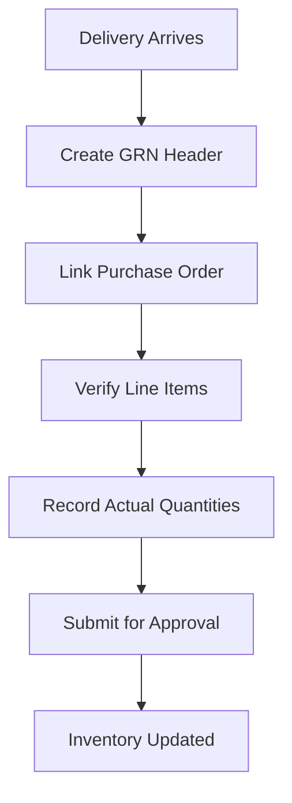
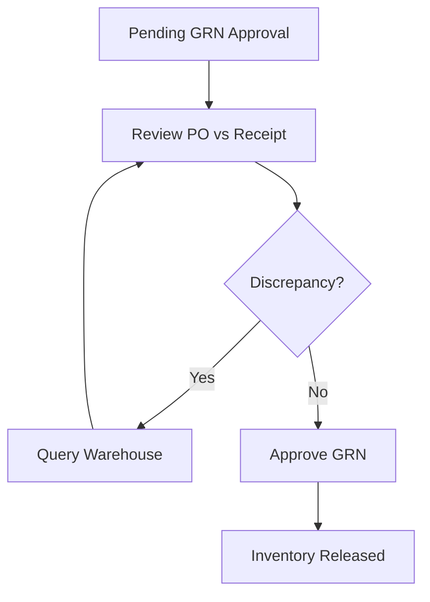

## Purpose and Overview

The **Internal Purchase GRN Applet** is a powerful tool designed to streamline the entire goods receipt process for internal purchase transactions. It moves beyond simple receipt recording by integrating inventory management, supplier verification, and quality control workflows.


**Core Concept**: The system links **what** you received (Items) to **where** it came from (Purchase Orders) and **how much** was received (Quantities & Quality).


## Key Features Overview

### Who Benefits from This Applet?

**Warehouse Staff & Receivers:**

- Easy recording of goods received with barcode scanning
- Real-time inventory updates
- Quality inspection workflows
- Exception handling for discrepancies

**Purchase Teams & Buyers:**

- Automated PO matching and closure
- Supplier performance tracking
- Cost verification and approval
- Complete audit trail

**Finance & Accounting Teams:**

- Automated three-way matching (PO, GRN, Invoice)
- Accurate cost allocation
- Reduced processing time
- Compliance with procurement policies

**Management & Supervisors:**

- Better control over inventory levels
- Reduced receiving errors
- Improved supplier relationships
- Data-driven procurement analysis

### What Problems Does This Solve?

**The Manual Receipt Process Problem:**

Traditional goods receipt relies on paper forms and manual data entry. Common issues include:

- Lost paperwork and missing receipts
- Inventory discrepancies and stock errors
- Manual quantity verification leading to mistakes
- Difficult supplier performance tracking
- No centralized receiving records

**The Internal Purchase GRN Solution:**

- **Digital receipt recording** - Capture receipts anytime with mobile support
- **Automated PO matching** - Intelligent linking to purchase orders
- **Real-time inventory updates** - Automatic stock-in processing
- **Quality control workflows** - Built-in inspection and approval steps
- **Complete traceability** - Full audit history for every receipt
- **Integration ready** - Connects with inventory and accounting systems



---



















## Key Concepts

### Understanding the GRN Framework

Every goods receipt system must address three fundamental aspects. The Internal Purchase GRN Applet provides structured handling:

| Aspect                      | Component                        | Practical Example                             |
| --------------------------- | -------------------------------- | --------------------------------------------- |
| **What** was received?      | Items & Quantities               | 100 units of Product A, 50 units of Product B |
| **From Where** did it come? | Purchase Order & Supplier        | PO-2024-001 from ABC Suppliers                |
| **How** was it processed?   | Receipt Workflow & Quality Check | Inspection, approval, stock-in                |


**Real-World Example**: A warehouse receives a delivery (WHAT) of 100 laptops from Tech Supplier (WHERE) against PO-2024-001. The system verifies quantities, checks quality, and updates inventory (HOW).


### GRN Hierarchy Structure

Think of the GRN process as a structured flow:

```
Purchase Order
│
├── Supplier Delivery ──→ WHAT is being received?
│   │
│   └── GRN Header ──→ WHO received it and WHEN?
│       │
│       └── GRN Line Items ──→ SPECIFIC quantities and conditions
│           │
│           └── Quality Checks ──→ INSPECTION results
│
└── Inventory Update ──→ HOW stock levels change
    │
    └── Financial Impact ──→ COST allocation and matching
```

**Flow Through the Hierarchy:**

1. **Purchase Order**: Original purchase request
2. **Supplier Delivery**: Physical goods arrival
3. **GRN Header**: Receipt document creation
4. **Line Items**: Item-by-item verification
5. **Quality Checks**: Inspection and approval
6. **Inventory Update**: Stock-in processing

This structure enables:

- **Precise tracking** of all receipts
- **Flexible reporting** by any dimension
- **Clear accountability** for quality
- **Automated financial processing**

### The "Golden Triangle" of GRN Processing

To effectively manage the system, it is crucial to understand how **Purchase Orders**, **GRN Records**, and **Inventory Updates** work together.

| Component            | Analogy            | Definition                                              | Example                                         |
| -------------------- | ------------------ | ------------------------------------------------------- | ----------------------------------------------- |
| **Purchase Order**   | The "Request"      | A formal request to buy specific items from a supplier. | **PO-2024-001** for 100 laptops                 |
| **GRN Record**       | The "Receipt"      | The document confirming what was actually received.     | **GRN-2024-001** confirming 95 laptops received |
| **Inventory Update** | The "Stock Change" | The actual adjustment to inventory levels.              | **+95 laptops** added to warehouse stock        |

**How they link:**

1. You create a **Purchase Order** (e.g., 100 laptops from Tech Supplier).
2. You receive goods and create a **GRN Record** (e.g., 95 laptops actually received).
3. The system processes an **Inventory Update** (e.g., +95 laptops to stock).
4. Any discrepancies (5 missing laptops) are flagged for follow-up.

---

### Advanced Transaction Attributes

The applet captures rich metadata for every transaction to ensure legal and operational compliance.

| Attribute            | Purpose                                      | Practical Example                              |
| -------------------- | -------------------------------------------- | ---------------------------------------------- |
| **Budget Votebook**  | Links receipt to specific budget allocations | "IT Equipment Replacement 2024"                |
| **Contra Entry**     | Offsets payments against other balances      | Offsetting a receipt against a supplier credit |
| **Multi-Currency**   | Handles foreign supplier transactions        | Recording a USD receipt in a MYR base system   |
| **External Remarks** | Notes visible to external parties/suppliers  | "Goods received on pallet #4"                  |

---

## For Warehouse Staff (Receivers)

This section is your personal guide to recording goods receipts and managing warehouse inventory.

### Quick Receipt Workflow

<div align="center">



</div>

### Create Your First GRN

**Goal:** Record a goods receipt and update inventory in 5 simple steps.

1.  **Navigate**: Go to **Internal Purchase GRN** from the sidebar
2.  **Create Header**: Click **"+"** → Enter GRN details (Supplier, Date, Reference) → **Create**
3.  **Link Purchase Order**:
    - Click **"Link PO"**
    - Search and select the relevant **Purchase Order**
    - System auto-populates expected items
4.  **Record Actual Receipt**:
    - For each line item, enter **Actual Quantity Received**
    - Note any **Quality Issues** or **Damage**
    - Upload **Delivery Note** photos
5.  **Finalize**: Click **Submit** → GRN goes for approval → Inventory updates automatically





**What happens next?** You'll get notifications when approved. Inventory updates automatically upon finalization.

**Pro Tip:** Use barcode scanning to speed up item identification and reduce errors.

---

## For Purchase Teams (Buyers)

This section helps you verify receipts against orders and maintain procurement accuracy.

### Approval & Verification Workflow

<div align="center">



</div>

### Verify Your First Receipt

**Goal:** Review and approve goods receipts in 3 steps.

1.  **Check Pending**: Go to **Pending GRN Approvals** (you'll see a notification badge)
2.  **Review Details**:
    - Click on the GRN to open
    - Check: Quantities received vs ordered, supplier delivery note
    - **Verify Financials**: Check currency rates, contra entries, and expense allocation.
    - Verify any discrepancies are explained
3.  **Decide**:
    - **Approve**: Click ✓ **Approve** → Inventory gets updated
    - **Reject**: Click ✗ **Reject** → Add reason → Warehouse notified
    - **Query**: Click **Query** → Ask for more information

#### Deep-Dive: Financial & Budgetary Control

The system ensures every GRN is accounted for within the company's financial framework:

- **Departmental Allocation**: Assign receipts to specific Profit Centers, Segments, or Projects.
- **Budget Register**: Track utilization against Fiscal Periods and specific Budget Items.
- **Foreign Exchange History**: Maintain a history of currency rates (Forex Source) used at the time of receipt.

---

**Going on Leave?** Set up delegation: `Settings > GRN Approval Delegation` → Select someone to approve on your behalf.

---

## For Managers & Supervisors

Track warehouse efficiency and supplier performance.

### Monitor Receipt Performance

**Goal:** Track warehouse efficiency and supplier performance in 4 steps.

1.  **Access Dashboard**: Go to **GRN Reports** or **Dashboard**
2.  **Review Key Metrics**:
    - Receipt accuracy rates
    - Average processing time
    - Supplier delivery performance
3.  **Identify Issues**:
    - Check for recurring discrepancies
    - Review quality problems by supplier
4.  **Take Action**:
    - Follow up on problem suppliers
    - Provide feedback to warehouse team

**Ongoing:** Set up automated reports for weekly performance reviews.

---

### Detailed Line Items Management



Line Items Management allows warehouse staff and purchase teams to record and track the receipt of individual items within a GRN. Each line represents a specific product with its own quantity, condition, and quality status.

**How to Record Line Items:**

1.  Open a **GRN** from the listing
2.  Go to **Line Items** tab
3.  For each item received:
    - **Expected Quantity**: Auto-populated from PO
    - **Received Quantity**: Enter actual amount received
    - **Quality Status**: Good, Damaged, Rejected
    - **Notes**: Any special observations
    - **Serial/Batch**: If applicable

**Visual Example:**

```
Item: Laptop Model ABC-123
━━━━━━━━━━━━━━━━━━━━━━━━━━━━━━━━━━━━━━━
Expected: 100 units     Received: 95 units     Status: Good
Missing: 5 units        Reason: Short delivery by supplier

[████████████████████░░] 95% received
```


**Best Practices for Receivers:**

- ✓ **Verify Before Recording**: Always check physical goods against delivery note.
- ✓ **Document Discrepancies**: Take photos and add detailed notes for any issues.
- ✓ **Use Barcode Scanning**: Speed up identification and reduce errors.
- ✓ **Check Serial Numbers**: Verify serial numbers match supplier documentation.
  

---

---

### Detailed PO Matching & Quality Control

PO Matching is the process of linking received goods to their originating purchase orders. This ensures that what you receive matches what you ordered and enables automated processing workflows.

**Matching Process Steps:**

1.  **PO Selection**: Search by PO number or supplier.
2.  **Line Item Population**: System creates GRN lines for all open PO lines.
3.  **Receipt Recording**: Enter actual quantities received.
4.  **Validation**: System checks for over-receipts or quality flags.

**Quality Control Workflows:**

Quality Control Workflows ensure that received goods meet your organization's standards.

- **Good Status**: Items accepted into inventory immediately.
- **Hold Status**: Items require additional inspection or testing.
- **Rejected Status**: Items fail quality standards and initiate return process.

**Real-World Scenarios:**

| Scenario           | Result                         | Action                            |
| ------------------ | ------------------------------ | --------------------------------- |
| **Perfect Match**  | 100 ordered, 100 received good | Auto-approve and stock-in         |
| **Short Delivery** | 100 ordered, 80 received       | Partial receipt, PO remains open  |
| **Damage Found**   | 25 received, 5 damaged         | Accept 20, move 5 to Quality Hold |
| **Over-receipt**   | 100 ordered, 105 received      | Flags for Purchase Team approval  |


**Best Practices for Buyers:**

- ✓ **Fast-Track Routine Receipts**: Bulk approve small, routine GRNs with clear receipts.
- ✓ **Careful Review for High-Value**: Take time with GRNs > RM 5,000.
- ✓ **Clear Rejection Reasons**: Always explain WHY a receipt was rejected (e.g., "Missing tax invoice").
- ✓ **Use Delegation**: Set up approval delegation when going on leave.
  

---

---

---

## For Administrators (System Setup)

Configure the system to match your organizational workflows and inventory policies.

### Core Configuration & Integration



Administrators are responsible for setting up the foundational parameters that govern how receipts are processed, approved, and integrated with inventory.

#### Inventory Integration Settings

Inventory Integration ensures that all goods receipts automatically update your inventory management system in real-time.

- **Update Timing**: Real-time upon approval or batch processing.
- **Costing Methods**: Weighted Average, FIFO, LIFO, or Standard Cost.
- **Location Management**: Default receiving bins and quality hold areas.

#### Approval & Quality Settings

- **GRN Approval Settings**: Define multi-level approval chains based on value or quality status.
- **Quality Control Settings**: Mandatory inspection thresholds and supplier-specific rules.


**Best Practices for Administrators:**

- ✓ **Assign Backup Approvers**: Ensure every level in the approval chain has at least one backup to prevent bottlenecks.
- ✓ **Monitor Costing Accuracy**: Regularly review unit costs in GRNs to ensure they align with Purchase Orders and supplier invoices.
- ✓ **Automate Sequential Numbering**: Use a prefix (e.g., GRN-2024-) to make document tracking and auditing easier.
- ✓ **Review Integration Logs**: Periodically check integration logs to ensure stock-in transactions are reaching the ERP correctly.
  

---

## Reporting & Analytics

**Comprehensive receipt and performance analysis tools.**

### GRN Summary Reports

**Overview of all goods receipt activities.**

The GRN Summary Reports provide high-level visibility into receipt operations, helping managers monitor performance and identify trends.

**Key Metrics Displayed:**

**Volume Metrics:**

- Total GRNs processed
- Total value received
- Average GRN value
- Processing time statistics

**Performance Metrics:**

- Receipt accuracy rates
- Quality acceptance rates
- Approval cycle times
- Exception rates

**Trend Analysis:**

- Monthly/quarterly comparisons
- Seasonal patterns
- Growth trends
- Performance improvements

---

### Supplier Performance Reports

**Detailed analysis of supplier delivery and quality performance.**

Track and evaluate supplier performance across multiple dimensions to support procurement decisions.

**Performance Categories:**

**Delivery Performance:**

- On-time delivery rates
- Quantity accuracy
- Lead time consistency
- Delivery completeness

**Quality Performance:**

- Quality acceptance rates
- Defect rates
- Return percentages
- Quality improvements

**Service Performance:**

- Documentation accuracy
- Communication responsiveness
- Issue resolution time
- Compliance rates

---

### Inventory Impact Reports

**Analysis of how receipts affect inventory levels and costs.**

Understand the financial and operational impact of goods receipts on inventory management.

**Impact Analysis:**

**Inventory Levels:**

- Stock level changes
- Turnover rates
- Carrying costs
- Obsolescence risks

**Cost Analysis:**

- Cost variances
- Price trends
- Landed cost analysis
- Budget vs actual

**Operational Impact:**

- Stockout prevention
- Service level improvements
- Working capital effects
- Space utilization

---

## Configuration & Settings

Tailor the Internal Purchase GRN applet to your specific workflow for faster processing.

### Customizing Your View

The applet allows individual users to personalize their interface:

- **Sidebar Shortcuts**: Pin the "Pending Approvals" or "Recent GRNs" to your sidebar for one-click access.
- **Table Customization**: Show or hide columns in the main listing (e.g., hide "Reference" if not used).
- **Default Filters**: Save your preferred filters (e.g., "Status = Pending" and "Branch = My Branch") as the default view.
- **Favorite Suppliers**: Mark frequently used suppliers as favorites to find them faster when creating manual GRNs.

---

### GRN Approval Settings (`Settings > GRN Approval Settings`)

**Configure approval workflows for goods receipt processing.**

The GRN Approval Settings define who needs to approve goods receipts and under what conditions. This ensures proper authorization and control over inventory additions.

**Creating an Approval Rule - Field Guide:**

| Field                  | Purpose                                      | Why It Matters                    | Example                                                  |
| ---------------------- | -------------------------------------------- | --------------------------------- | -------------------------------------------------------- |
| **Approval Level**     | Order of approval (1st, 2nd, 3rd)            | Determines approval sequence      | Level 1: Warehouse Supervisor, Level 2: Purchase Manager |
| **Approval Condition** | When this approval is required               | Controls which GRNs need approval | Value > RM 1,000, Quality Issues, Over-receipts          |
| **Approver Role**      | Who can approve at this level                | Links to organizational hierarchy | Purchase Manager, Quality Inspector, Finance Director    |
| **Delegation Rules**   | Backup approvers when primary is unavailable | Ensures no delays during leave    | Deputy Manager, Department Head                          |

**Common Approval Scenarios:**

**Standard Approval:**

```
All GRNs → Warehouse Supervisor → Inventory Update
```

**High-Value Approval:**

```
GRNs > RM 5,000 → Warehouse Supervisor → Purchase Manager → Inventory Update
```

**Quality Issue Approval:**

```
GRNs with Quality Issues → Quality Inspector → Purchase Manager → Supplier Notification
```

---

### GRN Number Configuration (`Settings > GRN Numbering`)

**Set up automatic numbering for GRN documents.**

Configure how GRN numbers are generated to ensure unique identification and proper sequencing.

**Numbering Options:**

| Format             | Example                    | Use Case                   |
| ------------------ | -------------------------- | -------------------------- |
| **Sequential**     | GRN-000001, GRN-000002     | Simple numbering           |
| **Date-Based**     | GRN-2024-001, GRN-2024-002 | Year-based tracking        |
| **Branch-Based**   | KL-GRN-001, JB-GRN-001     | Multi-location operations  |
| **Supplier-Based** | SUP001-GRN-001             | Supplier-specific tracking |

**Configuration Fields:**

- **Prefix**: Text before the number (e.g., "GRN-")
- **Number Length**: Minimum digits (e.g., 6 digits = 000001)
- **Reset Frequency**: Never, Yearly, Monthly
- **Branch Inclusion**: Include branch code in number
- **Date Format**: YYYY, YYMM, YYYYMM options

---

### Quality Control Settings (`Settings > Quality Control`)

**Configure inspection requirements and quality workflows.**

Define quality control parameters to ensure consistent inspection processes across all receipts.

**Quality Configuration Options:**

**Inspection Requirements:**

- Mandatory inspection for all items
- Value-based inspection thresholds
- Supplier-specific inspection rules
- Item category inspection requirements

**Quality Status Options:**

- Good (immediate acceptance)
- Hold (pending further review)
- Rejected (return to supplier)
- Conditional (accept with conditions)

**Approval Workflows:**

- Quality inspector assignment
- Management approval thresholds
- Supplier notification processes
- Documentation requirements

---

### Inventory Integration Settings (`Settings > Inventory Integration`)

**Configure how GRNs update inventory systems.**

Set up the connection between goods receipts and inventory management to ensure accurate stock tracking.

**Integration Parameters:**

**Update Timing:**

- Real-time updates upon approval
- Batch processing at scheduled times
- Manual update triggers
- End-of-day processing

**Costing Methods:**

- Weighted Average Cost
- FIFO (First In, First Out)
- LIFO (Last In, First Out)
- Standard Cost with variances

**Location Management:**

- Default receiving locations
- Automatic bin assignments
- Quality hold areas
- Quarantine locations

---

### Supplier Performance Settings (`Settings > Supplier Performance`)

**Configure supplier evaluation and tracking parameters.**

Set up metrics and thresholds for monitoring supplier delivery performance and quality.

**Performance Metrics:**

**Delivery Performance:**

- On-time delivery percentage
- Quantity accuracy rates
- Quality acceptance rates
- Lead time consistency

**Quality Metrics:**

- Defect rates by supplier
- Return/rejection percentages
- Quality improvement trends
- Certification compliance

**Scoring Parameters:**

- Weighting for different metrics
- Performance thresholds
- Escalation triggers
- Improvement targets

---

## FAQ

**Q: Why can't I see a specific Purchase Order when creating a GRN?**
A: The PO might be fully received, closed, or assigned to a different branch. Ensure the PO is in "Approved" status and has open quantities.

**Q: How do I handle over-receipts when the supplier delivers more than ordered?**
A: Record the actual quantity. The system will flag a "Quantity Over-receipt" which requires approval from the Purchase Manager.

**Q: What happens if I mark items as damaged during receipt?**
A: They are moved to a **Quality Hold** bucket. They do not increase "Available Stock" until a Quality Inspector releases them or initiates a supplier return.

**Q: Can I receive against multiple Purchase Orders in a single GRN?**
A: Yes. Use the "Link Multi-PO" feature to consolidate several small deliveries into one GRN document.

**Q: How do I track serial numbers?**
A: For serialized items, a "Serial Input" button appears on the line item. You can scan or type each individual serial number.

**Q: Can I modify a GRN after it's been approved?**
A: No. Approved GRNs are "Locked" for audit purposes. You must use a "GRN Reversal" or "Adjustment" to correct errors.

**Q: What if the cost on the GRN differs from the PO?**
A: The system flags a "Price Variance". Depending on settings, this may trigger an additional approval level from Finance.

**Q: Why is my GRN stuck in "Submitted" status?**
A: Check the **Approval Queue**. It likely requires a second-level approval from a Department Head or Purchase Manager.
