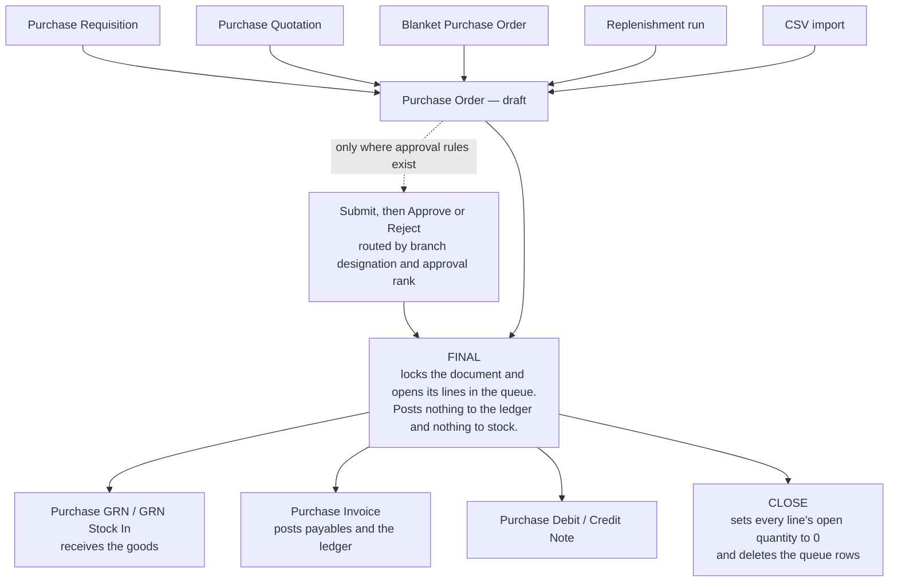

## Overview

The **Purchase Order (Internal)** applet records your company's commitment to buy from a supplier — items, quantities, prices, delivery details and terms — before anything is received or invoiced. Buyers create it (by hand, from a requisition, quotation or blanket order, from a CSV, or from a stock-replenishment run), approvers sign it off, and the warehouse and finance knock its lines off with a GRN and a purchase invoice.

Its engine document type is `INTERNAL_PURCHASE_ORDER` with amount signum **0** and quantity signum **0**: a purchase order posts **nothing** to the General Ledger or to stock. FINAL locks it and opens its lines in the open-queue so downstream documents can knock them off; **CLOSE** empties that queue.



## Where it fits

| Position | Document / applet | Why |
|---|---|---|
| Module | [Purchasing](/modules-v2/purchasing/), [Inventory](/modules-v2/inventory/) | Procurement document; replenishment reads stock balances. |
| Upstream | [Purchase Requisition (Internal)](/applets/purchase-workflow/internal-purchase-requisition-applet/), [Purchase Quotation (Internal)](/applets/purchase-workflow/internal-purchase-quotation-applet/), [Blanket Purchase Order](/applets/purchase-workflow/blanket-purchase-order-applet/), another Purchase Order | **Search Document** (edit) and **KO For** (create) pull lines from these. A PR → PO conversion can be made mandatory in *Approval Monitor*. |
| Downstream | [Purchase GRN (Internal)](/applets/purchase-workflow/internal-purchase-grn-applet/), [Purchase GRN Stock In (Internal)](/applets/purchase-workflow/internal-purchase-grn-stock-in-applet/), [Supplier Delivery Order](/applets/purchase-workflow/supplier-delivery-order-applet/) | Receipt documents knock off PO lines from the open queue; **PO Line with GRN KO** reports the match. |
| Downstream | [Purchase Invoice (Internal)](/applets/finance/internal-purchase-invoice-applet/), [Purchase Invoice No Stock In (Internal)](/applets/purchase-workflow/internal-purchase-invoice-no-stock-in-applet/) | Invoices knock off PO lines; **PO Line with PI KO** reports it. |
| Downstream (adjustments) | [Purchase Debit Note (Internal)](/applets/purchase-workflow/internal-purchase-debit-note-applet/), [Purchase Credit Note (Internal)](/applets/purchase-workflow/internal-purchase-credit-note-applet/) | Both can knock off open PO lines from their create screens. |
| Intercompany | [Sales Order (Internal)](/applets/sales-workflow/internal-sales-order-applet/) | Intercompany processing pairs `INTERNAL_PURCHASE_ORDER` ↔ `INTERNAL_SALES_ORDER` between two companies of the tenant; the **Intercompany** menu is the manual confirmation queue. |
| External | [Purchase Order Supplier Access (Internal)](/applets/purchase-workflow/internal-purchase-order-supplier-access-applet/) | Supplier-facing view of the same document type. |
| Reporting | [Purchase Report](/applets/purchase-workflow/purchase-report-applet/) | Purchase analysis across PO, GRN and invoice. |

## Screens and menus

| Menu | Route | What it is | Hidden by |
|---|---|---|---|
| **Purchase Order** | `purchase-order` | Listing, create, edit. | — |
| **Line Items** | `line-items` | Cross-document line grid with inline edit. | `HIDE_LINE_ITEMS_MENU` unless `SHOW_LINE_ITEMS_MENU` |
| **PO Line with GRN KO** | `po-line-with-grn-ko` | Report: PO lines against GRN knock-offs (ordered vs received). | `HIDE_PURCHASE_ORDER_LINE_WITH_GRN_KO_MENU` unless `SHOW_PURCHASE_ORDER_LINE_WITH_GRN_KO_MENU` |
| **PO Line with PI KO** | `po-line-with-pi-ko` | Report: PO lines against purchase-invoice knock-offs. | `HIDE_PO_LINE_WITH_PI_KO_MENU` |
| **Closed Queue KO** | `closed-queue-report` | Report of closed open-queue rows. | `HIDE_CLOSED_QUEUE_KO_MENU` unless `SHOW_CLOSED_QUEUE_KO_MENU` |
| **Purchase Order Queue** | `purchase-order-queue` | Open-queue rows (outstanding PO lines) — not the approval queue. | `HIDE_PURCHASE_ORDER_QUEUE_MENU` unless `SHOW_PURCHASE_ORDER_QUEUE_MENU` |
| **Multi-PO** | `multi-po` | Create several POs in one pass (own draft and KO screens). | `HIDE_MULTI_PURCHASE_ORDER_MENU` unless `SHOW_MULTI_PURCHASE_ORDER_MENU` |
| **PO Replenishment** → Replenishment Runs / Events / Template | `stock-replenishment*` | Stock-driven PO generation (below). | `HIDE_PURCHASE_ORDER_REPLENISHMENT_MENU` unless `SHOW_PURCHASE_ORDER_REPLENISHMENT_MENU` |
| **File Import** / **File Export** | `file-import`, `file-export` | CSV in and out. | `HIDE_FILE_IMPORT_MENU` / `HIDE_FILE_EXPORT_MENU` unless `SHOW_FILE_IMPORT_MENU` / `SHOW_FILE_EXPORT_MENU` |
| **Intercompany** | `intercompany` | Manual intercompany transaction queue (UNPROCESSED / PROCESSED; *Confirm Intercompany Transaction*). | `HIDE_INTERCOMPANY_MENU` unless `SHOW_INTERCOMPANY_MENU` |
| **Approval Request** / **Approval History** | `approval-request`, `approval-history` | Approve or reject submitted POs; audit past decisions. | `HIDE_APPROVAL_REQUEST_MENU` / `HIDE_APPROVAL_HISTORY_MENU` unless `SHOW_…` |
| **PO Free Gift** | `po-free-gift` | Free-gift rules attached to POs (main items → gift items; `ENABLE_MULTIPLE_MAIN_ITEMS`, `FREE_GIFT_TOP_LEVEL_LOGIC` AND/OR, `SIMPLIFIED_UI`). | shown only with `SHOW_PO_FREE_GIFT_MENU` |
| **Audit Trail** | `audit-trail` | Change log. | `HIDE_AUDIT_TRAIL_MENU` |
| **Settings** | `settings/…` | Application Settings, Default Selection, Printable Format Settings, Branch Settings, Workflow Settings, Email Template, Branch Designation, Approval Settings, Approval Monitor, Custom Resource Bundle Configuration, Custom Field Placement, Spreadsheet View configuration, Webhook, Feature Visibility, Client Side Permission, Role Pricing Scheme Link, Permission Wizard / Set / User / Team / Role Permission, Release Notes, Applet Log. | — |
| **Personalization** | `personalization/personal-default-selection` | Per-user Default Selection. | — |

### Listing

Filters by the default posting status and date window; **Advanced Search** for everything else. Bulk actions: **FINAL**, **DISCARD**, **VOID** (disabled when the selection contains a row in the wrong status) and **SINGLE/MULTIPLE PRINT** with a printable-format picker (hidden by `HIDE_PRINT_BUTTON`; `ENABLE_PRINT_FINAL_GEN_DOC_ONLY` limits printing to FINAL documents).

### Create screen



Tabs: **Main Details**, **Account**, **Lines**, **KO For** (hidden by `HIDE_KO_FOR_TAB`), **Delivery Details**, **Payment**, **Department Hdr**. **KO For** has sub-tabs for Blanket Purchase Order, Purchase Quotation and Purchase Requisition; `ENABLE_MULTIPLE_KO` allows one line to knock off several source lines.

### Edit screen

Header buttons: **SAVE**, **FINAL**, **DISCARD** (draft), **VOID** (FINAL), **CLONE** (background job, polls three times), **CLOSE** (sets every line's open quantity to 0 and deletes the open-queue rows; hidden by `HIDE_CLOSE_BUTTON`; confirmation dialog).

Tabs, in the order set by *Default Selection → Details Tab Ordering*: **Search Document** (Search Blanket Purchase Order / Purchase Order / Purchase Quotation / Purchase Requisition), **Main Details**, **Account**, **Lines** (inline grid v2 with stock-balance column when `SHOW_ITEM_STOCK_BALANCE`), **KO For**, **ARAP**, **Delivery Details**, **Payment**, **Department Hdr**, **Trace Document**, **Contra**, **Doc Link**, **Attachments**, **Export**, **Events**, and **Generic Doc Approval** (Submit / Approve / Reject).

### File Import and Export

**File Import → + → Upload Master Data → Sample Format for Purchase Order** opens the column picker and downloads `MasterData_Upload_InternalPurchaseOrderData.csv`. CSV only; delimiter PIPE, COMMA, SEMICOLON or TAB must match the file; **ADD** enables after a file is attached. Results appear on the import listing (Status, Process Status, User Error Message).

| Mandatory column | Meaning |
|---|---|
| `BRANCH_CODE` | Owning branch. |
| `TXN_DATE` | Transaction date. |
| `HDR_REF_NO` | Header reference. |
| `DOC_CURRENCY` | Document currency. |
| `ENTITY_CODE` | Supplier code. |
| `SETTLEMENT_OR_ITEM_CODE` | Item (or settlement) code. |
| `QTY` | Line quantity. |

Common optional columns: `UOM`, `UNIT_PRICE_INCL_TAX` / `AMOUNT_INCL_TAX`, `TAX_GST_CODE`, `BASE_DOC_X_RATE`, billing and shipping address columns, `SEGMENT_CODE`, `GL_DIMENSION_CODE`, `PROFIT_CENTRE_CODE`, `PROJECT_CODE`, line remarks. A column header that is not in the sample is rejected (wrong-column check, 2026). **File Export** downloads the filtered listing.

### PO Replenishment

| Menu | What it holds |
|---|---|
| **Replenishment Template** | Reusable rule set: company, location, item filters and the item list with manual minimum / maximum / reorder quantities and a **Fulfill Option**. |
| **Replenishment Events** | Named schedules (event code, name, cycle start / end, recurring rule, **Action Logic**) linked to a template. |
| **Replenishment Runs** | An execution: current and previous run window, per item the company and location balances, reserved, in-transit, open-PO, sales-order-in-queue and last-30-days sales quantities, the calculated reorder quantity (**Location Qty Reorder Calculation**, **Company Quantity Recommend AI**), the requested and approved quantities, and the generated purchase orders. |

### Intercompany

The **Intercompany** menu lists queue rows created by branch intercompany rules when a PO is finalised: **UNPROCESSED** rows (source PO, target document type, configuration used) wait for **CONFIRM INTERCOMPANY TRANSACTION**; **PROCESSED** rows are the audit trail. The engine pairs `INTERNAL_PURCHASE_ORDER` → `INTERNAL_SALES_ORDER` (and the reverse) with quantity and amount signum 0. The **Intercompany** sub-tab on the Account tab (`HIDE_INTERCOMPANY_TAB`) is a different thing: it shows the link on the document itself.

## Configuration

### Before you can use it

| Prerequisite | Where | Why |
|---|---|---|
| Company, branch, location | [Organisation](/applets/master-data/organisation-applet/) | Branch and location are required header fields; `DEFAULT_BRANCH` / `DEFAULT_LOCATION` pre-fill them. |
| Supplier entities | [Supplier](/applets/master-data/supplier-applet-1/) | Account tab. `ENABLE_SELECT_MODE` + `ALLOW_TO_CREATE_EDIT_ACCOUNT` let buyers create a supplier from the picker; `ENABLE_BRANCH_FILTER` limits the picker to the branch's suppliers. |
| Items | [Doc Item Maintenance](/applets/master-data/doc-item-maintenance-applet/) | Lines. `EXCLUDE_ACCOUNT_CODE_ITEM_TYPE_AT_ITEM_SEARCH` keeps GL-code items out of the picker. |
| Pricing schemes | [Pricebook](/applets/master-data/pricebook-applet/) | `DEFAULT_PRICING_SCHEME` and *Branch Settings → Pricing Scheme* derive unit prices; *Role Pricing Scheme Link* ties schemes to roles. |
| Tax codes | [Tax Configuration](/applets/master-data/tax-configuration-applet/) | Line tax and WHT. |
| Employees with designations | [Employee](/applets/master-data/employee-applet/) and *Settings → Branch Designation* | Approval routing uses designation and approval rank per branch. |
| Approval rules | This applet → *Approval Settings*, *Approval Monitor* | Optional. Only if POs must be approved or must originate from a requisition — approvals are off until a setting exists. See [Document Approvals](/guides/document-approvals/). |
| Forex rates | [Forex](/applets/master-data/forex-applet/) | Foreign-currency POs need a rate; `CANNOT_EDIT_CURRENCY_RATE` locks it unless the user holds `EDIT_CURRENCY_RATE`. |
| Permissions | *Permission Wizard / Set*, *Client Side Permission* | Server-side create / read / update / delete on `INTERNAL_PURCHASE_ORDER` with targets; client-side switches below. |

### Applet settings

**Settings → Default Selection**:

| Setting | What it controls | Default | Effect when changed | Who can change it |
|---|---|---|---|---|
| `DEFAULT_BRANCH`, `DEFAULT_LOCATION` (and derived `DEFAULT_COMPANY`) | Branch and location pre-selected on new POs. | none | New POs open with them; personal defaults override. | Tenant admin with the applet's Settings menu |
| `DEFAULT_VALIDITY_DAYS` | "Validity in Day(s)" — how far after the transaction date the validity date defaults. | none | Validity date pre-fills; `REQUIRE_VALIDITY_DATE` makes it mandatory. | Same |
| `DEFAULT_DECIMAL_PRECISION`, `DEFAULT_DECIMAL_STEP` | Unit-price decimal precision and step. | none | Line price inputs round and step accordingly. | Same |
| `DEFAULT_CURRENCY` | Document currency for new POs. | none | Header currency pre-fills. | Same |
| `DEFAULT_PRICING_SCHEME` | Pricing scheme used to derive line prices. | none | Applies when no branch/role scheme wins. | Same |
| `DEFAULT_LANGUAGE_CODE` | Resource-bundle language for the applet's labels. | none | Works with *Custom Resource Bundle Configuration*. | Same |
| `PURCHASE_ORDER_DETAILS_TAB_ORDER` | Drag-and-drop order of the 15 edit tabs. | code order | Re-orders for everyone. | Same |

**Settings → Application Settings** (shared field-configuration screen; toggles labelled by key, default off). Keys this applet reads, by group:

| Group | Keys | What they control |
|---|---|---|
| Listing | `DEFAULT_POSTING_STATUS`, `DEFAULT_STATUS`, `DEFAULT_TRANSACTION_DATE`, `DISABLE_GEN_DOC_LISTING`, `ENABLE_PRINT_FINAL_GEN_DOC_ONLY`, `HIDE_PRINT_BUTTON`, `HIDE_SEND_EMAIL_BUTTON`, `PRINTABLE`, `ENABLE_AUTO_POPUP` | Default filters, print controls, default printable format, PDF pop-up after FINAL (moved into the FINAL-success effect in 2026 so it no longer waits a fixed delay). |
| Menus | `HIDE_LINE_ITEMS_MENU`, `HIDE_PURCHASE_ORDER_QUEUE_MENU`, `HIDE_MULTI_PURCHASE_ORDER_MENU`, `HIDE_PURCHASE_ORDER_REPLENISHMENT_MENU`, `HIDE_FILE_IMPORT_MENU`, `HIDE_FILE_EXPORT_MENU`, `HIDE_INTERCOMPANY_MENU`, `HIDE_PURCHASE_ORDER_LINE_WITH_GRN_KO_MENU`, `HIDE_PO_LINE_WITH_PI_KO_MENU`, `HIDE_CLOSED_QUEUE_KO_MENU`, `HIDE_APPROVAL_REQUEST_MENU`, `HIDE_APPROVAL_HISTORY_MENU`, `HIDE_AUDIT_TRAIL_MENU`, `SHOW_PO_FREE_GIFT_MENU` | Sidebar entries (see the menu table for the matching `SHOW_…` permissions). |
| Buttons | `HIDE_GENDOC_FINAL_BUTTON`, `HIDE_GENDOC_VOID_BUTTON`, `HIDE_GENDOC_DISCARD_BUTTON`, `HIDE_GENDOC_SAVE_BUTTON`, `HIDE_CLOSE_BUTTON`, `HIDE_EXPORT_AS_PDF_BUTTON` | Edit-screen buttons; `SHOW_GENDOC_*_BUTTON` / `SHOW_CLOSE_BUTTON` permissions restore them per user. |
| Header fields | `HIDE_DOC_SHORT_CODE`, `HIDE_SERVER_DOC_1..3`, `HIDE_CLIENT_DOC_TYPE`, `HIDE_CLIENT_DOC_1..5`, `HIDE_PURCHASER`, `LOCK_PURCHASER_TO_CURRENT_USER`, `ENABLE_EMPLOYEE_LOGIN_AUTO_DETECTION`, `HIDE_TRACKING_ID`, `HIDE_PERMIT_NO`, `HIDE_CURRENCY`, `HIDE_BASE_CURRENCY`, `SHOW_FOREX_DATA_SOURCE`, `CANNOT_EDIT_CURRENCY_RATE`, `HIDE_CREDIT_TERMS`, `HIDE_CREDIT_LIMIT`, `HIDE_REFERENCE`, `HIDE_REMARKS`, `HIDE_DESCRIPTION`, `HIDE_VALIDITY_DATE`, `REQUIRE_VALIDITY_DATE`, `HIDE_DUE_DATE`, `HIDE_ETA`, `HIDE_LOCATION`, `HIDE_CREATED_BY`, `HIDE_CREATED_BY_DETAILS`, `HIDE_CREATED_DATE`, `HIDE_UPDATED_BY`, `HIDE_UPDATED_DATE`, `HIDE_WORKFLOW_STATUS`, `HIDE_WORKFLOW_RESOLUTION`, `HIDE_EMPLOYEE_RANKING`, `ENABLE_DUPLICATE_REFERENCE_CHECK`, `SHOW_BUDGET`, `DISABLE_LINES_FOLLOWING_HDR_BUDGET` | Main Details visibility and behaviour. `LOCK_PURCHASER_TO_CURRENT_USER` pins the purchaser to the login unless the user holds `SHOW_ALL_PURCHASERS`. `SHOW_BUDGET` adds vote-book and fiscal-period budget selectors; lines inherit the header budget unless `DISABLE_LINES_FOLLOWING_HDR_BUDGET`. |
| External Documents | `HIDE_EXTERNAL_QUOTATION`, `HIDE_EXTERNAL_ORDER`, `HIDE_EXTERNAL_DELIVERY_ORDER`, `HIDE_EXTERNAL_INVOICE`, `HIDE_EXTERNAL_OTHERS`, `HIDE_EXTERNAL_REMARKS`, `MANDATORY_QUOTATION`, `MANDATORY_ORDER`, `MANDATORY_DELIVERY_ORDER`, `MANDATORY_INVOICE`, `MANDATORY_OTHERS` and the `…_DATE` pairs | The five external reference / date pairs; mandatory flags add required validators. |
| Account tab | `HIDE_ACCOUNT_BILLING_CONTACT`, `HIDE_ACCOUNT_SHIPPING_CONTACT`, `HIDE_BILL_TO_TAB`, `HIDE_SHIP_FROM_TAB`, `HIDE_INTERCOMPANY_TAB`, `HIDE_SUPPLIER_CATEGORY_TAB`, `HIDE_SUPPLIER_LOGIN_TAB`, `HIDE_SUPPLIER_PAYMENT_CONFIG_TAB`, `ENABLE_SELECT_MODE`, `ENABLE_BRANCH_FILTER`, `DEFAULT_CUST_TYPE`, `DEFAULT_COUNTRY` | Supplier picker and the supplier sub-tabs. |
| Lines | `HIDE_QTY_BASE`, `HIDE_QTY_UOM`, `HIDE_UOM_TO_BASE_RATIO`, `HIDE_UNIT_PRICE_STD_*`, `HIDE_UNIT_PRICE_NET_*`, `HIDE_UNIT_PRICE_TXN`, `HIDE_UNIT_PRICE_TXN_UOM_INCL_TAX`, `HIDE_UNIT_DISCOUNT`, `HIDE_UNIT_DISCOUNT_UOM_EXCL_TAX`, `HIDE_MULTI_DISCOUNT`, `HIDE_GROUP_DISCOUNT_PERCENTAGE`, `HIDE_TOTAL_DISCOUNT_AMOUNT`, `HIDE_AMOUNT_STD_EXCL_TAX`, `HIDE_DISCOUNT_AMOUNT_EXCL_TAX`, `HIDE_AMOUNT_NET_EXCL_TAX`, `HIDE_AMOUNT_TXN`, `HIDE_LAST_PURCHASE_PRICE`, `SHOW_REBATE_PRICE`, `HIDE_TAX_CONFIG_SELECTION`, `HIDE_WHT_CONFIG_SELECTION`, `HIDE_LINE_ITEMS_GL_CODE`, `HIDE_LINE_ITEMS_BRANCH`, `HIDE_LINE_ITEM_DETAILS_REMARKS`, `HIDE_LINE_ITEM_LISTING_TXN_AMOUNT`, `HIDE_COSTING_DETAILS`, `HIDE_PRICING_DETAILS`, `HIDE_DELIVERY_DETAILS`, `HIDE_DELIVERY_INSTRUCTION`, `HIDE_ISSUE_LINK`, `HIDE_DOC_LINK`, `HIDE_CHILD_ITEMS_TAB`, `HIDE_EAN_CODE`, `HIDE_BATCH_NUMBER`, `HIDE_BATCH_EXPIRY_DATE`, `HIDE_BATCH_ISSUE_DATE`, `HIDE_BIN_NUMBER`, `MANDATORY_BIN_NUMBER`, `HIDE_SERIAL_NUMBER`, `HIDE_DEPARTMENT`, `ENABLE_EDITING_UNIT_PRICE_STD`, `DISABLE_EDITING_AMOUNT_TXN`, `DISALLOW_LINE_ITEM_EDIT`, `DISABLE_LINE_ITEM_NAME_EDIT`, `ENABLE_ITEM_NAME_MAX_LIMIT` + `ITEM_NAME_MAX_LIMIT`, `DISABLE_ITEM_LISTING`, `SHOW_ITEM_STOCK_BALANCE`, `PURCHASE_ORDER_INLINE_LINE_ITEMS_COLUMNS`, `SHOW_LINE_ITEM_DOC_NO_TENANT`, `SHOW_LINE_ITEM_ENTITY_ID`, `SHOW_LINE_ITEM_ENTITY_NAME`, `SHOW_LINE_ITEM_TRANSACTION_DATE` | Line grid columns and sub-panels. `DISALLOW_LINE_ITEM_EDIT` blocks edits unless the user holds `ALLOW_LINE_ITEM_EDIT`; `SHOW_ITEM_STOCK_BALANCE` also makes FINAL validate stock balance. |
| Knock-off | `HIDE_KO_FOR_TAB`, `ENABLE_MULTIPLE_KO`, `HIDE_PO_LINE_WITH_GRN_KO_LISTING` | KO For tab on create; one-to-many knock-off; the GRN KO report listing. |
| Delivery | `HIDE_DELIVERY_DETAILS_TAB`, `HIDE_DELIVERY_BRANCH`, `HIDE_DELIVERY_LOCATION`, `SHOW_SHIPMENT_TRACKING_DATES` | Delivery Details tab fields. |
| Department tags | `HIDE_SEGMENT`, `HIDE_DIMENSION`, `HIDE_PROFIT_CENTER`, `HIDE_PROJECT`, `MANDATORY_SEGMENT`, `MANDATORY_DIMENSION`, `MANDATORY_PROFIT_CENTER`, `MANDATORY_PROJECT`, `HIDE_DEPARTMENT_HDR_TAB` | Accounting dimensions. |
| Other tabs | `HIDE_MAIN_PAYMENT_TAB`, `HIDE_ATTACHMENT_TAB`, `HIDE_DOC_LINK_FROM`, `HIDE_DOC_LINK_TO`, `HIDE_ARAP_PNS`, `HIDE_ARAP_SETTLEMENT`, `HIDE_ARAP_DOC_OPEN`, `HIDE_ARAP_CONTRA`, `HIDE_ARAP_BAL`, `ENABLE_EDIT_PAYMENT_DATE` | Payment, Attachment, Doc Link and ARAP visibility. |
| Layout | `VERTICAL_ORIENTATION`, `DEFAULT_ORIENTATION`, `DEFAULT_TOGGLE_COLUMN` | Tabs vs panels; single or double column. |
| Free gift | `ENABLE_MULTIPLE_MAIN_ITEMS`, `FREE_GIFT_TOP_LEVEL_LOGIC` (`AND` / `OR`), `FREE_GIFT_INLINE_LINE_ITEMS_COLUMNS`, `SIMPLIFIED_UI` | The PO Free Gift screens. |

### Document behaviour settings

| Behaviour | Where it is set | Notes |
|---|---|---|
| Approval routing | *Settings → Approval Settings* — Approval Setting Code / Name, Server Doc Type, Submitter Designation Code, Approver Designation, Min / Max Approval Amount, Total Required Approval Levels, Approval Levels Configuration, Approval Logic, Approval Quorum. *Settings → Branch Designation* — per branch, the employees with Designation, Approval Level and Approval Rank. *Settings → Workflow Settings* — the workflow process (Process Code, Server Doc Type, Company) attached to the document. | Submit from the **Generic Doc Approval** tab creates an approval record (`bl_fi_generic_doc_approval_hdr`); approvers act in **Approval Request**. FINAL itself is not blocked by approval status in the applet code — enforce it by hiding FINAL (`HIDE_GENDOC_FINAL_BUTTON`) for submitters. |
| Requisition-first policy | *Settings → Approval Monitor* — rule From Server Doc Type `INTERNAL_PURCHASE_REQUISITION` To `INTERNAL_PURCHASE_ORDER`, **Is Document Conversion Required**, Remarks. | When required, submitting for approval checks for a document link from a requisition; otherwise the tab shows *Purchase Order needs to be converted from Purchase Requisition* and refuses. |
| Closing | **CLOSE** button (`HIDE_CLOSE_BUTTON`, `SHOW_CLOSE_BUTTON` / `SHOW_CLOSE_PO` permissions). | Zeroes `qty_open` on every line and deletes the open-queue rows; the PO drops out of GRN / invoice knock-off pickers. |
| Backdating | Permission `PO_ALLOW_BACKDATE_TRANSACTION`. | Without it the transaction date cannot be earlier than today. |
| Printables | *Printable Format Settings* (Format Code, Format Name, template); `PRINTABLE`; *Branch Settings → Printable Format*; permission `PRINTABLE_FORMAT_WITH_NO_PRICE` for a no-price layout; `HIDE_PRICE` permission hides prices on screen. | |
| Email | *Settings → Email Template* (Template Code, Template) with `INTERNAL_PURCHASE_ORDER_EMAIL_TEMPLATE`; permission `SEND_EMAIL_TO_FINAL_GEN_DOCS_ONLY`. | The Export tab's email action. |
| Custom fields and labels | *Custom Field Placement* (per screen area: Account, Add Child Item, Add Contra, Add Payment, address lines …), *Custom Resource Bundle Configuration*, *Spreadsheet View configuration* (Column Label, Line View Mode). | Rename labels, place custom fields, switch the line grid to spreadsheet view. |
| e-Invoice | Not applicable — a purchase order is not an e-Invoice document type. | |
| Webhooks | *Settings → Webhook*. | |

### Branch settings

| Sub-tab | What it controls |
|---|---|
| **Branch Details** | Read-only Branch Name / Code / Company; **Sales Agent** (default purchaser); **Rounding Five Cent** + rounding item; **Group Discount Item**. |
| **Default Settlement Method** | Pre-selected settlement method on the Payment tab. |
| **Item Category Filter** | Item categories offered at this branch. |
| **Menu List** | Sidebar menus per branch. |
| **Pricing Scheme** | Branch pricing schemes. |
| **Printable Format** | Branch default printable format. |

### Feature visibility / permissions

Server-side: `INTERNAL_PURCHASE_ORDER` create / read / update / delete with targets (company, branch, location, supplier, employee …) via *Permission Wizard* / *Permission Set*.

Client-side permissions seeded for this applet (`internalPurchaseOrderApplet`), grouped:

| Group | Permission codes |
|---|---|
| Menus | `SHOW_FILE_IMPORT_MENU`, `SHOW_FILE_EXPORT_MENU`, `SHOW_INTERCOMPANY_MENU`, `SHOW_MULTI_PURCHASE_ORDER_MENU`, `SHOW_PURCHASE_ORDER_QUEUE_MENU` (plus, checked in code but not seeded: `SHOW_LINE_ITEMS_MENU`, `SHOW_PURCHASE_ORDER_REPLENISHMENT_MENU`, `SHOW_PURCHASE_ORDER_LINE_WITH_GRN_KO_MENU`, `SHOW_CLOSED_QUEUE_KO_MENU`, `SHOW_APPROVAL_REQUEST_MENU`, `SHOW_APPROVAL_HISTORY_MENU`) |
| Buttons | `SHOW_GENDOC_FINAL_BUTTON`, `SHOW_GENDOC_SAVE_BUTTON`, `SHOW_GENDOC_DISCARD_BUTTON`, `SHOW_GENDOC_VOID_BUTTON`, `SHOW_FINAL_BUTTON`, `SHOW_SAVE_BUTTON`, `SHOW_DRAFT_BUTTON`, `SHOW_CLONE_BUTTON`, `SHOW_CLOSE_BUTTON`, `SHOW_CLOSE_PO`, `SHOW_PRINT_BUTTON`, `SHOW_GENERATE_BUTTON`, `SHOW_SEND_EMAILS`, `HIDE_DOCUMENT_DELETE_BUTTON`, `HIDE_EMAIL_PAYMENT_URL_BUTTON` |
| Header fields | `SHOW_DOC_NO_TENANT`, `SHOW_DOC_NO_COMPANY`, `SHOW_DOC_NO_BRANCH`, `SHOW_TRANSACTION_DATE`, `SHOW_PREFIX`, `SHOW_SOURCE_DOC_NO`, `SHOW_MARKETPLACE_ORDER_NO`, `SHOW_CLIENT_DOC_TYPE`, `SHOW_CLIENT_DOC_1..5`, `SHOW_QUOTATION`, `SHOW_ORDER`, `SHOW_DELIVERY_ORDER`, `SHOW_INVOICE`, `SHOW_OTHERS`, `SHOW_EXTERNAL_REMARKS`, `SHOW_REFERENCE`, `SHOW_REMARKS`, `SHOW_DESCRIPTION`, `SHOW_REASON`, `SHOW_PERMIT_NO`, `IPO_HIDE_TRACKING_ID_AND_PERMIT_NO`, `SHOW_VALIDITY_DATE`, `REQUIRE_VALIDITY_DATE`, `SHOW_CREDIT_TERMS`, `SHOW_CREDIT_LIMIT`, `DISABLE_CREDIT_LIMIT_FILTER`, `SHOW_CURRENCY`, `SHOW_BASE_CURRENCY`, `EDIT_CURRENCY_RATE`, `HIDE_FOREX_DATA_SOURCE`, `SHOW_LOCATION`, `SHOW_DELIVERY_BRANCH`, `SHOW_DELIVERY_LOCATION`, `SHOW_SALES_AGENT/PURCHASER`, `SHOW_ALL_PURCHASERS`, `DISABLE_EMPLOYEE_LOGIN_AUTO_DETECTION`, `SHOW_CREATED_BY_DETAILS`, `PO_ALLOW_BACKDATE_TRANSACTION`, `HIDE_BUDGET` |
| Lines and pricing | `PURCHASE_ORDER_DISPLAY_PRICING`, `HIDE_PRICE`, `SHOW_QTY_BASE`, `SHOW_QTY_UOM`, `SHOW_UOM_TO_BASE_RATIO`, the `SHOW_UNIT_PRICE_*` set, `SHOW_UNIT_DISCOUNT`, `SHOW_UNIT_DISCOUNT_UOM_EXCL_TAX`, `SHOW_DISCOUNT_AMOUNT_EXCL_TAX`, `SHOW_TOTAL_DISCOUNT_AMOUNT`, `SHOW_AMOUNT_STD_EXCL_TAX`, `SHOW_AMOUNT_NET_EXCL_TAX`, `SHOW_AMOUNT_TXN`, `SHOW_AMOUNT_TXN_MAIN_LISTING`, `SHOW_AMOUNT_MAIN_LISTING`, `SHOW_AMOUNT_AND_OUTSTANDING_FIELDS`, `SHOW_OUTSTANDING_AMOUNT`, `SHOW_TOTAL_TXN_AMOUNT`, `SHOW_SST_VAT_GST_AMOUNT`, `SHOW_TOTAL_SST_VAT_GST_AMOUNT`, `SHOW_TAX_CONFIG_SELECTION`, `SHOW_WHT_CONFIG_SELECTION`, `SHOW_GL_CODE`, `SHOW_LAST_PURCHASE_PRICE`, `SHOW_REBATE_PRICE_EXCL_TAX`, `HIDE_REBATE_PRICE`, `SHOW_COSTING_DETAILS`, `ALLOW_LINE_ITEM_EDIT`, `DISABLE_EDITING_UNIT_PRICE_STD`, `SHOW_DISABLE_EDITING_AMOUNT_TXN_SETTING`, `DISABLE_ITEM_NAME_MAX_LIMIT`, `ENABLE_ITEM_LISTING`, `EXCLUDE_ACCOUNT_CODE_ITEM_TYPE_AT_ITEM_SEARCH`, `ALLOW_SELL_BELOW_MA_COST`, `ALLOW_SELL_BELOW_MIN_PRICE`, `ALLOW_SELL_BELOW_REPLACEMENT_PRICE`, `VALIDATE_STOCK_BALANCE`, `DISABLE_SERIAL_NUMBER_VALIDATION_FINAL`, `DISABLE_DRAFT_LOCK_SERIAL_NUMBER_CHECKING` |
| Account | `ALLOW_TO_CREATE_EDIT_ACCOUNT` |
| Dimensions | `HIDE_SEGMENT`, `HIDE_GL_DIMENSION`, `HIDE_PROFIT_CENTER`, `HIDE_PROJECT` |
| ARAP / listing / other | `SHOW_ARAP_PNS`, `SHOW_ARAP_SETTLEMENT`, `SHOW_ARAP_DOC_OPEN`, `SHOW_ARAP_CONTRA`, `SHOW_ARAP_BAL`, `HIDE_REFERENCE_MAIN_LISTING`, `HIDE_REMARKS_MAIN_LISTING`, `DISABLE_GEN_DOC_LISTING`, `DISABLE_PRINT_FINAL_GEN_DOC_ONLY`, `PRINTABLE_FORMAT_WITH_NO_PRICE`, `SEND_EMAIL_TO_FINAL_GEN_DOCS_ONLY`, `SHOW_EXPORT_TAB` |

*Feature Visibility* (shared) hides menus per team.

## Fields

### Main Details

| Field | Meaning | Required | Notes / validation |
|---|---|---|---|
| Branch, Location | Ordering branch and receiving location. | Yes | Defaults from Default Selection / personal defaults. |
| Company | Owning company. | System | Derived from the branch. |
| Purchaser | Buyer. | No | Locked to the login with `LOCK_PURCHASER_TO_CURRENT_USER`; branch default *Sales Agent*. |
| Doc Short Code, Doc No (Tenant / Company / Branch), Custom Doc No | Type and running numbers. | System | `SHOW_DOC_NO_*`; `SHOW_CUSTOM_DOC_NO`. |
| Transaction Date | Order date. | Yes | Earlier than today only with `PO_ALLOW_BACKDATE_TRANSACTION`. |
| Validity Date | Offer validity. | With `REQUIRE_VALIDITY_DATE` | Defaults to transaction date + `DEFAULT_VALIDITY_DAYS`. |
| Due Date, ETA | Expected dates. | No | `HIDE_DUE_DATE`, `HIDE_ETA`. |
| Credit Terms, Credit Limit | Supplier terms. | No | |
| Reference, Remarks, Description | Free text. | No | `ENABLE_DUPLICATE_REFERENCE_CHECK` warns on a reused reference. |
| Permit No, Tracking ID | References. | No | `IPO_HIDE_TRACKING_ID_AND_PERMIT_NO`. |
| Currency, Base Currency, Currency Rate, Forex Source | Document currency. | Currency yes | `DEFAULT_CURRENCY`; rate locked by `CANNOT_EDIT_CURRENCY_RATE` unless `EDIT_CURRENCY_RATE`. |
| Client Doc Type, Client Doc 1–5 | Supplier references. | No | |
| External Quotation / Order / Delivery Order / Invoice / Others (+ dates), External Remarks | Cross-references. | Per `MANDATORY_…` | |
| Budget (vote book, fiscal period) | Budget consumed by the order. | No | Shown with `SHOW_BUDGET`; hidden per user by `HIDE_BUDGET`. |
| Workflow Status, Workflow Resolution | Workflow fields. | System | |

### Account

| Field | Meaning | Required | Notes |
|---|---|---|---|
| Supplier | Entity flagged as supplier. | Yes | Picker with branch filter; create/edit inline with `ALLOW_TO_CREATE_EDIT_ACCOUNT`. |
| Entity branch | Supplier branch. | No | |
| Bill To, Ship From, Intercompany, Supplier Category, Supplier Login, Supplier Payment Config | Sub-tabs. | No | Each hideable by its `HIDE_…_TAB` key. |

### Lines

| Field | Meaning | Required | Notes / validation |
|---|---|---|---|
| Item | Item master entry. | Yes | Group items expand into child items (Child Items tab). |
| Quantity, UOM, ratio | Ordered quantity. | Yes | Open quantity is tracked separately and consumed by knock-offs. |
| Unit price (std / txn / net), discounts, rebate price | Pricing. | No | Derived from the pricing scheme; standard price editable with `ENABLE_EDITING_UNIT_PRICE_STD`. |
| Tax code / %, WHT code / % | Taxes. | No | |
| Branch (line), delivery branch / location | Where the line is delivered. | No | |
| Segment, Dimension, Profit Centre, Project, Budget | Tags. | Per `MANDATORY_…` | |
| GL code | Line GL code. | No | `SHOW_GL_CODE`. |
| Batch (number, expiry, issue date), Bin, Serial, EAN | Stock references. | Bin with `MANDATORY_BIN_NUMBER` | |
| Delivery details / instruction, shipment tracking dates | Per-line delivery. | No | `SHOW_SHIPMENT_TRACKING_DATES`. |
| Remarks | Line text. | No | |

### Delivery Details, Payment, Department Hdr, Contra, Events

| Tab | Fields | Notes |
|---|---|---|
| Delivery Details | Delivery branch, delivery location, addresses, shipment tracking dates. | |
| Payment | Settlement method, amount, date. | A deposit against the order; `ENABLE_EDIT_PAYMENT_DATE`. |
| Department Hdr | Segment, Dimension, Profit Centre, Project. | |
| Contra | Contra against the supplier's documents. | |
| Events | Document events (generic-document event log). | |

## Lifecycle and posting

| Status | Meaning | Allowed next |
|---|---|---|
| **DRAFT** | Editable; lines not yet in the open queue. | FINAL, DISCARDED |
| **FINAL** | Locked; every line's open quantity is queued for knock-off. | VOID, CLOSE |
| **CLOSED** (via CLOSE) | Still FINAL, but `qty_open` = 0 and the open-queue rows are deleted. | — |
| **VOID** | Cancelled. | none |
| **DISCARDED** | Abandoned draft. | none |

**Approval** runs beside posting: Submit (Generic Doc Approval tab) → approval record → **Approval Request** Approve / Reject → **Approval History**. Submission is refused when *Approval Monitor* requires a requisition link and none exists.

**On FINAL** the backend validates serial / batch / bin quantities (and stock balance when requested), refuses a locked fiscal period, creates a base-currency shadow for foreign-currency orders, and queues the document. With both signums 0 **no journal, no ARAP and no stock** entries are produced. Intercompany rules may queue a mirror `INTERNAL_SALES_ORDER` for manual confirmation.

| Ledger | Effect of FINAL |
|---|---|
| General Ledger | none |
| Stock | none (quantity on order is visible to replenishment as *Location Qty Open Purchase Order*) |
| Open queue | one row per line with the open quantity — consumed by GRN, supplier DO, purchase invoice, debit note and credit note knock-offs |

## Related applets

- [Purchase Requisition (Internal)](/applets/purchase-workflow/internal-purchase-requisition-applet/) — optional first step; can be made mandatory in Approval Monitor.
- [Purchase Quotation (Internal)](/applets/purchase-workflow/internal-purchase-quotation-applet/) and [Blanket Purchase Order](/applets/purchase-workflow/blanket-purchase-order-applet/) — other knock-off sources.
- [Purchase GRN (Internal)](/applets/purchase-workflow/internal-purchase-grn-applet/), [Purchase GRN Stock In (Internal)](/applets/purchase-workflow/internal-purchase-grn-stock-in-applet/), [Supplier Delivery Order](/applets/purchase-workflow/supplier-delivery-order-applet/) — receipt against the order.
- [Purchase Invoice (Internal)](/applets/finance/internal-purchase-invoice-applet/), [Purchase Invoice No Stock In (Internal)](/applets/purchase-workflow/internal-purchase-invoice-no-stock-in-applet/) — billing against the order.
- [Purchase Debit Note (Internal)](/applets/purchase-workflow/internal-purchase-debit-note-applet/), [Purchase Credit Note (Internal)](/applets/purchase-workflow/internal-purchase-credit-note-applet/) — adjustments that can knock off PO lines.
- [Purchase Order Supplier Access (Internal)](/applets/purchase-workflow/internal-purchase-order-supplier-access-applet/) — supplier portal view.
- [Sales Order (Internal)](/applets/sales-workflow/internal-sales-order-applet/) — intercompany mirror.
- [Purchase Report](/applets/purchase-workflow/purchase-report-applet/) — analysis.
- [Supplier](/applets/master-data/supplier-applet-1/), [Organisation](/applets/master-data/organisation-applet/), [Doc Item Maintenance](/applets/master-data/doc-item-maintenance-applet/), [Tax Configuration](/applets/master-data/tax-configuration-applet/), [Pricebook](/applets/master-data/pricebook-applet/), [Workflow Design](/applets/master-data/workflow-design-applet/) — master data and workflow.

## Troubleshooting

| Symptom | Cause | Fix |
|---|---|---|
| *Purchase Order needs to be converted from Purchase Requisition* on Submit | Approval Monitor rule PR → PO has **Is Document Conversion Required** ticked and the PO has no link from a requisition. | Build the PO from **Search Purchase Requisition** / KO For, or untick the rule. |
| Cannot backdate the transaction date | No `PO_ALLOW_BACKDATE_TRANSACTION` permission. | Grant it. |
| A menu (File Import, Replenishment, Intercompany, Approval …) is missing | The `HIDE_…_MENU` setting is on and the user lacks the matching `SHOW_…_MENU` permission. | Turn the setting off or grant the permission. |
| GRN cannot find the PO | The PO is not FINAL, has been **CLOSED**, or its lines are fully knocked off. | Check Purchase Order Queue / Closed Queue KO. |
| PDF pop-up after FINAL arrives late or times out | Older builds triggered the pop-up on a fixed delay inside FINAL. | Update the applet (2026 change moved it to the FINAL-success effect); needs `ENABLE_AUTO_POPUP` and `PRINTABLE`. |
| Group item shows blank or wrong child rows | Rendering bug fixed in 2026. | Update the applet. |
| Purchaser cannot be changed | `LOCK_PURCHASER_TO_CURRENT_USER` without `SHOW_ALL_PURCHASERS`. | Grant the permission or turn the setting off. |
| Line cannot be edited on a draft | `DISALLOW_LINE_ITEM_EDIT` without `ALLOW_LINE_ITEM_EDIT`. | Grant the permission. |
| Import rejected for an unknown column | Wrong-column check (2026). | Download the current Sample Format. |
| Import rows fail on supplier or item code | `ENTITY_CODE` / `SETTLEMENT_OR_ITEM_CODE` not found. | Fix the codes; read User Error Message on the import listing. |
| FINAL fails on stock balance | `SHOW_ITEM_STOCK_BALANCE` makes FINAL validate stock balance. | Turn it off for purchase orders or grant `VALIDATE_STOCK_BALANCE` handling per policy. |
| *The selected date falls within a locked fiscal period* | Date in a locked period. | Change the date or reopen the period. |

## Related documentation

- [Purchasing module](/modules-v2/purchasing/) and its [related applets](/modules-v2/purchasing/related-applets/)
- [Standard procurement workflow](/guides/purchasing-guides/standard-procurement-workflow/), [Direct GRN workflow](/guides/purchasing-guides/direct-grn-workflow/), [Invoice-first workflow](/guides/purchasing-guides/invoice-first-workflow/)
- Settings walkthrough video:


