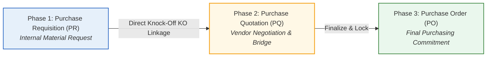
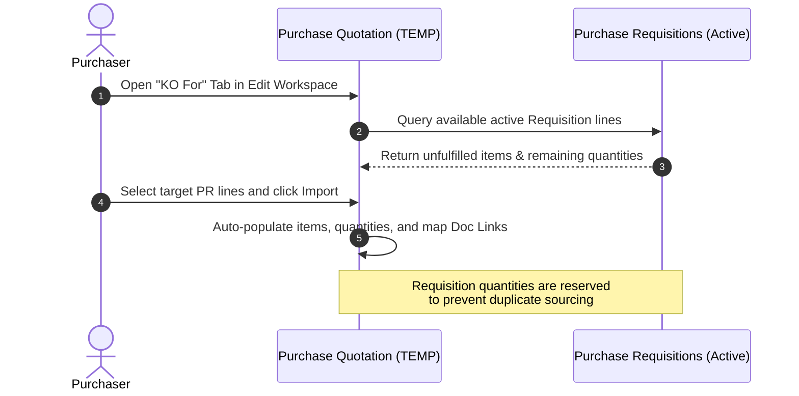

## Purpose and Overview

The **Purchase Quotation (Internal) Applet** is a core procurement module designed to streamline the sourcing and price negotiation phase of inventory acquisition. Rather than relying on scattered email exchanges, spreadsheets, and manual quotations, this applet allows procurement teams to log, structure, and finalize vendor quotations in a single, auditable workspace.


**Core Concept**: The applet serves as the "Bridge" in the **Golden Triangle of Procurement** — connecting internal requests for materials (**Purchase Requisitions**) to final legally binding commitments (**Purchase Orders**). It tracks supplier credit terms, negotiated pricing, tax configurations (SST/GST/VAT), Withholding Tax (WHT), and shipping logistics.



---

### Who Benefits from This Applet?

**Purchasers and Procurement Teams:**
- **Centralized Vendor Sourcing:** Log supplier quotation terms, item costs, and validity dates in a structured database.
- **Automated Requisition Import:** Effortlessly pull approved items from internal Purchase Requisitions via the **Knock-Off (KO)** flow.
- **Supplier Price Comparison:** Evaluate credit terms, delivery schedules, and line-item pricing across multiple draft PQs.

**Finance Teams and Controllers:**
- **Posting Integrity:** Enforce strict verification using **DRAFT** vs. **FINAL** posting controls to lock documents against post-approval modifications.
- **Financial Auditability:** Track accounts receivable/payable adjustments through integrated **Contra** balance matching.
- **Tax & Ledger Precision:** Eliminate manual math errors through automated computation of Net Price, tax rates, and Withholding Tax (WHT).

**Operations and Logistics Teams:**
- **Delivery Coordination:** Direct visibility into scheduled delivery arrival dates and special logistics instructions.
- **Digital Document Vault:** Instant access to original supplier PDF quotations and agreements via the **Attachments** portal.
- **Multi-Dimension Allocation:** Track cost allocation across G/L Dimensions, Profit Centres, Projects, and Business Segments.

---

### What Problems Does This Solve?

| The Manual Procurement Problem | The Purchase Quotation Applet Solution |
| :--- | :--- |
| **Scattered Supplier Quotes**: Quotations stored across separate email threads, chat apps, and desktop folders, leading to lost pricing records and delayed approvals. | **Centralized Database**: All supplier quotes logged under a structured, searchable listing page, complete with digital file attachments. |
| **No Linkage to Requisitions**: Difficulty verifying whether a supplier quotation matches an approved internal material request. | **Direct Knock-Off (KO) Linkage**: Pulls lines directly from active Purchase Requisitions, locking quantities to prevent duplicate ordering. |
| **Incorrect Tax and Math Errors**: Manual calculations of discount margins, currency exchanges, WHT, and SST/VAT leading to accounting discrepancies. | **Automated Calculation Engine**: Automatic line-level calculation of Net Price, tax amounts, and totals based on central system parameters. |
| **Lack of Audit Control**: Draft quotes being mistakenly treated as official purchasing commitments, causing accounting headaches. | **DRAFT vs. FINAL posting control**: Restricts modifications to documents once verified and posted to downstream workflows. |

---

## Key Features Overview


  

  

  

  

  

  


---

## Core Concepts

### 1. The Golden Triangle of Procurement

Every procurement transaction follows a structured three-phase lifecycle to ensure financial accountability and prevent duplicate purchasing commitments:



1. **Phase 1: Purchase Requisition (PR):** The internal starting point where operational departments request materials and receive budget clearance.
2. **Phase 2: Purchase Quotation (PQ):** The "Bridge" workspace where procurement teams log supplier terms, negotiate pricing, and structure the purchasing deal.
3. **Phase 3: Purchase Order (PO):** The final legally binding purchasing commitment generated directly from the finalized and locked quotation.

---

### 2. The Internal Quotation Lifecycle

To maintain complete audit trails, records are governed by operational status states that control editable permissions and posting authority:

| Document Status | Posting Status | Operational Meaning | Allowable Actions |
| :--- | :--- | :--- | :--- |
| **`TEMP`** | **`DRAFT`** | **Temporary Draft Workspace**: Initial creation state where purchasers build the quotation. | Edit all fields, add/remove line items, link Purchase Requisitions via KO, **SAVE**, **DISCARD**, or **FINAL**. |
| **`ACTIVE`** | **`DRAFT`** | **Saved Draft**: Verified draft saved in the database but not yet officially posted. | Edit fields, add attachments, **SAVE**, or **FINAL**. |
| **`ACTIVE`** | **`FINAL`** | **Posted & Locked**: Officially posted quotation. Fully verified and ready for Purchase Order conversion. | View details, Export PDF, **VOID** (if role permits). All editing controls are locked. |
| **`VOID`** | **`FINAL`** | **Voided Quotation**: Read-only archived state for finalized records no longer in effect. | View only. Preserved permanently for financial audit compliance. |


**Posting Lock Security**: Once a quotation is posted to `ACTIVE / FINAL`, all line items and header details are locked. Buttons such as **SAVE**, **FINAL**, **DISCARD**, and the **KO For** tab are automatically hidden or disabled.


---

## Quick Start Guide: The Purchaser's Checklist

Follow this standardized 4-step workflow to log and finalize vendor quotations:

| Step | Action | Key Operational Tasks |
| :-: | :--- | :--- |
| **1** | **Initiate & Fill Main Details** | Click **Create ("+")**. Select the operating **Branch**, inventory **Location**, and **Purchaser**. Verify transaction date and target **Currency**. |
| **2** | **Link Supplier Account** | Open the **Account** tab. Search and select the Supplier entity to auto-populate default **Bill To**, **Ship To**, and **Credit Terms**. |
| **3** | **Add Lines or KO Import** | In the **Lines** tab, manually add items with unit prices and tax codes. Alternatively, use the **KO For** tab to pull approved lines directly from a Purchase Requisition. |
| **4** | **Review & Finalize** | Inspect total net amounts, tax values (SST/VAT), WHT, and attachments. Click **FINAL** to post and lock the quotation for Purchase Order generation. |

---

## Detailed Workspace Breakdown

The applet interface adapts dynamically based on whether you are creating a new record or managing an existing document in the edit workspace.

```
[Main Details] ── [Account] ── [Lines] ── [Delivery Details] ── [Payment]
      ├── [KO For]          <-- Visible only in TEMP status (Import Requisitions)
      ├── [Department Hdr]  <-- Multi-dimension budget allocation
      ├── [Contra]          <-- Ledger balance matching
      ├── [Doc Link]        <-- Audit trail cross-doc references
      ├── [Attachments]     <-- Upload digital supplier PDFs
      └── [Export]          <-- Generate official PDF prints
```

---

### Create View Tabs

When creating a new quotation, configure the following core parameters:

#### 1. Main Details Tab
Captures essential transaction metadata:
- **Branch**: The operating company entity issuing the quotation request.
- **Location**: The specific inventory store or warehouse designated for receiving goods.
- **Purchaser**: The assigned procurement officer handling vendor negotiations.
- **Transaction Date**: Official logging date of the quotation.
- **Credit Terms**: Payment terms (e.g., Net 30, COD). Automatically unlocked and populated after selecting a supplier.
- **Reference**: External supplier quotation reference number (e.g., vendor proposal ID).
- **Remarks**: Internal operational notes and comments.
- **Permit No**: Custom import/customs permit tracking number (hidden if `HIDE_PERMIT_NO` is enabled).
- **Currency**: Transaction currency (e.g., MYR, USD, SGD, EUR).
- **Tracking ID**: Logistics consignment or courier tracking ID (hidden if `HIDE_TRACKING_ID` is enabled).

#### 2. Account Tab
Dedicated to vendor master data mapping:
- **Entity Details**: Search and link the Supplier Account (Entity ID and Name).
- **Bill To**: The company billing address associated with the selected branch.
- **Ship To**: The physical warehouse receiving address tied to the selected location.

#### 3. Lines Tab
The itemized material and service procurement list:
- **Item Details**: Material Code and Description selected from item master data.
- **Quantity**: The requested volume to purchase.
- **Unit Price**: Negotiated vendor price per unit (configurable as inclusive or exclusive of tax).
- **Unit Discount**: Line-level margin discounts or volume rebates.
- **Tax Code & Tax Rate**: Applies appropriate SST, GST, or VAT rates automatically.
- **WHT (Withholding Tax)**: Applies withholding tax rates for cross-border or service quotes where applicable.

#### 4. Delivery Details Tab
Logistics management controls:
- **Delivery Instruction**: Transport notes and special handling requirements for the carrier.
- **Delivery Date**: Promised vendor arrival date at the destination warehouse.
- **Delivery Message Card**: Parameter inputs for custom delivery notes.

#### 5. Payment Tab
Defines proposed settlement structures:
- **Settlement Method**: Cash, Cheque, Bank Transfer, Credit Card, or Voucher.
- **Cash Back for Settlement**: Records cash adjustment entries.
- **Card Details / Cheque No / Txn No**: Reference fields for recording payment credentials and banking transaction numbers.

#### 6. Department Hdr Tab
Financial dimension allocation for multi-department organizations:
- **G/L Dimension / Profit Centre / Project / Segment**: Maps expense commitments directly to specific internal department budgets or capital project codes.

---

### Edit View Tabs

Editing an active or saved quotation opens additional administrative and analytical tabs:

#### 1. KO For (Knock-Off) Tab
Enables seamless material tracking by importing lines directly from active **Purchase Requisitions (PR)**. See the [Knock-Off Flow](#ko-for-knock-off-tab) detailed section below.

#### 2. Contra Tab
Facilitates ledger offsetting between vendor receivable and payable accounts:
- Displays live **AR/AP Balances**.
- Allows users to specify a **Contra Amount** to offset outstanding balances prior to final posting.

#### 3. Doc Link Tab
Maintains a full audit history of linked procurement records:
- **Copied From**: Traces originating upstream records (e.g., Purchase Requisition ID).
- **Copied To**: Tracks downstream generated records (e.g., Purchase Order ID).

#### 4. Attachments Tab
Centralized digital file repository:
- Drag-and-drop support for supplier quotation PDFs, technical spec sheets, and email correspondence.
- Records File Name, File Size, Upload Timestamp, and Uploaded By user ID.

#### 5. Export Tab
Document distribution tools:
- **Export as PDF**: Renders the quotation into an official branded printable document based on configured system templates.

---

## KO For (Knock-Off) Flow

The **Knock-Off (KO)** engine forms the cornerstone of controlled procurement by linking quotations directly to approved requisitions.



### Key Operational Rules:
- **Visibility Conditions**: The KO tab renders **only** when the quotation status is `TEMP` and `HIDE_KO_FOR_TAB` is set to `false`.
- **Quantity Lock**: Knocked-off quantities are locked in the source PR. This guarantees that multiple purchasers cannot quote or order against the same requisition lines.
- **Single vs. Multi-KO**: Admin settings (`ENABLE_MULTIPLE_KO`) control whether a quotation can pull lines from multiple PRs or is restricted to one source PR per quotation.

---

## Line Items Page (Cross-Document Grid)

Located on the main left navigation menu, the **Line Items** workspace acts as an enterprise-wide procurement analysis tool.

### Key Analytical Capabilities:
- **Global Item Visibility**: Displays line items across all quotations in the system on a single grid.
- **Vendor Price Comparison**: Filter by Item Code to compare quoted unit prices, lead times, and credit terms across different suppliers.
- **Ag-Grid Data Operations**: Group, sort, and filter lines by date range, branch, or material category.
- **Export Capabilities**: Export structured line data to CSV or Excel for executive reporting and sourcing audits.

---

## Configuration and Settings

System administrators can customize applet behavior using tenant-level configuration parameters:

| Configuration Area | Setting Key | Purpose & Description | Default & Options |
| :--- | :--- | :--- | :--- |
| **Branch Defaults** | `DEFAULT_BRANCH_GUID` | Pre-selects the operating branch when creating a new quotation. | Defaults to user's logged-in branch. |
| **Location Defaults** | `DEFAULT_LOCATION_GUID` | Pre-selects the inventory warehouse location. | Must be configured per branch. |
| **Field Control** | `HIDE_PERMIT_NO` | Toggles visibility of the customs Permit No field. | `false` (Visible). Set `true` to hide. |
| **Field Control** | `HIDE_TRACKING_ID` | Toggles visibility of the consignment Tracking ID field. | `false` (Visible). Set `true` to hide. |
| **Feature Control** | `HIDE_KO_FOR_TAB` | Disables the Requisition Knock-Off import tab. | `false` (Visible). Set `true` if PRs are not used. |
| **Feature Control** | `ENABLE_MULTIPLE_KO` | Permits importing lines from multiple PRs into a single PQ. | `false` (Restricted to single PR source). |
| **Feature Control** | `HIDE_GENDOC_SAVE_BUTTON` | Removes the Save Draft button in edit mode. | `false` (Save button visible). |
| **Print Formats** | `DEFAULT_PRINT_FORMAT` | Sets the default layout template for PDF exports. | Assigned via `Settings > Printable Formats`. |
| **Permissions** | `ALLOW_DOCUMENT_VOID` | Restricts document voiding authority to designated roles. | Restricted to Finance/Admin roles. |

---

## Personalization Options

Individual purchasers can set personal preferences under `Personalization > Default Selection`:
- **Personal Defaults**: Set personal default Branch, Location, and Purchaser fields to auto-fill every time a new quotation is initiated.
- **Grid View Persistence**: Custom column arrangements, widths, and sort orders saved on the listing grid persist across user sessions.

---

## FAQ & Troubleshooting

**Q: Why is the CREATE or SAVE button disabled?**  
A: Creation is blocked if mandatory fields are missing. Ensure that:
1. **Branch** and **Location** are selected in Main Details.
2. A valid **Supplier Account** is selected in the Account tab.
3. At least one valid item line exists in the **Lines** tab.

**Q: Why is the KO For tab missing in the Edit workspace?**  
A: The KO For tab will not appear if:
1. The document has already been posted to `FINAL` or saved as `ACTIVE`. (KO import is strictly allowed only in `TEMP` status).
2. The system administrator has enabled the `HIDE_KO_FOR_TAB` setting.

**Q: What is the difference between DISCARD and VOID?**  
A: 
- **DISCARD**: Used for `TEMP` draft records. Permanently deletes unposted drafts from the database.
- **VOID**: Used for posted `ACTIVE / FINAL` records. Marks the transaction as inactive while preserving the record permanently for financial audit compliance.

**Q: How do credit terms populate automatically?**  
A: Credit terms are linked to vendor master records. Select a Supplier under the **Account** tab first; the system will automatically fetch and populate their default credit terms into the **Main Details** tab.
