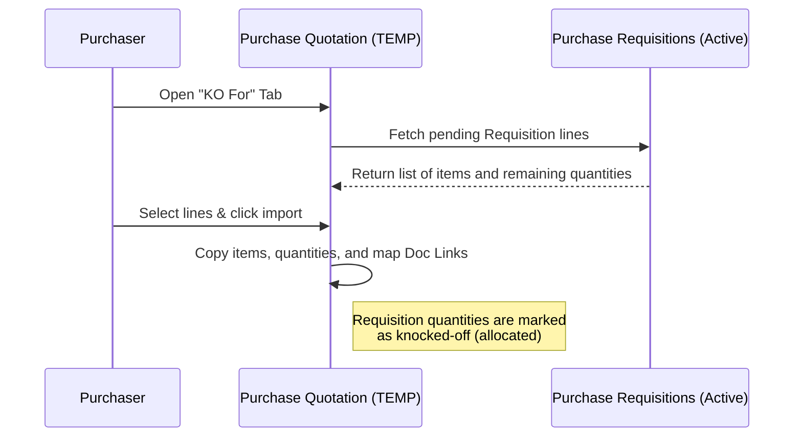

## Purpose and Overview

The **Purchase Quotation (Internal) Applet** is a core procurement module designed to streamline the sourcing and price negotiation phase of inventory acquisition. Rather than relying on scattered email exchanges and paper quotations, this applet allows procurement teams to log, structure, and finalize vendor quotations in a single, auditable workspace.


**Core Concept**: The applet serves as the bridge between the internal request for materials (**Purchase Requisition**) and the final purchasing commitment (**Purchase Order**). It tracks supplier terms, item costs, tax configurations, and billing/shipping logistics.


### Who Benefits from This Applet?

**Purchasers and Procurement Teams:**
- Centralized logging of supplier quotation terms, pricing, and validity.
- Effortless conversion of approved Purchase Requisitions via the **Knock-Off (KO)** flow.
- Simple comparison of credit terms, delivery schedules, and item-level pricing across draft PQs.

**Finance Teams and Controllers:**
- Strict verification using the **DRAFT** vs. **FINAL** posting control.
- Traceability of financial adjustments via the **Contra** ledger matching.
- Elimination of data entry errors through automatic validation of credit terms and tax rates.

**Operations and Logistics Teams:**
- Direct visibility into delivery dates and custom instructions.
- Instant access to original supplier PDFs via the **Attachments** portal.
- Multi-dimension tracking (G/L Dimension, Profit Centre, Project) for operational department allocation.

### What Problems Does This Solve?

| The Manual Procurement Problem | The Purchase Quotation Applet Solution |
| :--- | :--- |
| **Scattered Supplier Quotes**: Quotations stored across separate emails, messaging chats, and local desktop folders, leading to lost info. | **Centralized Database**: All supplier quotes logged under a structured listing page, complete with original attachments. |
| **No Linkage to Requisitions**: Difficulty verifying if a quotation corresponds to an approved internal purchase requisition. | **Direct Knock-Off (KO) Linkage**: Pulls lines directly from active Purchase Requisitions, locking quantities to prevent duplicate orders. |
| **Incorrect Tax and Math Errors**: Manual calculations of discount margins, currency exchanges, WHT, and tax leading to accounting mismatches. | **Automated Calculation Engine**: Automatic line-level calculation of Net Price, SST/GST/VAT tax amount, and final totals based on central settings. |
| **Lack of Audit Control**: Draft quotes being treated as official purchasing commitments, causing accounting headaches. | **DRAFT vs. FINAL posting control**: Restricts modifications to documents once they are verified and finalized. |

---

## Key Features Overview


  

  

  

  

  

  




---

## Key Concepts

### 1. Two-Tiered Document and Posting Status

To prevent unauthorized changes and maintain an audit log, the applet manages records using both a **Document Status** and an operational **Posting Status**:

| Status | Posting Status | Operational Meaning | Allowable Actions |
| :--- | :--- | :--- | :--- |
| **`TEMP`** | **`DRAFT`** | A temporary draft quotation. | Edit all fields, add/remove lines, link Purchase Requisitions via KO, **SAVE**, **DISCARD**, or **FINAL**. |
| **`ACTIVE`** | **`DRAFT`** | Saved draft. The quotation is verified but not yet finalized. | Edit fields, **SAVE**, or **FINAL**. |
| **`ACTIVE`** | **`FINAL`** | Posted and locked. The quotation is officially confirmed. | View, Export to PDF, **VOID** (reverts status if permitted). No edits allowed. |
| **`VOID`** | **`FINAL`** | Voided quotation. Preserved for audit trail only. | View only. Read-only state. |


Buttons such as **SAVE**, **FINAL**, **VOID**, **DISCARD**, and the **KO For** tab are condition-based (depending on the document's current status and tenant configurations) and can be hidden by admin settings.


### 2. The Golden Triangle of Procurement

Every transaction runs through a linear chain to prevent duplicate inventory procurement and ensure budget compliance:

```mermaid
graph TD
    PR["Purchase Requisition (PR) <br> [Internal Department Request]"] -->|Knock-Off (KO) Flow| PQ["Purchase Quotation (PQ) <br> [Vendor Price Log]"]
    PQ -->|Convert to Order| PO["Purchase Order (PO) <br> [Supplier Commitment]"]
    
    style PR fill:#f9f9f9,stroke:#333,stroke-width:1px
    style PQ fill:#fff3cd,stroke:#ffc107,stroke-width:2px
    style PO fill:#f9f9f9,stroke:#333,stroke-width:1px
```

---

## Quick Start Guide

Get up and running with the essential workflows for each role.

### For Purchasers: Create and Finalize a PQ

**Goal:** Create a supplier quotation, add items, and lock it to prepare for a Purchase Order.

1. **Navigate**: Go to **Purchase Quotation** from the left sidebar.
2. **Initiate**: Click the **Create ("+")** button in the top-right corner.
3. **Fill Main Details**:
   - Select the **Branch** and operational **Location**.
   - Select the **Purchaser** (procurement agent).
   - Verify the **Transaction Date** and **Currency**.
4. **Link Supplier**: Select the **Account** tab, search for the supplier, and confirm their billing and shipping details.
5. **Add Lines**: 
   - Select the **Lines** tab and click **Add Line**.
   - Choose the item, specify the **Quantity**, and input the negotiated **Unit Price**.
   - Verify the **Tax Code** and click **ADD**.
6. **Submit Draft**: Click **CREATE** in the top-right corner. The document status is saved as `TEMP` / `DRAFT`.
7. **Finalize**: Review the created document and click **FINAL** to lock it.

---

### For Managers: Review and Manage Quotes

**Goal:** Inspect incoming quotations, verify pricing, and approve or void documents.

1. **Open Listing**: Go to **Purchase Quotation** to view all active quotes.
2. **Review Details**: Double-click a row to open the edit workspace. Inspect:
   - Total amount and tax values.
   - The **Attachments** tab to inspect original supplier price files.
   - The **Doc Link** tab to verify originating Purchase Requisitions.
3. **Approve (Post)**: Click **FINAL** in the header to post the quotation.
4. **Discard or Void**: If a quote is rejected or has expired, click **DISCARD** (for draft/temp documents) or **VOID** (for finalized documents) to remove them from active operations.

---

### For Admins: Initial Setup

**Goal:** Configure defaults and field visibility rules before launching the applet.

1. **Set Defaults** (`Settings > Default Selection`): Configure default Branch, Location, and Currency to save purchasers time.
2. **Setup Fields** (`Settings > Field Configuration`): Decide if fields like `Tracking ID` or `Permit No` are required or should be hidden.
3. **Configure Prints** (`Settings > Printable Format Settings`): Assign default PDF templates for printing or exporting.
4. **Assign Permissions** (`Settings > Permissions`): Configure roles allowing specific users to edit, finalize, void, or view quotations.

---

## Create vs. Edit Workspace

The applet uses a structured workspace that adapts depending on whether you are creating a new record or editing an existing one.

### Create View Tabs

When creating a new quotation, the following tabs are available:

#### 1. Main Details
This tab captures the core transaction metadata:
- **Branch**: The operating company branch associated with the purchase.
- **Location**: The inventory store or warehouse where items will be delivered.
- **Purchaser**: The employee responsible for sourcing the quote.
- **Transaction Date**: The date the quotation was logged.
- **Credit Terms**: Payment terms (e.g., Net 30). This field is unlocked only after a Supplier is selected in the Account tab.
- **Reference**: Internal reference number (e.g., supplier's quotation reference).
- **Remarks**: General text remarks for notes.
- **Permit No**: Custom import/customs permit number (hidden if `HIDE_PERMIT_NO` is enabled).
- **Currency**: Transaction currency (e.g., MYR, USD, SGD).
- **Tracking ID**: Courier or consignment tracking number (hidden if `HIDE_TRACKING_ID` is enabled).

#### 2. Account Tab
Dedicated to supplier information:
- **Entity Details**: Search and select the Supplier Account (Entity ID/Name).
- **Bill To**: The billing address associated with the branch (editable or selected from presets).
- **Ship To**: The physical delivery address associated with the location.

#### 3. Lines Tab
The itemized procurement list:
- **Item Details**: Code and Name of the materials.
- **Quantity**: The volume to procure.
- **Unit Price (Inclusive/Exclusive of Tax)**: Negotiated price.
- **Unit Discount**: Margin discount deducted from the line.
- **Tax Code & Tax Rate**: Applies appropriate SST/VAT/GST rates.
- **WHT (Withholding Tax)**: Apply withholding tax if applicable.

#### 4. Delivery Details
Logistical information:
- **Delivery Instruction**: General instructions for the supplier's driver.
- **Delivery Date**: Scheduled delivery arrival date.
- **Delivery Message Card**: Custom message card parameters.

#### 5. Payment Tab
Defines the settlement terms:
- **Settlement Method**: Cash, Cheque, Bank Transfer, Card, or Voucher.
- **Cash Back for Settlement**: Records cash adjustments.
- **Card No / Card Issuer / Expiry / CVV**: Credit card payment details.
- **Cheque No / Transaction No**: Bank details for auditing.

#### 6. Department Hdr
Allocation parameters for downstream accounting:
- **G/L Dimension / Profit Centre / Project / Segment**: Assigns the quotation's expense lines to a specific company project or internal department budget.

---

### Edit View Tabs

Once a quotation is created, double-clicking the record from the listing page opens the Edit workspace, which adds the following advanced tabs:

```
[Main Details] ── [Account] ── [Lines] ── [Delivery Details] ── [Payment]
      ├── [KO For]      <-- Only shown for TEMP status (Import Requisitions)
      ├── [Department Hdr]
      ├── [Contra]      <-- Match AR/AP balances
      ├── [Doc Link]    <-- Cross-document links
      ├── [Attachments] <-- Upload files / invoices
      └── [Export]      <-- Generate PDF
```

#### 1. KO For (Knock-Off)
Allows importing lines directly from an active **Purchase Requisition (PR)**. This ensures that quoted quantities align with internal approvals. See the [Knock-Off Flow](#ko-for-knock-off-tab) section below.

#### 2. Contra Tab
Used to apply contra adjustments between accounts.
- Displays **AR/AP Balance** and allows adding a **Contra Amount**.
- Links matching documents to offset balances before final posting.

#### 3. Doc Link
Tracks automatic and manual linkages between documents. It displays:
- **Copied From**: Originating documents (e.g., Purchase Requisition ID).
- **Copied To**: Downstream documents (e.g., Purchase Order ID).

#### 4. Attachments
The document management portal:
- Supports drag-and-drop or manual uploads.
- Stores digital files (e.g., supplier PDFs, scan receipts, email agreements) tied permanently to the PQ.
- Displays: File Name, Size, Uploaded Date, and Uploaded By.

#### 5. Export Tab
Provides tools to generate official print documents:
- **Export as PDF**: Renders the quotation using the configured print format template.

---

## KO For (Knock-Off) Tab

The **KO For** tab allows purchasers to import approved lines from one or more **Purchase Requisitions (PR)**.



### Key Behaviors:
- **Document Restrictions**: The KO tab is visible **only** when the Purchase Quotation has a status of `TEMP` and the setting `HIDE_KO_FOR_TAB` is disabled.
- **Quantity Tracking**: Once lines from a PR are knocked off, the corresponding quantities in the PR are locked/reserved. This prevents multiple quotations from claiming the same requisition lines.
- **Single vs. Multiple KO**: Depending on the setting `ENABLE_MULTIPLE_KO`, the user can select multiple PR documents at once or is restricted to importing from a single requisition per quotation.

---

## Line Items Page

The **Line Items** menu entry (accessible from the left navigation pane) is a cross-document analysis tool. Unlike the tab within a single quotation, this page lists every line item across all quotations in the system.

### Key Capabilities:
- **Column Customization**: Toggle columns including PQ Number, Transaction Date, Supplier Name, Item Code, Quantity, UOM, and Net Amount.
- **Ag-Grid Controls**: Filter by supplier, date range, or item category. Group rows to compare pricing from different vendors for the same raw material.
- **Data Export**: Export the filtered line list to CSV or Excel for external analysis.

---

## Configuration and Settings

Admin parameters are managed under the applet's Settings workspace. They are configured via the following options:

| Configuration Area | Setting Key | Parameter Purpose | Path & Default Behavior |
| :--- | :--- | :--- | :--- |
| **Branch Settings** | `DEFAULT_BRANCH_GUID` | Sets the default branch selected when creating a new PQ. | `Settings > Branch Settings` <br> Defaults to the user's primary operating branch. |
| **Default Selection** | `DEFAULT_LOCATION_GUID` | Sets the default inventory location. | `Settings > Default Selection` <br> Must be configured per branch to auto-fill the Location dropdown. |
| **Field Configuration** | `HIDE_PERMIT_NO` | Toggles visibility of the Permit No input field. | `Settings > Application Settings` <br> Default: `false` (Permit No field is visible). |
| **Field Configuration** | `HIDE_TRACKING_ID` | Toggles visibility of the Tracking ID input field. | `Settings > Application Settings` <br> Default: `false` (Tracking ID field is visible). |
| **Feature Visibility** | `HIDE_KO_FOR_TAB` | Completely hides the KO For tab. | `Settings > Application Settings` <br> Set to `true` if your organization does not use Purchase Requisitions. |
| **Feature Visibility** | `ENABLE_MULTIPLE_KO` | Allows pulling lines from multiple Purchase Requisitions. | `Settings > Application Settings` <br> Default: `false` (restricted to one PR source document). |
| **Feature Visibility** | `HIDE_GENDOC_SAVE_BUTTON` | Hides the Save button in the Edit workspace. | `Settings > Application Settings` <br> If enabled, users must immediately Finalize or Discard. |
| **Printable Format Settings**| `DEFAULT_PRINT_FORMAT` | Assigns the default PDF template layout. | `Settings > Printable Format Settings` <br> Controls the layout of the Export PDF option. |
| **Permissions** | `ALLOW_DOCUMENT_VOID` | Restricts Voiding capability to specific user roles. | `Settings > Permissions` <br> Restricted to supervisors and finance roles by default. |

---

## Personalization

Personalization settings allow individual purchasers to configure defaults without affecting tenant-wide operations:
- **Personal Default Selection** (`Personalization > Default Selection`): Set your personal default Branch, Location, and Purchaser. The system will auto-fill these fields when you click Create.
- **Grid Layout**: Rearrange listing columns and save the view state. The layout will persist for subsequent logins.

---

## FAQ

**Q: Why is the CREATE or SAVE button disabled?**  
A: The system blocks creation if mandatory validations fail:
1. No branch or location selected in Main Details.
2. No Supplier selected in the Account tab.
3. The Lines list is empty. Verify that at least one item has been added to the Lines tab.

**Q: Why can't I see the KO For tab in my edit view?**  
A: The KO For tab has two strict requirements:
1. The quotation must have a status of `TEMP`. If the quotation has been finalized or saved as `ACTIVE`, the KO tab will not render.
2. The setting `HIDE_KO_FOR_TAB` must be set to `false`.

**Q: What is the difference between VOID and DISCARD?**  
A: **DISCARD** is used to delete `TEMP` drafts. It removes the draft permanently from the database. **VOID** is used for posted, finalized (`ACTIVE` / `FINAL`) documents. It marks the record as inactive but retains it in the database for financial audit trails.

**Q: How do credit terms load?**  
A: Credit terms are fetched directly from the Supplier's account configuration. You must select a Supplier under the Account tab first before credit terms can be populated in Main Details.
