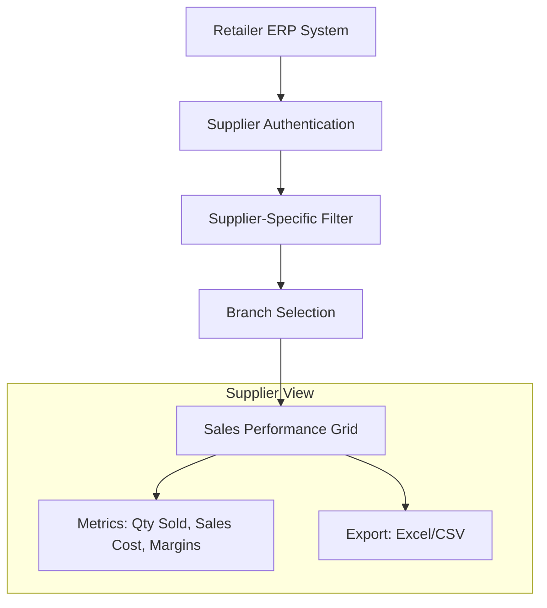

## Purpose and Overview

The **Sales Report Supplier Access Applet** is designed to bridge the data gap between retailers and their suppliers. It provides a secure, controlled interface where suppliers can directly access sales performance metrics for their products, enabling better demand planning, inventory optimization, and collaborative growth.


**Core Concept**: This applet acts as a **Window into Performance**, giving suppliers the exact same data as the retailer but filtered specifically for their own items.


## Key Features Overview

### Who Benefits from This Applet?

**Suppliers & Manufacturers:**

- Gain real-time visibility into product performance.
- Track sales trends across different branches.
- Forecast demand more accurately based on actual sell-through data.
- Monitor inventory replacement costs and margins.

**Sales & Category Managers:**

- Reduce time spent generating and sharing manual reports with suppliers.
- Facilitate data-driven discussions during business reviews.
- Identify top-performing items and potential stockouts quickly.

**Inventory & Procurement Teams:**

- Align stock replenishment with actual sales velocity.
- Improve supply chain transparency and responsiveness.
- Optimize stock levels based on branch-specific demand.

### What Problems Does This Solve?

**The Information Silo Problem:**

Traditionally, suppliers rely on delayed, manual reports sent via email or spreadsheets. This leads to:

- **Lagging Insights**: Suppliers only see performance weeks after the sale.
- **Data Discrepancies**: Inconsistent reporting formats cause confusion.
- **Manual Effort**: High administrative burden for retailers to share data.
- **Reactive Planning**: Decisions made on old data lead to stockouts or overstock.

**The Sales Report Supplier Access Solution:**

- **On-Demand Visibility**: Suppliers log in and see their latest sales data instantly.
- **Unified Source of Truth**: Data comes directly from the ERP, ensuring accuracy.
- **Self-Service Reporting**: Suppliers can filter, search, and export data themselves.
- **Granular Insights**: Sales performance is broken down by item code and branch.

## Key Features Overview

















## Key Concepts

### Data Visibility Hierarchy

Understanding how data flows and who sees what is critical for security and accuracy.

**Flow Through the Hierarchy:**

1. **Authentication**: Supplier logs in with unique credentials.
2. **Filter**: System automatically restricts data to only items supplied by the entity.
3. **Branch**: Supplier selects which retailer branch(es) to analyze.
4. **Metrics**: Real-time sales and cost data are rendered in the grid.

### Understanding Supplier Access

The applet is built on a "Supplier-First" architecture. Unlike general sales reports, this applet strictly enforces data isolation, ensuring a supplier only sees items linked to their own entity.

| Concept                 | Definition                                            | Practical Impact                                        |
| ----------------------- | ----------------------------------------------------- | ------------------------------------------------------- |
| **Supplier Filtering**  | Automatic data isolation based on supplier login.     | Security: Supplier A cannot see Supplier B's sales.     |
| **Sales Cost Basis**    | Option to calculate costs based on replacement cost.  | Clarity: Suppliers understand their margin performance. |
| **Branch Intelligence** | Breaking down sales by physical or digital locations. | Strategy: Identify regional demand variations.          |


**Real-World Example**: A beverage supplier uses the applet to see that their "Energy Drink 500ml" is selling 3x faster in Northern branches compared to Southern ones. They proactively shift their next delivery to prioritize Northern distribution centers.




### The "Golden Triangle" of Supplier Data

To effectively use the system, it is crucial to understand how **Supplier Entities**, **Item Codes**, and **Branch Codes** work together.

| Component           | Analogy             | Definition                                   | Example               |
| ------------------- | ------------------- | -------------------------------------------- | --------------------- |
| **Supplier Entity** | The "Security Gate" | The unique identifier that filters all data. | **ABC Beverages Ltd** |
| **Item Code**       | The "Subject"       | The actual product being tracked.            | **SOFTDRINK-01**      |
| **Branch Code**     | The "Context"       | Where the sale actually occurred.            | **HQ-Main, KL-Sub**   |

---

## Quick Start Guide

Get your team up and running quickly with these essential workflows.



### For Suppliers: Analyzing Your Sales Performance

**Goal:** Review sales trends and download data for planning.

1. **Navigate**: Go to **Sales Report by Item Code** from the sidebar.
2. **Set Filters**:
   - Select **Branch** (or "All Branches").
   - Toggle the **Date Filter** for custom ranges or **Month Filter** for full-month snapshots.
3. **Analyze**: Check the **Qty Sold** and **Sales Cost** columns. Use the column headers to sort by top sellers.
4. **Export**: Click **Export** to save the report as an Excel file.

**Pro Tip:** Use the **Advanced Search** keyword field to find specific product categories or brands instantly.

---

### For Sales Managers: Monitoring Supplier Engagement

**Goal:** Understand how suppliers are using their data access.

1. **Check Reports**: Review the same listings as your suppliers to see what they are seeing.
2. **Verify Configuration**: Ensure the **Field Configuration** matches the agreed-upon data sharing policy.
3. **Collaborate**: Use the **Exported Data** as a baseline for monthly supplier business reviews (JBP).

---

### For Admins: Initial System Setup

**Goal:** Configure the applet for supplier use in 3 steps.

**Step 1: Configure Supplier Linkage** (`Settings > Supplier Settings`)

- Ensure supplier entities are correctly mapped so they only see their own products.

**Step 2: Customize Columns** (`Settings > Field Settings`)

- Select which data fields are visible to suppliers (e.g., hide certain cost metrics if necessary).

**Step 3: Assign Permissions** (`Settings > Permission Listing`)

- Grant access to specific supplier users or teams via the Permission Set containers.

---

## Feature Sections

### Sales Report by Item Code

The heart of the applet is the high-performance data grid. It provides an item-ized view of sales performance.

**Key Columns include:**

- **Supplier & Branch**: Identifies WHERE the sale happened.
- **Code & Alternate Code**: Universal and supplier-specific SKU identifiers.
- **Description**: The full name of the item.
- **Quantity Sold**: Total units moved during the selected period.
- **Sales Cost**: Total cost value of the items sold (calculated based on settings).

### Advanced Search Filters

Refine your data to find exactly what you need:

- **Branch Selection**: Filter across all branches or specific ones.
- **Date/Month Toggle**: Choose between specific date ranges or full-month snapshots.
- **Keyword Search**: Quickly find items by name or code.
- **Cost calculation**: Toggle between different cost bases like replacement cost.

---

## Configuration & Settings

Admins have full control over the supplier experience:

- **Supplier Settings**: Manage the core linkage between users and their data.
- **Field Configuration**: A flexible UI to toggle column visibility on and off.
- **Webhooks**: Configure outgoing data notifications for integration with supplier systems.
- **Permissions**: Detailed modules for:
  - User-level permissions.
  - Team/Role-level permissions.
  - Client-side permission sets.



#### Field Configuration Settings

The **Field Configuration** menu allows retailers to control exactly which sensitive data points are shared with external suppliers.

| Setting                | Description                                           | Recommended Usage                                                                  |
| ---------------------- | ----------------------------------------------------- | ---------------------------------------------------------------------------------- |
| **HIDE_MA_COST**       | Hides the Moving Average Cost from the supplier view. | **Enable** if you want suppliers to see quantity but not your internal cost basis. |
| **HIDE_GP**            | Hides the Gross Profit value from the report.         | **Enable** to keep margin data confidential.                                       |
| **HIDE_GP_PERCENTAGE** | Hides the Margin % column.                            | **Enable** for basic trade-level transparency only.                                |

**Pro Tip:** Test different permission levels to ensure that "Power Users" (Admins) can see full data while "Standard Suppliers" only see restricted fields.

---

## FAQ

**Q: Can a supplier see items they don't supply?**
A: No. The system automatically filters the data based on the entity relationship defined in the ERP. A supplier only sees the items they are primary/linked suppliers for.

**Q: How often is the sales data updated?**
A: The data is real-time. As soon as a transaction is finalized in the ERP, it reflects in the applet's report.

**Q: Why don't the Sales Costs match my internal figures?**
A: Check the **Cost Calculation** toggle in Advanced Search. The report may be configured to use **Replacement Cost** or another basis depending on your retailer's settings.

**Q: Can I see Gross Profit (GP) for my items?**
A: This depends on the retailer's **Field Configuration**. If `HIDE_GP` is enabled by the admin, these columns will not appear in your report.

**Q: I supply multiple branches. Can I see a consolidated view?**
A: Yes. Leave the **Branch** filter empty or select all branches in the search model to see a consolidated total, then use the grid's **Grouping** feature to break down by branch manually.

**Q: Can I automate these reports?**
A: Yes. Admins can configure **Webhooks** in the settings to push notification data to your external systems upon specific events.
