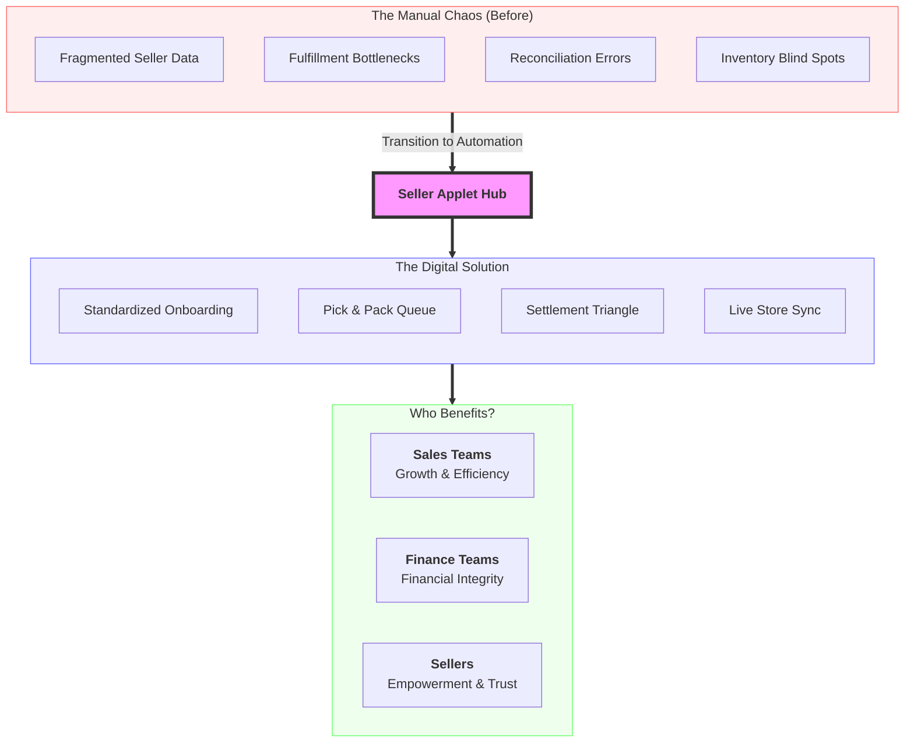

## Purpose and Overview

The **Seller Applet** is a robust platform designed to manage the entire lifecycle of third-party sellers within your ecosystem. It streamlines the onboarding of sellers, product synchronization, order fulfillment, and complex financial reconciliations between the platform and its sellers.


**Core Concept**: The system manages the relationship between the **Seller Account** (Who), their **Marketplace Products** (What), and the **Pick & Pack Queue** (How) that drive business growth. It acts as a bridge between your core business and external partners.


### Who Benefits from This Applet?

**Sales & Procurement Teams:**

- **Standardized Onboarding**: Capture essential details including ID Numbers, Tax Registration, and Accounting Categories.
- **Centralized Catalog**: Manage marketplace items (MKP Items) linked directly to your Financial Items (FI Items).
- **Logistics Oversight**: Automated routing of orders to specific seller branches or stores.
- **Unified Inventory**: Real-time stock visibility across the entire seller network with granular inventory tracking.

**Finance & Accounting Teams:**

- **Automated Settlement Flow**: Seamlessly transition from Seller Orders to Purchase Invoices (PI) and Payment Vouchers (PV).
- **Flexible Payouts**: Support for multiple settlement types including Bank Transfer, FPX e-Mandate, e-Wallets, and Membership Point Currency.
- **Credit & Limit Control**: Manage seller credit terms and limits directly within their entity profiles.
- **Transparent Auditing**: Full audit trails for every financial interaction through the Applet Log.

**Sellers & Partners:**

- **Self-Service Dashboard**: Manage product listings, descriptions, and high-quality image assets.
- **Pick & Pack Queue**: Granular visibility into the fulfillment status of every order line.
- **Settlement Transparency**: View pending and historical payouts with itemized breakdowns.
- **Branch Support**: Ability to manage multiple operational locations within a single seller account.

### What Problems Does This Solve?

**The Manual Marketplace Problem:**
Traditional marketplace management often suffers from fragmented data and manual bottlenecks. Common issues include:

- **Data Inconsistency**: Disparate product formats across different sellers leading to a messy customer experience.
- **Fulfillment Chaos**: Difficulty coordinating Pick & Pack operations across multiple external partners.
- **Settlement Errors**: Manual calculation of payouts resulting in reconciliation headaches and payment delays.
- **Inventory Blind Spots**: Lack of real-time visibility into whether a seller can actually fulfill an order.
- **Compliance Risks**: Incomplete seller documentation and unverified tax status.

**The Seller Applet Solution:**

- **Entity Attribute Mapping** - Standardize seller data (ID, Tax, Accounting) for 100% compliance.
- **Integrated Pick & Pack Queue** - Convert customer sales orders into streamlined fulfillment tasks for sellers.
- **Automated Settlement Triangle** - Link Orders, Invoices, and Vouchers in a single, error-free chain.
- **Store-Level Inventory Control** - Enable/disable inventory tracking at the individual branch level.
- **Extensible Configuration** - Customize fields, printable formats, and webhooks to match your specific needs.

## Key Features Overview















## Visual Overview: From Manual Chaos to Automated Growth

---

## Key Concepts

### Understanding the Seller Ecosystem

To effectively manage the system, it is crucial to understand how **Sellers**, **Branches**, and **Products** interact.

| Component             | Definition                               | Role in Workflow                                                |
| --------------------- | ---------------------------------------- | --------------------------------------------------------------- |
| **Seller Account**    | The `mst_entity` profile of the partner. | Owns the tax registration (Tax Reg No) and accounting category. |
| **Seller Branch**     | A physical store or branch location.     | The fulfillment point linked to specific inventory stores.      |
| **Pick & Pack Queue** | The real-time order fulfillment engine.  | Manages the transition from customer order to seller shipment.  |

### The "Settlement Triangle"

The Seller Applet ensures financial accuracy through a linked three-step process:

1.  **Seller Order**: Customer pays; the system creates a Marketplace Seller Order.
2.  **Purchase Invoice**: Upon shipment/delivery, the system generates a PI (Purchase record).
3.  **Payment Voucher**: Finance processes the settlement via the selected mode (Bank Transfer, FPX, etc.).

---

## Quick Start Guide

Get your marketplace operations running quickly with these essential workflows.

### For Staff: Onboarding a New Seller

**Goal:** Successfully register a seller and their products.

1.  **Create Entity Profile**: Go to **Seller Account** → Click **"+"** → Fill in Legal Name, `ID_NO`, and `TAX_REG_NO`.
2.  **Set Credit Terms**: Define `CREDIT_LIMIT_TERMS` to manage the financial relationship.
3.  **Assign Operating Stores**: Link the seller to specific branches to enable store-based inventory.
4.  **Map Financial Items**: Link new Marketplace Products to existing `FI_Items` for accurate stock accounting.
5.  **Review & Approve**: Verify documentation and click **Approve** to activate the seller account.



### For Sellers: Managing Daily Operations

**Goal:** Fulfill orders and track payments efficiently.

1.  **Monitor Pick/Pack Queue**: Check for new orders in the **Seller Order** dashboard.
2.  **Fulfill Orders**:
    - Pick the items from the allocated store.
    - Pack the items and click **Issue GIN** (Goods Issued Note).
    - The status automatically updates to "Shipped" for the customer.
3.  **Verify Settlements**: Review generated **Purchase Invoices** to confirm the amount owed for the period.
4.  **Download Vouchers**: View your **Payment Vouchers** to confirm when funds are released.



---

## Feature Sections

### Seller Account Management

The foundation of the applet is the **Seller Account**. This section allows you to manage the master data for all third-party partners. Each account is linked to an `mst_entity` and captures unique attributes like tax registration numbers and specific accounting categories.



- **Credit Limits**: Set hard limits on the amount of business a seller can process before payout.
- **Entity Extensions**: Use custom fields to track unique metadata for each seller.

### Product and Catalog Sync

Synchronize your marketplace listings with your financial inventory. This ensures that every sale is tracked against a valid item in your ERP.



- **MKP to FI Linkage**: Map Marketplace Items directly to Financial Items.
- **Pre-Order Control**: Enable flags for items that require longer lead times.

### Pick & Pack Fulfillment (Seller Orders)

The **Seller Order** dashboard houses the **Pick & Pack Queue**, a real-time fulfillment engine that guides sellers through the picking, packing, and shipping process.



- **Granular Status Tracking**: View the exact status of every line item in an order.
- **Goods Issued Note (GIN)**: Automatically update order statuses by issuing a GIN upon shipment.

### Accounts Payable & Settlement

Automate the financial reconciliation between the platform and the seller using the generated documents in this section.

- **Purchase Invoices (PI)**: Created automatically based on fulfilled orders.
  

- **Payment Vouchers (PV)**: Process settlements via Bank Transfer, e-Wallets, or even Membership Points.
  

### Multi-Branch & Store Mapping

Support complex multi-location operations by mapping specific sellers and products to physical branches.



---

## Configuration & Settings

### Admin: Initial System Setup

**Goal:** Prepare the environment for seller onboarding.

1.  **Verify Accounting Categories**: Define `AKN_ETY_CTG` labels to classify your sellers (e.g., Corporate vs. Individual).
2.  **Setup Printable Formats** (`Settings > Printable Format`): Customize Invoices and Payment Vouchers.
3.  **Configure Branches/Stores**: Map out physical locations in `Settings > Branches`.
4.  **Define Webhooks** (`Settings > Webhook`): Enable external notifications for new orders.
5.  **Establish Permission Sets**: Define access for Sales, Finance, and Seller roles.
6.  **Set Settlement Types**: Enable payment modes like Bank Transfer or e-Wallet.



### Detailed Admin Controls

- **Seller Account Management**:
  - **Entity Attributes**: Customize `mst_entity_ext` parameters.
  - **Status Lifecycle**: Manage accounts through `Active`, `Inactive`, or `Pending Approval`.
- **Product & Inventory Logic**:
  - **Fulfillment Flags**: Toggle `Require Delivery` or `Require Production` per product.
  - **UOM Management**: Set multi-unit measurements and complex pricing.
    - **Batch Processing**: Group Seller Orders into single settlement cycles.

---

## FAQ

**Q: What is the benefit of the Pick & Pack Queue?**
A: It provides real-time visibility into the fulfillment progress of every item within a multi-vendor order, ensuring customers get accurate shipping updates.

**Q: Can we capture different tax categories for different sellers?**
A: Yes, using the `TAX_REG_NO` and specific `TAX_DETAILS` fields in the Seller Account profile, you can manage unique tax requirements for each partner.

**Q: How does the system handle "Pre-Order" items?**
A: You can enable the `preOrderItem` flag on the product listing, which adjusts the Pick & Pack Queue to allow for longer fulfillment lead times.

**Q: Can a seller be paid via Membership Points?**
A: Yes, the Seller Applet supports `MEMBERSHIP_POINT_CURRENCY` as a valid settlement type, allowing for creative ecosystem-based rewards.

**Q: How do we track image assets for products?**
A: Use the **Manage Image** feature within the Product listing to upload, tag, and set "Public" status for product photos.
