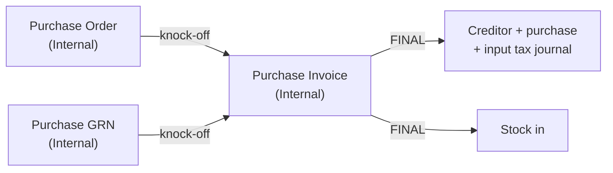

Understanding core procurement concepts is essential before configuring vendor pricebooks or processing supplier invoices. These concepts explain **how procurement documents flow through the ERP** and how warehouse receipts impact financial ledgers.

## The Procurement-to-Pay (P2P) Document Lifecycle

Procurement transactions follow a structured 5-step lifecycle. Each step represents a distinct legal commitment, inventory movement, and financial milestone.

| Step | Document | Business Purpose | Inventory Impact | Accounting Impact |
|------|----------|------------------|------------------|-------------------|
| **1** | **Purchase Requisition** | Internal department request asking procurement to buy goods | None | None |
| **2** | **Purchase Order (PO)** | Legally binding contract sent to vendor specifying items & prices | Stock Expected (Incoming PO quantity) | None (Commitment recorded) |
| **3** | **Goods Received Note (GRN)** | Receiving slip issued upon physical arrival of goods | Stock Increased (Physical stock-in) | GRNI Accrual (Debit Inventory / Credit GRNI) |
| **4** | **Purchase Invoice** | Supplier's commercial billing document demanding payment | None (if GRN already executed) | Accounts Payable Credited, GRNI Cleared |
| **5** | **Vendor Settlement** | AP cash disbursement or bank transfer payment | None | Bank Credited, Accounts Payable Debited |

---

## Knock-off — how a PO, a GRN and an invoice are tied together

BigLedger has **no three-way matching engine**. There is no tolerance setting, no variance check and
nothing that blocks a supplier invoice because its price or quantity differs from the purchase order.
What it has instead is **knock-off**: when you create a Purchase Invoice you open its *KO For* tab,
pick a finalised Purchase Order or Purchase GRN, and BigLedger copies that document's supplier, lines
and prices into your invoice. Only finalised source documents that are not already fully knocked off
appear in the list.

Matching, in other words, is something **you** do by eye when you compare the copied lines against the
paper the supplier sent. If the supplier billed a different price, you change the line and the invoice
finalises anyway. Controls over that live in permissions — who may edit a price, who may finalise — not
in a matching rule.

> **The Knock Off Settings screen is inert.** The Purchase Invoice applet has a *settings/knock-off-settings*
> route with switches named `KNOCK_OFF_BY_PURCHASE_GRN`, `KNOCK_OFF_BY_PURCHASE_ORDER` and similar. Its
> menu entry is commented out and nothing outside that screen reads the values. The *KO For* tab offers
> Purchase GRN and Purchase Order whatever they are set to.

---

## Which document moves the stock

This is the part most new users get backwards, and it decides what your balance sheet shows between
receipt and billing.

In the **standard** flow the **invoice** moves the stock, not the receipt. Purchase GRN (Internal)
records that goods arrived, but its quantity signum is `0` — it books nothing into inventory. Purchase
Invoice (Internal) has quantity signum `+1`: finalising it books the quantities in and updates the
item's last purchase cost. So between delivery and billing, the goods are physically in your warehouse
and absent from your stock ledger.

If you need stock booked at receipt and billed later, use the **alternative pair** instead: Purchase GRN
Stock In (Internal) to receive, and Purchase Invoice No Stock In (Internal) to bill. Choose one pair per
flow and stay with it — mixing them double-counts.

| You want stock to move at… | Receive with | Bill with |
|---|---|---|
| Invoice (standard) | [Purchase GRN (Internal)](/applets/purchase-workflow/internal-purchase-grn-applet/) | [Purchase Invoice (Internal)](/applets/finance/internal-purchase-invoice-applet/) |
| Receipt | [Purchase GRN Stock In (Internal)](/applets/purchase-workflow/internal-purchase-grn-stock-in-applet/) | [Purchase Invoice No Stock In (Internal)](/applets/purchase-workflow/internal-purchase-invoice-no-stock-in-applet/) |

---

## What to Read Next

- **[Configuration](/modules-v2/purchasing/configuration/)** — Set up vendor pricebooks, requisition approval hierarchies, and receiving rules.
- **[Use Cases](/modules-v2/purchasing/use-cases/)** — Review reference architectures for raw material procurement, trading stock reordering, and consignment purchases.
