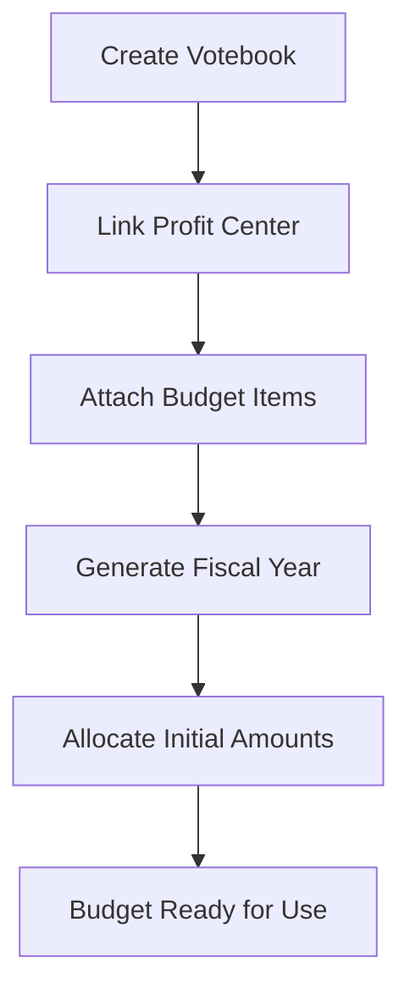

## Overview

The Budgetary Management Module provides comprehensive budget planning, allocation, tracking, and control capabilities through specialized applets working together. Designed for organizations requiring structured financial planning and budget oversight, it delivers real-time budget utilization insights while maintaining fiscal discipline across departments and faculties.

## Module Composition

### Core Applets (Primary Functions)
- **[Budget Applet](/applets/budget-applet/)** - Complete budget management system
- **Budget Item Management** - Define spending components
- **Votebook Management** - Departmental budget allocation
- **Budget Reports** - Utilization and variance analysis

### Shared Applets (From Core Module)
- **[Organization Applet](/applets/organization-applet/)** - Multi-entity structure
- **[Chart of Accounts Applet](/applets/)** - Account structure integration
- **Financial Reports Applet** - Budget vs actual reporting

### Optional Enhancement Applets
- **Budget Forecasting Applet** - Predictive budget analytics
- **Multi-Year Budget Applet** - Long-term budget planning
- **Capital Budget Applet** - Capital expenditure planning

## Key Concepts

### Budgetary Framework

The BigLedger Budgetary Module operates on a structured framework that answers three fundamental questions:

| Question | Component | Example |
|----------|-----------|---------|
| **Who** is spending? | Profit Center | Faculty of Science, HR Department |
| **What** are they spending on? | Category | Laboratory Equipment, Training Programs |
| **How** are funds allocated? | Votebook | Budget 2025 - Faculty of Science |

### Budget Hierarchy

```
Organization
├── Profit Centers (Faculties/Departments)
│   └── Votebooks (Annual Budgets)
│       └── Budget Items (Spending Components)
│           └── Categories (Expense Classification)
│               └── Budget Registers (Period Allocations)
```

## Core Features

### 1. Budget Item Management


#### Purpose & Concept
Budget Items define the specific spending components that make up a votebook's budget allocation. Each budget item represents an element of spending such as:
- Office Supplies
- Marketing & Advertising
- Equipment Maintenance
- Professional Development


**Key Insight**: Think of Budget Items as the building blocks of every budget plan. They ensure uniformity and clarity across the budgeting system before categorization and allocation begin.


#### Creating Budget Items

1. Navigate to **Budgetary Applet → Items**
2. Click **"+"** Add button
3. Fill in required details:
   - **Item Code*** (e.g., MKTG001)
   - **Item Name*** (e.g., Marketing Expenses)
   - **Description** (optional contextual notes)
4. Click **Save** to create the item


**Best Practice**: Use a consistent naming format such as DEPT-TYPE (e.g., HR-TRAIN for HR Training expenses).


#### Multi-Level Category Assignment

Budget items can be classified across up to **10 category levels**, providing granular expense tracking:

**Example Multi-Level Classification:**
- Category 0 → Faculty of Science
- Category 1 → Laboratory Equipment
- Category 2 → Maintenance

This flexible categorization enables:
- Structured expense classification across all departments
- Accurate reporting in budget and utilization summaries
- Organizational flexibility (use 3 levels or all 10 as needed)

### 2. Category Group & Category Management


#### Purpose & Concept
Categories define **what** money is being spent on, while Category Groups provide broader organizational umbrellas.

| Element | Description | Example |
|---------|-------------|---------|
| **Category Group** | Broader grouping level | FAKULTI-SAINS, FAKULTI-EKONOMI |
| **Category** | Specific spending type | Maintenance, Equipment Purchase, Training |

#### Creating Category Groups

1. Navigate to **Budgetary Applet → Category Groups**
2. Click **"+ Add"**
3. Enter:
   - Category Group Code (e.g., FAKULTI-SAINS)
   - Category Group Name
   - Status (Active/Inactive)
4. Click **Create** to save

#### Creating Categories

1. Navigate to **Budgetary Applet → Categories**
2. Click **"+ Add"**
3. Fill in:
   - Category Group
   - Category Code
   - Category Name
   - Description
4. Click **Create**

#### Linking Categories to Items

Categories can be assigned to budget items through the **Category Tab**:
- Select appropriate category from dropdown
- Repeat for additional category levels as required
- Click **Save** to link

### 3. Profit Center Management


#### Purpose & Concept
Profit Centers define **who** is doing the spending within the organization. Each profit center represents a department, faculty, or division that manages its own budget through associated Votebooks.


**Budget Accountability**: Every expenditure is traceable back to a responsible unit, providing clear accountability and departmental spending reports.


#### Creating a Profit Center

1. Navigate to **Budgetary Applet → Profit Center**
2. Click **"+"** Add button
3. Fill in the required fields:

| Field | Description |
|-------|-------------|
| Profit Center Code* | Unique identifier (e.g., FAC_A) |
| Profit Center Name* | Name of department/unit |
| Description | Optional brief explanation |
| Ref 1 Code/Name/Description | Additional reference (campus, division) |
| Ref 2 Code/Name/Description | Secondary reference if needed |
| Status | Active / Inactive |

4. Click **Save** to create

**Example Structure:**

| Profit Center Code | Profit Center Name | Description | Status |
|-------------------|-------------------|-------------|--------|
| FAC_A | Fakulti A | Faculty of Arts | Active |
| FAC_B | Fakulti B | Faculty of Business | Active |
| FAC_C | Fakulti C | Faculty of Computing | Active |

### 4. Votebook Management


#### Purpose & Concept
The Votebook module manages how funds are distributed across Budget Items and Fiscal Periods. It connects:
- **Profit Centers** (who is doing the spending)
- **Budget Items** (what is being spent on)
- **Fiscal Periods** (when funds are allocated)


**Core Concept**: Think of a Votebook as the "spending ledger" of each department or faculty for a specific fiscal year.


#### Workflow Overview



#### Creating a Votebook

1. Navigate to **Budgetary Applet → Votebook**
2. Click **"+ Add"**
3. Fill in:
   - Votebook Code and Name
   - Linked Profit Center
   - Description / Notes
4. Click **Save**

#### Linking Budget Items

After creating the votebook:
1. Open the **Items Tab**
2. Click **"+ Add Item"**
3. Link budget items that this votebook will manage
4. Each linked item inherits its category classification

#### Generating Fiscal Year

From the votebook's **Fiscal Year Tab**:
1. Click **Generate Fiscal Year**
2. The applet automatically:
   - Creates Budget Registers for each fiscal period (e.g., Jan–Dec)
   - Links each register to the respective budget item

#### Allocating Initial Amounts


1. Open the **Budget Register** under the fiscal year
2. Enter the **Initial Amount** once
3. The system automatically spreads the value equally across all months/periods

**Example:**
- Enter RM 10,000 → automatically distributed as RM 833.33 per month (12-month fiscal year)

### 5. Budget Virement Management


#### Purpose & Concept
Budget Virement allows users to **transfer** allocated amounts between two budget registers within the same votebook and fiscal year. It's used to reallocate existing funds—not to increase or decrease the total budget.


**Important**: Virement redistributes funds without changing the overall budget ceiling. To adjust total allocations, use Budget Adjustment instead.


#### Process Flow

1. **Fill in Header Details**
   - Select Votebook, Fiscal Year, and Fiscal Period
   - Add Reference # / Tracking ID
   - Enter Remarks / Description

2. **Add Lines**
   - Select Item Code / Name
   - Choose Fiscal Period
   - Select Budget Register **From** and **To**
   - View Amount Allocated
   - Enter Amount To Transfer

3. **Create the Document**
   - Document is saved in **Draft** state
   - Review all lines before finalizing

4. **Finalize**
   - Click **Finalize** to confirm the virement
   - System automatically updates registers:
     - Budget Register From → reduced by transfer amount
     - Budget Register To → increased by transfer amount

### 6. Budget Adjustment Management


#### Purpose & Concept
Budget Adjustment allows users to **increase** (Adjust In) or **decrease** (Adjust Out) the total amount allocated to a budget register. Use this when the overall budget ceiling changes.

#### Key Difference: Virement vs Adjustment

| Feature | Virement | Adjustment |
|---------|----------|-----------|
| **Purpose** | Transfer funds between registers | Increase/decrease total budget |
| **Impact** | No change in total allocation | Changes total allocation |
| **Fields** | Register From → To | Single Register |
| **Adjustment Type** | Always a transfer | Adjust In / Adjust Out |
| **Finalization** | Updates both registers | Updates one register |

#### Process Flow

1. **Fill in Header Details**
   - Select Votebook and Fiscal Year
   - Add Reference # / Tracking ID
   - Enter Remarks / Description

2. **Add Lines**
   - Choose Item Code / Name
   - Select Fiscal Period
   - View Budget Register and Amount Allocated
   - Select **Adjustment Type** (Adjust In / Adjust Out)
   - Enter Amount To Adjust

3. **Create the Document**
   - Document saved as **Draft**
   - Review all entries before finalizing

4. **Finalize**
   - Click **Finalize** to apply adjustments
   - Registers automatically updated:
     - Adjust In → adds to register total
     - Adjust Out → deducts from register total

### 7. Budget Reports


#### Budget Report

The Budget Report provides a **high-level summary** of each Budget Item's financial position:

| Column | Description |
|--------|-------------|
| Item Code / Name | Identifies the specific budget item |
| Initial Amount Allocated | Original amount allocated during budget creation |
| Latest Amount Allocated | Current total after adjustments or virements |
| Amount Reserved | Funds earmarked but not yet utilized |
| Amount Utilized | Actual amount spent or used |
| Utilization % | (Amount Utilized ÷ Latest Amount Allocated) × 100 |
| Remaining Balance | Unutilized funds remaining |

**Available Actions:**
- Generate Utilization Chart
- Search / Filter by votebook, item, or fiscal period
- Export to Excel / PDF


**Reading Utilization**: Positive utilization values indicate spending, while negative values (from reverse adjustments) show fund recovery or reallocation.


#### Budget Register Transaction Line Report

The Budget Register Txn Line Report provides a **detailed audit trail** of all transactions affecting each budget register:

- Lists every entry (Budget Creation, Virement, Adjustment)
- Shows Budget Votebook, Fiscal Year, Fiscal Period
- Displays Budget Item and Item Code
- Enables complete transaction traceability

**Common Users:**
- Accountants
- Auditors
- Finance Teams

### 8. Budget Utilization and Validation


#### Integration with General Documents

The Budgetary Applet integrates with General Document applets to ensure financial control through automated budget validation and utilization tracking:

- Purchase Orders
- Purchase Invoices
- Sales Orders
- Sales Invoices

#### Validation Process

When processing a transaction with budget-linked items, users must specify:
1. **Budget Votebook** – which budget the expense relates to
2. **Budget Fiscal Year and Period** – applicable financial period
3. **Budget Item** – expense or revenue category
4. **Budget Register** – active register holding the allocation

The system checks:
- Whether sufficient funds are available
- Whether the transaction exceeds the remaining balance


**Budget Exceeded Warning**: If the limit is breached, a validation warning appears and the affected line is highlighted in red. Over-budget entries are prevented unless adjusted through Virement or Adjustment modules.


#### Utilization Process

Once the document is **finalized**, the budget register:
- Deducts the utilized amount from Remaining Balance
- Reflects updated figures in Budget Utilization Reports
- Ensures real-time tracking of fund consumption

**Key Points:**
- Budget checks occur **before** finalization (Validation)
- Actual consumption occurs **after** finalization (Utilization)
- Over-budget entries are prevented unless adjusted

## Configuration

### Initial Setup

#### Step 1: Organization Structure
1. Define your organizational hierarchy
2. Set up Profit Centers for each department/faculty
3. Configure reporting relationships

#### Step 2: Category Framework
1. Create Category Groups (e.g., by Faculty, Department, Type)
2. Define Categories under each group
3. Set up mandatory category fields if required

#### Step 3: Budget Items
1. Create standard budget items
2. Assign multi-level categories
3. Link items to appropriate category groups

#### Step 4: Votebook Setup
1. Create votebooks for each Profit Center
2. Link budget items to votebooks
3. Generate fiscal year periods
4. Allocate initial budget amounts

### Field Settings Configuration

Navigate to **Settings → Field Settings → Budget Item Settings** to:
- Configure up to 10 Category Groups
- Mark Category Groups as Mandatory
- Define category selection requirements

## Best Practices

### Budget Planning

1. **Bottom-Up Approach**
   - Departments submit budget requests
   - Items justified with business cases
   - Review and consolidation at management level

2. **Top-Down Approach**
   - Management sets overall budget ceiling
   - Allocation distributed to departments
   - Departments plan within limits

3. **Hybrid Approach**
   - Combine both methods
   - Strategic items top-down
   - Operational items bottom-up

### Budget Control

1. **Approval Hierarchy**

| Transaction Type | Amount | Approver |
|-----------------|--------|----------|
| Virement | < RM 10,000 | Department Head |
| Virement | > RM 10,000 | Finance Director |
| Adjustment In | Any | CFO |
| Adjustment Out | < RM 5,000 | Finance Manager |
| Adjustment Out | > RM 5,000 | CFO |

2. **Monitoring Schedule**
   - Weekly: Review high-utilization items
   - Monthly: Full budget variance analysis
   - Quarterly: Strategic budget review
   - Annually: Budget planning and rollover

### Performance Optimization

1. **Data Archiving**
   - Archive completed fiscal years after 2 years
   - Maintain summary data for historical reporting
   - Keep detailed data for current and previous year

2. **Reporting Efficiency**
   - Use filters to limit data ranges
   - Schedule large reports during off-peak hours
   - Export to Excel for detailed analysis

## Integration

### ERP Module Integration

The Budgetary Module seamlessly integrates with:

- **Financial Accounting**: Budget vs actual variance reporting
- **Purchasing**: Budget validation for purchase orders
- **Sales**: Revenue budget tracking
- **Projects**: Project budget management
- **HR/Payroll**: Personnel cost budgeting

### External Systems

Budget data can be:
- Imported from spreadsheets (Excel/CSV)
- Exported to financial planning tools
- Integrated with consolidation systems
- Synchronized with corporate reporting platforms

## Troubleshooting

### Common Issues

| Issue | Cause | Solution |
|-------|-------|----------|
| Cannot finalize virement | Insufficient funds in source register | Check register balance, adjust virement amount |
| Budget validation fails | Register not linked to document | Ensure correct votebook and period selected |
| Report shows incorrect utilization | Timing differences in posting | Run report after all transactions posted |
| Cannot delete budget item | Item linked to active votebook | Remove from votebook first, then delete |
| Category assignment missing | Category group not configured | Set up category groups in Field Settings |

## Regulatory Compliance

### Audit Trail Features
- Complete transaction history
- User activity logs
- Approval workflows
- Document versioning
- Period locking

### Public Sector Compliance
- Vote accounting standards
- Fund accounting principles
- Appropriation controls
- Year-end closing procedures

## Support & Resources

- 📚 [Budget Planning Guide](/guides/budgetary/)
- 🎥 [Video Tutorials](/tutorials/budgetary/)
- 📊 [Budget Template Library](/resources/budgetary/)
- 🤝 [Community Forum](https://forum.bigledger.com/budgetary)
- 📧 [Expert Support](mailto:budgetary@bigledger.com)
