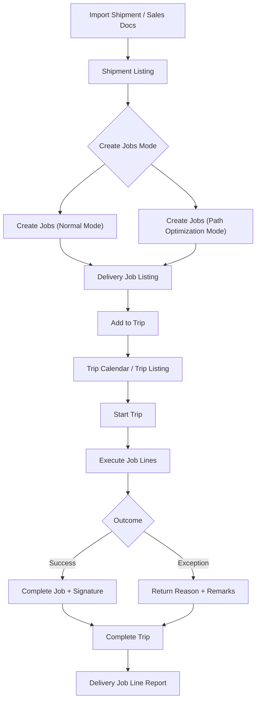


**Sedang dibangunkan**: Panduan pengguna ini masih dalam proses pembangunan.


## Tujuan dan Gambaran Keseluruhan

**Delivery & Installation Applet** ialah penyelesaian logistik dan pelaksanaan lapangan hujung-ke-hujung yang menghubungkan perancangan gudang dengan hasil penghantaran dan pemasangan di lapangan. Ia membantu pasukan beralih daripada koordinasi manual yang berpecah-pecah kepada aliran kerja yang berstruktur dan boleh dijejak merentas **Shipments**, **Jobs**, dan **Trips**.


**Konsep Teras**: Aplet ini menghubungkan **apa yang perlu dihantar** (Job daripada `SO` = Sales Order, `SI` = Sales Invoice, `DO` = Delivery Order), **bagaimana ia dikelompokkan** (Shipment), dan **bagaimana ia dilaksanakan** (Trip dengan pemandu, kenderaan, serta kemas kini status masa nyata).


## Gambaran Keseluruhan Ciri Utama

### Siapa yang Mendapat Manfaat daripada Aplet Ini?

**Penyelaras Dispatch & Logistik:**
- Merancang trip secara visual menggunakan Trip Calendar
- Menggabung dan memperuntukkan job pada skala besar
- Melaksanakan tindakan pukal (status, tarikh, catatan, peruntukan trip)
- Menjejak kemajuan tanpa perlu bertukar sistem

**Pemandu & Pasukan Pemasangan:**
- Melihat trip dan job yang ditugaskan dengan jelas
- Mengemas kini status trip/job di lapangan
- Merekod sebab pemulangan secara konsisten
- Merekod tandatangan penghantaran dan bukti penyempurnaan

**Pengurus Gudang & Operasi:**
- Menukar shipment kepada job dengan pantas
- Menggunakan mod penciptaan job biasa atau optimasi laluan
- Memantau peruntukan, keseimbangan kuantiti, dan beban penghantaran
- Menyeragamkan pelaksanaan merentas cawangan dan wilayah

**Pasukan Khidmat Pelanggan & Back Office:**
- Menggunakan Delivery Job Line Report untuk keterlihatan peringkat item
- Mendapatkan sebab pemulangan/kegagalan yang kemas untuk susulan
- Mencetak dokumen operasi dengan templat terkawal
- Memberi respons lebih pantas kepada pertanyaan pelanggan

### Masalah Apa yang Diselesaikan oleh Aplet Ini?

**Masalah Operasi Penghantaran yang Berpecah-pecah:**

Operasi penghantaran tradisional selalunya berjalan merentas spreadsheet, chat, dan manifest kertas yang terasing. Antara isu lazim:
- Sukar mengelompokkan shipment dan memperuntukkannya ke trip secara cekap
- Tiada keterlihatan menyeluruh merentas delivery job berasaskan SO/SI/DO
- Kemas kini lapangan yang tidak konsisten dan kualiti sebab pemulangan yang lemah
- Serahan kerja yang lambat antara dispatch, pemandu, dan khidmat pelanggan
- Bukti pelaksanaan peringkat job-line yang sukar diaudit

**Penyelesaian Delivery & Installation Applet V2:**

- **Aliran kerja bersepadu** - Urus Trip Calendar, Shipment, Delivery Job, dan pelaksanaan Trip dalam satu aplet
- **Operasi pukal yang boleh diambil tindakan** - Laksanakan kemas kini status pukal, suntingan tarikh pukal, dan catatan pukal pada job
- **Kebolehjejakkan operasi** - Jejak setiap job line dengan cap masa, pemandu, kenderaan, dan rujukan pelanggan
- **Pelaksanaan sedia bukti** - Sokong tangkapan tandatangan dan rekod sebab pemulangan berstruktur
- **Kawalan fleksibel** - Konfigurasi keterlihatan, status, tetapan lalai, akses menu, dan format cetakan
- **Import dan kebolehpulihan** - Import fail shipment dan kenal pasti kegagalan melalui process status serta mesej ralat pengguna

## Gambaran Keseluruhan Ciri Utama


  

  

  

  

  

  

  

  




---

## Konsep Utama

### Memahami Rangka Kerja Penghantaran

| Aspek | Komponen | Contoh Praktikal |
|--------|-----------|------------------|
| **Apa** yang memerlukan tindakan? | Delivery Job (SO/SI/DO) | Pasang 2 unit untuk Pelanggan A |
| **Bagaimana** ia dikelompokkan? | Shipment | Kelompokkan berbilang baris ke dalam pelan shipment |
| **Siapa/Bila** melaksanakan? | Trip | Tugaskan pemandu + kenderaan + tarikh/masa trip |


**Contoh Dunia Sebenar**: Shipment diimport, ditukar kepada job, dikelompokkan mengikut wilayah, dilampirkan ke trip, kemudian diselesaikan di tapak dengan tangkapan sebab pemulangan/tandatangan apabila diperlukan.


### Hierarki Penghantaran

```text
Import Shipment / Sales Docs
│
├── Delivery Jobs (SO, SI, DO)
│   │
│   ├── Job Actions (Ready To Ship, Start, Complete, Cancel)
│   └── Job Line Details (serials, signature, return reason)
│
├── Shipments
│   └── Create Jobs (Normal / Path Optimization)
│
└── Trips
    ├── Trip Calendar (planning)
    └── Trip Listing (execution and reporting)
```

### Peta Laluan (Disahkan daripada Sumber)

Struktur laluan aplet (`app.routing.ts`) memetakan modul teras berikut:

| Route | Module | Tujuan Utama |
|-------|--------|--------------|
| `trip-calendar` | Trip Calendar | Rancang trip mengikut tarikh/pemandu/kenderaan/wilayah |
| `trip-listing` | Trips | Laksanakan status trip dan cetak laporan trip |
| `shipment-listing` | Shipment | Tukar baris shipment kepada delivery job |
| `file-import` | Import Shipment | Muat naik fail import shipment dan pantau pemprosesan |
| `job-shipment-listing` | Delivery Job | Jalankan tindakan pukal untuk job berasaskan shipment |
| `sales-order-jobs` | Job Sales Order | Laksanakan delivery job berasaskan SO |
| `sales-invoice-jobs` | Job Sales Invoice | Laksanakan delivery job berasaskan SI |
| `job-delivery-order` | Job Delivery Order | Laksanakan delivery job berasaskan DO |
| `delivery-job-line-report` | Delivery Job Line Report | Jana output laporan peringkat baris |
| `delivery-region-listing` | Delivery Region Listing | Selenggara master wilayah penghantaran |
| `vehicle-listing` | Vehicle Listing | Selenggara master kenderaan |
| `driver-listing` | Driver Listing | Selenggara master pemandu |
| `logistic-hub` | Logistic Hub | Selenggara master logistic hub |
| `logistic-hub-network` | Logistic Hub Network | Selenggara tetapan rangkaian hub untuk optimasi |
| `settings/*` | Settings Center | Konfigurasi tingkah laku, keterlihatan medan, lalai, dan kawalan |
| `personalization` | Personalization | Tetapkan lalai peringkat pengguna untuk konteks branch/location |

### Aliran Pelaksanaan Penghantaran



---

## Panduan Mula Pantas

Mulakan dengan cepat menggunakan aliran kerja khusus peranan berikut.


**Sebelum anda bermula**
1. Sahkan branch/location lalai anda di `Settings > Default Selection` atau `Personalization > Default Selection`
2. Pastikan master data telah sedia (Driver, Vehicle, Delivery Region, Logistic Hub, Logistic Hub Network)
3. Sahkan kebenaran pengguna untuk Delivery Job, Trip Listing, dan Shipment Listing


### Untuk Dispatchers: Rancang dan Peruntukkan Kerja Harian

**Matlamat:** Pindahkan job tertunggak ke trip yang dirancang dengan akauntabiliti yang jelas.

1. Buka **Shipment Listing** dan cipta job untuk baris shipment tertunggak (`Normal Mode` atau `Path Optimization Mode`).
2. Buka **Trip Calendar** dan cipta trip untuk tarikh sasaran, pemandu, serta kenderaan.
3. Buka **Delivery Job** (`Job Shipment Listing`) dan tapis mengikut lokasi/wilayah.
4. Gunakan **Add to Trip** untuk memperuntukkan job terpilih ke trip yang dipilih.
5. Gunakan **Job Status** untuk mengalihkan job ke `Ready To Ship` sebelum dispatch.
6. Gunakan **Bulk Date Edit** dan **Bulk Remarks** apabila perlukan kemas kini bersepadu.
7. Gunakan **Printing** untuk menyediakan dokumen trip/job sebelum serahan.
8. Gunakan **Custom Status** untuk milestone khusus perniagaan apabila diperlukan.

**Apa yang berlaku seterusnya?** Pemandu boleh melaksanakan trip yang ditugaskan dengan konteks job yang lebih jelas dan kurang keperluan penjelasan manual.

**Petua Pro:** Simpan `Cancel Job` untuk pembatalan sebenar dan gunakan `Custom Status` untuk checkpoint pertengahan supaya pelaporan KPI kekal bersih.

---

### Untuk Drivers & Installers: Laksana dan Tutup Job

**Matlamat:** Selesaikan job lapangan dengan cap masa dan bukti yang tepat.

1. Buka **Trip Listing** dan sahkan butiran pemandu, kenderaan, serta laluan yang ditugaskan.
2. Tetapkan **Trip Status** kepada `Start Trip` apabila benar-benar bertolak.
3. Jika rangkaian lewat, gunakan **Trip Status Date** untuk merekod masa kejadian sebenar.
4. Buka baris job yang ditugaskan dan kemas kini hasil pelaksanaan mengikut turutan.
5. Apabila penghantaran gagal, pilih **Return Reason** standard yang betul dan tambah catatan.
6. Tangkap bukti menggunakan **Open Signature** dalam suntingan job item line apabila diperlukan.
7. Kemas kini status job dengan tepat (`Start Job` / `Complete Job`) untuk elak ketidakpadanan hujung hari.
8. Tandakan trip sebagai `Complete Trip` hanya selepas semua job yang ditugaskan dimuktamadkan.

**Apa yang berlaku seterusnya?** Dispatch dan khidmat pelanggan boleh terus melihat butiran penyempurnaan serta pengecualian untuk tindakan susulan.

**Petua Pro:** Kemas kini status pada setiap hentian, bukan hanya di akhir hari, supaya pasukan eskalasi boleh bertindak hampir masa nyata.

---

### Untuk Admins: Konfigurasi Aplet bagi Operasi

**Matlamat:** Sediakan kawalan utama supaya pengguna boleh melaksanakan proses secara konsisten.

1. Selenggara master operasi: **Delivery Region Listing**, **Vehicle Listing**, **Driver Listing**, **Logistic Hub**, dan **Logistic Hub Network**.
2. Konfigurasi tetapan lalai di `Settings > Default Selection` (branch/location lalai).
3. Konfigurasi tingkah laku operasi di `Settings > Application Settings` (togol keterlihatan dan kawalan proses).
4. Piawaikan hasil di `Settings > Return Reasons Settings`.
5. Cipta milestone perniagaan di `Settings > Custom Status Settings`.
6. Konfigurasi templat output di `Settings > Printable Format Settings`.
7. Hadkan akses menu dan ciri mengikut peranan menggunakan **Menu Containers**, halaman permission, dan **Feature Visibility**.
8. Jalankan pilot selama sehari dengan satu dispatcher dan satu pasukan pemandu, kemudian laras keterlihatan medan dan output cetakan.

**Apa yang berlaku seterusnya?** Aplet berfungsi lebih konsisten merentas pasukan, dengan kurang workaround manual serta data pelaporan yang lebih bersih.


**Cadangan rollout baharu:** Mulakan dengan satu laluan pilot dan satu pasukan dispatcher, muktamadkan Return Reasons dan Printable Formats, kemudian perluaskan ke semua cawangan.


---

## Delivery Job Workbench

Skrin **Delivery Job** (`Job Shipment Listing`) ialah pusat kawalan operasi untuk peruntukan dan kemas kini volum tinggi.



### Tab tindakan terbina dalam

- **Add to Trip**: Lampirkan job terpilih ke trip yang dipilih
- **Printing**: Batch print atau custom batch print dengan custom delivery date pilihan
- **Job Status**: Terapkan `Ready To Ship`, `Start Job`, `Complete Job`, `Cancel Job`
- **Bulk Remarks**: Kemas kini catatan merentas job terpilih
- **Add Logistic Hub**: Lampirkan logistic hub kepada job terpilih
- **Custom Status**: Terapkan custom status ditakrif pengguna dengan datetime pilihan
- **Bulk Date Edit**: Kemas kini datetime ketibaan/berlepas secara pukal



### Kenapa ini penting

Workbench ini mengurangkan usaha dispatcher daripada kemas kini satu-per-satu kepada pelaksanaan pukal yang terkawal, sambil mengekalkan kebolehauditan proses.



---

## Shipment Listing

**Shipment Listing** ialah tempat kuantiti shipment tersedia ditukar kepada job yang boleh dilaksanakan.






### Mod yang disokong

- **Normal Mode**: Cipta job terus daripada shipment terpilih
- **Path Optimization Mode**: Cipta job dengan optimization method (`DISTANCE`, `COST`, atau `TIME`) serta logistic hub network terpilih

### Aliran praktikal

1. Pilih baris shipment.
2. Semak/laras **Allocate Job Qty**.
3. Pilih mode dan (jika perlu) optimization method/network.
4. Klik **Create Jobs**.

Anda juga boleh menggunakan **Import** untuk memuatkan fail shipment dan menjejak pemprosesan melalui skrin **Import Shipment**.

---

## Trip Listing

**Trip Listing** ialah hab pelaksanaan untuk operasi peringkat laluan.



### Fungsi tersedia

- **Printing**: `Batch Print` (jika diaktifkan) dan `Trip Report`
- **Trip Status**: `Start Trip`, `Complete Trip`, `Cancel Trip`
- **Trip Status Date**: Rekod cap masa kejadian status sebenar

Ini memastikan garis masa dispatch dan lapangan kekal selaras walaupun kemas kini diterima lewat.

---

## Trip Calendar

**Trip Calendar** menyediakan perancangan visual dengan paparan bulanan/mingguan/harian/agenda.



### Keupayaan perancang

- Tapis event mengikut **Driver**, **Vehicle**, atau **Region**
- Gunakan carian asas dan lanjutan (pemandu/julat tarikh/kenderaan/wilayah)
- Klik tarikh untuk cipta trip baharu dengan cepat
- Klik event sedia ada untuk terus ke butiran trip

Ini membantu pasukan mengesan ketidakseimbangan beban, konflik kenderaan, dan jurang kapasiti lebih awal.

---

## Sumber Job (SO, SI, DO)

V2 menyokong aliran delivery job selari untuk:
- **Job Sales Order**
- **Job Sales Invoice**
- **Job Delivery Order**

Merentas sumber ini, pasukan boleh menjalankan status job yang konsisten (`Ready To Ship`, `Start Job`, `Complete Job`, `Cancel Job`) serta mengendalikan aliran kerja item bersiri melalui antara muka scan/import.







---

## Delivery Job Line Report

**Delivery Job Line Report** menyediakan kebolehjejakkan dan pelaporan peringkat baris.



### Medan output teras

- Item code/name, quantity, UOM
- Trip no., vehicle no., driver name
- Job ID, start/end delivery datetime
- Sales order no., customer name

### Aliran pelaporan

1. Tetapkan **Start Date** dan **End Date** (pilihan).
2. Pilih printable format.
3. Klik **Generate Delivery Job Line Report** untuk eksport PDF.

---

## Konfigurasi & Tetapan

Gunakan kawasan Settings untuk menguatkuasakan peraturan perniagaan dan memastikan operasi kekal kemas.



### `Settings > Application Settings`

Mengawal keterlihatan dan tingkah laku untuk skrin Trips, Shipment, dan Job. Kawalan lazim termasuk:
- Keterlihatan batch print
- Keterlihatan medan shipment (sender, recipient, tracking, quantity, CBM, process status)
- Keterlihatan medan job (trip/vehicle/driver, statuses, process resolution)
- Tingkah laku custom delivery date pilihan untuk cetakan job

### `Settings > Field Settings`

Menyediakan togol peringkat medan tambahan dan keutamaan UI untuk menyelaraskan skrin kemasukan data dengan model operasi anda.

### `Settings > Default Selection`

Tetapkan lalai peringkat applet:
- Default Branch
- Default Location

### `Personalization > Default Selection`

Tetapkan lalai peringkat pengguna yang mengatasi lalai applet untuk pengguna individu.

### `Settings > Custom Status Settings`

Cipta milestone tersuai dengan:
- Code
- Name
- Description
- Imej/lampiran pilihan

Status ini kemudian boleh digunakan daripada tindakan pukal Delivery Job.

### `Settings > Return Reasons Settings`

Takrifkan kod dan nama return reason piawai (digunakan untuk hasil gagal/return). Ini meningkatkan kualiti laporan dan mengelakkan ketidakseragaman teks bebas.

### `Settings > Printable Format Settings`

Urus templat cetakan (code, name, file) dan tetapkan lalai untuk konteks transaksi utama seperti Trips, Job Shipment, Sales Order, dan Sales Invoice.

### `Settings > Menu Containers`

Kawal keterlihatan menu untuk kumpulan pengguna berbeza supaya pengguna lapangan hanya melihat perkara yang diperlukan.

### Kawalan sistem tambahan dalam Settings

- Feature Visibility
- Webhook
- Permission Wizard dan halaman pengurusan permission

---

## Personalization

### Default Selection (`Personalization > Default Selection`)

Tetapkan lalai peringkat pengguna supaya setiap pengguna membuka applet dengan konteks yang betul:

| Setting | Purpose |
|---------|---------|
| **Default Branch** | Konteks branch lalai peribadi anda |
| **Default Location** | Konteks location lalai peribadi anda |

Lalai pengguna ini boleh mengatasi lalai peringkat applet untuk kemudahan operasi harian.

---

## FAQ

### Kenapa saya tidak boleh menambah job terpilih ke dalam trip?

Punca lazim:
- Tiada trip yang dicipta lagi untuk tarikh atau laluan terpilih
- Job tidak berada dalam status yang boleh dipilih (contohnya belum dipindahkan ke `Ready To Ship`)
- Konteks branch/location tidak sepadan dengan konteks trip

Semak persediaan trip dahulu, kemudian jalankan semula pemilihan daripada **Delivery Job > Add to Trip**.

### Kenapa tindakan Create Jobs di Shipment Listing tidak berfungsi seperti dijangka?

Kebiasaannya ini berlaku apabila:
- `Allocate Job Qty` tiada atau melebihi kuantiti tersedia
- Input optimasi wajib tiada dalam `Path Optimization Mode` (method atau network)
- Baris shipment berada dalam status yang tidak membenarkan penukaran

Sahkan kuantiti dan input khusus mode, kemudian cuba semula penciptaan job.

### Kenapa status trip dan status job nampak tidak selari?

Status trip dan job saling berkaitan tetapi dikemas kini secara berasingan. Trip boleh bermula walaupun sebahagian job masih belum dikemas kini. Gunakan:
1. `Trip Listing > Trip Status Date` untuk cap masa kejadian trip yang tepat
2. Tindakan pukal `Delivery Job > Job Status` untuk menyelaraskan kemajuan peringkat job

Ini memastikan garis masa peringkat laluan dan peringkat job kekal sedia audit.

### Bagaimana patut kita urus penghantaran gagal secara konsisten?

Gunakan aliran standard:
1. Kemas kini job kepada status hasil yang betul
2. Pilih sebab daripada `Settings > Return Reasons Settings`
3. Tambah catatan dengan butiran yang boleh diambil tindakan
4. Tangkap tandatangan atau bukti lain apabila tersedia

Ini menghasilkan data pengecualian yang lebih bersih untuk semakan khidmat pelanggan dan operasi.

### Bila patut gunakan Custom Status berbanding status job lalai?

Gunakan status lalai (`Ready To Ship`, `Start Job`, `Complete Job`, `Cancel Job`) untuk kitar hayat operasi teras. Gunakan **Custom Status** untuk milestone dalaman seperti `Arrived Site`, `Awaiting Customer`, atau `Installer En Route` yang tidak sepatutnya menggantikan kitar hayat teras.

### Bagaimana untuk hasilkan laporan penghantaran peringkat item yang sedia audit dengan cepat?

Pergi ke **Delivery Job Line Report**, tetapkan julat tarikh, pilih printable format yang betul, kemudian jana PDF. Untuk kualiti audit terbaik, pastikan status trip dan job dikemas kini tepat pada masa serta return reason direkodkan bagi kes pengecualian.
