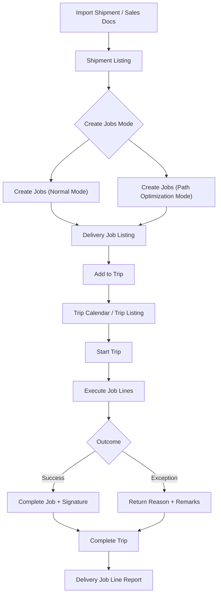


**进行中**：本用户指南仍在持续完善中。


## 目的与概览

**Delivery & Installation Applet** 是一个端到端的物流与现场执行解决方案，可把仓储规划与在途交付/安装结果连接起来，帮助团队从碎片化的手工协作，过渡到围绕 **Shipments**、**Jobs** 与 **Trips** 的结构化、可追踪流程。


**核心概念**：该小程序把 **要交付什么**（来自 `SO` = Sales Order、`SI` = Sales Invoice、`DO` = Delivery Order 的 Job）、**如何分组**（Shipment）、以及 **如何执行**（由司机与车辆执行并带实时状态更新的 Trip）连接在一起。


## 关键功能概览

### 谁会从此小程序受益？

**调度与物流协调团队：**
- 使用 Trip Calendar 进行可视化排程
- 大规模整合并分配作业
- 执行批量操作（状态、日期、备注、行程分配）
- 无需切换系统即可跟踪进度

**司机与安装团队：**
- 清晰查看被分配的行程与作业
- 在现场更新 Trip/Job 状态
- 一致地记录退回原因
- 记录签收与完工凭证

**仓储与运营管理团队：**
- 快速将 Shipment 转换为 Jobs
- 使用普通模式或路径优化模式创建 Jobs
- 监控分配量、数量平衡与交付负载
- 在各分支与区域标准化执行

**客服与后台团队：**
- 使用 Delivery Job Line Report 获取行级可视性
- 获取结构化的退回/失败原因用于跟进
- 使用受控模板打印运营文档
- 更快响应客户交付查询

### 这个小程序解决了哪些问题？

**交付运营割裂问题：**

传统交付运营常分散在表格、聊天与纸质单据中，典型问题包括：
- 难以高效分组 Shipment 并分配到 Trip
- 无法统一查看基于 SO/SI/DO 的 Delivery Jobs
- 现场更新不一致，退回原因质量差
- 调度、司机与客服之间交接滞后
- 缺少可审计的行级执行凭证

**Delivery & Installation Applet V2 解决方案：**

- **统一流程** - 在同一小程序内管理 Trip Calendar、Shipment、Delivery Job 与 Trip 执行
- **可执行的批量操作** - 支持作业批量状态更新、批量日期编辑、批量备注
- **运营可追踪性** - 以时间戳、司机、车辆与客户引用追踪每个 Job Line
- **可留痕执行** - 支持签名采集与结构化退回原因记录
- **灵活控制** - 可配置可见性、状态、默认值、菜单权限与打印格式
- **导入与可恢复性** - 支持 Shipment 文件导入，并通过流程状态与错误信息排查失败

## 关键功能概览


  

  

  

  

  

  

  

  




---

## 核心概念

### 理解交付框架

| 维度 | 组件 | 实际示例 |
|--------|-----------|------------------|
| **做什么**？ | Delivery Job (SO/SI/DO) | 为客户 A 安装 2 台设备 |
| **如何分组**？ | Shipment | 将多条明细打包成 Shipment 计划 |
| **谁/何时执行**？ | Trip | 分配司机 + 车辆 + 出行时间 |


**真实场景示例**：先导入 Shipment，再生成 Jobs，按区域分组后挂到 Trip，最终在现场完成并按需记录退回原因与签名。


### 交付层级

```text
Import Shipment / Sales Docs
│
├── Delivery Jobs (SO, SI, DO)
│   │
│   ├── Job Actions (Ready To Ship, Start, Complete, Cancel)
│   └── Job Line Details (serials, signature, return reason)
│
├── Shipments
│   └── Create Jobs (Normal / Path Optimization)
│
└── Trips
    ├── Trip Calendar (planning)
    └── Trip Listing (execution and reporting)
```

### 路由地图（已从源码核实）

该小程序在 `app.routing.ts` 中定义了以下核心模块路由：

| Route | Module | 主要用途 |
|-------|--------|--------------|
| `trip-calendar` | Trip Calendar | 按日期/司机/车辆/区域规划行程 |
| `trip-listing` | Trips | 执行 Trip 状态更新并打印 Trip 报表 |
| `shipment-listing` | Shipment | 将 Shipment 明细转换为 Delivery Jobs |
| `file-import` | Import Shipment | 上传 Shipment 导入文件并监控处理状态 |
| `job-shipment-listing` | Delivery Job | 执行基于 Shipment 的作业批量操作 |
| `sales-order-jobs` | Job Sales Order | 执行基于 SO 的 Delivery Jobs |
| `sales-invoice-jobs` | Job Sales Invoice | 执行基于 SI 的 Delivery Jobs |
| `job-delivery-order` | Job Delivery Order | 执行基于 DO 的 Delivery Jobs |
| `delivery-job-line-report` | Delivery Job Line Report | 生成行级交付报表输出 |
| `delivery-region-listing` | Delivery Region Listing | 维护交付区域主数据 |
| `vehicle-listing` | Vehicle Listing | 维护车辆主数据 |
| `driver-listing` | Driver Listing | 维护司机主数据 |
| `logistic-hub` | Logistic Hub | 维护物流枢纽主数据 |
| `logistic-hub-network` | Logistic Hub Network | 维护用于优化的枢纽网络 |
| `settings/*` | Settings Center | 配置行为、字段可见性、默认值与控制项 |
| `personalization` | Personalization | 设置用户级分支/地点默认上下文 |

### 交付执行流程



---

## 快速开始指南

通过以下按角色划分的流程快速上手。


**开始前请先确认**
1. 在 `Settings > Default Selection` 或 `Personalization > Default Selection` 中确认默认分支/地点
2. 确保主数据已就绪（Driver、Vehicle、Delivery Region、Logistic Hub、Logistic Hub Network）
3. 确认用户拥有 Delivery Job、Trip Listing、Shipment Listing 的访问权限


### 面向调度员：规划并分配每日作业

**目标：** 将待处理 Jobs 分配到已规划的 Trips，并明确责任归属。

1. 打开 **Shipment Listing**，为待处理 Shipment 行创建 Jobs（`Normal Mode` 或 `Path Optimization Mode`）。
2. 打开 **Trip Calendar**，按目标日期、司机和车辆创建 Trip。
3. 打开 **Delivery Job**（`Job Shipment Listing`），按地点/区域筛选。
4. 使用 **Add to Trip** 将选中 Jobs 分配到目标 Trip。
5. 使用 **Job Status** 先把作业批量切换为 `Ready To Ship`。
6. 需要协同更新时，使用 **Bulk Date Edit** 与 **Bulk Remarks**。
7. 使用 **Printing** 在交接前准备 Trip/Job 文档。
8. 需要业务里程碑时，使用 **Custom Status**。

**接下来会发生什么？** 司机可在更清晰的上下文中执行任务，减少沟通反复。

**专业建议：** 将 `Cancel Job` 仅用于真实取消场景；中间进度请优先使用 `Custom Status`，有助于 KPI 统计更准确。

---

<a id="for-drivers--installers-execute-and-close-jobs"></a>
### 面向司机与安装团队：执行并完结作业

**目标：** 以准确时间戳与证据完成现场作业。

1. 打开 **Trip Listing**，确认分配的司机、车辆与路线信息。
2. 实际出发时将 **Trip Status** 更新为 `Start Trip`。
3. 如网络延迟，使用 **Trip Status Date** 记录真实事件时间。
4. 逐条打开已分配 Job Line，按执行顺序更新结果。
5. 交付失败时，选择标准化 **Return Reason** 并补充备注。
6. 按需在 Job Item 编辑中使用 **Open Signature** 采集签名凭证。
7. 准确更新作业状态（`Start Job` / `Complete Job`），避免日终对账不一致。
8. 仅在全部作业完成后将 Trip 更新为 `Complete Trip`。

**接下来会发生什么？** 调度与客服可即时看到准确的完成与异常信息并开展跟进。

**专业建议：** 每个站点完成后及时更新状态，而不是一天结束后统一补录，可提升异常响应速度。

---

### 面向管理员：配置小程序以支撑运营

**目标：** 建立统一的主控配置，确保团队执行一致。

1. 维护运营主数据：**Delivery Region Listing**、**Vehicle Listing**、**Driver Listing**、**Logistic Hub**、**Logistic Hub Network**。
2. 在 `Settings > Default Selection` 配置默认值（默认 branch/location）。
3. 在 `Settings > Application Settings` 配置运行行为（可见性开关与流程控制）。
4. 在 `Settings > Return Reasons Settings` 标准化结果原因。
5. 在 `Settings > Custom Status Settings` 创建业务里程碑状态。
6. 在 `Settings > Printable Format Settings` 配置输出模板。
7. 通过 **Menu Containers**、权限页与 **Feature Visibility** 实现按角色访问控制。
8. 先用一个调度员团队与一个司机团队进行试运行，再微调字段可见性与打印输出。

**接下来会发生什么？** 小程序在各团队间的行为更一致，手工补救更少，数据质量更高。


**新系统上线建议：** 先以一个试点路线和一个调度团队启动，确认 Return Reasons 与 Printable Formats 后，再逐步推广到所有分支。


---

<a id="delivery-job-workbench"></a>
## Delivery Job 工作台

**Delivery Job** 界面（`Job Shipment Listing`）是高并发分配与批量更新的运营控制中心。



### 内置操作标签

- **Add to Trip**：将选中 Jobs 关联到指定 Trip
- **Printing**：批量打印或自定义批量打印（可选自定义交付日期）
- **Job Status**：批量应用 `Ready To Ship`、`Start Job`、`Complete Job`、`Cancel Job`
- **Bulk Remarks**：批量更新备注
- **Add Logistic Hub**：批量为作业关联物流枢纽
- **Custom Status**：按时间应用自定义状态
- **Bulk Date Edit**：批量更新到达/离开时间



### 为什么这很重要

该工作台把“逐单处理”升级为“可审计的批量执行”，显著降低调度操作成本。



---

<a id="shipment-listing"></a>
## Shipment 列表

**Shipment Listing** 用于把可执行的 Shipment 数量转换为 Jobs。






### 支持模式

- **Normal Mode**：直接从选中 Shipment 创建 Jobs
- **Path Optimization Mode**：按优化方法（`DISTANCE`、`COST`、`TIME`）及物流枢纽网络创建 Jobs

### 实操流程

1. 选择 Shipment 行。
2. 检查并调整 **Allocate Job Qty**。
3. 选择模式，并在需要时选择优化方法/网络。
4. 点击 **Create Jobs**。

你也可以通过 **Import** 导入 Shipment 文件，并在 **Import Shipment** 页面跟踪处理结果。

---

<a id="trip-listing"></a>
## Trip 列表

**Trip Listing** 是路线级执行中心。



### 可用功能

- **Printing**：`Batch Print`（若启用）与 `Trip Report`
- **Trip Status**：`Start Trip`、`Complete Trip`、`Cancel Trip`
- **Trip Status Date**：记录实际状态发生时间

这可确保调度时间线与现场执行时间线保持一致，即使存在延迟回传。

---

<a id="trip-calendar"></a>
## Trip 日历

**Trip Calendar** 提供按月/周/日/议程视图的可视化排程。



### 排程能力

- 按 **Driver**、**Vehicle**、**Region** 筛选事件
- 支持基础与高级搜索（司机/日期范围/车辆/区域）
- 点击日期快速新建 Trip
- 点击事件快速跳转到 Trip 明细

帮助团队提前识别负载不均、车辆冲突与运力缺口。

---

<a id="job-sources-so-si-do"></a>
## 作业来源（SO、SI、DO）

V2 支持并行的交付作业来源：
- **Job Sales Order**
- **Job Sales Invoice**
- **Job Delivery Order**

在这些来源下，团队都可执行一致的状态流（`Ready To Ship`、`Start Job`、`Complete Job`、`Cancel Job`），并通过扫描/导入流程处理序列号。







---

<a id="delivery-job-line-report"></a>
## Delivery Job Line Report

**Delivery Job Line Report** 提供行级可追踪与报表输出能力。



### 核心输出字段

- Item code/name、quantity、UOM
- Trip no.、vehicle no.、driver name
- Job ID、start/end delivery datetime
- Sales order no.、customer name

### 报表流程

1. 设置 **Start Date** 与 **End Date**（可选）。
2. 选择打印格式。
3. 点击 **Generate Delivery Job Line Report** 导出 PDF。

---

<a id="configuration--settings"></a>
## 配置与设置

通过 Settings 区域统一业务规则并保持运营数据整洁。



### `Settings > Application Settings`

用于控制 Trips、Shipment、Job 界面的可见性与行为。常用项包括：
- 批量打印可见性
- Shipment 字段可见性（sender、recipient、tracking、quantity、CBM、process status）
- Job 字段可见性（Trip/Vehicle/Driver、statuses、process resolution）
- Job 打印中的自定义交付日期行为

### `Settings > Field Settings`

提供更细粒度的字段可见性开关与界面偏好设置，以匹配你的运营模型。

### `Settings > Default Selection`

设置小程序级默认值：
- Default Branch
- Default Location

### `Personalization > Default Selection`

设置用户级默认值，可覆盖小程序级默认值。

### `Settings > Custom Status Settings`

创建自定义业务里程碑状态：
- Code
- Name
- Description
- 可选图片/附件

创建后可在 Delivery Job 批量操作中应用。

### `Settings > Return Reasons Settings`

定义标准化退回原因代码与名称（用于失败/退回结果），提升报表质量并减少自由文本不一致。

### `Settings > Printable Format Settings`

管理打印模板（code、name、file），并为 Trips、Job Shipment、Sales Order、Sales Invoice 等场景设置默认模板。

### `Settings > Menu Containers`

按用户角色控制菜单可见性，让现场用户只看到所需功能。

### Settings 中其他系统控制

- Feature Visibility
- Webhook
- Permission Wizard 与权限管理页面

---

## 个性化

### 默认选择（`Personalization > Default Selection`）

设置用户级默认值，让每位用户打开小程序时直接进入正确上下文：

| 设置项 | 用途 |
|---------|---------|
| **Default Branch** | 你的个人默认分支上下文 |
| **Default Location** | 你的个人默认地点上下文 |

这些用户默认值可在日常操作中覆盖小程序级默认值。

---

## 常见问题（FAQ）

### 为什么我不能把选中的 Jobs 加入 Trip？

常见原因：
- 目标日期/路线尚未创建 Trip
- Jobs 当前状态不可被加入（例如尚未到 `Ready To Ship`）
- branch/location 上下文与 Trip 上下文不一致

请先检查 Trip 配置，再从 **Delivery Job > Add to Trip** 重新执行。

### 为什么 Shipment Listing 中的 Create Jobs 行为不符合预期？

通常由以下原因导致：
- `Allocate Job Qty` 缺失，或大于可分配数量
- `Path Optimization Mode` 缺少必填输入（method 或 network）
- 选中的 Shipment 行当前状态不可转换

请先校验数量与模式参数，再重试创建。

### 为什么 Trip 状态和 Job 状态看起来不一致？

Trip 与 Job 状态彼此关联，但更新是分开进行的。可能出现 Trip 已开始而部分 Jobs 仍未更新。建议：
1. 使用 `Trip Listing > Trip Status Date` 记录准确 Trip 事件时间
2. 使用 `Delivery Job > Job Status` 批量对齐 Job 层进度

这样可同时保证路线级与作业级时间线满足审计要求。

### 如何以一致方式处理交付失败？

建议采用标准流程：
1. 将 Job 更新到正确结果状态
2. 从 `Settings > Return Reasons Settings` 选择标准原因
3. 填写可执行的备注
4. 如可用，补充签名或其他执行凭证

这样能为客服与运营复盘提供更高质量的异常数据。

### 什么时候该用 Custom Status，而不是默认 Job 状态？

默认状态（`Ready To Ship`、`Start Job`、`Complete Job`、`Cancel Job`）用于核心生命周期。**Custom Status** 更适合内部里程碑，如 `Arrived Site`、`Awaiting Customer`、`Installer En Route`，不应替代核心生命周期状态。

### 如何快速产出可审计的行级交付报表？

进入 **Delivery Job Line Report**，设置日期范围，选择正确打印格式后生成 PDF。为保证审计质量，请确保 Trip/Job 状态及时更新，并对异常完整记录退回原因。
